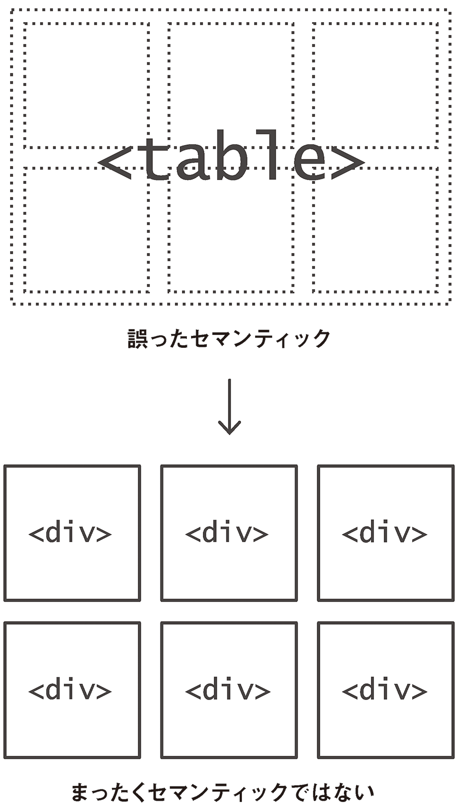

# 1-3 セマンティクスとスクリーンリーダー
インクルーシブな方法でWebアプリケーションの性質と状態を伝えるためには、セマンティクスが重要です。[セマンティックHTML](http://en.wikipedia.org/wiki/Semantic_HTML)というテーマは誤解されやすく、ときに悪者にされることもあります。皆さんもこの言葉を聞いたことがあるでしょうし、使ったこともあるかもしれません。しかし、アクセシビリティにおけるセマンティクスの本当の意味は何でしょうか？　先に進む前に、少し気分転換をしましょう。これまでにセマンティクスについて説明する機会はありませんでしたので、今がその時だと思うのです。

マークアップという言葉は、「校正印をつける（mark up）」という言葉から派生したものです。これは、内容をよりわかりやすくしたり修正したりするために、印刷原稿の余白に注釈や指示を書くという慣習です。

[マークアップ言語](http://en.wikipedia.org/wiki/Markup_language)の一種であるHTMLは、さらに大きな**メタ言語**というカテゴリに属します。メタという接頭辞はギリシャ語（μετα-）に由来し、「**〜を超えた**」および「**〜自体の**」という意味が含まれています。[メタ言語](http://en.wikipedia.org/wiki/Metalanguage)は、対象言語を明確にするために使用されるシステムです。言い換えると、メタ言語は**言語についての**言語です。


従来の印刷されたドキュメントと同じく、HTMLドキュメントは人間が情報を読み、利用するための伝達手段です。それこそがHTMLドキュメントの目的です。しかし、言葉は単なる言葉にすぎず、ただ一様な文章で埋められたページは、非常に見づらく、読みにくいでしょう。

そこで役に立つのがHTMLの要素です。助っ人言語（マークアップ言語）を組み込むことで、切れ目のない文章をタイトル、段落、リストなど意味のあるパーツに分解することができますし、HTMLの仕様が許す範囲で、作者の好きなものにすることができます。そしてなにより、これらのパーツはCSSによる視覚化のときにも使えます。

情報に関する情報を提供することで、ページの基本的なコンテンツはより充実し、そのブラウジングや利用はより楽しいものとなります。たとえば、`<em>`について考えてみましょう。`<em>`要素でフレーズを囲むと、1つのセンテンス内でのその文字列のトーンを強調することができます。このトーンの強調はHTMLの要素によって表現され、`<em>`要素内にある文字列は視覚的にはイタリック（斜字体）で表現されます。この`<em>`は、[音声の特性](https://quote.ucsd.edu/phonoloblog/2006/07/26/phonetics-in-grammar/)を書体に置き換えたり、あるいは他の何らかの方法で表現することを容易にしています。これで、言葉が生き生きと伝わりやすくなるでしょう。


## インターオペラビリティ
セマンティックHTMLとは、ページの言葉の意味を伝えることに積極的に貢献するHTMLのことです。具体的には、できるだけ多くの[ユーザーエージェント](http://www.w3.org/TR/UAAG20/)（ユーザーの代わりに動作するソフトウェア）が理解できるような、標準化された方法で意味（セマンティック）を伝えます。このように、さまざまなデバイスやソフトウェアが共通言語を使用できることを、**インターオペラビリティ**（**相互運用性**）と呼ぶことがあります。

実際にインターオペラビリティを妨げているHTMLと、インターオペラビリティを促進しているHTMLを見てみましょう。

CSSのクラスを定義しておけば、リスト項目を次のようにマークアップすることでHTMLの番号なしリストに近いものを作成できます。

```
<div class="list-item">1つめのリスト項目</div>
<div class="list-item">2つめのリスト項目</div>
<div class="list-item">3つめのリスト項目</div>
```

しかしこれは、（必要なCSSと組み合わせると）リストのように見えるものを描画するように、ブラウザに命令しているだけです。次のように、標準の番号なしリスト（`<ul>`）を使用して、標準のリスト項目を含めると、

```
<ul>
<li>1つめのリスト項目</li>
<li>2つめのリスト項目</li>
<li>3つめのリスト項目</li>
</ul>
```

…となり、いくつかのメリットがあります。まず、このパターンのほうが簡潔です。共同作業するHTML制作者も、おなじみの標準として容易に認識することができます。

また、このリストに適用されたCSSは、すべてのリストに一様に適用されるというメリットもあります。つまり、WYSIWYG（what you see is what you get：最終的なアウトプットのスタイルのまま編集できる）テキストエディターを使用した場合でも、[Markdown](http://daringfireball.net/projects/markdown/)を使った場合でも、すべての標準リストに同じスタイルをつけることができます。これにより一貫した見た目が得られ、技術に詳しくない制作者がそれぞれのニーズに合わせてHTMLを直接記述する必要がなくなります。

以下は、同じリストをMarkdownで書いたものです。

```
* 1つめのリスト項目
* 2つめのリスト項目
* 3つめのリスト項目
```

本書の目的に沿った最も重要なメリットは、スクリーンリーダー（音声読み上げユーザーエージェント）がこのパターンを認識でき、ユーザーに音声で伝えられることです。視覚的にも聴覚的にも同じ情報または類似の情報を提供し、**見る**ユーザーと**聞く**ユーザーが確実に同じコンテンツを同じように経験できるようになります。

つまり、このHTMLは十分なレベルのインターオペラビリティを実現しています。異なる方法で、異なるファイル形式やコードフォーマットを使用して作成でき、かつ使用するソフトウェアによっては読むことも聞くことも可能です。


Webデザイナーが作成するCSSのクラス名は標準の構成要素ではないため、ユーザーエージェントはこれらを完全にインターオペラブルな方法で伝えることはできません。つまり、HTMLを自然言語として考えてみると、クラス名はブラウザがわからない言葉にあたるということです。

ブラウザはこれらの単語を視覚的に表示することはできますが、これらを**概念的**に理解することはできません。コンテンツの定義にクラスを多用しすぎることについて、W3CがHTML制作者に警告しているのはこのためです。

>CSSでは「class」属性に非常に大きな力があるため、HTML制作者は特定の表現がないに等しい要素（HTMLのDIV、SPANなど）を使用し、「class」属性を使ってスタイル情報を割り当てることによって、独自の「ドキュメント言語」をデザインすることもできてしまいます。しかし、ドキュメント言語の構成要素の多くには、広く認識された一般的な意味があるため、制作者はそのような手法を避けるべきです。<br>
― [W3C CSS Level 2、「Selectors」](http://www.w3.org/TR/CSS2/selector.html#class-html)

CSSのクラスを使用する場合、共同作業する制作者が理解できる単語を使用することが大切です。たとえば、ページコンテンツを囲む`<div>`にラベルをつける場合、意味がわかりにくい**p-w**などよりも、**page-wrapper**というクラスを使用したほうが良いでしょう。しかしながら、[Harry Roberts（ハリー・ロバーツ）](http://csswizardry.com/2010/08/semantics-and-sensibility/)によれば、これはセマンティックな決定ではなく、分別のある決定にすぎません。

W3Cの「考慮の優先度（Priority of Constituencies）」によれば、共同制作者よりもユーザーを優先するべきです。このため、分別のあるクラス名の使用は、インターオペラブル（相互運用が可能）なHTMLの使用ほど重要ではありません。

>意見の不一致や対立が起こった場合、ユーザー、作者、実装者、仕様書、理論上の純粋さという順番で考慮してください。これは、「ユーザーにかかる困難やコストは、作者にかかるものよりも重要であり、…（以下略）<br>
― [W3C、「HTML設計原則（HTML Design Principles）」](http://www.w3.org/TR/html-design-principles/#priority-of-constituencies)


## 意外なほどの重要性

セマンティックHTMLは役割にふさわしい要素を使用することだと捉えられることがよくあります。しかし、それだけではありません。初期のWeb標準化運動の成功によって、HTML制作者は視覚的なレイアウトを構築する目的ではネストされたデータテーブル（`<table>`）を使用しないように促されましたが、セマンティックHTMLにはさらに大きな意味があります。



要素だけでなく属性も、ブラウザやその他のユーザーエージェントが拾い出して解釈できるような、セマンティックな性質をもっています。

これらの属性は、動作に加えて要素の視覚的な外観にも影響します。`<input>`の`type`属性を`text`から`checkbox`に変えると、要素の視覚的な表現、インターオペラブルなコミュニケーションの方法、さらには動作も変化します。この例で言うと、`<input>`は任意のテキスト文字列を受け入れるテキストボックスから、オン／オフスイッチへと変化します。

本書ではこの先、WAIのARIA（Accessible Rich Internet Applications）関連文書群で規定されている一連の特別なセマンティック属性を取り上げます。これらはセマンティクスの強化、ひいてはWebアプリケーション内のHTMLのアクセシビリティ向上を目的として設計されています。また、セマンティック属性は[従来のセマンティックHTML](http://www.456bereastreet.com/archive/200711/posh_plain_old_semantic_html/)を置き換えるものではなく、HTMLのセマンティクスをより強化するものです。

この後はまず、一般的でありながら不思議とあまり好かれていない、しかしアクセシブルなWebアプリケーションを実現するためには欠かすことができないという、あるHTMLの要素について説明していきます。
