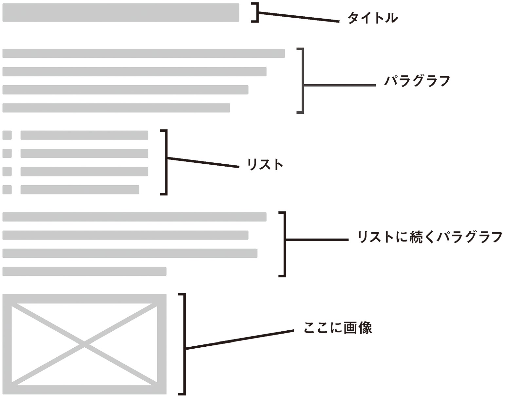
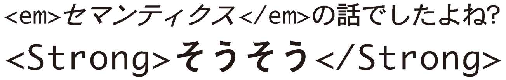
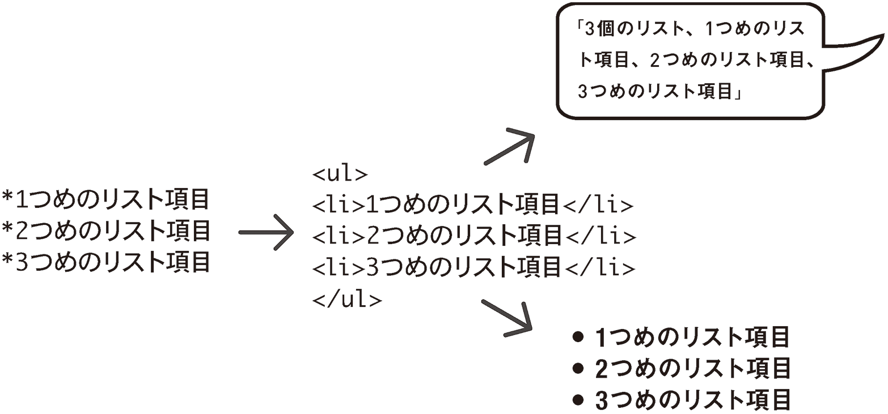
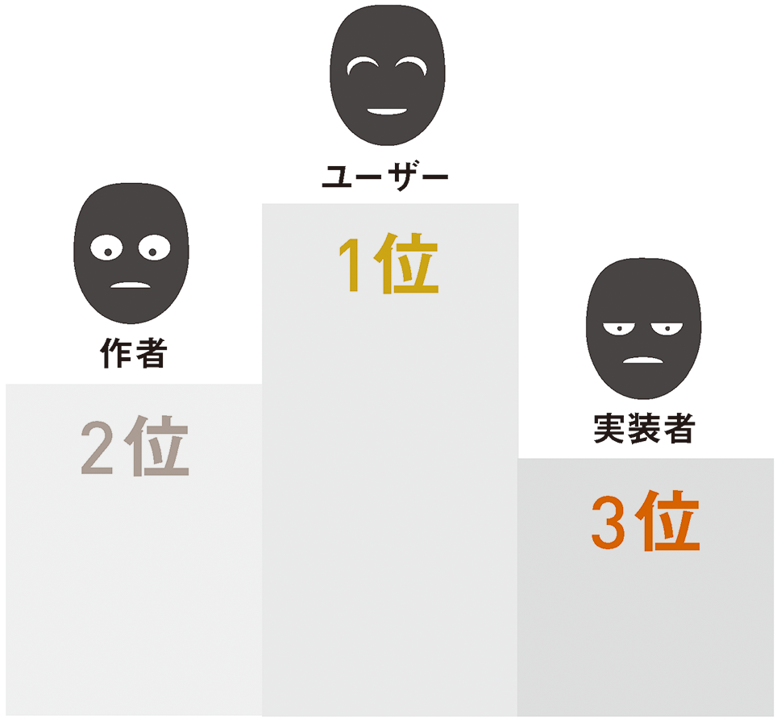
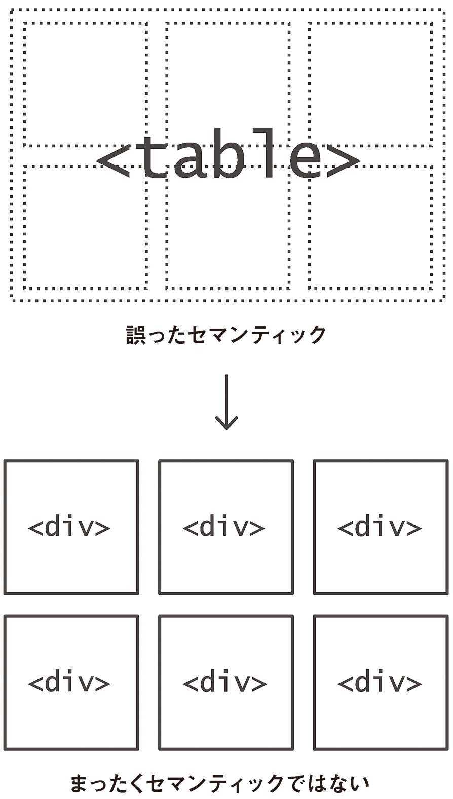

# 1 すべての人のために
アクセシブルとは何か？Webとは何か？そもそものWebの思想と担保されるべきアクセシビリティとはどういうことなのかについて、本書籍のねらいを交えて解説します。

- [1-1 Web標準](bodymatter_1_2.xhtml)
- [1-2 本書の内容](bodymatter_1_3.xhtml)
- [1-3 セマンティクスとスクリーンリーダー](bodymatter_1_4.xhtml)

=======================================

巨大な特設スタジアムの中で、8万人の観衆そして数百万人にのぼる世界各地のテレビ視聴者の注目を浴びながら、電子機器に調整を加えているのはTimBLという謎めいたニックネームで知られるひとりの人物。

このペンネームや装置、大群衆の期待から、きっとこの人物はスーパーDJで、腹の底まで揺さぶるようなリズムを<ruby>轟<rp>（</rp><rt>とどろ</rt><rp>）</rp></ruby>かせようと準備をしているのだ、と思った人がいても無理はありません。しかし彼はロンドンオリンピックの開幕式に出席したロンドン生まれのコンピュータ科学者であり、シンプルながら永久に心に刻まれるメッセージを伝えに来たのです。会場のスタンドに取りつけられたLCDライトに、「THIS IS FOR EVERYONE（すべての人のために）」というメッセージが浮かび上がりました。

[CERNがWorld Wide Webをパブリックドメインに公開](http://home.web.cern.ch/about/updates/2013/04/twenty-years-free-open-web)してから、20年あまりがたちました。適切なソフトウェアと、DJ TimBL（またの名をTim Berners-Lee：ティム・バーナーズ＝リー）の発明に関連するテクノロジーを通じて、誰もが豊かな情報資産に貢献できるだけの力をもつようになりました。しかしながら、Webサーバーを実行するソフトウェアを世界中の誰もが使用できるように作成することと、そのサーバーを利用して世界中の誰もが利用できる情報を提供することは、まったく別です。

>Webの力はその普遍性にあります。障害の有無にかかわらず誰もがアクセスできるというのがWebの本質的な側面なのです。  
― Tim Berners-Lee

Berners-Leeは、1994年10月にWorld Wide Web Consortium（W3C）を創立し、CERNを退職して専任のディレクターに就任しました。グローバルな利用を目的としたテクノロジーを創造した彼にとって重要なのは、Webの新しい部分と既存の部分を確実に連携させて、情報を隆盛させることでした。このため、世界各国から参加していた個人や組織の協力を得て、HTMLなどのウェブ技術を標準化することがW3Cの役割となったのです。

=======================================

## 1-1 Web標準

Jeffrey Zeldman（ジェフリー・ゼルドマン）の著書『[Designing With Web Standards](http://en.wikipedia.org/wiki/Designing_with_Web_Standards)』（『Designing with Web Standards ―XHTML+CSSを中心とした「Web標準」によるデザインの実践』）に対する評価は年を追って高まりつつあり、この本の表紙を飾っている著者がかぶった青いニット帽は、Web標準化運動の象徴になっています。標準ベースのHTMLは、多様なテクノロジーと連携することができ、これによって私たちの活動はずっと容易になります。さらに、多様なソフトウェアやデバイスがHTMLを解釈できると、HTMLはインクルーシブ、つまりアクセシブルになります。標準のHTMLによって、コンテンツは見る、読む、聞く、クリックする、タイプする、さらには[触れる](http://en.wikipedia.org/wiki/Refreshable_braille_display)ことまでもが可能になり、好みや能力がさまざまに異なるユーザーが、それぞれのニーズに合った方法で、マークアップされたコンテンツを利用できます。

Web標準が、技術基準ではなく運動（ムーブメント）という形を取っていることには重要な意味があります。HTMLは、本来あるべき方法で作られていないからといって単純に動作を停止するわけにはいきません。もしそうであれば、高度な技術を持つ人しかコンテンツを公開できず、このメディアそのものがアクセシブルではなくなるでしょう。私たちの責任は、ユーザーを疎外しないようにすることです。そのためには、インクルーシブだと立証されたHTML制作の手法を共有し、革新を進めていく必要があります。

生後すぐに視力を失ったRon McCallum（ロン・マッカラム）は、[TED Talks](http://www.ted.com/talks/ron_mccallum_how_technology_allowed_me_to_read.html)で彼の読書を可能にした技術の進化について語り、Webの技術的な面を強調するのではなく、本質的にアクセシブルであるというメディアの責務を果たすようWeb制作者に求め、関心を集めました。

>多くのWebサイトは非常に視覚的で、ラベルのないグラフやラベルのないボタンがあります。これこそWorld Wide Web Consortium（W3C）がインターネットのグローバルな標準規格を設定した理由です。私たちはすべてのインターネットユーザーやサイトの持ち主に、標準規格に則ったサイトを作って欲しいと願っています。そうすれば、視覚障害者も同じ土俵に立つことができるのです。  
― Ron McCallum

### Web Accessibility Initiative（WAI）

Web標準化運動の影響により、最近では無謀にも望ましくないHTMLコードを提供したり、共有したりするようなHTML制作者（またはWebデザイナー）はほとんどいません。これは良いことではありますが、（自動検証を適用できるような）技術的に正しいドキュメントと、実際にアクセシブルなドキュメントの間には、深い谷のような隔たりがあります。そして、アクセシブルデザインにおいては他人の立場になってみることによって生まれる「共感」が必要です。Zeldmanの本が示すように、アクセシビリティとは「Web標準の根源（the soul of web standards）」です。

（基本的なWeb標準に比べて）あいまいな性質をもったWebアクセシビリティを1つの専門分野として扱うために、1997年にWebアクセシビリティを扱うW3Cの分科会として[Web Accessibility Initiative（WAI）](http://en.wikipedia.org/wiki/Web_Accessibility_Initiative)が発足しました。WAIの主眼は、ガイドラインの作成と専門技術を通じて、障害をもった人々にとってWebをよりよく使いやすい場所にすることです。しかし、支援技術を利用する人々や、特殊な方法で情報を利用する人々の要求に応じることによって得られる知識や経験は、すべての人を対象としたWebの質の向上にも応用できます。すべての人にとって利益となるのです。

先ほど引用したRon McCallumのすばらしいスピーチが紹介されている[TEDのWebページ](http://www.ted.com/talks/ron_mccallum_how_technology_allowed_me_to_read.html)を例にしましょう。このスピーチの字幕はいくつもの言語で提供されており、聴覚障害者や難聴者だけではなく、さまざまな国の人々が視聴できるようになっています。結果として、スピーチのコンテンツはよりよい形で保管され、より楽に検索できます（本書でも先ほど引用することができました）。この例では、特定のアクセシビリティ要件を満たすことで、そこにある情報の提示方法が向上しています。

=======================================

## 1-2 本書の内容
Webアクセシビリティが非常に大きなトピックであることに間違いはありません。小さな本1冊にはまとめることはできないほどです。それでは、この小さな本で何を取り上げようとしているのでしょうか？　本書では視覚デザインの課題やパフォーマンスの問題に対処し、プログレッシブエンハンスメントの考え方を取り入れていきます（これらはすべてアクセシビリティの関連事項です）。本書の根底にあるテーマは、Webアプリケーションに**キーボードユーザーおよびスクリーンリーダーユーザー**を考慮したインタラクティブ性をもたせることです。本書は、まずシンプルなボタンコントロールを定義して、再利用可能なアクセシブルなウィジェットを作るところから始まります。そして、さまざまな視覚障害を持つユーザーはもちろん、認識機能障害や運動障害をもった人々にも使える、有意義なインタラクションの作り方について述べていきます。

### 技術的な内容
本書は現代のWebアプリケーションデザインを解説する本であり、HTML5およびJavaScriptを使用したインタラクティブなアプリケーションの構築に関するある程度の知識を前提としています。[AngularJS](http://angularjs.org/)のようなJavaScriptフレームワークについても言及していますが、主に取り上げるパターンはビジネスロジックではなく、[DOM](http://css-tricks.com/dom/)レベルのものです。特定のアプリケーション設計理念に結びついたものではありません。必要時にDOMの状態を操作するために使用するJavaScriptコードのサンプルは、jQueryを使用して書いていきます。このため、jQuery構文の基本を理解している必要があります。

全体を通じて特に注意を払っていくのは、アクセシブルなHTMLの作成とインクルーシブデザインのCSS組み込みに関するW3Cの勧告です。JavaScriptがこれらの関連テクノロジーを利用したり、これらのテクノロジーとインタラクションを行ったりする方法についてW3Cの提言がある場合は、その内容にも注目していきます。

これから私たちが実践していくガイダンスの大部分は、WAIが提供する2つのリソースによって構成されています。そのリソースとは、[WAI-WCAG 2.0](http://www.w3.org/TR/WCAG20/)（Web Content Accessibility Guidelines）と[WAI-ARIA](http://www.w3.org/WAI/intro/aria)（Accessible Rich Internet Applications）です。これら2つは、コンテンツのアクセシビリティならびにその**コンテンツとのインタラクション**のアクセシビリティについて、非常に包括的にカバーしています。どちらも、あらかじめ読んでおく必要はありません。

=======================================

## 1-3 セマンティクスとスクリーンリーダー
インクルーシブな方法でWebアプリケーションの性質と状態を伝えるためには、セマンティクスが重要です。[セマンティックHTML](http://en.wikipedia.org/wiki/Semantic_HTML)というテーマは誤解されやすく、ときに悪者にされることもあります。皆さんもこの言葉を聞いたことがあるでしょうし、使ったこともあるかもしれません。しかし、アクセシビリティにおけるセマンティクスの本当の意味は何でしょうか？　先に進む前に、少し気分転換をしましょう。これまでにセマンティクスについて説明する機会はありませんでしたので、今がその時だと思うのです。

マークアップという言葉は、「校正印をつける（mark up）」という言葉から派生したものです。これは、内容をよりわかりやすくしたり修正したりするために、印刷原稿の余白に注釈や指示を書くという慣習です。

[マークアップ言語](http://en.wikipedia.org/wiki/Markup_language)の一種であるHTMLは、さらに大きな**メタ言語**というカテゴリに属します。メタという接頭辞はギリシャ語（μετα-）に由来し、「**〜を超えた**」および「**〜自体の**」という意味が含まれています。[メタ言語](http://en.wikipedia.org/wiki/Metalanguage)は、対象言語を明確にするために使用されるシステムです。言い換えると、メタ言語は**言語についての**言語です。

従来の印刷されたドキュメントと同じく、HTMLドキュメントは人間が情報を読み、利用するための伝達手段です。それこそがHTMLドキュメントの目的です。しかし、言葉は単なる言葉にすぎず、ただ一様な文章で埋められたページは、非常に見づらく、読みにくいでしょう。

そこで役に立つのがHTMLの要素です。助っ人言語（マークアップ言語）を組み込むことで、切れ目のない文章をタイトル、段落、リストなど意味のあるパーツに分解することができますし、HTMLの仕様が許す範囲で、作者の好きなものにすることができます。そしてなにより、これらのパーツはCSSによる視覚化のときにも使えます。

情報に関する情報を提供することで、ページの基本的なコンテンツはより充実し、そのブラウジングや利用はより楽しいものとなります。たとえば、`<em>`について考えてみましょう。`<em>`要素でフレーズを囲むと、1つのセンテンス内でのその文字列のトーンを強調することができます。このトーンの強調はHTMLの要素によって表現され、`<em>`要素内にある文字列は視覚的にはイタリック（斜字体）で表現されます。この`<em>`は、[音声の特性](https://quote.ucsd.edu/phonoloblog/2006/07/26/phonetics-in-grammar/)を書体に置き換えたり、あるいは他の何らかの方法で表現することを容易にしています。これで、言葉が生き生きと伝わりやすくなるでしょう。

### インターオペラビリティ
セマンティックHTMLとは、ページの言葉の意味を伝えることに積極的に貢献するHTMLのことです。具体的には、できるだけ多くの[ユーザーエージェント](http://www.w3.org/TR/UAAG20/)（ユーザーの代わりに動作するソフトウェア）が理解できるような、標準化された方法で意味（セマンティック）を伝えます。このように、さまざまなデバイスやソフトウェアが共通言語を使用できることを、**インターオペラビリティ**（**相互運用性**）と呼ぶことがあります。

実際にインターオペラビリティを妨げているHTMLと、インターオペラビリティを促進しているHTMLを見てみましょう。

CSSのクラスを定義しておけば、リスト項目を次のようにマークアップすることでHTMLの番号なしリストに近いものを作成できます。

<pre class="sourceCode html"><code class="sourceCode html">&lt;div class=&quot;list-item&quot;&gt;1つめのリスト項目&lt;/div&gt;
&lt;div class=&quot;list-item&quot;&gt;2つめのリスト項目&lt;/div&gt;
&lt;div class=&quot;list-item&quot;&gt;3つめのリスト項目&lt;/div&gt;</code></pre>

しかしこれは、（必要なCSSと組み合わせると）リストのように見えるものを描画するように、ブラウザに命令しているだけです。次のように、標準の番号なしリスト（`<ul>`）を使用して、標準のリスト項目を含めると、

<pre class="sourceCode html"><code class="sourceCode html">&lt;ul&gt;
&lt;li&gt;1つめのリスト項目&lt;/li&gt;
&lt;li&gt;2つめのリスト項目&lt;/li&gt;
&lt;li&gt;3つめのリスト項目&lt;/li&gt;
&lt;/ul&gt;</code></pre>

…となり、いくつかのメリットがあります。まず、このパターンのほうが簡潔です。共同作業するHTML制作者も、おなじみの標準として容易に認識することができます。

また、このリストに適用されたCSSは、すべてのリストに一様に適用されるというメリットもあります。つまり、WYSIWYG（what you see is what you get：最終的なアウトプットのスタイルのまま編集できる）テキストエディターを使用した場合でも、[Markdown](http://daringfireball.net/projects/markdown/)を使った場合でも、すべての標準リストに同じスタイルをつけることができます。これにより一貫した見た目が得られ、技術に詳しくない制作者がそれぞれのニーズに合わせてHTMLを直接記述する必要がなくなります。

以下は、同じリストをMarkdownで書いたものです。

<pre class="sourceCode markdown"><code class="sourceCode markdown">* 1つめのリスト項目
* 2つめのリスト項目
* 3つめのリスト項目</code></pre>

本書の目的に沿った最も重要なメリットは、スクリーンリーダー（音声読み上げユーザーエージェント）がこのパターンを認識でき、ユーザーに音声で伝えられることです。視覚的にも聴覚的にも同じ情報または類似の情報を提供し、**見る**ユーザーと**聞く**ユーザーが確実に同じコンテンツを同じように経験できるようになります。

つまり、このHTMLは十分なレベルのインターオペラビリティを実現しています。異なる方法で、異なるファイル形式やコードフォーマットを使用して作成でき、かつ使用するソフトウェアによっては読むことも聞くことも可能です。

Webデザイナーが作成するCSSのクラス名は標準の構成要素ではないため、ユーザーエージェントはこれらを完全にインターオペラブルな方法で伝えることはできません。つまり、HTMLを自然言語として考えてみると、クラス名はブラウザがわからない言葉にあたるということです。

ブラウザはこれらの単語を視覚的に表示することはできますが、これらを**概念的**に理解することはできません。コンテンツの定義にクラスを多用しすぎることについて、W3CがHTML制作者に警告しているのはこのためです。

>CSSでは「class」属性に非常に大きな力があるため、HTML制作者は特定の表現がないに等しい要素（HTMLのDIV、SPANなど）を使用し、「class」属性を使ってスタイル情報を割り当てることによって、独自の「ドキュメント言語」をデザインすることもできてしまいます。しかし、ドキュメント言語の構成要素の多くには、広く認識された一般的な意味があるため、制作者はそのような手法を避けるべきです。  
― [W3C CSS Level 2、「Selectors」](http://www.w3.org/TR/CSS2/selector.html#class-html)

CSSのクラスを使用する場合、共同作業する制作者が理解できる単語を使用することが大切です。たとえば、ページコンテンツを囲む`
`にラベルをつける場合、意味がわかりにくい**p-w**などよりも、**page-wrapper**というクラスを使用したほうが良いでしょう。しかしながら、[Harry Roberts（ハリー・ロバーツ）](http://csswizardry.com/2010/08/semantics-and-sensibility/)によれば、これはセマンティックな決定ではなく、分別のある決定にすぎません。

W3Cの「考慮の優先度（Priority of Constituencies）」によれば、共同制作者よりもユーザーを優先するべきです。このため、分別のあるクラス名の使用は、インターオペラブル（相互運用が可能）なHTMLの使用ほど重要ではありません。

>意見の不一致や対立が起こった場合、ユーザー、作者、実装者、仕様書、理論上の純粋さという順番で考慮してください。これは、「ユーザーにかかる困難やコストは、作者にかかるものよりも重要であり、…（以下略）  
― [W3C、「HTML設計原則（HTML Design Principles）」](http://www.w3.org/TR/html-design-principles/#priority-of-constituencies)

### 意外なほどの重要性

セマンティックHTMLは役割にふさわしい要素を使用することだと捉えられることがよくあります。しかし、それだけではありません。初期のWeb標準化運動の成功によって、HTML制作者は視覚的なレイアウトを構築する目的ではネストされたデータテーブル（`<table>`）を使用しないように促されましたが、セマンティックHTMLにはさらに大きな意味があります。

要素だけでなく属性も、ブラウザやその他のユーザーエージェントが拾い出して解釈できるような、セマンティックな性質をもっています。

これらの属性は、動作に加えて要素の視覚的な外観にも影響します。`<input>`の`type`属性を`text`から`checkbox`に変えると、要素の視覚的な表現、インターオペラブルなコミュニケーションの方法、さらには動作も変化します。この例で言うと、`<input>`は任意のテキスト文字列を受け入れるテキストボックスから、オン／オフスイッチへと変化します。

本書ではこの先、WAIのARIA（Accessible Rich Internet Applications）関連文書群で規定されている一連の特別なセマンティック属性を取り上げます。これらはセマンティクスの強化、ひいてはWebアプリケーション内のHTMLのアクセシビリティ向上を目的として設計されています。また、セマンティック属性は[従来のセマンティックHTML](http://www.456bereastreet.com/archive/200711/posh_plain_old_semantic_html/)を置き換えるものではなく、HTMLのセマンティクスをより強化するものです。

この後はまず、一般的でありながら不思議とあまり好かれていない、しかしアクセシブルなWebアプリケーションを実現するためには欠かすことができないという、あるHTMLの要素について説明していきます。
