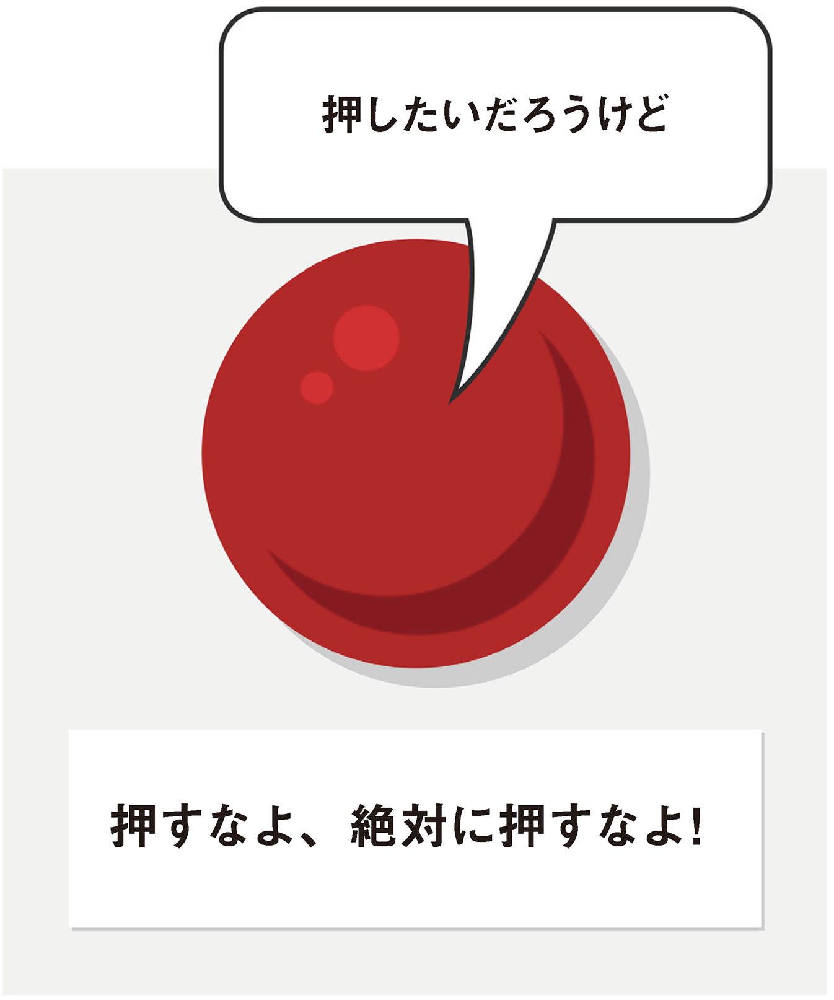
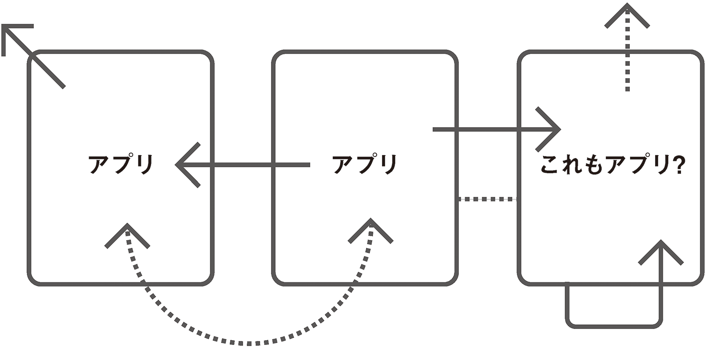

どんな形であれ、ボタンが含まれていないインターフェイスがあるでしょうか？　スロットマシンからATMまで、あるいは未来の宇宙船のコンソールからiPhoneアプリまで。現実のものであれ想像上のものであれ、ほとんどのマシンにはボタンがあり、人間はマシンを動作させるため好き勝手にボタンを押します。

有名な**ビッグレッドボタン**には、意味ありげな「押すなよ、絶対に押すなよ！」というラベルがついていますが、なじみのあるその形は魅力的で、触らずにはいられません。押せば何かが崩れるのか、それとも爆発するのかを知らんがために。

それがボタンの力です。

World Wide Webは、もうずいぶん前から、ハイパーリンクと呼ばれる独特なタイプのボタンで定義されていました。このボタンを押すと、読者は相互接続されたドキュメントの連続体の中で、ある場所から別の場所へと連れて行かれます。

アルファベット順でも重要さでも真っ先にくるのが`<a>`要素です。この要素がまさにWebを定義していると言っても過言ではないでしょう。いわば世界中の共有知識を1つにまとめる接着剤です。

しかし次第に、私たちが取り組む対象は、単純なWebページではなく、Webアプリケーションに変わってきました。いつしか、単に情報を行き来するだけでなく、情報を操作するアプリケーションを構築したり、使用したりするようになっていたのです。Webアプリケーションを使用して、新しいWebアプリケーションを構築するためのWebアプリケーションを構築することさえもあります。実のところ、この文を書いているまさに今日、[ATAG](http://www.w3.org/WAI/intro/atag.php)（Authoring Tool Accessibility Guidelines）の勧告候補が完成しました。つまり、障害をもった人々が単にWebアプリケーションを使うだけでなく、自ら作成できるようにするためのガイドラインが、W3Cによって策定されたのです。大きな一歩ですね。

このような標準化や、jQueryなどの使いやすいライブラリによるJavaScriptの普及によって、Web制作者はかつてないほど簡単に、いわゆるシングルページJavaScriptアプリケーションを構築できるようになりました。

シングルページJavaScriptアプリケーションは、他のページとつながらず、単独で機能するインタラクティブなWebページです。ハイパーリンクが別の場所にジャンプするのに対し、JavaScriptアプリケーションが自己完結型であるとすれば、ハイパーリンクは一体どのような役割を果たすのでしょうか？

実のところ、**純粋**なWebアプリケーションというものは存在しません。これから見ていくように、アプリケーションページの内外で、ハイパーリンクは今後も重要なナビゲーションの役割を果たします。しかし、私たちのアプリケーションでは、**物事を発生させるボタン**にその役割を担わせます。

アクセシブルなアプリケーションは、`<button>`を押すところから始まります。
