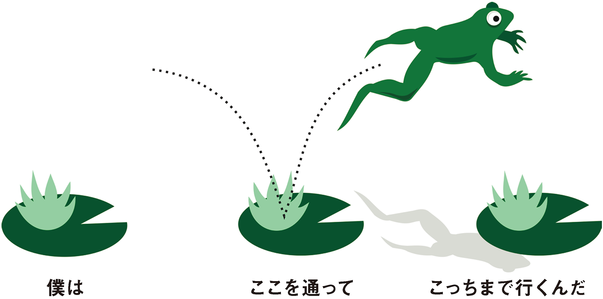
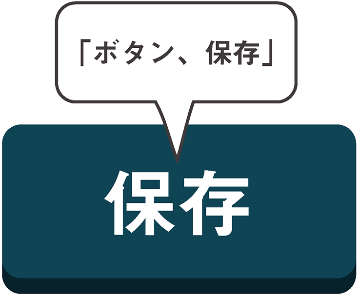

# 2-1 &lt;button&gt;要素

Webデザイナーの中には、ややこしい勧告を出すW3Cをわずらわしく思っている人もいます。こうしたデザイナーの中に、[HTML仕様書](http://www.w3.org/TR/html5/)を本当に全部読んだことがある人はわずかしかいないと思いますが、確かにHTMLに関する記述の細部には難解なものもあります。しかし、`<button>`の仕様については、まったくそんなことはありません。

>[button要素はボタンを表す。](http://www.w3.org/TR/2011/WD-html5-20110525/the-button-element.html#the-button-element)  
― W3C

この章では、WAI-ARIAのステートとプロパティを使って`<button>`要素を拡張し、そのさまざまな用途に関する詳細情報をアクセシブルに表現する方法を見ていきます。具体的には、押されたボタンと押されていないボタン、他の要素をコントロールするボタン、そしてアプリケーションのさまざまな部分の表示／非表示を切り替えるボタンなどです。

まず、基本のボタン（アプリケーション内で何かを実行するボタン）は次のように記述します。
```HTML
<button>何かを実行</button>
```

## ボタンをアクセシブルにするには？

正しいセマンティックHTMLの使用は手間がかかり難しすぎる、動作にふさわしい要素を使用することはあまり重要ではない、そんなふうに思われがちです。どのような要素でもJavaScriptでイベントを登録でき、CSSを使用してボタンに見せることができるのだから、使用する要素にこだわることは無意味なのでは？ などとも。


そんな気がするかもしれませんが、違います。Web標準は「取り決め」にほかなりません。この取り決めに従うことによってはじめて、処理を行い、できるだけ多くの人が予測する通りに動作させることができるのです。`<button>`要素に特定の動作を割り当てることによって、複数のブラウザベンダーがこの要素の表示と動作について共通の見解をもつのです。

その結果、皆さんや私のような制作者は、こうした動作を引き出すためにはどの要素を使用すればよいかがわかります。私たちは、ユーザーを戸惑わせないためにも、ブラウザベンダーと連携する必要があります。取り決めがあるからこそ、ユーザーはボタンに出会ったときに、それがボタンであるとわかるのです。

>支援技術ベンダーが制作者およびブラウザベンダーと協力して（HTMLコンテンツをアクセシブルにするべく）標準化されたインターフェイスによって提供される情報を利用しなければ、憂き目に遭うのはユーザーです。  
― [Paciello Groupブログ](http://blog.paciellogroup.com/2013/11/short-note-aria-dragon-accessibility/)

ボタンの場合で言うと、ボタンコントロールとして`<button>`要素を正しく使用することで、2つの重要なグループに属するユーザーにメリットがあります。キーボードユーザーとスクリーンリーダーのユーザーです。`<button>`要素を使用することで、次のことが可能になります。

- ボタンがフォーカスを受け取る。
- フォーカスを受け取ったボタンをキーボードで慣習通りに操作する。
- スクリーンリーダーがボタンを「ボタン」として読み上げる。

キーボードユーザーは、マウスではなくキーボードを使ってWebページをナビゲートします。好みでそうするユーザーもいるかもしれませんが、ほとんどは必要があってそうしているユーザー（マウスで正確にポイントすることが難しい人、マウスカーソルの小さな矢印がスクリーン上のどこにあるかが見えない人など）です。キーボードでWebページを利用できるようにすることは、WCAG 2.0（Web Accessibility Initiative発行の「Web Content Accessibility Guidelines」）に規定されています。

>すべての機能をキーボードから利用できるようにすること。  
― WCAG 2.0ガイドライン2.1

キーボードユーザーがボタンを動作させるためには、まずこのボタンにフォーカスを合わせなくてはなりません。要素にフォーカスを合わせることは、その要素に触れるようなものです。Webページで<kbd>Tab</kbd>キーを押すと、ページ内の次のインタラクティブ要素（ボタンなど）にフォーカスが移動します。<kbd>Enter</kbd>キーまたはスペースバーを押すと、要素がアクティブになり、イベントが実行されます。

このイベントの種類はさまざまですが、ここで問題としているのは、どうしたらイベントに**アクセス**できるかということです。ユーザーが要素に触れることができなければ、アクションはアクセシブルにはなりません。



スクリーンリーダーユーザーも同様にキーボードをよく使う傾向にありますが、ボタンにフォーカスがあるかどうかを目で確認することができません。スクリーンリーダーは、ユーザーがフォーカスを合わせたとき、その要素が`<button>`であるかどうかを伝える必要があり、そのためにはボタンのマークアップに`<button>`要素を使うというのが最も簡単な方法です。



## ボタンのタイプ

これまでに述べた`<button>`要素に関するすばらしい情報を思うと驚くべきことですが、アプリケーションのボタンコントロールとして`<button>`が使われていないことも少なくありません。Webアプリケーションをよく調べてみると、ボタンが実際には`<a>`要素であることや、さらに悪い場合には、デフォルトではフォーカスを受け取れない`<span>`や`<div>`であることもよくあります。

その主な理由は、「`<button>`はHTMLフォームに関連づけられているから、`<button>`にはフォームや送信のしくみが必要だ」と思って敬遠するデザイナーがいることです。

`<button>`がフォームやその他のフォーム要素と組み合わせて使用できることは事実です。`button`要素に`form`属性を指定して、フォームの`id`と関連づけることもあります。加えて、3つある`type`属性値の2つ、`submit`と`reset`は、明らかにフォーム内で使用するためのものです。

しかし、さらに`button`という`type`属性値も提供されています。このタイプのボタンは、フォームと直接関連している必要がありません。実際、これに関し、仕様には`<button type="button">`について次のように記述されています。

>[何もしない。](http://www.w3.org/TR/2011/WD-html5-20110525/the-button-element.html#the-button-element)  
― W3C

このため、フォームの送信やページのリロードを伴わない、キーボードで操作できるアクセシブルなコントロールを作成できます。モダンでアクセシブルなJavaScriptアプリケーション内のコントロールにはこのようなマークアップが最適であり、私たちはこれをふんだんに使っていくべきです。ボタンのタイプについて簡単にまとめると次のようになります。

<table>
<tr><th>`submit`</th><td>フォームを送信する</td></tr>
<tr><th>`button`</th><td>JavaScriptイベントに適する</td></tr>
<tr><th>`reset`</th><td>「誰だよ！　このボタンを置いたヤツは？」</td></tr>
</table>

## test.css

ほとんどのブラウザでは、`<form>`の外部にある単純な`<button>`は、大方の制作者が意図した方法で（**JavaScriptを実行するものとして**）処理されます。ただし、`<button>`の暗黙的な`type`は`submit`であるため、ブラウザによってはフォーム内にある`type`属性をもたないボタンが`submit`ボタンとして解釈されます。しかし、心配はいりません。これはテストで見つけることができます！

本書では、全体を通じて**test.css**という名前の特別なスタイルシートを使用して、マークアップ上のミスやアクセシビリティの問題をチェックしていきます。CSSセレクタを使用すると、HTMLの望ましくないパターンを定義し、特定することができます。ここでは、フォーム内に配置するすべてのボタンに`type`属性が明示的に指定されているかどうかをチェックします。疑似要素を使用して、不正が見つかったときにスクリーン上に警告メッセージが表示されるようにしましょう。

**test.css**ファイルに次の宣言ブロックを追加し、ページの`<head>`に最後のスタイルシートとしてインクルードします。
```CSS
form button:not([type]):after {
	background: red;
	color: white;
	content: '警告：このボタンにはtype属性がありません。submitですか、resetですか、単純なボタンですか？';
}
```

警告メッセージの見た目を変えることもできます。ここでは赤地に白いテキストにしました。
