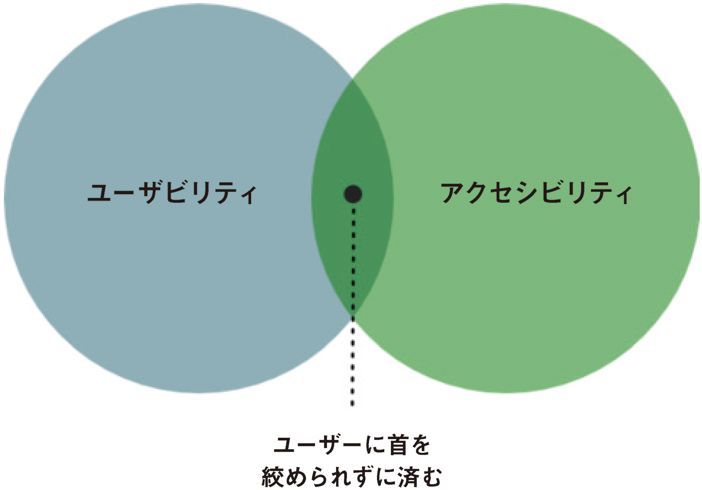
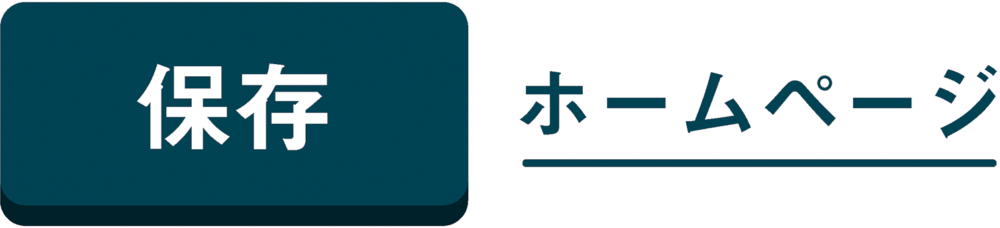
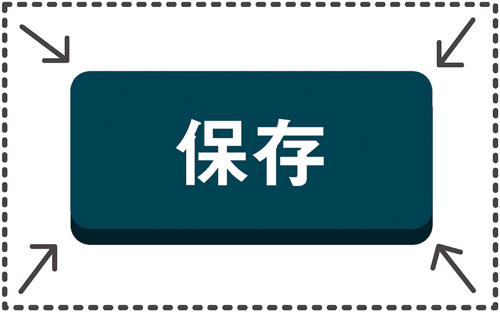
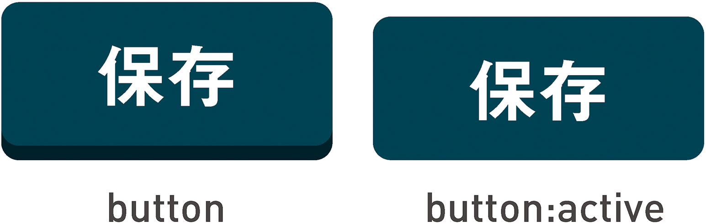
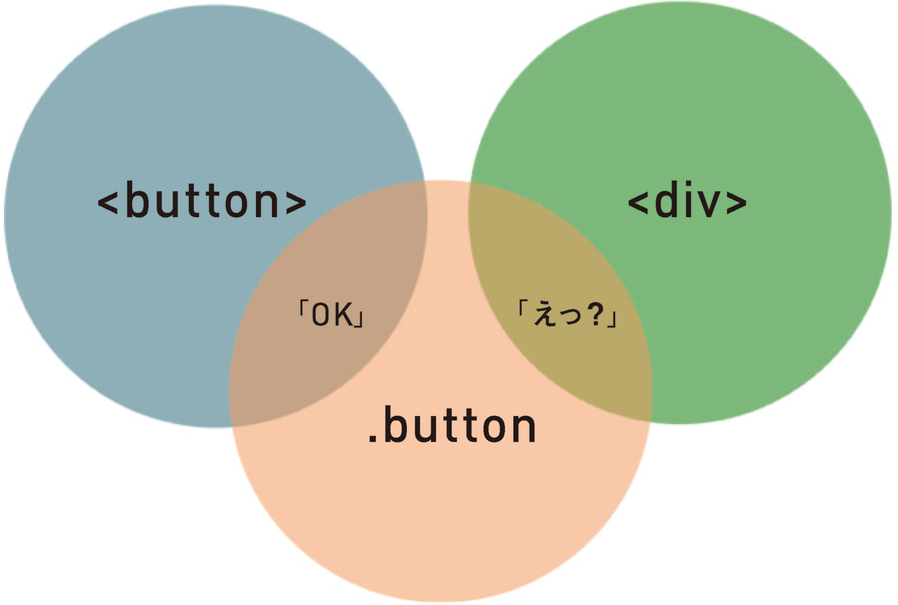
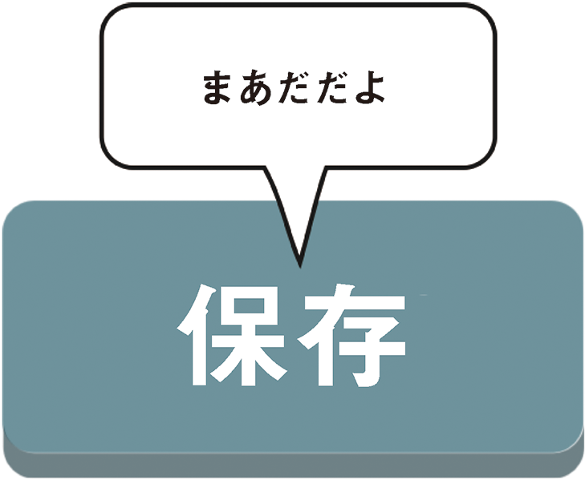

# 2-2 ボタンのスタイル

>望む目的に最もよくかなうように、 必要な要素を組み立てる計画が
デザインである。<br>
― Charles Eames（チャールズ・イームズ）
>
>『Eames Design: The Work of the Office of Charles and Ray Eames』、1989年、John Neuhart、Charles Eames、Ray Eames、Marilyn Neuhart著

これでアプリケーションにおけるボタンを作成するための正しいコードがわかりました。次は、このボタンをアピールすることを考えましょう。とは言っても、ボタンをセンスよく見せようということではなく（あまりにも醜いのは論外ですが）、ボタンが確実に見えるようにし、ユーザーの予想できる範囲で見た目を変えようということです。ボタンの見た目に関するユーザーの先入観はもちろん、ボタン自体に関する事前の理解や認識にも沿ったものにするべきです。

[認知障害に関するアクセシビリティ](http://webaim.org/articles/cognitive/)は、認知機能に関する障害を医学的に診断された人だけでなく、すべての人に役立つ分野です。アクセシビリティと、もうひとつの高尚な目標である[ユーザビリティ](http://en.wikipedia.org/wiki/Usability)を集約したものだとも言えるでしょう。



HTMLは「すべての人のために」あるため、優秀なアーティストでなかったとしても、ドキュメントやアプリケーションが制作できなくてはなりません。このため、CSSが関連づけられていないドキュメントに表示される`<button>`は、何らかの形でボタンに見えます。まったくスタイルがつけられないのではなく、制作者に代わってブラウザが無難な見た目にしてくれるということです。このため、どんな制作者でも、CSSのテクノロジーを追加で学習することなく、利用できるWebページを作成できます。

機能に沿った形状を採用したボタンデザインを行えば、ユーザーの認知能力を問わず、誰にとっても使いやすいアプリケーションまたはWebサイトになります。ブラウザがデフォルトで`<button>`をボタンらしい見た目で表示するのはこのためです。ボタンのスタイルを変える場合は、この慣習をヒントにするのがベストでしょう。

## 押したくなるボタン

本書の執筆時点では「[フラットデザイン](http://www.smashingmagazine.com/2013/09/03/flat-and-thin-are-in/)」が流行しており、人気という点でも、論争という点でも頂点に達しています。フラットデザインでは、これまでのアプリケーションやWebサイトのインターフェイスに組み込まれていた影、グラデーション、テクスチャといった要素が排除されています。

アプリケーションを印象的でスタイリッシュな外観に仕上げ、すっきりとさせることができるため、世界中のデザイナーがフラットデザインを採用してきました。もしくは、圧倒的な流行としてのフラットデザインに巻き込まれたかのどちらかでしょう。

いずれにしても、フラットデザインには注意が必要です。インタラクションデザインとは、見た目ばかりでなく使いやすさを重視するものであり、インタラクティブコントロールが認識しやすいものであれば、その用途がわかりやすくなります。

次の例では、単純な`border-radius`と`box-shadow`を使ってページから少し浮かせることで、ボタンを「ボタンらしく」見せています。スクリーン自体がフラットであることに変わりはないため、文字通りに「浮く」わけではありませんが、それらしく見えるようになります。

```
button {
	background-color: DarkSlateBlue;
	border-radius: 0.25em;
	box-shadow: 0 4px 0 #222;
}
```


---

### 訳注

この例には`background-color`指定がありますが、`color`の指定がないため、このままではボタンのラベルが読めなくなることがあります。実際に使用する際には、`color: white`など、適切な文字色を指定する必要があります。

---

### サイズとコントラスト

ボタンを出し惜しみすることはありません。大きくし、目立たせましょう。これにより、マウスのコントロールが難しく、かといってキーボードを使用するわけではない人々にとって、使いやすいコントロールになります。同じ理由で、`type`に`checkbox`を指定した`<input>`要素は、`<label>`で囲みます。こうすると、その入力をクリックするためのターゲットエリアが拡張されます。

```
<label><input type="checkbox" value="Yes" />同意しますか？</label>
```

>ラベルをクリックまたは押下してコントロールに割り当てられたイベントをトリガーできる機能によって、コントロールのヒット領域が増え、ユーザビリティとアクセシビリティが向上します。<br>
― W3C、「[label要素（The label element）](http://www.w3.org/html/wg/drafts/html/master/forms.html#the-label-element)」

ボタンの場合は、背景色で塗りつぶした単独のボックスとしてデザインされるのが一般的です。押せるものの色を統一するために、ボタンの背景色をリンクの文字色とそろえたくなることもあるでしょう。必ずしもそろえる必要はありませんが、いずれにしても、文字色と背景色の間には十分なコントラストが必要です。

>コンテンツを、利用者にとって見やすくしたり聞きやすくしたりすること。これには、前景と背景を区別することも含む。<br>
― WCAG 2.0ガイドライン1.4



ボタンのコントラストが適切であるかどうかを簡単にチェックするには、前景と背景の色を[Lea Verou（リー・ヴェルー）のツール](http://leaverou.github.io/contrast-ratio/)に入力するという方法があります。本書の付録では、この他にもカラーテスト（および色覚シミュレーション）用のツールを紹介しています。

## 押せるボタンが取りうる状態

ボタンの状態は、ボタンを押す寸前に変化します。ボタンの上にカーソルを合わせたとき（`:hover`状態）や、キーボードでフォーカスを移したとき（`:focus`状態）、これらはいずれも押す準備ができた状態だと考えられます。この2つの状態はユーザーのタイプが異なるだけで同等であるため、[Roger Johansson（ロジャー・ヨハンソン）の提言](https://twitter.com/rogerjohansson/status/382531860686848000)に従って、スタイルシートのルールを結合することをお勧めします。

```
button:hover, button:focus {
	/* 今まさに押せる状態になったとわかる見た目にする */
}
```

ほとんどのブラウザは、フォーカスの所在を示すために、ハイパーリンクに何らかのアウトライン（たとえば`outline: thin dotted`）をデフォルトで適用しています。このルールを打ち消して良いのは、目に見える形でフォーカスの見た目を変えるときだけです。破線のアウトラインは文字の形が不規則であるリンクには効果的ですが、ボタンに使用すると、ボックスの形状とラインがぴったりとくっつきすぎてわかりにくくなります。

>キーボード操作が可能なあらゆるユーザーインターフェイスには、フォーカスインジケータが見える操作モードがある。<br>
― WCAG ガイドライン 2.4.7

ボタンが四角形である場合、より太くてはっきりとしたアウトラインを使用することで、`:hover`および`:focus`の状態をより見やすくすることができます。もしくは、`background-color`を変えるのも効果的です。もっと凝ったことをするなら、やはり`outline`を使い、あまり知られていない`outline-offset`プロパティに命を吹き込むこともできます。

### ボタンのアウトラインのアニメーション

フォーカスが移ったボタンコントロールにキーボードユーザーが気づきやすくなるように、アウトラインがコントロールに少しずつ近づいてくるようにするのはどうでしょうか？　CSSトランジションを使いながら`outline-offset`プロパティを小さくすることで、まずは広く網をかけて、次第にボタンの正確な位置を示すようにできます。

そのためには、最初は`outline-offset`を広く設定すると同時に、アウトラインを不可視にしておきます。ページのあちこちに大きなボックスが表示されるようなことは避けなくてはなりません。また、トランジションのタイプも定義する必要があります。

```
button {
	outline: 2px solid transparent;
	outline-offset: 100px;
	transition: 0.5s all ease;
}
```

次に、網を小さくすると同時に、アウトラインを可視にします。

```
button:focus {
	outline: 2px solid #000;
	outline-offset: 0;
}
```

---

### 訳注
このスタイルではフォーカス枠は点線ではなく、実線になります。フォーカスを点線にする場合は、`outline`プロパティの`solid`を`dotted`に変更してください。

---

`outline-offset`をサポートしないブラウザ（どうせInternet Explorerは対応していないでしょう）のユーザーには、フォーカス時に2ピクセルのアウトラインが表示され、徐々にはっきり見えてくるようになっています。

CSSトランジションや`outline-offset`を利用できないユーザーにも、この厚ぼったい2ピクセルのアウトラインが表示されます。取り残されるユーザーを最小限にしようという[グレイスフルデグラデーション](http://www.css3.info/graceful-degradation/)のアプローチです。



この[アウトラインを縮めていくアプローチ](http://www.heydonworks.com/article/shrinking-button-outlines)は、皆さんのニーズや好みに合わないかもしれませんし、ユーザーが便利だと思うとは限りません。

しかし重要なことは、アクセシビリティは必ずしも雑用ではないということです。インターフェイスデザインの楽しい部分が終わった後に残されている義務などではないのです。アクセシビリティの向上を探ってみることが、クリエイティブな成果につながることもあります。

### アクティブな状態

ボタンのことばかりでそろそろ気味悪がられてしまいそうですが、ボタンが押されたときは見た目にも**押された状態**になったほうがいいですよね？　認知という観点から言うと、これは、押されていないときに表面から浮き出しているボタンが押されたときの動作として、期待される動作です。このとき役に立つのが`:active`の状態です。最初の例を元に、ボタンを押し下げたのと同じ量だけ`box-shadow`を減らすことで、ボタンが実際に押されたように見える効果を作ってみましょう。

```
button:active {
	position: relative;
	top: 3px; /* 3px凹む */
	box-shadow: 0 0 0 #222; /* 3px減（0に） */
}
```



### HTMLの要素にスタイルをつける方法

もう説明したじゃないか、ですって？　それは、「**方法**」という言葉の意味によって異なります。確かに、ボタンの外観をデザインする方法については説明しましたが、実際にそのようなボタンを作る方法についてはまだ説明していません。これから説明することは、ボタンに限らず、あらゆる要素のCSSにおいて重要な内容です。

[CSSフレームワーク](http://usablica.github.io/front-end-frameworks/compare.html)のスタイルのルールの多くは、CSSクラスに基づいています。実際のところ、CSSフレームワークがHTMLを大量に含んでいたら、それは純粋なCSSフレームワークとは言えないでしょう。スタイルシートで`.button`などのクラスを使うことにより、ボタンの見た目の定義を汎用的なものにすることが可能になっています。CSSフレームワークの`.button`クラスをどの要素に適用するかは、制作者次第です。



これは、アクセシビリティという観点からすると問題があります。これまでに見てきたように、**特定の動作を表す**真の`<button>`だけをボタンらしい見た目にするべきです。`<span>`、`<a>`、その他の要素をボタンのように見せかけるのは、ごまかしです。にもかかわらず、`.button`という暗号がこの過ちを許してしまっています。

CSSクラスはアクセシブルでも非アクセシブルでもありませんが、アクセシビリティに貢献するものではありません。ボタンのスタイルを`<button>`要素に限定することで、見た目がボタンであるものをボタンらしく動作させます。

```
.button {
	/* このスタイルは何にでも適用可 :-/ */
}

button {
	/* ボタンのみに適用されるスタイル */
}
```

### ボタンの無効化

これまで述べてきたように、アクセシブルなHTMLには要素だけでなく、要素の属性も関連しています。次はまさにそのための特別な属性について見ていきましょう。属性では、見た目だけでなく、指定された要素の動作も定義できます。`disabled`属性の場合でいうと、その目的は、有効になっているボタンならではの特徴の大部分を取り除くことです。安全のために銃から弾薬を外しておくのと同じことです。

`.button`と同じように、クラスを使ってボタンを無効に見せることには落とし穴があります。`.disabled`クラスと`.off`クラスは、どちらを選んだとしても、無効に見せかけるだけです。やはり、個別の`disabled`属性にまだ働いてもらわねばなりません。



クラスを使って要素の見た目だけを無効にする場合は、2つの危険が伴います。

1. すべての要素を無効にできるわけではない。
2. 無効にできる要素についても、適切に無効にすることはできない。

話になりませんね。ボタンを無効にする唯一の方法は要素に`disabled`属性を含めることであり、ハイパーリンクを無効にする唯一の方法は`href`属性を取り除くことです。したがって、CSSは次のようになります。

```
[disabled], a:not([href]) {
	/* disabled属性をもつすべての要素およびhref属性をもたないリンク用のスタイル */
}
```

### test.css

`href`のないリンクは、`disabled`を含むボタンのように、フォーカスを受け取らないし、受け取るべきではありません。それでも、 `href`をもたない``<a>`要素に`.button`クラスを使用し、きちんと機能する有効なボタンを作成したのだと勘違いしてしまう制作者はいなくならないでしょう。いま私の言ったことが何のことだかわからないという方は、心配いりません。あなたは正しい認識をもっているはずです。しかし、これまでに私がこのような間違いを何度見てきた（そして犯してきた）ことでしょうか！　

```
<!-- 機能するボタンではなく無効なリンク -->
<a class="button">押してください</a>
```

それでは**test.css**ファイルに新しいルールを追加して、不適切なところに`.button`クラスを追加していないか、要素を正しく無効化しているかどうかをチェックしましょう。

```
.button:not(button):after {
	background: red;
	color: white;
	content: '警告：ここでは要素をボタンのような外観にしようとしています。この要素は本当にボタンですか？';
}

button.disabled:not([disabled]):after,
a.disabled[href]:after {
	background: red;
	color: white;
	content: '警告：要素が無効であるかのようなスタイルを設定しようとしています。この要素がきちんと無効化されていることを確認してください。';
}
```
