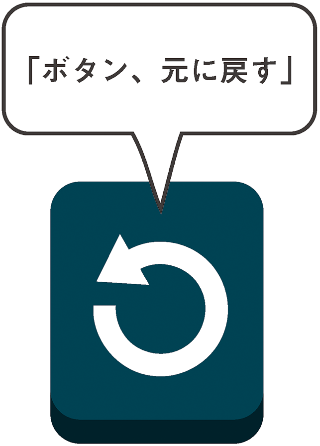
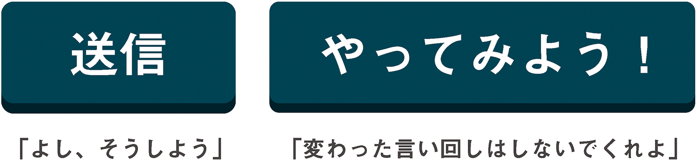

# 2-3 ボタンにラベルをつける

ここまではボタンのデザインに夢中になりすぎて、これが見えない人もいるのだということをすっかり忘れていました。こうした人々（とそれ以外のすべての人々）に、個々のボタンの目的を伝えるにはどうしたらよいでしょうか？　その答えは、単純に言えば「言葉で」、専門用語を使えば「`<button>`要素のテキストノードで」となります。WebAIMによる、[アクセシブルなフォームにするためのガイド](http://webaim.org/techniques/forms/controls#button)には、ボタンにテキストを含めることの重要性について、これ以上ないほどはっきりと明記されています。

>入力ボタンのvalue属性と`<button>`要素に含まれたテキストは、ボタンにアクセスしたときにスクリーンリーダーによって読み上げられます。これらを空にしておくことは、あってはなりません。

スクリーンリーダーは通常、フォーカスのあるコントロールが実際にボタンであることを通知した後に、そのボタンのラベルを読み上げます。たとえば「ボタン、保存」のように。

意図的に推測ゲームを作ろうとしているのでない限り、単に「ボタン」であるという通知だけでは、アクセシビリティの観点からするとほめられたものではありません。たとえば、Victor Tsaran（ビクター・ツァラン）による[サウスウエスト航空のiPhoneアプリのテスト](https://www.youtube.com/watch?v=StI0iIufJzk)では、画面の各コントロールが単に「ボタン」としか読み上げられていません。彼は最後に、「もうサウスウエストに用はないな」と顔をしかめています。

ただし、ボタンにラベルをつける方法はテキストノードだけではありません。基本的にはそうであるべきなのでしょうが、実際はそうではないのです。たとえば「元に戻す」操作を示すカーブした左向きの矢印などの``要素をテキストの代わりに`<button>`の中に含めて、わかりやすいシンボルを表示することもできます。

このような場合、次の2つの備えが必要です。

1. シンボルを理解できない人（そんなもん、わからなくて当然！）にテキストでヒントを提供するため、ツールチップを追加する。
2. スクリーンリーダーユーザー向けにボタンの説明をテキストで提供するため、`alt`属性をもたせる。

```
<button type="button"></button>
<p class="tooltip hidden">元に戻す</p>
```

**注**： JavaScriptで表示するツールチップよりも、代わりに標準の`title`属性を使用したほうが効率的と思えるかもしれません。しかし、`title`が表示されるのはhover時だけであり、フォーカス時には表示されないため、キーボードユーザーにとってはアクセシブルではありません。もちろん、使用するツールチップライブラリの作者がフォーカスイベントを考慮していない可能性もありますが、その場合は次のようにして調整することができます。

```
button:hover + .tooltip, button:focus + .tooltip {
	display: block;
}
```

Chapter 5「いないいないばあ」では、アクセシブルなWAI-ARIAベースのツールチップについてさらに見ていきます。

`alt`テキストは、標準のテキストラベルとして読めるであろうものを指定することが重要です。「元に戻す」ならよいのですが、「元に戻す矢印の絵」というのはナンセンスです。これは、機能を表現する代替手段であり、見えないものを説明するためのものではありません。

## ARIAによるラベルづけ

>すべての非テキストコンテンツには、拡大印刷、点字、音声、シンボル、平易な言葉などの利用者が必要とする形式に変換できるように、代替テキストを提供すること。<br>
― WCAG 2.0ガイドライン1.1

ここで初めてWeb Accessibility InitiativeのARIAが登場します。ARIA（Accessible Rich Internet Applications）は、`aria-label`と`aria-labelledby`という、フォームにアクセシブルなテキストを付与するための2つの方法を提供しています。前者は値にラベルテキストを含む属性であり、後者はテキストを含む他の要素を参照します。

ARIAがこれらのプロパティを提供している目的は、読み上げのための追加のテキストコンテンツや足りないテキストコンテンツを提供することによってスクリーンリーダーのアクセシビリティを向上することです。

ARIAプロパティおよびそのWebアプリケーションのアクセシビリティに対する貢献については、次の章でさらに詳しく見ていきます。

### aria-label

次の例では、アイコンフォントでアイコンを表現するために、特なUnicode
文字を使います。Unicode符号位置が[私用領域（PUA）](http://en.wikipedia.org/wiki/Private_Use_Areas)にあるため、特定の意味はなく、読み上げることはできません。`aria-label`の値は、このような場合に読み上げるべき文字を追加します。

```
<!-- aria-labelのサンプル -->
<button aria-label="元に戻す">&#xE000;</button>
```



### aria-labelledby

この例では、ちょっとした説明文を使って、ユーザーにボタンの使い方を案内します。この説明文では元に戻すボタンについて言及されているため、元に戻すボタンとその説明との関係（リレーションシップ）をアクセシブルな方法でコーディングします。具体的には、説明文の`id`を使います。

```
<p>直前の操作を元に戻すには<strong id="undo-text">元に戻す</strong>ボタンを押します。</p>
<button aria-labelledby="undo-text">&#xE000;</button>
```

リレーションシップについては、本書の後半でさらに詳しく説明します。今のところ、`aria-label`と`aria-labelledby`は対症療法に過ぎず、ほかに選択肢がない場合に使うということだけを覚えておいてください。テキストラベルを含んだ魅力的なボタンの方が好ましいでしょう。

## 用語選択

ユーザビリティと同様、アクセシビリティの要は慣習です。実際、そもそも先ほどのボタンの目的を伝えるために「元に戻す」の矢印を使ったのは、これがシンボリックだからという理由です。つまり、ボタンの意味が伝わったのは、カーブした左向きの矢印が操作の取り消しを示すという慣習があるからです。

考えてみれば（特に、右から左へと読み進める言語もあることを考慮すれば）、操作の取り消しをもっとうまく表す方法もあるでしょう。しかし、カーブした左向きの矢印は一般に広まった慣習であり、もっと普遍的なシンボルがありそうではあっても、鼻であしらわれることもないのです。私たち皆がその意味に同意したということです。

>「クリエイティビティ」はできの悪いデザイナーに任せましょう。ここは人と違うことをやる場所ではないのです。慣習があるならば、それを使います。<br>
― [Mark Boulton（マーク・ボルトン）](http://www.markboulton.co.uk/journal/icons-symbols-and-a-semiotic-web)

言葉も、[ピクトグラム](http://en.wikipedia.org/wiki/Pictogram)のようにシンボリックになりえます。慣習的な言葉を使って一般的なアクションを表すことはクリエイティブではないかもしれませんが、ユーザーが経験する[認知的緊張](http://www.nngroup.com/articles/navigation-cognitive-strain/)が軽減されるため、そのユーザビリティはとても優れています。

- **保管**ではなく**保存**
- **破棄**ではなく**削除**
- **入れ替え**ではなく**編集**



## test.css

ここでtest.cssファイルにもうひとつのルールを加えましょう。この宣言ブロックは、一連のセレクタを使用して、Webページのボタンに、少なくとも何らかの方法でアクセシビリティを考慮したラベルがつけられているかどうかをチェックします。

```
a:empty:not([aria-label]):not([aria-labelledby]):after,
button:empty:not([aria-label]):not([aria-labelledby]):after,
button:not([aria-label]):not([aria-labelledby]) img:only-child:not([alt]):after,
a:not([aria-label]):not([aria-labelledby]) img:onlychild:not([alt]):after {
	background: red;
	color: white;
	content: 'このボタンに関する情報が十分ではありません。ボタンの中にテキストを含めてください。';
}
```

上のコードは、かみ砕いて言うと、「ボタンにコンテンツがない場合でかつアクセシブルなARIAラベルがない場合は、警告を表示する」という処理を行っています。また、「ボタンにコンテンツがあり、それが単なる画像である場合でかつ画像にalt属性がない場合は、警告を表示する」という処理も行っています。CSSの見た目は悪くなりますが、ラベルをチェックするうえで役に立つでしょう。

---

### 訳注

残念ながら、画像を使用している場合の警告表示は、ほとんどのモダンブラウザで機能しません。このCSSでは`img`要素に対して`:after`擬似要素を使っていますが、`:after`擬似要素は要素内容の末尾にノードを追加するため、置換要素である`img`要素に警告のテキストを挿入することはできません。機能させたければ、CSSを調整して他の場所に表示させる必要があるでしょう。

---
