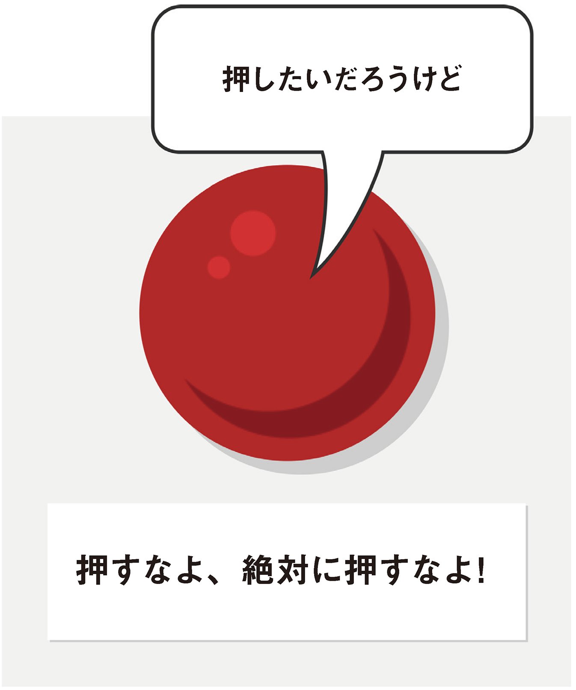
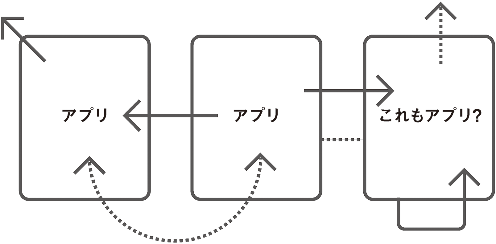

# Chapter2 ボタンのすべて
もっとも頻出するコントロールである「ボタン」を題材に、「ロール（役割の定義）」「ステート（状態を伝える）」「プロパティ（情報を提供する）」というWAI-ARIAの基本を解説します。

- [2-1 &lt;button&gt;要素](bodymatter_2_2.xhtml)
- [2-2 ボタンのスタイル](bodymatter_2_3.xhtml)
- [2-3 ボタンにラベルをつける](bodymatter_2_4.xhtml)

=======================================

どんな形であれ、ボタンが含まれていないインターフェイスがあるでしょうか？　スロットマシンからATMまで、あるいは未来の宇宙船のコンソールからiPhoneアプリまで。現実のものであれ想像上のものであれ、ほとんどのマシンにはボタンがあり、人間はマシンを動作させるため好き勝手にボタンを押します。

有名な**ビッグレッドボタン**には、意味ありげな「押すなよ、絶対に押すなよ！」というラベルがついていますが、なじみのあるその形は魅力的で、触らずにはいられません。押せば何かが崩れるのか、それとも爆発するのかを知らんがために。

それがボタンの力です。

World Wide Webは、もうずいぶん前から、ハイパーリンクと呼ばれる独特なタイプのボタンで定義されていました。このボタンを押すと、読者は相互接続されたドキュメントの連続体の中で、ある場所から別の場所へと連れて行かれます。

アルファベット順でも重要さでも真っ先にくるのが`<a>`要素です。この要素がまさにWebを定義していると言っても過言ではないでしょう。いわば世界中の共有知識を1つにまとめる接着剤です。

しかし次第に、私たちが取り組む対象は、単純なWebページではなく、Webアプリケーションに変わってきました。いつしか、単に情報を行き来するだけでなく、情報を操作するアプリケーションを構築したり、使用したりするようになっていたのです。Webアプリケーションを使用して、新しいWebアプリケーションを構築するためのWebアプリケーションを構築することさえもあります。実のところ、この文を書いているまさに今日、[ATAG](http://www.w3.org/WAI/intro/atag.php)（Authoring Tool Accessibility Guidelines）の勧告候補が完成しました。つまり、障害をもった人々が単にWebアプリケーションを使うだけでなく、自ら作成できるようにするためのガイドラインが、W3Cによって策定されたのです。大きな一歩ですね。

このような標準化や、jQueryなどの使いやすいライブラリによるJavaScriptの普及によって、Web制作者はかつてないほど簡単に、いわゆるシングルページJavaScriptアプリケーションを構築できるようになりました。

シングルページJavaScriptアプリケーションは、他のページとつながらず、単独で機能するインタラクティブなWebページです。ハイパーリンクが別の場所にジャンプするのに対し、JavaScriptアプリケーションが自己完結型であるとすれば、ハイパーリンクは一体どのような役割を果たすのでしょうか？

実のところ、**純粋**なWebアプリケーションというものは存在しません。これから見ていくように、アプリケーションページの内外で、ハイパーリンクは今後も重要なナビゲーションの役割を果たします。しかし、私たちのアプリケーションでは、**物事を発生させるボタン**にその役割を担わせます。

アクセシブルなアプリケーションは、`<button>`を押すところから始まります。

=======================================

## 2-1 button要素

Webデザイナーの中には、ややこしい勧告を出すW3Cをわずらわしく思っている人もいます。こうしたデザイナーの中に、[HTML仕様書](http://www.w3.org/TR/html5/)を本当に全部読んだことがある人はわずかしかいないと思いますが、確かにHTMLに関する記述の細部には難解なものもあります。しかし、`<button>`の仕様については、まったくそんなことはありません。

>[button要素はボタンを表す。](http://www.w3.org/TR/2011/WD-html5-20110525/the-button-element.html#the-button-element)  
― W3C

この章では、WAI-ARIAのステートとプロパティを使って`<button>`要素を拡張し、そのさまざまな用途に関する詳細情報をアクセシブルに表現する方法を見ていきます。具体的には、押されたボタンと押されていないボタン、他の要素をコントロールするボタン、そしてアプリケーションのさまざまな部分の表示／非表示を切り替えるボタンなどです。

まず、基本のボタン（アプリケーション内で何かを実行するボタン）は次のように記述します。

<pre class="sourceCode html"><code class="sourceCode html">&lt;button&gt;何かを実行&lt;/button&gt;</code></pre>

### ボタンをアクセシブルにするには？

正しいセマンティックHTMLの使用は手間がかかり難しすぎる、動作にふさわしい要素を使用することはあまり重要ではない、そんなふうに思われがちです。どのような要素でもJavaScriptでイベントを登録でき、CSSを使用してボタンに見せることができるのだから、使用する要素にこだわることは無意味なのでは？ などとも。

そんな気がするかもしれませんが、違います。Web標準は「取り決め」にほかなりません。この取り決めに従うことによってはじめて、処理を行い、できるだけ多くの人が予測する通りに動作させることができるのです。`<button>`要素に特定の動作を割り当てることによって、複数のブラウザベンダーがこの要素の表示と動作について共通の見解をもつのです。

その結果、皆さんや私のような制作者は、こうした動作を引き出すためにはどの要素を使用すればよいかがわかります。私たちは、ユーザーを戸惑わせないためにも、ブラウザベンダーと連携する必要があります。取り決めがあるからこそ、ユーザーはボタンに出会ったときに、それがボタンであるとわかるのです。

>支援技術ベンダーが制作者およびブラウザベンダーと協力して（HTMLコンテンツをアクセシブルにするべく）標準化されたインターフェイスによって提供される情報を利用しなければ、憂き目に遭うのはユーザーです。  
― [Paciello Groupブログ](http://blog.paciellogroup.com/2013/11/short-note-aria-dragon-accessibility/)

ボタンの場合で言うと、ボタンコントロールとして`<button>`要素を正しく使用することで、2つの重要なグループに属するユーザーにメリットがあります。キーボードユーザーとスクリーンリーダーのユーザーです。`<button>`要素を使用することで、次のことが可能になります。

- ボタンがフォーカスを受け取る。
- フォーカスを受け取ったボタンをキーボードで慣習通りに操作する。
- スクリーンリーダーがボタンを「ボタン」として読み上げる。

キーボードユーザーは、マウスではなくキーボードを使ってWebページをナビゲートします。好みでそうするユーザーもいるかもしれませんが、ほとんどは必要があってそうしているユーザー（マウスで正確にポイントすることが難しい人、マウスカーソルの小さな矢印がスクリーン上のどこにあるかが見えない人など）です。キーボードでWebページを利用できるようにすることは、WCAG 2.0（Web Accessibility Initiative発行の「Web Content Accessibility Guidelines」）に規定されています。

>すべての機能をキーボードから利用できるようにすること。  
― WCAG 2.0ガイドライン2.1

キーボードユーザーがボタンを動作させるためには、まずこのボタンにフォーカスを合わせなくてはなりません。要素にフォーカスを合わせることは、その要素に触れるようなものです。Webページで<kbd>Tab</kbd>キーを押すと、ページ内の次のインタラクティブ要素（ボタンなど）にフォーカスが移動します。<kbd>Enter</kbd>キーまたはスペースバーを押すと、要素がアクティブになり、イベントが実行されます。

このイベントの種類はさまざまですが、ここで問題としているのは、どうしたらイベントに**アクセス**できるかということです。ユーザーが要素に触れることができなければ、アクションはアクセシブルにはなりません。

スクリーンリーダーユーザーも同様にキーボードをよく使う傾向にありますが、ボタンにフォーカスがあるかどうかを目で確認することができません。スクリーンリーダーは、ユーザーがフォーカスを合わせたとき、その要素が`<button>`であるかどうかを伝える必要があり、そのためにはボタンのマークアップに`<button>`要素を使うというのが最も簡単な方法です。

### ボタンのタイプ

これまでに述べた`<button>`要素に関するすばらしい情報を思うと驚くべきことですが、アプリケーションのボタンコントロールとして`<button>`が使われていないことも少なくありません。Webアプリケーションをよく調べてみると、ボタンが実際には`<a>`要素であることや、さらに悪い場合には、デフォルトではフォーカスを受け取れない``や`
`であることもよくあります。

その主な理由は、「`<button>`はHTMLフォームに関連づけられているから、`<button>`にはフォームや送信のしくみが必要だ」と思って敬遠するデザイナーがいることです。

`<button>`がフォームやその他のフォーム要素と組み合わせて使用できることは事実です。`button`要素に`form`属性を指定して、フォームの`id`と関連づけることもあります。加えて、3つある`type`属性値の2つ、`submit`と`reset`は、明らかにフォーム内で使用するためのものです。

しかし、さらに`button`という`type`属性値も提供されています。このタイプのボタンは、フォームと直接関連している必要がありません。実際、これに関し、仕様には`<button type="button">`について次のように記述されています。

>[何もしない。](http://www.w3.org/TR/2011/WD-html5-20110525/the-button-element.html#the-button-element)  
― W3C

このため、フォームの送信やページのリロードを伴わない、キーボードで操作できるアクセシブルなコントロールを作成できます。モダンでアクセシブルなJavaScriptアプリケーション内のコントロールにはこのようなマークアップが最適であり、私たちはこれをふんだんに使っていくべきです。ボタンのタイプについて簡単にまとめると次のようになります。

<table>
<tr><th><code>submit</code></th><td>フォームを送信する</td></tr>
<tr><th><code>button</code></th><td>JavaScriptイベントに適する</td></tr>
<tr><th><code>reset</code></th><td>「誰だよ！　このボタンを置いたヤツは？」</td></tr>
</table>

#### test.css

ほとんどのブラウザでは、`<form>`の外部にある単純な`<button>`は、大方の制作者が意図した方法で（**JavaScriptを実行するものとして**）処理されます。ただし、`<button>`の暗黙的な`type`は`submit`であるため、ブラウザによってはフォーム内にある`type`属性をもたないボタンが`submit`ボタンとして解釈されます。しかし、心配はいりません。これはテストで見つけることができます！

本書では、全体を通じて**test.css**という名前の特別なスタイルシートを使用して、マークアップ上のミスやアクセシビリティの問題をチェックしていきます。CSSセレクタを使用すると、HTMLの望ましくないパターンを定義し、特定することができます。ここでは、フォーム内に配置するすべてのボタンに`type`属性が明示的に指定されているかどうかをチェックします。疑似要素を使用して、不正が見つかったときにスクリーン上に警告メッセージが表示されるようにしましょう。

**test.css**ファイルに次の宣言ブロックを追加し、ページの`<head>`に最後のスタイルシートとしてインクルードします。

<pre class="sourceCode css"><code class="sourceCode css">form button:not([type]):after {
    background: red;
    color: white;
    content: &#39;警告：このボタンにはtype属性がありません。submitですか、resetですか、単純なボタンですか？&#39;;
}</code></pre>

警告メッセージの見た目を変えることもできます。ここでは赤地に白いテキストにしました。

=======================================

## 2-2 ボタンのスタイル

>望む目的に最もよくかなうように、 必要な要素を組み立てる計画がデザインである。  
― Charles Eames（チャールズ・イームズ）
>
>『Eames Design: The Work of the Office of Charles and Ray Eames』、1989年、John Neuhart、Charles Eames、Ray Eames、Marilyn Neuhart著

これでアプリケーションにおけるボタンを作成するための正しいコードがわかりました。次は、このボタンをアピールすることを考えましょう。とは言っても、ボタンをセンスよく見せようということではなく（あまりにも醜いのは論外ですが）、ボタンが確実に見えるようにし、ユーザーの予想できる範囲で見た目を変えようということです。ボタンの見た目に関するユーザーの先入観はもちろん、ボタン自体に関する事前の理解や認識にも沿ったものにするべきです。

[認知障害に関するアクセシビリティ](http://webaim.org/articles/cognitive/)は、認知機能に関する障害を医学的に診断された人だけでなく、すべての人に役立つ分野です。アクセシビリティと、もうひとつの高尚な目標である[ユーザビリティ](http://en.wikipedia.org/wiki/Usability)を集約したものだとも言えるでしょう。

HTMLは「すべての人のために」あるため、優秀なアーティストでなかったとしても、ドキュメントやアプリケーションが制作できなくてはなりません。このため、CSSが関連づけられていないドキュメントに表示される`<button>`は、何らかの形でボタンに見えます。まったくスタイルがつけられないのではなく、制作者に代わってブラウザが無難な見た目にしてくれるということです。このため、どんな制作者でも、CSSのテクノロジーを追加で学習することなく、利用できるWebページを作成できます。

機能に沿った形状を採用したボタンデザインを行えば、ユーザーの認知能力を問わず、誰にとっても使いやすいアプリケーションまたはWebサイトになります。ブラウザがデフォルトで`<button>`をボタンらしい見た目で表示するのはこのためです。ボタンのスタイルを変える場合は、この慣習をヒントにするのがベストでしょう。

### 押したくなるボタン

本書の執筆時点では「[フラットデザイン](http://www.smashingmagazine.com/2013/09/03/flat-and-thin-are-in/)」が流行しており、人気という点でも、論争という点でも頂点に達しています。フラットデザインでは、これまでのアプリケーションやWebサイトのインターフェイスに組み込まれていた影、グラデーション、テクスチャといった要素が排除されています。

アプリケーションを印象的でスタイリッシュな外観に仕上げ、すっきりとさせることができるため、世界中のデザイナーがフラットデザインを採用してきました。もしくは、圧倒的な流行としてのフラットデザインに巻き込まれたかのどちらかでしょう。

いずれにしても、フラットデザインには注意が必要です。インタラクションデザインとは、見た目ばかりでなく使いやすさを重視するものであり、インタラクティブコントロールが認識しやすいものであれば、その用途がわかりやすくなります。

次の例では、単純な`border-radius`と`box-shadow`を使ってページから少し浮かせることで、ボタンを「ボタンらしく」見せています。スクリーン自体がフラットであることに変わりはないため、文字通りに「浮く」わけではありませんが、それらしく見えるようになります。

<pre class="sourceCode css"><code class="sourceCode css">button {
    background-color: DarkSlateBlue;
    border-radius: 0.25em;
    box-shadow: 0 4px 0 #222;
}</code></pre>

訳注
: この例には`background-color`指定がありますが、`color`の指定がないため、このままではボタンのラベルが読めなくなることがあります。実際に使用する際には、`color: white`など、適切な文字色を指定する必要があります。

#### サイズとコントラスト

ボタンを出し惜しみすることはありません。大きくし、目立たせましょう。これにより、マウスのコントロールが難しく、かといってキーボードを使用するわけではない人々にとって、使いやすいコントロールになります。同じ理由で、`type`に`checkbox`を指定した`<input>`要素は、`<label>`で囲みます。こうすると、その入力をクリックするためのターゲットエリアが拡張されます。

<pre class="sourceCode html"><code class="sourceCode html">&lt;label&gt;&lt;input type=&quot;checkbox&quot; value=&quot;Yes&quot; /&gt;同意しますか？&lt;/label&gt;</code></pre>

>ラベルをクリックまたは押下してコントロールに割り当てられたイベントをトリガーできる機能によって、コントロールのヒット領域が増え、ユーザビリティとアクセシビリティが向上します。  
― W3C、「[label要素（The label element）](http://www.w3.org/html/wg/drafts/html/master/forms.html#the-label-element)」

ボタンの場合は、背景色で塗りつぶした単独のボックスとしてデザインされるのが一般的です。押せるものの色を統一するために、ボタンの背景色をリンクの文字色とそろえたくなることもあるでしょう。必ずしもそろえる必要はありませんが、いずれにしても、文字色と背景色の間には十分なコントラストが必要です。

>コンテンツを、利用者にとって見やすくしたり聞きやすくしたりすること。これには、前景と背景を区別することも含む。  
― WCAG 2.0ガイドライン1.4

ボタンのコントラストが適切であるかどうかを簡単にチェックするには、前景と背景の色を[Lea Verou（リー・ヴェルー）のツール](http://leaverou.github.io/contrast-ratio/)に入力するという方法があります。本書の付録では、この他にもカラーテスト（および色覚シミュレーション）用のツールを紹介しています。

### 押せるボタンが取りうる状態

ボタンの状態は、ボタンを押す寸前に変化します。ボタンの上にカーソルを合わせたとき（`:hover`状態）や、キーボードでフォーカスを移したとき（`:focus`状態）、これらはいずれも押す準備ができた状態だと考えられます。この2つの状態はユーザーのタイプが異なるだけで同等であるため、[Roger Johansson（ロジャー・ヨハンソン）の提言](https://twitter.com/rogerjohansson/status/382531860686848000)に従って、スタイルシートのルールを結合することをお勧めします。

<pre class="sourceCode css"><code class="sourceCode css">button:hover, button:focus {
    /* 今まさに押せる状態になったとわかる見た目にする */
}</code></pre>

ほとんどのブラウザは、フォーカスの所在を示すために、ハイパーリンクに何らかのアウトライン（たとえば`outline: thin dotted`）をデフォルトで適用しています。このルールを打ち消して良いのは、目に見える形でフォーカスの見た目を変えるときだけです。破線のアウトラインは文字の形が不規則であるリンクには効果的ですが、ボタンに使用すると、ボックスの形状とラインがぴったりとくっつきすぎてわかりにくくなります。

>キーボード操作が可能なあらゆるユーザーインターフェイスには、フォーカスインジケータが見える操作モードがある。  
― WCAG ガイドライン 2.4.7

ボタンが四角形である場合、より太くてはっきりとしたアウトラインを使用することで、`:hover`および`:focus`の状態をより見やすくすることができます。もしくは、`background-color`を変えるのも効果的です。もっと凝ったことをするなら、やはり`outline`を使い、あまり知られていない`outline-offset`プロパティに命を吹き込むこともできます。

#### ボタンのアウトラインのアニメーション

フォーカスが移ったボタンコントロールにキーボードユーザーが気づきやすくなるように、アウトラインがコントロールに少しずつ近づいてくるようにするのはどうでしょうか？　CSSトランジションを使いながら`outline-offset`プロパティを小さくすることで、まずは広く網をかけて、次第にボタンの正確な位置を示すようにできます。

そのためには、最初は`outline-offset`を広く設定すると同時に、アウトラインを不可視にしておきます。ページのあちこちに大きなボックスが表示されるようなことは避けなくてはなりません。また、トランジションのタイプも定義する必要があります。

<pre class="sourceCode css"><code class="sourceCode css">button {
    outline: 2px solid transparent;
    outline-offset: 100px;
    transition: 0.5s all ease;
}</code></pre>

次に、網を小さくすると同時に、アウトラインを可視にします。

<pre class="sourceCode css"><code class="sourceCode css">button:focus {
    outline: 2px solid #000;
    outline-offset: 0;
}</code></pre>

訳注
: このスタイルではフォーカス枠は点線ではなく、実線になります。フォーカスを点線にする場合は、`outline`プロパティの`solid`を`dotted`に変更してください。

`outline-offset`をサポートしないブラウザ（どうせInternet Explorerは対応していないでしょう）のユーザーには、フォーカス時に2ピクセルのアウトラインが表示され、徐々にはっきり見えてくるようになっています。

CSSトランジションや`outline-offset`を利用できないユーザーにも、この厚ぼったい2ピクセルのアウトラインが表示されます。取り残されるユーザーを最小限にしようという[グレイスフルデグラデーション](http://www.css3.info/graceful-degradation/)のアプローチです。

この[アウトラインを縮めていくアプローチ](http://www.heydonworks.com/article/shrinking-button-outlines)は、皆さんのニーズや好みに合わないかもしれませんし、ユーザーが便利だと思うとは限りません。

しかし重要なことは、アクセシビリティは必ずしも雑用ではないということです。インターフェイスデザインの楽しい部分が終わった後に残されている義務などではないのです。アクセシビリティの向上を探ってみることが、クリエイティブな成果につながることもあります。

#### アクティブな状態

ボタンのことばかりでそろそろ気味悪がられてしまいそうですが、ボタンが押されたときは見た目にも**押された状態**になったほうがいいですよね？　認知という観点から言うと、これは、押されていないときに表面から浮き出しているボタンが押されたときの動作として、期待される動作です。このとき役に立つのが`:active`の状態です。最初の例を元に、ボタンを押し下げたのと同じ量だけ`box-shadow`を減らすことで、ボタンが実際に押されたように見える効果を作ってみましょう。

<pre class="sourceCode css"><code class="sourceCode css">button:active {
    position: relative;
    top: 3px; /* 3px凹む */
    box-shadow: 0 0 0 #222; /* 3px減（0に） */
}</code></pre>

### HTMLの要素にスタイルをつける方法

もう説明したじゃないか、ですって？　それは、「**方法**」という言葉の意味によって異なります。確かに、ボタンの外観をデザインする方法については説明しましたが、実際にそのようなボタンを作る方法についてはまだ説明していません。これから説明することは、ボタンに限らず、あらゆる要素のCSSにおいて重要な内容です。

[CSSフレームワーク](http://usablica.github.io/front-end-frameworks/compare.html)のスタイルのルールの多くは、CSSクラスに基づいています。実際のところ、CSSフレームワークがHTMLを大量に含んでいたら、それは純粋なCSSフレームワークとは言えないでしょう。スタイルシートで`.button`などのクラスを使うことにより、ボタンの見た目の定義を汎用的なものにすることが可能になっています。CSSフレームワークの`.button`クラスをどの要素に適用するかは、制作者次第です。

これは、アクセシビリティという観点からすると問題があります。これまでに見てきたように、**特定の動作を表す**真の`<button>`だけをボタンらしい見た目にするべきです。``、`<a>`、その他の要素をボタンのように見せかけるのは、ごまかしです。にもかかわらず、`.button`という暗号がこの過ちを許してしまっています。

CSSクラスはアクセシブルでも非アクセシブルでもありませんが、アクセシビリティに貢献するものではありません。ボタンのスタイルを`<button>`要素に限定することで、見た目がボタンであるものをボタンらしく動作させます。

<pre class="sourceCode css"><code class="sourceCode css">.button {
    /* このスタイルは何にでも適用可 :-/ */
}

button {
    /* ボタンのみに適用されるスタイル */
}</code></pre>

#### ボタンの無効化

これまで述べてきたように、アクセシブルなHTMLには要素だけでなく、要素の属性も関連しています。次はまさにそのための特別な属性について見ていきましょう。属性では、見た目だけでなく、指定された要素の動作も定義できます。`disabled`属性の場合でいうと、その目的は、有効になっているボタンならではの特徴の大部分を取り除くことです。安全のために銃から弾薬を外しておくのと同じことです。

`.button`と同じように、クラスを使ってボタンを無効に見せることには落とし穴があります。`.disabled`クラスと`.off`クラスは、どちらを選んだとしても、無効に見せかけるだけです。やはり、個別の`disabled`属性にまだ働いてもらわねばなりません。

クラスを使って要素の見た目だけを無効にする場合は、2つの危険が伴います。

1. すべての要素を無効にできるわけではない。
2. 無効にできる要素についても、適切に無効にすることはできない。

話になりませんね。ボタンを無効にする唯一の方法は要素に`disabled`属性を含めることであり、ハイパーリンクを無効にする唯一の方法は`href`属性を取り除くことです。したがって、CSSは次のようになります。

<pre class="sourceCode css"><code class="sourceCode css">[disabled], a:not([href]) {
    /* disabled属性をもつすべての要素およびhref属性をもたないリンク用のスタイル */
}</code></pre>

#### test.css

`href`のないリンクは、`disabled`を含むボタンのように、フォーカスを受け取らないし、受け取るべきではありません。それでも、 `href`をもたない`<a>`要素に`.button`クラスを使用し、きちんと機能する有効なボタンを作成したのだと勘違いしてしまう制作者はいなくならないでしょう。いま私の言ったことが何のことだかわからないという方は、心配いりません。あなたは正しい認識をもっているはずです。しかし、これまでに私がこのような間違いを何度見てきた（そして犯してきた）ことでしょうか！　

<pre class="sourceCode html"><code class="sourceCode html">&lt;!-- 機能するボタンではなく無効なリンク --&gt;
&lt;a class=&quot;button&quot;&gt;押してください&lt;/a&gt;</code></pre>

それでは**test.css**ファイルに新しいルールを追加して、不適切なところに`.button`クラスを追加していないか、要素を正しく無効化しているかどうかをチェックしましょう。

<pre class="sourceCode css"><code class="sourceCode css">.button:not(button):after {
    background: red;
    color: white;
    content: &#39;警告：ここでは要素をボタンのような外観にしようとしています。この要素は本当にボタンですか？&#39;;
}

button.disabled:not([disabled]):after,
a.disabled[href]:after {
    background: red;
    color: white;
    content: &#39;警告：要素が無効であるかのようなスタイルを設定しようとしています。この要素がきちんと無効化されていることを確認してください。&#39;;
}</code></pre>

=======================================

## 2-3 ボタンにラベルをつける

ここまではボタンのデザインに夢中になりすぎて、これが見えない人もいるのだということをすっかり忘れていました。こうした人々（とそれ以外のすべての人々）に、個々のボタンの目的を伝えるにはどうしたらよいでしょうか？　その答えは、単純に言えば「言葉で」、専門用語を使えば「`<button>`要素のテキストノードで」となります。WebAIMによる、[アクセシブルなフォームにするためのガイド](http://webaim.org/techniques/forms/controls#button)には、ボタンにテキストを含めることの重要性について、これ以上ないほどはっきりと明記されています。

>入力ボタンのvalue属性と`<button>`要素に含まれたテキストは、ボタンにアクセスしたときにスクリーンリーダーによって読み上げられます。これらを空にしておくことは、あってはなりません。

スクリーンリーダーは通常、フォーカスのあるコントロールが実際にボタンであることを通知した後に、そのボタンのラベルを読み上げます。たとえば「ボタン、保存」のように。

意図的に推測ゲームを作ろうとしているのでない限り、単に「ボタン」であるという通知だけでは、アクセシビリティの観点からするとほめられたものではありません。たとえば、Victor Tsaran（ビクター・ツァラン）による[サウスウエスト航空のiPhoneアプリのテスト](https://www.youtube.com/watch?v=StI0iIufJzk)では、画面の各コントロールが単に「ボタン」としか読み上げられていません。彼は最後に、「もうサウスウエストに用はないな」と顔をしかめています。

ただし、ボタンにラベルをつける方法はテキストノードだけではありません。基本的にはそうであるべきなのでしょうが、実際はそうではないのです。たとえば「元に戻す」操作を示すカーブした左向きの矢印などの``要素をテキストの代わりに`<button>`の中に含めて、わかりやすいシンボルを表示することもできます。

このような場合、次の2つの備えが必要です。

1. シンボルを理解できない人（そんなもん、わからなくて当然！）にテキストでヒントを提供するため、ツールチップを追加する。
2. スクリーンリーダーユーザー向けにボタンの説明をテキストで提供するため、`alt`属性をもたせる。

<pre class="sourceCode html"><code class="sourceCode html">&lt;button type=&quot;button&quot;&gt;&lt;img src=&quot;undo_icon.png&quot; alt=&quot;元に戻す&quot; /&gt;&lt;/button&gt;
&lt;p class=&quot;tooltip hidden&quot;&gt;元に戻す&lt;/p&gt;</code></pre>

**注**： JavaScriptで表示するツールチップよりも、代わりに標準の`title`属性を使用したほうが効率的と思えるかもしれません。しかし、`title`が表示されるのはhover時だけであり、フォーカス時には表示されないため、キーボードユーザーにとってはアクセシブルではありません。もちろん、使用するツールチップライブラリの作者がフォーカスイベントを考慮していない可能性もありますが、その場合は次のようにして調整することができます。

<pre class="sourceCode css"><code class="sourceCode css">button:hover + .tooltip, button:focus + .tooltip {
    display: block;
}</code></pre>

Chapter5「[いないいないばあ](bodymatter_5_0.xhtml)」では、アクセシブルなWAI-ARIAベースのツールチップについてさらに見ていきます。

`alt`テキストは、標準のテキストラベルとして読めるであろうものを指定することが重要です。「元に戻す」ならよいのですが、「元に戻す矢印の絵」というのはナンセンスです。これは、機能を表現する代替手段であり、見えないものを説明するためのものではありません。

### ARIAによるラベルづけ

>すべての非テキストコンテンツには、拡大印刷、点字、音声、シンボル、平易な言葉などの利用者が必要とする形式に変換できるように、代替テキストを提供すること。  
― WCAG 2.0ガイドライン1.1

ここで初めてWeb Accessibility InitiativeのARIAが登場します。ARIA（Accessible Rich Internet Applications）は、`aria-label`と`aria-labelledby`という、フォームにアクセシブルなテキストを付与するための2つの方法を提供しています。前者は値にラベルテキストを含む属性であり、後者はテキストを含む他の要素を参照します。

ARIAがこれらのプロパティを提供している目的は、読み上げのための追加のテキストコンテンツや足りないテキストコンテンツを提供することによってスクリーンリーダーのアクセシビリティを向上することです。

ARIAプロパティおよびそのWebアプリケーションのアクセシビリティに対する貢献については、次の章でさらに詳しく見ていきます。

#### aria-label

次の例では、アイコンフォントでアイコンを表現するために、特なUnicode
文字を使います。Unicode符号位置が[私用領域（PUA）](http://en.wikipedia.org/wiki/Private_Use_Areas)にあるため、特定の意味はなく、読み上げることはできません。`aria-label`の値は、このような場合に読み上げるべき文字を追加します。

<pre class="sourceCode html"><code class="sourceCode html">&lt;!-- aria-labelのサンプル --&gt;
&lt;button aria-label=&quot;元に戻す&quot;&gt;&amp;#xE000;&lt;/button&gt;</code></pre>

#### aria-labelledby

この例では、ちょっとした説明文を使って、ユーザーにボタンの使い方を案内します。この説明文では元に戻すボタンについて言及されているため、元に戻すボタンとその説明との関係（リレーションシップ）をアクセシブルな方法でコーディングします。具体的には、説明文の`id`を使います。

<pre class="sourceCode html"><code class="sourceCode html">&lt;p&gt;直前の操作を元に戻すには&lt;strong id=&quot;undo-text&quot;&gt;元に戻す&lt;/strong&gt;ボタンを押します。&lt;/p&gt;
&lt;button aria-labelledby=&quot;undo-text&quot;&gt;&amp;#xE000;&lt;/button&gt;</code></pre>

リレーションシップについては、本書の後半でさらに詳しく説明します。今のところ、`aria-label`と`aria-labelledby`は対症療法に過ぎず、ほかに選択肢がない場合に使うということだけを覚えておいてください。テキストラベルを含んだ魅力的なボタンの方が好ましいでしょう。

### 用語選択

ユーザビリティと同様、アクセシビリティの要は慣習です。実際、そもそも先ほどのボタンの目的を伝えるために「元に戻す」の矢印を使ったのは、これがシンボリックだからという理由です。つまり、ボタンの意味が伝わったのは、カーブした左向きの矢印が操作の取り消しを示すという慣習があるからです。

考えてみれば（特に、右から左へと読み進める言語もあることを考慮すれば）、操作の取り消しをもっとうまく表す方法もあるでしょう。しかし、カーブした左向きの矢印は一般に広まった慣習であり、もっと普遍的なシンボルがありそうではあっても、鼻であしらわれることもないのです。私たち皆がその意味に同意したということです。

>「クリエイティビティ」はできの悪いデザイナーに任せましょう。ここは人と違うことをやる場所ではないのです。慣習があるならば、それを使います。  
― [Mark Boulton（マーク・ボルトン）](http://www.markboulton.co.uk/journal/icons-symbols-and-a-semiotic-web)

言葉も、[ピクトグラム](http://en.wikipedia.org/wiki/Pictogram)のようにシンボリックになりえます。慣習的な言葉を使って一般的なアクションを表すことはクリエイティブではないかもしれませんが、ユーザーが経験する[認知的緊張](http://www.nngroup.com/articles/navigation-cognitive-strain/)が軽減されるため、そのユーザビリティはとても優れています。

- **保管**ではなく**保存**
- **破棄**ではなく**削除**
- **入れ替え**ではなく**編集**

### test.css

ここでtest.cssファイルにもうひとつのルールを加えましょう。この宣言ブロックは、一連のセレクタを使用して、Webページのボタンに、少なくとも何らかの方法でアクセシビリティを考慮したラベルがつけられているかどうかをチェックします。

<pre class="sourceCode css"><code class="sourceCode css">a:empty:not([aria-label]):not([aria-labelledby]):after,
button:empty:not([aria-label]):not([aria-labelledby]):after,
button:not([aria-label]):not([aria-labelledby]) img:only-child:not([alt]):after,
a:not([aria-label]):not([aria-labelledby]) img:onlychild:not([alt]):after {
    background: red;
    color: white;
    content: &#39;このボタンに関する情報が十分ではありません。ボタンの中にテキストを含めてください。&#39;;
}</code></pre>

上のコードは、かみ砕いて言うと、「ボタンにコンテンツがない場合でかつアクセシブルなARIAラベルがない場合は、警告を表示する」という処理を行っています。また、「ボタンにコンテンツがあり、それが単なる画像である場合でかつ画像にalt属性がない場合は、警告を表示する」という処理も行っています。CSSの見た目は悪くなりますが、ラベルをチェックするうえで役に立つでしょう。

訳注
: 残念ながら、画像を使用している場合の警告表示は、ほとんどのモダンブラウザで機能しません。このCSSでは`img`要素に対して`:after`擬似要素を使っていますが、`:after`擬似要素は要素内容の末尾にノードを追加するため、置換要素である`img`要素に警告のテキストを挿入することはできません。機能させたければ、CSSを調整して他の場所に表示させる必要があるでしょう。

