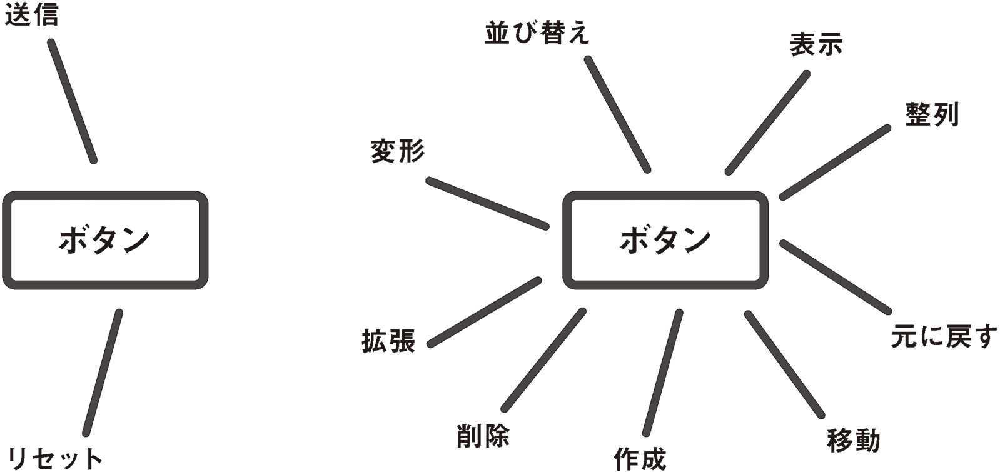
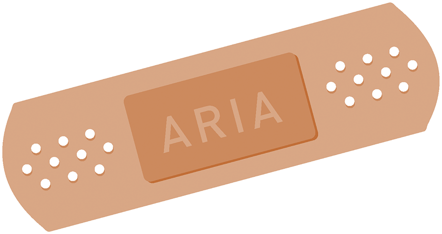

# 3-1 ARIA：平等への情熱

[WAI-ARIA](http://www.w3.org/WAI/intro/aria)は、WCAG 2.0と同じくアクセシビリティに関するリソースですが、いくつか顕著な違いがあります。この両者を兄弟だと考えるとわかりやすいかもしれません。同じ環境で育ち、基本的な価値観は同じですが、性格はそれぞれ異なります。WCAG 2.0は、家が火事にならないよう守る用心深いマイホーム主義者であるのに対し、WAI-ARIAはもっと積極的で、アクセシビリティを新しい領域に導こうという志をもっています。

WCAG 2.0と異なり、ARIAは単なる一連の推奨事項ではなく、HTMLに含めるための属性の集まりです。HTMLに対し、支援技術のユーザー向けに情報を追加したり変更したりする手段を提供しています。Webアプリケーションを作成する場合には、要素のロール、プロパティ、ステート、リレーションシップがきわめて複雑で動的になることが多いため、ARIAの属性は非常に役立ちます。ARIAが提供するツールは、WebアプリケーションにおいてWCAGの要件を満たすためのものである、という見方もできます。



## ARIAの2つの目的

ARIAによって、HTMLの意味（セマンティクス）を変更したり、補強することができるようになります。とても便利そうですが、その目的は何でしょう？　ARIAの主な用途は2つあります。

### 手当ての策

コーディングが不十分でセマンティックではないマークアップが支援技術に対して提供する情報を改善するために、ARIAは手当ての策として使用できます。



たとえば、制作者が`<div>`とJavaScriptを使用して、`type="checkbox"`を再現したとします。本来はそうするべきではありませんが、そのようなこともあるでしょう。

この`<div>`がチェックボックスとして認識されるようにするためには、属性として[ARIAのチェックボックスのロール](https://developer.mozilla.org/en-US/docs/Web/Accessibility/ARIA/ARIA_Techniques/Using_the_checkbox_role)を追加します。こうすると、スクリーンリーダーに標準のチェックボックスであるかのように認識させることができます。加えて、チェックボックスが実際にチェックされているかどうかを示すために、`aria-checked`属性を使用する必要があります。

```
<div class="toggle-thingy" role="checkbox" aria-checked="false" tabindex="0">Yes?</div>
```

この情報は、本来なら正規の`input`要素、`type`属性、`checked`属性を使って伝えるほうがよいでしょう。（比較的最近のものである）ARIAよりもサポートが充実しており、さらに`input`は前章のセマンティックな`<button>`と同じく、自動的にフォーカス可能となります（`tabindex`を必要としません）。とはいえ、アプリケーションのデザインを乱したくない場合などは、このようにARIAを使って迅速にマークアップを修正することができます。

### 拡張

これまでに見てきた通り、Webアプリケーションは単なるWebドキュメントに比べて複雑であり、HTMLの要素は、本来備えている基本的なセマンティクスを超えて使用されることがよくあります。ARIAの目玉機能は、このような意欲的な取り組みをアクセシブルに伝えるという点で、私たち制作者の助けとなります。

例として、[ARIAの`aria-haspopup`属性](http://www.w3.org/TR/wai-aria/states_and_properties#aria-haspopup)を見ていきましょう。これは、非表示のサブメニューをもつ特定の要素のプロパティです。このプロパティは`<a>`や`<button>`に指定され、この特殊な属性がなければ、サブメニューが存在していても、そのヒントは何も示されないのです。スクリーンリーダーのユーザーに与えられる情報は、これですべてとなります。

```
<li>
	<a href="#submenu" aria-haspopup="true" aria-controls="submenu">メインリンク</a>
	<ul id="submenu">
		<li><a href="/somehwere/">サブメニューリンク</a></li>
		<li><a href="/somehwere/else/">もうひとつのリンク</a></li>
	</ul>
</li>
```

次の章「飛んでいこう」で扱うように、これらのARIA属性の一部は、単純なHTMLの要素と属性で置き換えられると予想されています。たとえば、本書の執筆時点では、ARIAのロール属性である`dialog`と`alertdialog`の後継として、[`<dialog>`要素が徐々に採用されつつあります](https://twitter.com/stevefaulkner/status/413263499863658496)。

可能であれば、ARIAをプレーンなHTML（5）で置き換えたほうが良いでしょう。マークアップの記述が簡略化されますし、参照するべきW3Cのドキュメントも集約されます。しかし、特定の文脈に沿った情報を伝える多くの属性、たとえば上記のコードの`aria-haspopup`プロパティや[`aria-controls`プロパティ](http://msdn.microsoft.com/en-us/library/ie/cc848872%28v=vs.85%29.aspx)のようなものについては、これらをhaspopupやcontrolsのような属性としてHTMLに含めようとしても、多くの賛同は得られないでしょう。

Steve Faulkner（スティーブ・フォルクナー）が「[HTML5 and the myth of WAI-ARIA redundance](http://blog.paciellogroup.com/2010/04/html5-and-the-myth-of-wai-aria-redundance/)（HTML5とWAI-ARIAの冗長説について）」で指摘するように、ARIAの大部分は今後も変わらず存続するでしょう。本書の主なテーマである、視力のあるWebユーザーと視力のないWebユーザーの体験の間にあるギャップを埋めるというのが、ARIA特有の力です。
