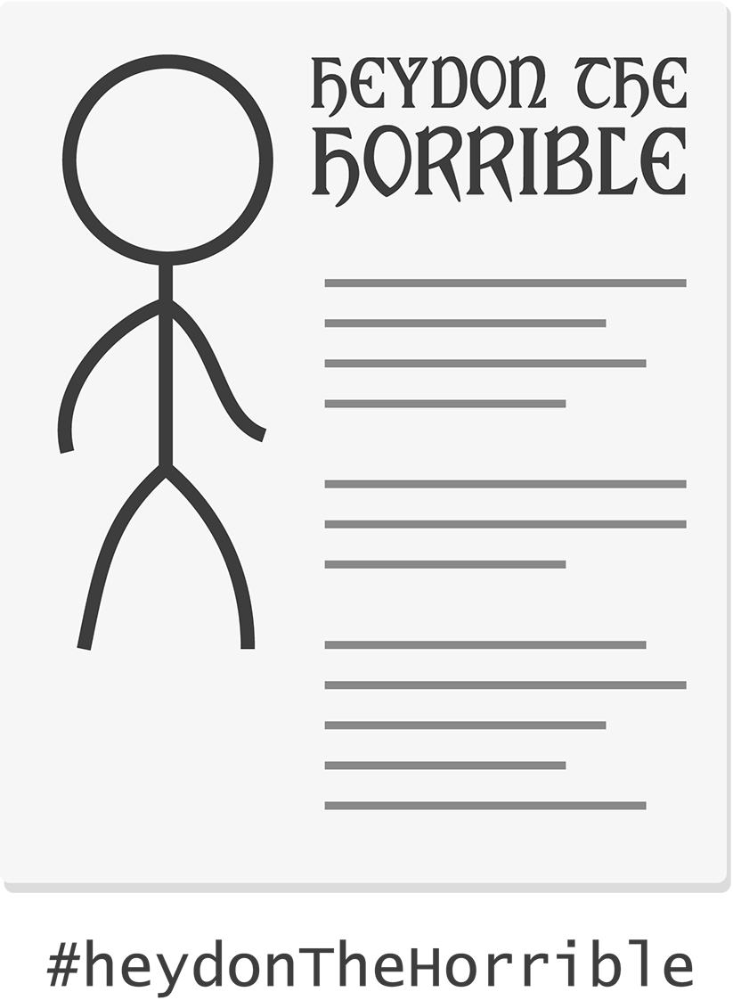
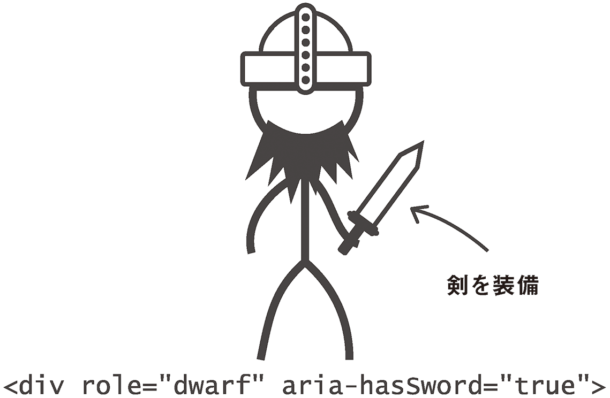
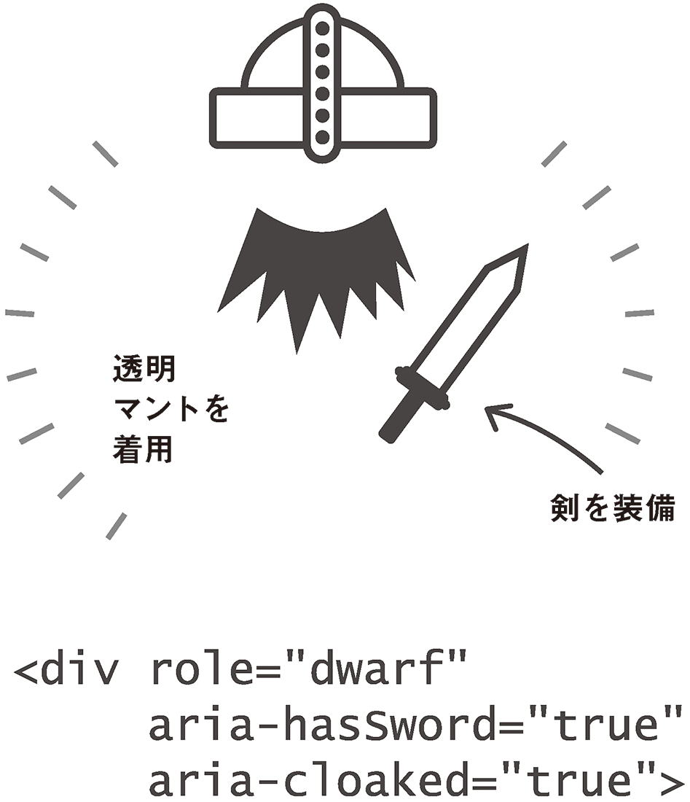

# 3-2 ロールプレイング

私の友達や同僚の多くが、テーブルトークロールプレイングゲームに夢中になっています。知らない方のために説明すると、これはプレイヤーが架空のキャラクターを演じ、ファンタジーの世界で冒険の旅に出たり戦闘を繰り広げたりするゲームです。

あくまで私自身は、ゲームにのめり込んだりしていないのですが、ゲーム中でキャラクターが役割（ロール）を演じるその性質が、HTML要素のWebアプリケーションにおける振る舞いと似ていることに気がつきました。そこで、ARIAの**ロール**、**プロパティ**、**ステート**について、このロールプレイングに例えて詳しく説明していくことにします。

ロールプレイングゲームについて詳しくなくても大丈夫ですから、心配はいりません。私も詳しくなんてありませんから！

## ロール

ロールプレイングゲームでは通常、各プレイヤーが「キャラクターシート」をもっています。このシートには、プレイヤーが演じるキャラクターの重要な特性がリストアップされます。HTMLで言うと、キャラクターの名前は要素の`id`に該当します。それぞれが一意でなくてはなりません。

ただし、キャラクターシートにはそれ以上の情報もたくさんあります。たとえば、こうしたファンタジーの世界の住人であるキャラクターは、何らかの「種族」に属しているのが普通です。一般的によく登場するのが、エルフ、ドワーフ、トロールなどの種族です。これらは共通の特性でプレイヤーを大まかにグループ化するという点で、HTMLの要素のタイプに似ています。

ARIAでは、`role`属性が要素のタイプよりも優先されます。ロールプレイングゲームのプレイヤーが、21世紀の人間という日常生活を忘れて、強靭なドワーフになるのと同じです。先ほどの例では、特徴のない`
`が`role="checkbox"`をもつことで、チェックボックスの役割を担いました。

[ARIAのロール](http://www.w3.org/TR/wai-aria/roles)は、ロールプレイングゲームの種族のように、皆が興味を抱くキャラクターの個性の一部です。ドワーフには力が強くて機械を作るのが上手であることが期待されるのと同じく、`<button>`には、すでに述べたような特徴や動作が期待されます。`role="button"`を実際には`<button>`ではない要素に指定すると、支援技術にこれをボタンとして認識させ、これらの特性を再現させることができます。

## プロパティ

名前と種族だけのキャラクターシートでは、できることに限りがあります。種族にばかり注目していても、ゲームは面白くならないでしょう。ARIA全体としてのポイントは、ARIAが汎用的な分類や、さらに細かい分類をするためのものではないということです。キャラクターも要素も、それぞれの強みや能力で特定したほうがはるかに良いでしょう。

通常、キャラクターシートには、キャラクターの一連の特徴がリストアップされます。これらはゲーム中、何らかの折に、お金をいくらもっているのか、重要な能力があるか、といったことを判定するために使われます。たとえば、あなたはエルフであると同時に、魔法の呪文を唱えられるという特別な能力をもっているかもしれません。これとまったく同じように、先ほど例示した`<a>`要素は、サブメニューを隠しもっているという特別なプロパティを持っていました。`aria-haspopup="true"`属性によって、基本のロールとともに、サブメニューをもっているという情報もアクセシビリティレイヤーに反映されます。

---

### 訳注

アクセシビリティレイヤーとは、アクセシビリティAPIから参照されるAccessible objectが属しているレイヤーを指しているものと思われます。"WAI-ARIA1.0 User Agent Implementation Guide" では、これを"accessibility tree"と呼んでいます。

http://www.w3.org/WAI/PF/aria-implementation/#intro_treetypes

---

ARIAには[非常に多数のプロパティ](http://www.w3.org/TR/wai-aria/states_and_properties)が規定され、ドキュメント化されています。プロパティの中にはグローバルなものがあり、どんな要素もそのプロパティをもつことができます。

また、特定のコンテキストや要素のために予約されているプロパティもあります。通常、長弓を正確に射る能力はエルフに共通の特性であり、ドワーフに与えられることはありません。前の章でボタンにラベルをつけるのに使用した`aria-label`はグローバルなものですが、入力必須であることを示す`aria-required`は、通常はフォームフィールドか、もしくは`listbox`や`textbox`といったフォームフィールドのロールをもった要素にのみ使用すべきです。

## ステート

動きのないWebドキュメントとWebアプリケーションの最も重要な違いは、アプリケーションではユーザーインタラクションや時限イベントによって要素が（時には大幅に）変化するという点でしょう。その時点でアプリケーションで行われている処理に応じて、要素は特定の状態、多くの場合は一時的な状態にあるということができます。

ロールプレイングゲームでは、プレイヤーがキャラクターの状態に目を光らせている必要があります。健康状態はどうか？　どんなアイテムを集めたのか？　誰と仲間になったのか？　こうしたことをすべてキャラクターシートに書き留めては消し、さらに書き留めていきます。インタラクティブな要素の状態を追跡することは、アクセシビリティにとっても重要です。

アプリケーションでは、要素の状態はしばしば視覚的に表現されます。ロールプレイングゲームやスクリーンリーダーでは、想像するしかないのでしょうか？　そんなことはありません。ドワーフが魔法の透明マントを身につけたら、覚えていられるようにキャラクターシートに書き留めておくのが一番でしょう。同様に、要素に[`aria-hidden`属性](http://www.w3.org/TR/wai-aria/states_and_properties#aria-hidden)を指定することで、目に見えないというステートを正しく記録することができます。

Chapter 5「いないいないばあ」で折りたたみ可能なコンテンツを構築するときに登場する[`aria-expanded`](http://www.w3.org/TR/wai-aria/states_and_properties#aria-expanded)などのステートは、trueまたはfalseの値に従って読み上げられます。Windows向けスクリーンリーダーであるJAWSおよびNVDAでは、`aria-expanded="false"`をもつ項目は「折りたたみ」と読み上げられ、`aria-expanded="true"`に設定されている場合は「展開」と読み上げられます。
