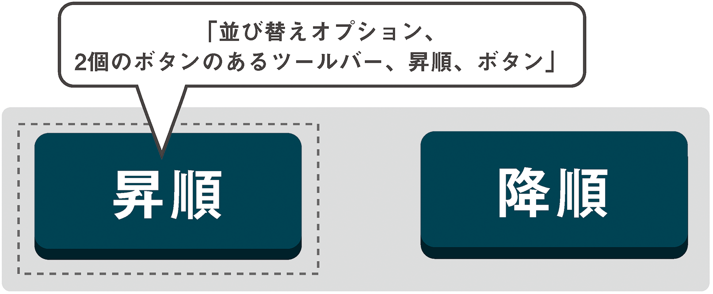

# 3-3 初めてのARIAウィジェット

これまでにロール、プロパティ、ステートについて学んだことを実践に移すときが来ました。ARIAウィジェットを構築してみましょう。

ウィジェットとはJavaScript開発でよく使用される言葉で、スクリプトによるインタラクティブ機能を1つにまとめたものを指します。幸い、ARIAでの定義もこれと一致しており、ARIAウィジェットとは適切なARIA属性の使用によってアクセシブルになったJavaScriptウィジェットだと考えることができます。

次の例では、単純なツールバーを作成します。コンテンツを操作できるボタンコントロールのグループです。ここでは、コンテンツをアルファベット順（昇順）およびその逆の順（降順）にソートするコントロールを作成しましょう。ありがたいことに、「[General Steps for Building an Accessible Widget with WAI-ARIA](http://www.w3.org/WAI/PF/aria-practices/#accessiblewidget)（ARIAを使ってアクセシブルなウィジェットを構築するための一般的なステップ）」という、ARIAウィジェット作成に関するW3Cのガイドがあり、これに似たようなツールバーの例が記載されています。

## ツールバーのロール

[Web Componentsとしてツールバーを作成](http://www.techrepublic.com/blog/web-designer/learn-more-about-web-components-with-thesedemos/)しない限り、HTMLに`<toolbar>`要素に該当するものはありません。ツールバーに対する標準の要素はないため、どんな場合でも、ツールバーのコンテナ（親）となる要素に`toolbar`ロールを含める必要があります。次のようにして、ウィジェットの範囲を示します。

```
<div role="toolbar">
	/* ツールバーの機能をここに記述 */
</div>
```

**注**：`<menu>`要素という、`type`属性値に`toolbar`という値を指定できる要素がありますが、[この要素はまだブラウザには採用されていない](https://developer.mozilla.org/en-US/docs/Web/HTML/Element/menu)ので、これを使って必要な情報を提供することはできません。

コンテンツへの影響を視覚的な関係性として表すデザインにより、ツールバーの機能は一目瞭然なはずです。しかし、それだけでは耳で聞いて理解することはできないため、おなじみの`aria-label`プロパティを使ってツールバーに名前をつけなくてはなりません。ここまでで、1つのロールと1つのプロパティを指定しました。

```
<div role="toolbar" aria-label="並び替えオプション">
	/* ツールバーの機能をここに記述 */
</div>
```

次に、コントロールとなるボタンを追加しましょう。

```
<div role="toolbar" aria-label="並び替えオプション">
	<button>昇順</button>
	<button>降順</button>
</div>
```

ウィジェットにプロパティとステートをこれ以上追加しなくても、既にツールバーの認識を改善することができています。NVDAスクリーンリーダー使用時、またはJAWSスクリーンリーダーとFirefoxの組み合わせ使用時にユーザーが最初のボタンにフォーカスを移動すると、現在位置がツールバーの中であること、そして（`aria-label`のおかげで）その機能が読み上げられます。



## リレーションシップ

今のところ、ツールバーとそれがコントロールするコンテンツとを実際には関連づけていません。そのためには、要素間の関係を伝える特殊なタイプのプロパティであるリレーションシップ属性を使う必要があります。ここで作成しているウィジェットは、コンテンツをコントロールし、これを操作して並び替えるものですので、`aria-controls`を使いましょう。先ほどのポップアップメニューの例で行ったように、`id`値を使って関連づけていきます。

```
<div role="toolbar" aria-label="並び替えオプション" aria-controls="sortable">
	<button>昇順</button>
	<button>降順</button>
</div>

<ul id="sortable">
	<li>Fiddler crab（シオマネキ）</li>
	<li>Hermit crab（ヤドカリ）</li>
	<li>Red crab（コシオレガニ）</li>
	<li>Robber crab（ヤシガニ）</li>
	<li>Sponge crab（カイカムリ）</li>
	<li>Yeti crab（キワ・ヒルスタ）</li>
</ul>
```

個々のボタンではなく、ツールバーそのものに`aria-controls`を追加していることに注目してください。どちらに追加することも可能ですが、1回だけ指定するほうが簡潔になりますし、いずれの場合も、ボタンはそれぞれ、ツールバーに属する独立したコンポーネントとみなされることになります。

`toolbar`のようなウィジェットのロールに対してどのプロパティとステートが適用できるかは、WAI-ARIAの仕様書の[Inherited States and Properties](http://www.w3.org/WAI/PF/aria/roles#toolbar)（継承したステートとプロパティ）のリストを見れば確認できます。ウィジェットを構築するときはこれを参考にするといいでしょう。

ごらんの通り、[`aria-controls`は`toolbar`の継承プロパティ](http://www.w3.org/WAI/PF/aria/roles#toolbar)として記載されています。

---

### 訳注

WAI-ARIAでは、各ロールに派生関係が定義されています。`toolbar`ロールは`group`ロールのサブクラスで、`roletype→structure→section→group→toolbar`という派生関係があります。`aria-controls`プロパティはどのロールにも適用できるグローバルなロールで、`roletype`から継承されています。

---

### 訳注

各ロールには、継承された"Inherited States and Properties"以外にも、ロール固有の"Supported States and Properties"が定義されていることがありますので、合わせて確認する必要があります。また、プロパティとステートの一覧"Supported States and Properties"から、対応するロールを逆引きすることもできますので、こちらも確認しておくと良いでしょう。

http://www.w3.org/TR/wai-aria/states_and_properties

---

このリレーションシップの情報をほとんど明らかにしないスクリーンリーダーもありますが、読み上げるものもあります。実際、JAWSはコントロールする要素にフォーカスを移動するためのキーボードコマンドを「use the <kbd>JAWS key + ALT + M</kbd> to move to the controlled element」のようにアナウンスします。関わりを持った相手については詳しく知りたくなるものです。JAWSはその手助けをしてくれます。


---

### 訳注

JAWS14日本語版でも、英語で「use the <kbd>JAWS key + ALT + M</kbd> to move to the controlled element」とアナウンスされます。

---

## 押された状態と押されていない状態

現在設定されている並び替えオプションがどちらなのかにより、対応するボタンは**選択されて押された状態**にあると言えます。

ここは`aria-pressed`ステートの使いどころです。押されているボタンには`true`、押されていないボタンには`false`の値を指定します。すでに説明したようにステートは動的なもので、JavaScriptで切り替えます。ページを読み込むときに、最初のボタンを`true`に設定しておきます。

```
<div role="toolbar" aria-label="並び替えオプション" aria-controls="sortable">
	<button aria-pressed="true">昇順</button>
	<button aria-pressed="false">降順</button>
</div>
<ul id="sortable">
	<li>Fiddler crab（シオマネキ）</li>
	<li>Hermit crab（ヤドカリ）</li>
	<li>Red crab（コシオレガニ）</li>
	<li>Robber crab（ヤシガニ）</li>
	<li>Sponge crab（カイカムリ）</li>
	<li>Yeti crab（キワ・ヒルスタ）</li>
</ul>
```

前の章で作成したアクティブな（`:active`）ボタンのスタイル、`aria-pressed`ボタンのスタイルを合わせてみるのも良いでしょう。一時的か半永久的かという違いはありますが、どちらも**押された**ボタンを表します。

```
button:active, button[aria-pressed="true"] {
	position: relative;
	top: 3px; /* 3px凹む */
	box-shadow: 0 1px 0 #222; /* 2px減（1pxに） */
}
```


`aria-pressed`が指定されたボタンにフォーカスを移したとき、NVDA使用時、またはJAWSとFirefoxの組み合わせ使用時であれば、このボタンを「トグルボタン」として認識します。JAWSの最新バージョンを使用し、`aria-pressed="true"`のボタンにフォーカスを合わせると、読み上げの後に随時「押されました」というアナウンスが追加されます。

Chromeブラウザの[ChromeVox](http://www.chromevox.com/)スクリーンリーダーでは、`aria-pressed="true"`のボタンは「button pressed」と読み上げられ、`aria-pressed="false"`は「button not pressed」と読み上げられます。

程度に差はあれ、最新のブラウザおよびスクリーンリーダーのほとんどは、これらのボタンのステートに関する情報をはっきりと読み上げることができます。

## キーボードコントロール

もう一息です。W3Cは（多くのARIAウィジェットと同様に）[ツールバーにも特定のキーボード操作機能を推奨](http://www.w3.org/WAI/PF/aria-practices/#toolbar)し、多くの場合は同等のデスクトップソフトウェアを模倣するよう勧めています。

左右の矢印キーを押すとボタンのフォーカスが移動し、<kbd>Tab</kbd>キーを押すとフォーカスがツールバーから別の項目に移動するようにするべきです。`tabindex="-1"`をリストに追加し、JavaScriptを使って、ユーザーが<kbd>Tab</kbd>キーを押したときにフォーカスがリストに移動するようにしましょう。

その目的は、ユーザーが並び替えオプションを選択した後、リストに直接移動できるようにすることです。複数のボタンがあるツールバーでは、こうすることで、リストにたどり着くまで並んでいるボタンの数だけタブキーを押す、ということを避けられます。

```
<div role="toolbar" aria-label="並び替えオプション" aria-controls="sortable">
	<button aria-pressed="true">昇順</button>
	<button aria-pressed="false">降順</button>
</div>
<ul id="sortable" tabindex="-1">
	<li>Fiddler crab（シオマネキ）</li>
	<li>Hermit crab（ヤドカリ）</li>
	<li>Red crab（コシオレガニ）</li>
	<li>Robber crab（ヤシガニ）</li>
	<li>Sponge crab（カイカムリ）</li>
	<li>Yeti crab（キワ・ヒルスタ）</li>
</ul>
```
```
$(listToSort).focus();
```

---

### 訳注
listToSortという変数はスクリプトの別の部分で定義されており、`aria-controls`属性で指定されたID（ここでは"`#sortable`"）が格納されるようになっています。

---

このようなフォーカスの制御については、後の例でより詳しく説明します。

## 完成

これで初めてのARIAウィジェットが完成しました。本書の多くの例と同じく、操作を試してテストできる[ライブデモ](http://heydonworks.com/practical_aria_examples/#toolbar-widget)を用意しました。目的は並び替えそのものではなく、すべてJavaScriptで作られていることだという点を忘れないでください。

ここでの目的は、並び替え、編集、検索、作成、再作成など、コンテンツにどのような操作を行う場合であっても、キーボードユーザーとスクリーンリーダーユーザーがその機能を使用できるよう、アプリケーションのリレーションシップとステートを明らかにすることです。
