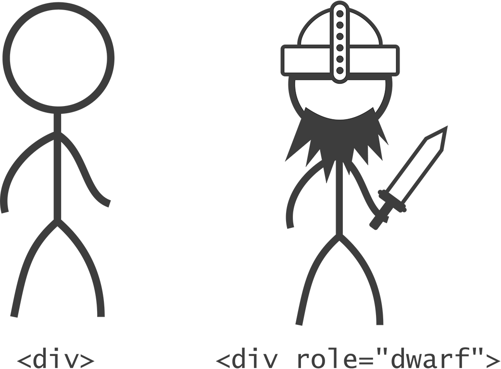

# Chapter3 WAI-ARIAの進む道
WAI-ARIAの全体像について。HTML5の既存の要素のマークアップにパッチを当てるように記述することで、支援技術向けにもマークアップを拡張できるという基本思想とルールを解説します。

- [3-1 ARIA：平等への情熱](bodymatter_3_2.xhtml)
- [3-2 ロールプレイング](bodymatter_3_3.xhtml)
- [3-3 初めてのARIAウィジェット](bodymatter_3_4.xhtml)
- [3-4 ルールを知る](bodymatter_3_5.xhtml)

=======================================

前章では、Webアプリケーションの標準コントロールとしてのボタンについて学習しました。セマンティックなHTMLの見本として`<button>`を取り上げ、Web Accessibility Initiative（WAI）のガイドラインを念頭に置きながら、これを使用して予測可能な動作を作成し、わかりやすく表示する方法を実践しました。

CSSトランジションを使ったもう少し高度な処理の作成にも挑戦しましたが、このときも、そのテクニックが確固たる基盤に基づいたプログレッシブエンハンスメントのひとつであることを確認しました。これにより、古いブラウザとその他のテクノロジーにも対応することができます。

WCAG 2.0ガイドラインを読むと、このガイドラインが「すべきこと」に加えて「すべきではないこと」に言及していることがわかります。「アクセシブルにすること」よりも、「非アクセシブルにしないこと」が重視されていることに間違いはないでしょう。たとえば、ガイドライン2.3には、「発作を引き起こす恐れのないようにコンテンツを設計すること」とあります。積極的に光過敏発性作を引き起こすようなWebページをデザインすることも可能ではありますが、そのようなばかばかしく無責任なものを作るためにわざわざ手間をかけることはないでしょう。

訳注
: 赤いものの点滅は赤色閃光（red flash）と呼ばれ、一般的な閃光よりも発作を起こしやすいとされています。詳しくは[WCAG2.0の"general flash and red flash thresholds"](http://www.w3.org/TR/WCAG20/#general-thresholddef)をご覧ください。

当初からW3Cの使命は、Webをアクセシブルにすることであったため、Webには多くのアクセシビリティ機能が組み込まれています。私たちは責任あるデザイナーとして、Web自体のシンプルな設計に基づくインクルーシブな性質を損なうことなく、魅力的な体験を作り出さなくてはなりません。Scott Jehl （スコット・ジール）はこのようにまとめています。

>アクセシビリティは私たちがWebサイトに追加するものではなく最初から存在しているものであり、改良をするごとに失われていくおそれがある。このことを忘れてはならない。  
̶ [Scott Jehl（2013年、12月12日、Twitter)](https://twitter.com/scottjehl/status/411237303579721728)

しかし、残念ながらすべてのWebサイトは、挑発的な宣言「[This is a motherfucking website](http://motherfuckingwebsite.com/)（これが最悪なWebサイトだ）」ほどシンプルにはできないでしょう。

Webの進化、そしてこれまで不可能だったWebベースのソフトウェアを構築する新しい力を受け入れた私たちは、新しいスタイルのアクセシビリティに取り組む必要があります。新しいツールとテクニックを取り入れ、Chapter1「[すべての人のために](bodymatter_1_0.xhtml)」で紹介したRon McCallumの「keep the playing field level（同じ土俵に立てるように）」という求めに応えることが必要です。

変化を受け入れるときが来たのです。

=======================================

## 3-1 ARIA：平等への情熱

[WAI-ARIA](http://www.w3.org/WAI/intro/aria)は、WCAG 2.0と同じくアクセシビリティに関するリソースですが、いくつか顕著な違いがあります。この両者を兄弟だと考えるとわかりやすいかもしれません。同じ環境で育ち、基本的な価値観は同じですが、性格はそれぞれ異なります。WCAG 2.0は、家が火事にならないよう守る用心深いマイホーム主義者であるのに対し、WAI-ARIAはもっと積極的で、アクセシビリティを新しい領域に導こうという志をもっています。

WCAG 2.0と異なり、ARIAは単なる一連の推奨事項ではなく、HTMLに含めるための属性の集まりです。HTMLに対し、支援技術のユーザー向けに情報を追加したり変更したりする手段を提供しています。Webアプリケーションを作成する場合には、要素のロール、プロパティ、ステート、リレーションシップがきわめて複雑で動的になることが多いため、ARIAの属性は非常に役立ちます。ARIAが提供するツールは、WebアプリケーションにおいてWCAGの要件を満たすためのものである、という見方もできます。

### ARIAの2つの目的

ARIAによって、HTMLの意味（セマンティクス）を変更したり、補強することができるようになります。とても便利そうですが、その目的は何でしょう？　ARIAの主な用途は2つあります。

#### 手当ての策

コーディングが不十分でセマンティックではないマークアップが支援技術に対して提供する情報を改善するために、ARIAは手当ての策として使用できます。

たとえば、制作者が`
`とJavaScriptを使用して、`type="checkbox"`を再現したとします。本来はそうするべきではありませんが、そのようなこともあるでしょう。

この`
`がチェックボックスとして認識されるようにするためには、属性として[ARIAのチェックボックスのロール](https://developer.mozilla.org/en-US/docs/Web/Accessibility/ARIA/ARIA_Techniques/Using_the_checkbox_role)を追加します。こうすると、スクリーンリーダーに標準のチェックボックスであるかのように認識させることができます。加えて、チェックボックスが実際にチェックされているかどうかを示すために、`aria-checked`属性を使用する必要があります。

<pre class="sourceCode html"><code class="sourceCode html">&lt;div class=&quot;toggle-thingy&quot; role=&quot;checkbox&quot; aria-checked=&quot;false&quot; tabindex=&quot;0&quot;&gt;Yes?&lt;/div&gt;</code></pre>

この情報は、本来なら正規の`input`要素、`type`属性、`checked`属性を使って伝えるほうがよいでしょう。（比較的最近のものである）ARIAよりもサポートが充実しており、さらに`input`は前章のセマンティックな`<button>`と同じく、自動的にフォーカス可能となります（`tabindex`を必要としません）。とはいえ、アプリケーションのデザインを乱したくない場合などは、このようにARIAを使って迅速にマークアップを修正することができます。

#### 拡張

これまでに見てきた通り、Webアプリケーションは単なるWebドキュメントに比べて複雑であり、HTMLの要素は、本来備えている基本的なセマンティクスを超えて使用されることがよくあります。ARIAの目玉機能は、このような意欲的な取り組みをアクセシブルに伝えるという点で、私たち制作者の助けとなります。

例として、[ARIAの`aria-haspopup`属性](http://www.w3.org/TR/wai-aria/states_and_properties#aria-haspopup)を見ていきましょう。これは、非表示のサブメニューをもつ特定の要素のプロパティです。このプロパティは`<a>`や`<button>`に指定され、この特殊な属性がなければ、サブメニューが存在していても、そのヒントは何も示されないのです。スクリーンリーダーのユーザーに与えられる情報は、これですべてとなります。

<pre class="sourceCode html"><code class="sourceCode html">&lt;li&gt;
    &lt;a href=&quot;#submenu&quot; aria-haspopup=&quot;true&quot; aria-controls=&quot;submenu&quot;&gt;メインリンク&lt;/a&gt;
    &lt;ul id=&quot;submenu&quot;&gt;
        &lt;li&gt;&lt;a href=&quot;/somehwere/&quot;&gt;サブメニューリンク&lt;/a&gt;&lt;/li&gt;
        &lt;li&gt;&lt;a href=&quot;/somehwere/else/&quot;&gt;もうひとつのリンク&lt;/a&gt;&lt;/li&gt;
    &lt;/ul&gt;
&lt;/li&gt;</code></pre>

次の章「飛んでいこう」で扱うように、これらのARIA属性の一部は、単純なHTMLの要素と属性で置き換えられると予想されています。たとえば、本書の執筆時点では、ARIAのロール属性である`dialog`と`alertdialog`の後継として、[`<dialog>`要素が徐々に採用されつつあります](https://twitter.com/stevefaulkner/status/413263499863658496)。

可能であれば、ARIAをプレーンなHTML（5）で置き換えたほうが良いでしょう。マークアップの記述が簡略化されますし、参照するべきW3Cのドキュメントも集約されます。しかし、特定の文脈に沿った情報を伝える多くの属性、たとえば上記のコードの`aria-haspopup`プロパティや[`aria-controls`プロパティ](http://msdn.microsoft.com/en-us/library/ie/cc848872%28v=vs.85%29.aspx)のようなものについては、これらをhaspopupやcontrolsのような属性としてHTMLに含めようとしても、多くの賛同は得られないでしょう。

Steve Faulkner（スティーブ・フォルクナー）が「[HTML5 and the myth of WAI-ARIA redundance](http://blog.paciellogroup.com/2010/04/html5-and-the-myth-of-wai-aria-redundance/)（HTML5とWAI-ARIAの冗長説について）」で指摘するように、ARIAの大部分は今後も変わらず存続するでしょう。本書の主なテーマである、視力のあるWebユーザーと視力のないWebユーザーの体験の間にあるギャップを埋めるというのが、ARIA特有の力です。

=======================================

## 3-2 ロールプレイング

私の友達や同僚の多くが、テーブルトークロールプレイングゲームに夢中になっています。知らない方のために説明すると、これはプレイヤーが架空のキャラクターを演じ、ファンタジーの世界で冒険の旅に出たり戦闘を繰り広げたりするゲームです。

あくまで私自身は、ゲームにのめり込んだりしていないのですが、ゲーム中でキャラクターが役割（ロール）を演じるその性質が、HTML要素のWebアプリケーションにおける振る舞いと似ていることに気がつきました。そこで、ARIAの**ロール**、**プロパティ**、**ステート**について、このロールプレイングに例えて詳しく説明していくことにします。

ロールプレイングゲームについて詳しくなくても大丈夫ですから、心配はいりません。私も詳しくなんてありませんから！

### ロール

ロールプレイングゲームでは通常、各プレイヤーが「キャラクターシート」をもっています。このシートには、プレイヤーが演じるキャラクターの重要な特性がリストアップされます。HTMLで言うと、キャラクターの名前は要素の`id`に該当します。それぞれが一意でなくてはなりません。

ただし、キャラクターシートにはそれ以上の情報もたくさんあります。たとえば、こうしたファンタジーの世界の住人であるキャラクターは、何らかの「種族」に属しているのが普通です。一般的によく登場するのが、エルフ、ドワーフ、トロールなどの種族です。これらは共通の特性でプレイヤーを大まかにグループ化するという点で、HTMLの要素のタイプに似ています。

ARIAでは、`role`属性が要素のタイプよりも優先されます。ロールプレイングゲームのプレイヤーが、21世紀の人間という日常生活を忘れて、強靭なドワーフになるのと同じです。先ほどの例では、特徴のない`
`が`role="checkbox"`をもつことで、チェックボックスの役割を担いました。

[ARIAのロール](http://www.w3.org/TR/wai-aria/roles)は、ロールプレイングゲームの種族のように、皆が興味を抱くキャラクターの個性の一部です。ドワーフには力が強くて機械を作るのが上手であることが期待されるのと同じく、`<button>`には、すでに述べたような特徴や動作が期待されます。`role="button"`を実際には`<button>`ではない要素に指定すると、支援技術にこれをボタンとして認識させ、これらの特性を再現させることができます。

### プロパティ

名前と種族だけのキャラクターシートでは、できることに限りがあります。種族にばかり注目していても、ゲームは面白くならないでしょう。ARIA全体としてのポイントは、ARIAが汎用的な分類や、さらに細かい分類をするためのものではないということです。キャラクターも要素も、それぞれの強みや能力で特定したほうがはるかに良いでしょう。

通常、キャラクターシートには、キャラクターの一連の特徴がリストアップされます。これらはゲーム中、何らかの折に、お金をいくらもっているのか、重要な能力があるか、といったことを判定するために使われます。たとえば、あなたはエルフであると同時に、魔法の呪文を唱えられるという特別な能力をもっているかもしれません。これとまったく同じように、先ほど例示した`<a>`要素は、サブメニューを隠しもっているという特別なプロパティを持っていました。`aria-haspopup="true"`属性によって、基本のロールとともに、サブメニューをもっているという情報もアクセシビリティレイヤーに反映されます。

訳注
: アクセシビリティレイヤーとは、アクセシビリティAPIから参照されるAccessible objectが属しているレイヤーを指しているものと思われます。"[WAI-ARIA1.0 User Agent Implementation Guide](http://www.w3.org/WAI/PF/aria-implementation/#intro_treetypes)" では、これを"accessibility tree"と呼んでいます。

ARIAには[非常に多数のプロパティ](http://www.w3.org/TR/wai-aria/states_and_properties)が規定され、ドキュメント化されています。プロパティの中にはグローバルなものがあり、どんな要素もそのプロパティをもつことができます。

また、特定のコンテキストや要素のために予約されているプロパティもあります。通常、長弓を正確に射る能力はエルフに共通の特性であり、ドワーフに与えられることはありません。前の章でボタンにラベルをつけるのに使用した`aria-label`はグローバルなものですが、入力必須であることを示す`aria-required`は、通常はフォームフィールドか、もしくは`listbox`や`textbox`といったフォームフィールドのロールをもった要素にのみ使用すべきです。

### ステート

動きのないWebドキュメントとWebアプリケーションの最も重要な違いは、アプリケーションではユーザーインタラクションや時限イベントによって要素が（時には大幅に）変化するという点でしょう。その時点でアプリケーションで行われている処理に応じて、要素は特定の状態、多くの場合は一時的な状態にあるということができます。

ロールプレイングゲームでは、プレイヤーがキャラクターの状態に目を光らせている必要があります。健康状態はどうか？　どんなアイテムを集めたのか？　誰と仲間になったのか？　こうしたことをすべてキャラクターシートに書き留めては消し、さらに書き留めていきます。インタラクティブな要素の状態を追跡することは、アクセシビリティにとっても重要です。

アプリケーションでは、要素の状態はしばしば視覚的に表現されます。ロールプレイングゲームやスクリーンリーダーでは、想像するしかないのでしょうか？　そんなことはありません。ドワーフが魔法の透明マントを身につけたら、覚えていられるようにキャラクターシートに書き留めておくのが一番でしょう。同様に、要素に[`aria-hidden`属性](http://www.w3.org/TR/wai-aria/states_and_properties#aria-hidden)を指定することで、目に見えないというステートを正しく記録することができます。

Chapter5「[いないいないばあ](bodymatter_5_0.xhtml)」で折りたたみ可能なコンテンツを構築するときに登場する[`aria-expanded`](http://www.w3.org/TR/wai-aria/states_and_properties#aria-expanded)などのステートは、trueまたはfalseの値に従って読み上げられます。Windows向けスクリーンリーダーであるJAWSおよびNVDAでは、`aria-expanded="false"`をもつ項目は「折りたたみ」と読み上げられ、`aria-expanded="true"`に設定されている場合は「展開」と読み上げられます。

=======================================

## 3-3 初めてのARIAウィジェット

これまでにロール、プロパティ、ステートについて学んだことを実践に移すときが来ました。ARIAウィジェットを構築してみましょう。

ウィジェットとはJavaScript開発でよく使用される言葉で、スクリプトによるインタラクティブ機能を1つにまとめたものを指します。幸い、ARIAでの定義もこれと一致しており、ARIAウィジェットとは適切なARIA属性の使用によってアクセシブルになったJavaScriptウィジェットだと考えることができます。

次の例では、単純なツールバーを作成します。コンテンツを操作できるボタンコントロールのグループです。ここでは、コンテンツをアルファベット順（昇順）およびその逆の順（降順）にソートするコントロールを作成しましょう。ありがたいことに、「[General Steps for Building an Accessible Widget with WAI-ARIA](http://www.w3.org/WAI/PF/aria-practices/#accessiblewidget)（ARIAを使ってアクセシブルなウィジェットを構築するための一般的なステップ）」という、ARIAウィジェット作成に関するW3Cのガイドがあり、これに似たようなツールバーの例が記載されています。

### ツールバーのロール

[Web Componentsとしてツールバーを作成](http://www.techrepublic.com/blog/web-designer/learn-more-about-web-components-with-thesedemos/)しない限り、HTMLに`<toolbar>`要素に該当するものはありません。ツールバーに対する標準の要素はないため、どんな場合でも、ツールバーのコンテナ（親）となる要素に`toolbar`ロールを含める必要があります。次のようにして、ウィジェットの範囲を示します。

<pre class="sourceCode html"><code class="sourceCode html">&lt;div role=&quot;toolbar&quot;&gt;
    /* ツールバーの機能をここに記述 */
&lt;/div&gt;</code></pre>

**注**：`<menu>`要素という、`type`属性値に`toolbar`という値を指定できる要素がありますが、[この要素はまだブラウザには採用されていない](https://developer.mozilla.org/en-US/docs/Web/HTML/Element/menu)ので、これを使って必要な情報を提供することはできません。

コンテンツへの影響を視覚的な関係性として表すデザインにより、ツールバーの機能は一目瞭然なはずです。しかし、それだけでは耳で聞いて理解することはできないため、おなじみの`aria-label`プロパティを使ってツールバーに名前をつけなくてはなりません。ここまでで、1つのロールと1つのプロパティを指定しました。

<pre class="sourceCode html"><code class="sourceCode html">&lt;div role=&quot;toolbar&quot; aria-label=&quot;並び替えオプション&quot;&gt;
    /* ツールバーの機能をここに記述 */
&lt;/div&gt;</code></pre>

次に、コントロールとなるボタンを追加しましょう。

<pre class="sourceCode html"><code class="sourceCode html">&lt;div role=&quot;toolbar&quot; aria-label=&quot;並び替えオプション&quot;&gt;
    &lt;button&gt;昇順&lt;/button&gt;
    &lt;button&gt;降順&lt;/button&gt;
&lt;/div&gt;</code></pre>

ウィジェットにプロパティとステートをこれ以上追加しなくても、既にツールバーの認識を改善することができています。NVDAスクリーンリーダー使用時、またはJAWSスクリーンリーダーとFirefoxの組み合わせ使用時にユーザーが最初のボタンにフォーカスを移動すると、現在位置がツールバーの中であること、そして（`aria-label`のおかげで）その機能が読み上げられます。

### リレーションシップ

今のところ、ツールバーとそれがコントロールするコンテンツとを実際には関連づけていません。そのためには、要素間の関係を伝える特殊なタイプのプロパティであるリレーションシップ属性を使う必要があります。ここで作成しているウィジェットは、コンテンツをコントロールし、これを操作して並び替えるものですので、`aria-controls`を使いましょう。先ほどのポップアップメニューの例で行ったように、`id`値を使って関連づけていきます。

<pre class="sourceCode html"><code class="sourceCode html">&lt;div role=&quot;toolbar&quot; aria-label=&quot;並び替えオプション&quot; aria-controls=&quot;sortable&quot;&gt;
    &lt;button&gt;昇順&lt;/button&gt;
    &lt;button&gt;降順&lt;/button&gt;
&lt;/div&gt;

&lt;ul id=&quot;sortable&quot;&gt;
    &lt;li&gt;Fiddler crab（シオマネキ）&lt;/li&gt;
    &lt;li&gt;Hermit crab（ヤドカリ）&lt;/li&gt;
    &lt;li&gt;Red crab（コシオレガニ）&lt;/li&gt;
    &lt;li&gt;Robber crab（ヤシガニ）&lt;/li&gt;
    &lt;li&gt;Sponge crab（カイカムリ）&lt;/li&gt;
    &lt;li&gt;Yeti crab（キワ・ヒルスタ）&lt;/li&gt;
&lt;/ul&gt;</code></pre>

個々のボタンではなく、ツールバーそのものに`aria-controls`を追加していることに注目してください。どちらに追加することも可能ですが、1回だけ指定するほうが簡潔になりますし、いずれの場合も、ボタンはそれぞれ、ツールバーに属する独立したコンポーネントとみなされることになります。

`toolbar`のようなウィジェットのロールに対してどのプロパティとステートが適用できるかは、WAI-ARIAの仕様書の[Inherited States and Properties](http://www.w3.org/WAI/PF/aria/roles#toolbar)（継承したステートとプロパティ）のリストを見れば確認できます。ウィジェットを構築するときはこれを参考にするといいでしょう。

ごらんの通り、[`aria-controls`は`toolbar`の継承プロパティ](http://www.w3.org/WAI/PF/aria/roles#toolbar)として記載されています。

訳注
: WAI-ARIAでは、各ロールに派生関係が定義されています。`toolbar`ロールは`group`ロールのサブクラスで、`roletype→structure→section→group→toolbar`という派生関係があります。`aria-controls`プロパティはどのロールにも適用できるグローバルなロールで、`roletype`から継承されています。

訳注
: 各ロールには、継承された"Inherited States and Properties"以外にも、ロール固有の"Supported States and Properties"が定義されていることがありますので、合わせて確認する必要があります。また、プロパティとステートの一覧"[Supported States and Properties](http://www.w3.org/TR/wai-aria/states_and_properties)"から、対応するロールを逆引きすることもできますので、こちらも確認しておくと良いでしょう。

このリレーションシップの情報をほとんど明らかにしないスクリーンリーダーもありますが、読み上げるものもあります。実際、JAWSはコントロールする要素にフォーカスを移動するためのキーボードコマンドを「use the <kbd>JAWS key + ALT + M</kbd> to move to the controlled element」のようにアナウンスします。関わりを持った相手については詳しく知りたくなるものです。JAWSはその手助けをしてくれます。

訳注
: JAWS14日本語版でも、英語で「use the <kbd>JAWS key + ALT + M</kbd> to move to the controlled element」とアナウンスされます。

### 押された状態と押されていない状態

現在設定されている並び替えオプションがどちらなのかにより、対応するボタンは**選択されて押された状態**にあると言えます。

ここは`aria-pressed`ステートの使いどころです。押されているボタンには`true`、押されていないボタンには`false`の値を指定します。すでに説明したようにステートは動的なもので、JavaScriptで切り替えます。ページを読み込むときに、最初のボタンを`true`に設定しておきます。

<pre class="sourceCode html"><code class="sourceCode html">&lt;div role=&quot;toolbar&quot; aria-label=&quot;並び替えオプション&quot; aria-controls=&quot;sortable&quot;&gt;
    &lt;button aria-pressed=&quot;true&quot;&gt;昇順&lt;/button&gt;
    &lt;button aria-pressed=&quot;false&quot;&gt;降順&lt;/button&gt;
&lt;/div&gt;
&lt;ul id=&quot;sortable&quot;&gt;
    &lt;li&gt;Fiddler crab（シオマネキ）&lt;/li&gt;
    &lt;li&gt;Hermit crab（ヤドカリ）&lt;/li&gt;
    &lt;li&gt;Red crab（コシオレガニ）&lt;/li&gt;
    &lt;li&gt;Robber crab（ヤシガニ）&lt;/li&gt;
    &lt;li&gt;Sponge crab（カイカムリ）&lt;/li&gt;
    &lt;li&gt;Yeti crab（キワ・ヒルスタ）&lt;/li&gt;
&lt;/ul&gt;</code></pre>

前の章で作成したアクティブな（`:active`）ボタンのスタイル、`aria-pressed`ボタンのスタイルを合わせてみるのも良いでしょう。一時的か半永久的かという違いはありますが、どちらも**押された**ボタンを表します。

<pre class="sourceCode css"><code class="sourceCode css">button:active, button[aria-pressed=&quot;true&quot;] {
    position: relative;
    top: 3px; /* 3px凹む */
    box-shadow: 0 1px 0 #222; /* 2px減（1pxに） */
}</code></pre>

`aria-pressed`が指定されたボタンにフォーカスを移したとき、NVDA使用時、またはJAWSとFirefoxの組み合わせ使用時であれば、このボタンを「トグルボタン」として認識します。JAWSの最新バージョンを使用し、`aria-pressed="true"`のボタンにフォーカスを合わせると、読み上げの後に随時「押されました」というアナウンスが追加されます。

Chromeブラウザの[ChromeVox](http://www.chromevox.com/)スクリーンリーダーでは、`aria-pressed="true"`のボタンは「button pressed」と読み上げられ、`aria-pressed="false"`は「button not pressed」と読み上げられます。

程度に差はあれ、最新のブラウザおよびスクリーンリーダーのほとんどは、これらのボタンのステートに関する情報をはっきりと読み上げることができます。

### キーボードコントロール

もう一息です。W3Cは（多くのARIAウィジェットと同様に）[ツールバーにも特定のキーボード操作機能を推奨](http://www.w3.org/WAI/PF/aria-practices/#toolbar)し、多くの場合は同等のデスクトップソフトウェアを模倣するよう勧めています。

左右の矢印キーを押すとボタンのフォーカスが移動し、<kbd>Tab</kbd>キーを押すとフォーカスがツールバーから別の項目に移動するようにするべきです。`tabindex="-1"`をリストに追加し、JavaScriptを使って、ユーザーが<kbd>Tab</kbd>キーを押したときにフォーカスがリストに移動するようにしましょう。

その目的は、ユーザーが並び替えオプションを選択した後、リストに直接移動できるようにすることです。複数のボタンがあるツールバーでは、こうすることで、リストにたどり着くまで並んでいるボタンの数だけタブキーを押す、ということを避けられます。

<pre class="sourceCode html"><code class="sourceCode html">&lt;div role=&quot;toolbar&quot; aria-label=&quot;並び替えオプション&quot; aria-controls=&quot;sortable&quot;&gt;
    &lt;button aria-pressed=&quot;true&quot;&gt;昇順&lt;/button&gt;
    &lt;button aria-pressed=&quot;false&quot;&gt;降順&lt;/button&gt;
&lt;/div&gt;
&lt;ul id=&quot;sortable&quot; tabindex=&quot;-1&quot;&gt;
    &lt;li&gt;Fiddler crab（シオマネキ）&lt;/li&gt;
    &lt;li&gt;Hermit crab（ヤドカリ）&lt;/li&gt;
    &lt;li&gt;Red crab（コシオレガニ）&lt;/li&gt;
    &lt;li&gt;Robber crab（ヤシガニ）&lt;/li&gt;
    &lt;li&gt;Sponge crab（カイカムリ）&lt;/li&gt;
    &lt;li&gt;Yeti crab（キワ・ヒルスタ）&lt;/li&gt;
&lt;/ul&gt;</code></pre>

<pre class="sourceCode javascript"><code class="sourceCode javascript">$(listToSort).focus();</code></pre>

訳注
: listToSortという変数はスクリプトの別の部分で定義されており、`aria-controls`属性で指定されたID（ここでは"`#sortable`"）が格納されるようになっています。

このようなフォーカスの制御については、後の例でより詳しく説明します。

### 完成

これで初めてのARIAウィジェットが完成しました。本書の多くの例と同じく、操作を試してテストできる[ライブデモ](http://heydonworks.com/practical_aria_examples/#toolbar-widget)を用意しました。目的は並び替えそのものではなく、すべてJavaScriptで作られていることだという点を忘れないでください。

ここでの目的は、並び替え、編集、検索、作成、再作成など、コンテンツにどのような操作を行う場合であっても、キーボードユーザーとスクリーンリーダーユーザーがその機能を使用できるよう、アプリケーションのリレーションシップとステートを明らかにすることです。

=======================================

## 3-4 ルールを知る

本書を読み進めるにつれ、作成するARIAウィジェットは段々複雑になります。このため、ちょっとした調整やニュアンスを、あらゆるブラウザとスクリーンリーダーの組み合わせで、逐一手動でテストするのは現実的ではありません。テスト自体は欠かすことができないものの、最初の段階からドジを踏まないためには、ひと握りちょっとの原則を手元に置いておくことが必要です。

順調なスタートを切るため、WAI-ARIAの専門家がW3Cで明確にしたように、[ARIA使用の3つのルール](http://www.w3.org/TR/aria-in-html/#first-rule-of-aria-use)を守りましょう。これらのルールを知っておかないと、恥をかくことになるかもしれません。

### ARIA使用の1番目のルール

>必要なセマンティクスや動作が組み込まれたネイティブのHTML要素（HTML5）や属性が存在する場合は、要素の転用とARIAのロール、ステート、プロパティの追加でアクセシブルにする代わりに、ネイティブのものを使用します。

ARIAを使用する目的がHTMLコードの改善、拡張であることはすでに説明しました。組み込みの、またはネイティブなHTMLのセマンティクスで目的が果たせる場合には、ARIA属性を使用する必要はありません。先ほどのチェックボックスの例のような、`checkbox`ロールの使用は次善策にすぎず、あのような方法を取るのは、扱いにくい`
`要素を置き換えるのが難しい場合のみです。

ことによると、新しいHTML属性のサポートが、ARIAの該当する属性のサポートほど広がっていない場合もあります。たとえば、[数年前に行ったテスト](http://wps.pearsoned.com/wps/media/objects/8956/9171771/aria-required.html)では、`required`がスクリーンリーダーとブラウザのすべての組み合わせでサポートされておらず、`aria-required`のほうが広くサポートされている、という結果が出ています。当面のところ、両方の属性を含めるという二重の安全策をとることで、互換性を最大にしておいたほうが良いでしょう。インターオペラビリティ（相互運用性）の最大化については、本書の後半でも取り上げます。

<pre class="sourceCode html"><code class="sourceCode html">&lt;input type=&quot;text&quot; id=&quot;text-entry&quot; required aria-required=&quot;true&quot; /&gt;</code></pre>

### ARIA使用の2番目のルール

本当に必要な場合を除いて、ネイティブのセマンティクスを変更してはなりません。同じく「[Using WAI-ARIA in HTML](http://www.w3.org/TR/aria-in-html/#what-does-adding-a-role-do-to-the-native-semantics)（HTMLでARIAを使う上での注意）」で説明されているように、`role`属性を要素に追加すると、その要素のネイティブなセマンティクスが無効になります。つまり、セマンティックではない`
`をチェックボックスとして表示するために`
`に`checkbox`を追加するのは有効な方法だと言えます。

しかし、`<h1>`に`button`のロールを追加する方法はあまり効果的ではありません。こうすると、事実上、（少なくとも、読み上げが行われるアクセシビリティレイヤーでは）`<h1>`はボタンになります。そして、第1レベルの見出しであるという要素についての情報は失われます。

Chapter5「[いないいないばあ](bodymatter_5_0.xhtml)」でクリック可能な見出しを作成するときは、代わりにJavaScriptを使用し、見出しの子として`<button>`を配置します。重要であることに変わりのない見出しのセマンティクスは残したままにするのです。これをW3Cの勧告に従って正確に書くと以下のようになります。

<pre class="sourceCode html"><code class="sourceCode html">&lt;h1&gt;&lt;button&gt;見出しボタン&lt;/button&gt;&lt;/h1&gt;</code></pre>

### ARIA使用の3番目のルール

>すべてのインタラクティブなARIAコントロールは、キーボードで使用できなくてはなりません。

聞き覚えがありませんか？　それはこれが、WCAG 2.0のガイドライン2.1「すべての機能をキーボードから利用できるようにすること」そのものだからです。そう、私たちはひと周りしてここに戻ってきたのです。

先ほどのツールバーの例では、フォーカス可能な`<button>`をコントロールとして含めるだけで、基本のキーボード操作が可能になりました。さらに、矢印キーを使ってこれらのボタンを切り替えられるように拡張しました。この後の例では、プログラムによるフォーカス管理を使った、より複雑なカスタムキーボード機能を取り上げます。

いよいよ本題に突入します。アプリケーションの機能そのものはいったん脇に置きつつ、まずはそのアプリケーションの機能を実際に見つけ出す方法について考えていきます。モビリティ（移動しやすさ）は、（オンラインおよびオフラインの）アクセシビリティの大きな一部です。ユーザーの移動を助けるさまざまな方法について見ていきましょう。
