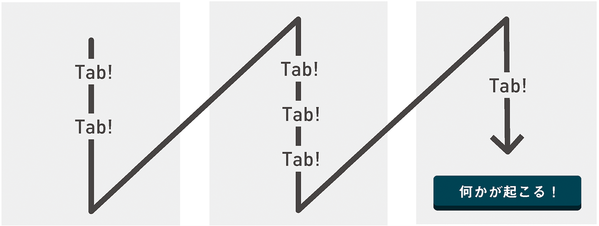

# 4 飛んでいこう
ページ内の移動やナビゲーションについて。ページ内に目印をつけて自由に移動することを可能にする「ランドマークロール」を中心に「ロール」を解説します。

---

インターフェイスというものがいかに簡単に利用できるかを考えてみましょう。スクリーン上でさっと視線を往復させるだけで、すぐにその構造を把握することができます。そこにどれだけの情報があるか、どの部分が重要であるか、そしてどの部分を読み飛ばしたいかということが、ほとんど瞬時にしてわかります。

すべてを一度に見ることができない？　そんなときはスクロールバーをつかんで、いわゆる「above the fold（スクロールしなくても見える範囲、ファーストビュー）」より下の部分を表示します。「盛りだくさんだな。ブックマークしておいて後で読もう」となります。

ページ間の移動を可能にするハイパーリンクは本質的にアクセシブルで、登場した頃からずっとアクセシブルです。ハイパーリンクはフォーカスを受け取ることができ、支援技術はその機能を「リンク」として認識します。同じ`<a>`（アンカー）要素で同じページの別の部分にジャンプすることもでき、ほとんどのスクリーンリーダーでは、同じページ上へのリンクがフォーカスを受け取ると「ページ内リンク」と読み上げられます。

これでナビゲーションについては成功です。果たしてそうでしょうか？

グリッド状に配置されたWebページの構造は、多くの人は視覚的に受け止めることができますが、目が見えない人にとっては構造になっていません。スクリーンリーダーユーザーにとってグリッドなどは存在しないのです。誰かが完璧な黄金比で作ったグリッドシステムのフレームワークも、読み込みに時間がかかるだけで、彼らにとっては何のメリットもありません。

（少なくとも次の項目に視線を移すことができる）キーボードユーザーにとっても、何列にもまたがったレイアウトはありがたいものとは言えません。横向きであっても、結局のところ同じ距離を移動しなくてはなりません。

私はWebページをある程度ざっくり見て把握することができますが、制作者の思慮が十分でない場合、キーボードユーザーとスクリーンリーダーユーザーは、テキストやリンクなどがただ雑然と存在する荒地をしぶしぶ歩かされることになります。

あらゆる問題と同じように、この問題も切り分ける必要があります。この場合は文字通り、ページを認識可能な領域と操作可能な領域に分けて考える必要があります。すこしばかりのARIA属性を選びセマンティックを強化したHTMLを使用することで、目には見えないアプリケーションの地図を描き始めることができます。どこに何があるかがわかれば、ユーザーはナビゲーションしやすくなるでしょう。
