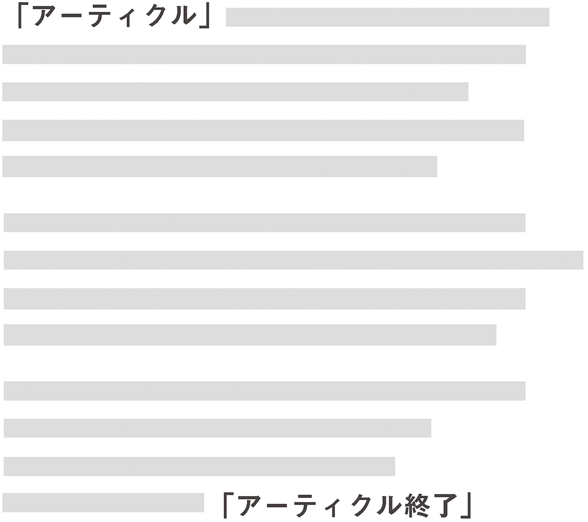

## 4-1 分割する

HTML5には、いくつかの新しい要素があります。[セクショニング要素](http://www.w3.org/WAI/GL/wiki/Using_HTML5_section_elements)（`<section>`、`<article>`、`<nav>`、`<aside>`）については皆さんもよくご存じでしょうが、これらの要素についてアクセシビリティという点から考えてみたことがありますか？　

セクショニングコンテンツは、HTMLの3つの基本カテゴリのひとつです。フレージングコンテンツ（`<em>`、`<strong>`などのインライン要素）とフローコンテンツ（主に`<p>`、`<div>`などのブロックレベル要素）があり、そして、ページの各部分の範囲を定義するのに使用されるセクションがあります。言い換えると、小さなコンテンツ、これより大きなコンテンツ、そして範囲をもった大きな領域のコンテンツがあるということです。

しっかりと構成されたWebページでは、フレージングコンテンツはフローコンテンツの中に入り、フローコンテンツはセクショニングコンテンツの中に入るはずです。HTML5のセクショニング関連要素を使用しない場合、`<body>`は1つの区画を囲む単一のセクションとみなすことができます。


<div class="notice" markdown="1">
訳注
: 実際には内容モデルのフロー（flow）という分類は非常に幅広く、フレーズやセクションに属する要素は同時にフローにも属していますが、上図のフローは主に`<p>`、`<div>`などのブロックレベル要素を指しています。HTML5ではブロックという分類がなくなり、これらの要素をひとことで言い表すことが難しくなってしまいました。
</div>

HTML5のセクショニング要素がもつ潜在的なメリットは、コンテンツを処理しやすい塊に分割できることです。JAWSスクリーンリーダーのいくつかのバージョンでは、ページ内で`<section>`および`<article>`要素に到達したときに通知が行われ、その最後に達したときには（たとえば「アーティクル終了」などのように）その終わりが通知されます。



これまで一般的だった`<div>`よりも、セクショニング要素のほうが優れていることは明らかです。セクショニング要素は多くの場合、耳で聞いて認識できますが、`<div>`は認識できません。`<div>`はグリッドの構築には適していますが、実際のところ、これは石積みのようなものです。支援技術のユーザーには何の意味ももたらしません。実際、セマンティックな情報を伝えることはまったく想定されていないのです。

>HTMLのspan要素とdiv要素は、一般的に、意味をもった現存の要素では目的を果たせない場合において、汎用的な組織化や様式の適用のために使用される。  
̶ [Wikipedia](http://en.wikipedia.org/wiki/Span_and_div)

`<section>`が間違って`<div>`と同じ意味で使用されている場合、セクショニング要素の使用によって見込まれるメリットは、失われます。次のマークアップの例を見てください。

```HTML
<section class="outer">
	<section class="inner">
		<section class="content">
			<!-- ここにコンテンツを記述 -->
		</section>
	</section>
</section>
```

`<div>`をあまり深くネストするとHTMLコードが無意味に長くなるので良くないとされていますが、`<section>`のネストではさらにずっと深刻な問題が発生します。少なくとも、疲れやすいスクリーンリーダーユーザーに対して、すべての余分な`<div>`が通知されるわけではありません！


このため、[HTML5.1仕様](http://www.w3.org/html/wg/drafts/html/master/sections.html#the-section-element)（HTML5仕様の最新バージョン）が先日変更され、セクションごとの目的の強調とラベルづけに見出し（heading）を使用することが強く推奨されています。

>各`section`の主題は、一般に`section`要素の子として見出し（`h1` - `h6`要素）を含むことによって識別されるべきである。

これに加えて、現在W3Cは、ブラウザと支援技術のベンダーに「[`section`要素に名前がつけられている場合のみ、［中略］`section`要素が存在することを通知すること](http://www.w3.org/html/wg/drafts/html/master/dom.html#sec-implicit-aria-semantics)」を推奨しています。制作者のミスを考慮して、この安全策が広く取り入れられることが望まれます。

Webページのアクセシビリティにおける見出しの役割については、後で説明します。ここでは、NVDAおよびJAWSスクリーンリーダーのユーザーはキーボードショートカットを使用して見出し間を移動できること、これは基本的にセクション間のジャンプを意味することがわかっていれば十分です。たとえば、JAWSでは、1～6のキーがHTMLの見出し要素`<h1>`～`<h6>`に対応しています。WebAIMによって、[JAWSのキーボードショートカット（「ナビゲーションクイックキー」）のまとめ](http://webaim.org/articles/jaws/#quick)が公開されています。

### test.css

`<section>`を使い過ぎていないか、また`<div>`のように使っていないかをチェックするには、ごく単純なルールをCSSに追加します。test.cssスタイルシートに以下を追加します。

```CSS
section > section:first-child:after {
	background: red;
	color: #fff;
	content: '警告：sectionがdivのように使われているようです。各sectionに見出しを追加しましょう。';
}
```
