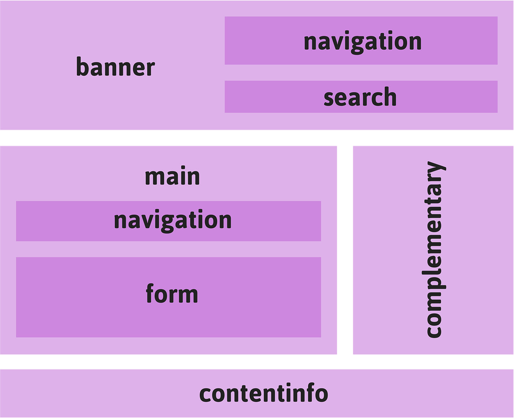
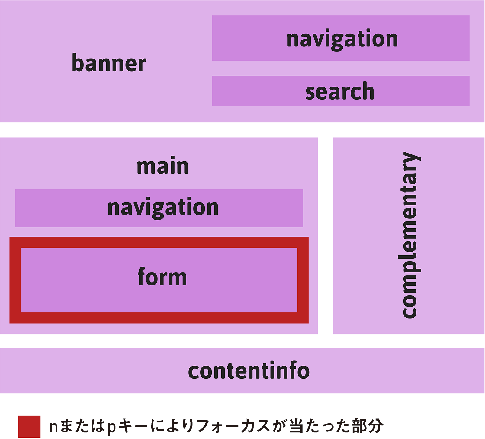
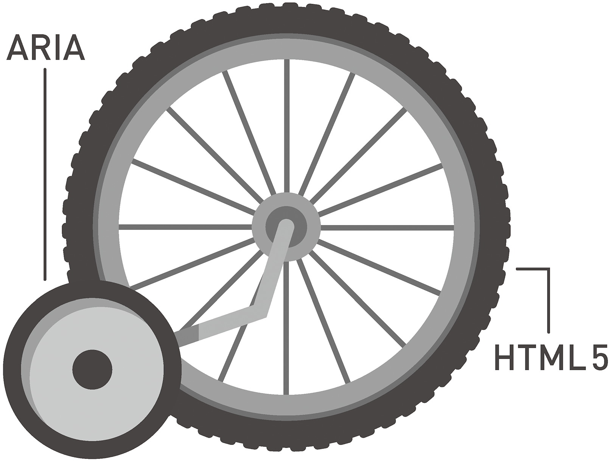

## 4-2 有名なランドマーク
セクショニング要素を控えめに正しく使用したとしても、ユーザーのコンテンツの読み方を改善できるのは直線的に上から下に読む場合だけです。先述の通り、ユーザーが見出しでできることは、見出し間のジャンプと、退屈な部分を読み飛ばすことだけです。

セクショニング要素は建築用のブロックのようなものです。構造を作るという点では役に立ちますが、汎用的な要素とあまり変わりません。時代遅れの`<div>`よりは少しましだという程度です。

私たちが本当に必要としているのは、ありふれたページデザインに含まれる、きちんとしたコードによって構成されたWebページの主要コンポーネント（言うなれば有名なランドマーク）を特定する方法です。その役目を果たすのがARIAの[ランドマークロール](http://www.nomensa.com/blog/2010/wai-aria-document-landmark-roles/)です。Webページをセクショニング要素から組み立てていくことは、レンガを積んで壁を作るのと同じことです。ランドマークの使用は、ページの骨格を構成している基本的な要素を明確にするようなものです。


ランドマークは[WCAGのガイドライン2.4](http://www.w3.org/TR/WCAG20/#navigation-mechanisms)「ユーザーがナビゲートしたり、コンテンツを探し出したり、現在位置を確認するのを手助けする手段を提供すること」に関連しています。これから見ていくように、アプリケーションの主要な部分間をすばやく移動できるようになるので、ランドマークはWebアプリケーションのインターフェイスデザインに特に役に立ちます。

ランドマークロールは以下の通りです。

- **banner：バナー**（`role="banner"`）
- **contentinfo：コンテンツ情報**（`role="contentinfo"`）
- **main：メイン**（`role="main"`）
- **navigation：ナビゲーション**（`role="navigation"`）
- **complementary：補足**（`role="complementary"`）
- **search：検索**（`role="search"`）
- **form：フォーム**（`role="form"`）

良心的なデザイナーのおかげでこれらのランドマークがすべて含まれているページを想像してみましょう。



各ランドマークロールの役割は以下の通りです。

- **banner**：ページの序文。通常はメインの`<h1>`見出しを、場合によっては`role="navigation"`ランドマークも含みます。ページにつき1回だけ使用できます。
- **contentinfo**：ページやWeb サイト全体についての情報。著作権や連絡先といった情報を配置するのに最も適した場所です。ページにつき1回だけ使用できます。
- **main**：ページのメインコンテンツを配置する場所です。別のページですでにバナーを読んだユーザーは、直接ここにジャンプしたいと考えるでしょう。ページにつき1回だけ使用できます。
- **navigation**：同じサイトの他のページへのリンクや、そのページの重要なセクションへのリンクを含むランドマーク。バナーやメインなどの他のランドマークの中にネストすることができます。1 ページに複数回使用できますが、使い過ぎないように注意します。リンクのリストに使用するものではありません。
- **complementary**：**complimentary** とスペルを間違いやすいので注意。補足的またはあまり関係のない情報を配置するのに適したランドマークを構成します。HTML4の頃は、このランドマークに相当するものに**sidebar**というラベルをつけることもありました。ページのサイドに表示しなくてはならないという意味ではありません。例えばTwitterの最新ツイートやおすすめサイトへのリンクのリストなど、補足的なコンテンツが含まれた巨大なフッターはその一例です。このロールはHTML5の`<aside>`要素と対応しています。ページにつき1回のみ使用するのが最適でしょう。
- **search**：サイトコンテンツの検索やフィルタを実行する、ページ内のフォームで使用する特殊なロールです。サイト全体の検索や、サイト内のセクションまたは単一ページの検索に、このロールを使用すると良いでしょう。ページにつき複数回使用することができます。
- **form**：`<form>`に関する汎用的なロールです。ページ上でユーザーが入力を行うという、重要な領域を特定するために使用されます。シングルページアプリケーションでは、このロールによってアプリケーションのインタラクティブな部分を特定します。

### テレポーテーション

ARIAのランドマークロールは、他のARIA属性と同じようにHTMLから拾い上げられ、Webブラウザを介してスクリーンリーダーに伝えられ、ページの構造に関する特別な情報が明らかになります。

JAWSやNVDAといったスクリーンリーダーのベンダーはランドマーク間を移動するためのキーボードショートカットを提供しているため、ランドマークを見出しと同じように使ってナビゲーションを補助することができます。たとえばJAWS 15では、<kbd>R</kbd>キーを押すと次のランドマークに移動でき、<kbd>Shift + R</kbd>キーを押すと1つ前のランドマークに移動できます。

リンク間のジャンプと比較すると、この移動は大陸間をテレポートするようなイメージです。さらに良いことに、JAWSとNVDAにはページ内のランドマークをリストアップする特別なダイアログがあり、これを使ってランドマーク間を移動することもできます。NVDAでは、<kbd>Insert + F7</kbd>キーを押すとこのダイアログにアクセスできます。他のランドマークにネストされたランドマークでも、その位置づけがわかるので便利です。

- banner
	- navigation
	- search
- main
	- navigation
	- form
- complementary
- contentinfo

上の例では、ナビゲーションランドマークが2つ使用されていることに注目してください。これは実に合理的で、ネストすることによって、構造全体におけるさまざまなロールを定義できます。

このケースでは、バナーのナビゲーションはサイトの別の場所にジャンプするもの、**メイン**のナビゲーションはページ上のコンテンツ間をページ内リンクで移動できるようにするものと考えられます。

#### 有名なランドマークのキーボードツアー

ランドマークを表示するダイアログインターフェイスは強力なツールです。NVDAおよびJAWSのベンダーが、同じようなソリューションを実装し、それぞれの製品間をスムーズに簡単に切り替えられるようにした成果です。

残念ながら、このスペシャルな機能を提供するには、スクリーンリーダーソフトウェアが実行されていなくてはならないため、キーボードユーザーはこれを利用できません。

しかし心配はいりません。これについて考えた人がいます。ランドマーク（および暗黙的なランドマーク：次の項を参照）間をジャンプするためのキーボードショートカットを提供する[Firefox用の無償の拡張機能](https://github.com/davidtodd/landmarks)があります。

- <kbd>n</kbd> ̶ 次のランドマークにジャンプします。
- <kbd>p</kbd> ̶ 前のランドマークにジャンプします。

ボタンなどのコントロールにフォーカスを合わせると見た目が変わるように、この拡張機能でランドマークに移動すると、そのランドマークが色つきの境界線でハイライトされます。両者の違いは、ランドマークによるナビゲーションのほうがスケールがはるかに大きく、ずっと広い領域を扱えることです。アプリケーションにおいては、`<main>`領域を囲むランドマークに直接飛ぶことで、はるかに効率的に作業できるようになります。



### ランドマークのコーディング

ARIAは[橋渡しのテクノロジー](http://www.w3.org/TR/wai-aria/introduction#co-evolution)です。ARIAは、HTMLに足りていないアクセシブルなセマンティクスを提供するため、そしてARIA属性がHTMLの要素および属性として後に採用されることを期待して、HTMLの拡張機能として開発されました。言い換えれば、ARIAは私たちの将来に向けた、よりリッチなHTMLのプロトタイプです。

時として、HTML側の表現でARIA側に追いつくことが可能になるケースがあり、これにより混乱が生じる可能性があります。いつARIAを使うのを止め、単純なHTMLを使い始めたら良いのでしょうか？　これに対する簡単な答えはありません。このため、当面の最善策は、将来的にARIAに頼らずとも意味の伝達が可能になるであろうHTMLの要素にARIA属性を記述しておくことです。

たとえば、明示的なバナーロールのセマンティックな意味は、`<body>`の直接の子として存在する`<header>`要素によって伝えられる意味と同じだと考えることができます。`<header>`はセクションの導入に使用され、`<body>`は最大のセクションであるため、ブラウザは追加の指示がなくてもこの`<header>`をバナーとして解釈することができるはずです。しかし、（今のところは）ほとんどがそうではありません。このため、これを補助するものとしてロールを残しておくのです。

```HTML
<body>
	<header role="banner"> <!-- 暗黙的/明示的バナー -->
		<h1>ページタイトル</h1>
		<p>導入パラグラフ</p>
	</header>
	<article>
		<header> <!-- ノーマルなヘッダー -->
		... 以下略...
```

この策は、自転車の補助輪のようなものだと考えてください。補助輪があるからといって自転車のタイヤを取り外すことはありません。補助輪は、補助輪なしで走れるようになるまで自転車のタイヤを支えるためにあるのです。W3Cは、どのHTML要素がどのARIA属性と同等であるかを示す[Recommendations Table](http://www.w3.org/TR/aria-in-html/#recommendations-table)（対応表）を保守しています。



Léonie Watson（レオニー・ワトソン、The Paciello Groupのシニアアクセシビリティエンジニア）は「[Rock ‘n’ Roll Guide to HTML5 and ARIA](http://www.slideshare.net/LeonieWatson/generate-2013-09)（HTML5とARIAのロックンロールガイド）」の中で、要素とロールを別々に使用しないよう警告しています。

以下は正しくない使い方の例で、`role="navigation"`属性と`<nav>`要素は同じことを意味しているので、この属性は`<nav>`要素に指定されるべきです。ロールと`<nav>`を別々にすることで、1つのランドマークに対するインジケーターが重複して作成されます。スクリーンリーダーは、「ナビゲーションランドマーク、ナビゲーションランドマーク」と読み上げるに違いありません。

```HTML
<nav>
	<ul role="navigation">
		<li><a href="">...</a></li>
		<li><a href="">...</a></li>
		<li><a href="">...</a></li>
	</ul>
</nav>
```
