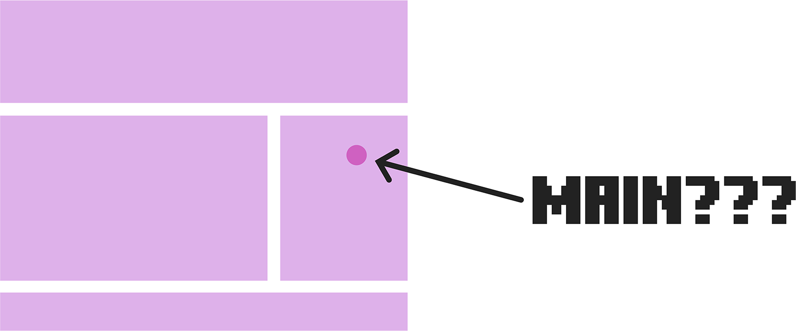
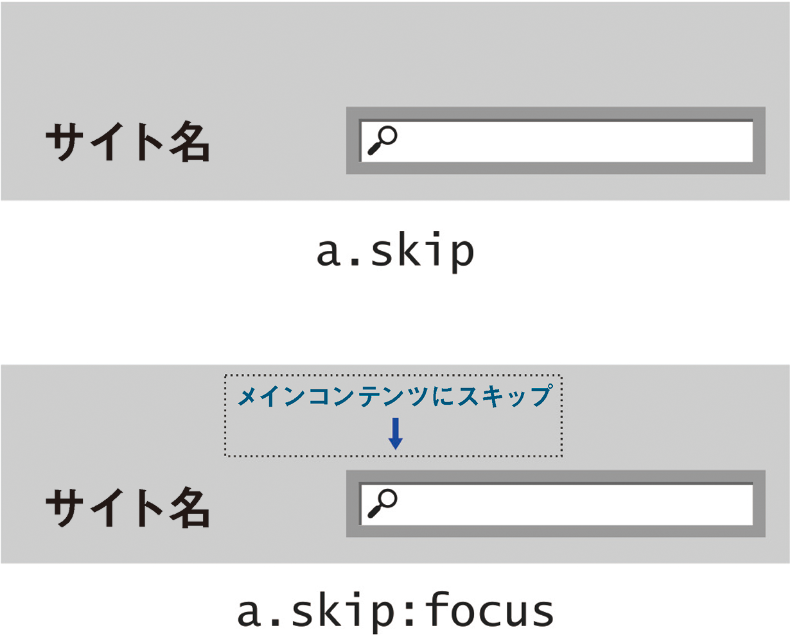

# 4-3 メインイベント

メインランドマークは、固有の要素`<main>`が、ARIAランドマーク`role="main"`をそのまま受け継いだものであるという点が特殊です。Webページやアプリケーションのメインコンテンツをマークアップするという非常に重要な役割を考慮して、その役割を果たす単独のタグが必要だという意見でまとまりました。

>ドキュメントのメインコンテンツの領域は、ドキュメントの中心となるトピックまたはアプリケーションの中心となる機能に、直接関連したコンテンツまたはその延長のコンテンツで構成される。<br>
̶ [W3C Editor's Draft](http://www.w3.org/html/wg/drafts/html/master/grouping-content.html#the-main-element)

`<main>`をランドマークのひとつだと考えるにせよ、他のランドマークを設定した後に残される部分だと考えるにせよ、ブラウザが自力でページのメイン部分を判別できるほど賢くないことはすぐに明らかになりました。メインコンテンツを推測する、いわゆる[スクービードゥーアルゴリズム](https://willnorris.com/2013/07/scooby-doo-algorithm)が提案されましたが、実験を開始するとすぐに、これはまったく役に立たないことがわかったからです。

`main`をマークアップするのは、HTMLは単なる手続きではなく、英語やその他の自然言語と同様、意味を表す手段だからです。人間のHTML制作者だけが、個々のセマンティック構造を理解できるのです。



アクセシビリティの中心にあるのは共感だ、とよく言われます。コンピュータには共感性はまったくありません。共感できるのは、これらのマシンに命令を与えている人間だけです。`<main>`要素は、ユーザーのニーズと制作者の慣習をデザインに取り込んだ、共感を仕様に落とし込んだものの代表例です。


## 核心に触れる

`<main>`の主な役割は、ページ固有のコンテンツを示すことです。仕様書によれば、`<main>`は「そのドキュメント固有のコンテンツを含み、一連のドキュメントで繰り返されるコンテンツは除外する」とされています。

キーボードユーザーとスクリーンリーダーは上から下へとドキュメントをたどること、そして共通の`role="banner"`ランドマークは通常は上に置かれることに注目すると、次のような問題が見えてきます。

- ユーザーは、サイト名を何度も告げられることを求めていない。
- ユーザーは、お決まりのスローガンがあったとしても、何度も読むことを望んでいない。
- ユーザーが特に望んでいないのは、`<iframe>`バナー広告に何度も遭遇することである。

「コンテンツにスキップ」などのリンクをページの最上部に含める（訪れたユーザーに最初に提示されるようにする）ことは、古くから行われている慣習です。これは、以下に定義するように、ページのメイン部分にリンクすべきです。

```
<main role="main" id="main">...</main>
```

しかし、このコーディングに関する誤りがよく見られます。スキップリンクはキーボードユーザーとスクリーンリーダーユーザー専用であるため、デザイナーはこれを必要としないユーザーには表示されないようにしようとします。最初の誤りは`display`値を`none`にすることで、視覚のあるユーザーにもスクリーンリーダーユーザーにもリンクが表示されなくなってしまいます。

```
a.skip {
	display: none; /* 誰にも見えません */
}
```

スクリーンリーダーにリンクが表示されていると錯覚させるには、`position:relative`と`top: -100px`と負の値を使用するなどして、単に画面の外に移動すると良いでしょう。もうひとつ、さらにありがちなのは、スキップリンクがキーボードユーザーに提示されないというミスです。[David Walsh（デビッド・ウォルシュ）のドキュメント](http://davidwalsh.name/accessibility-elements)にあるように、<kbd>Tab</kbd>キーでフォーカスを取得したときに`position`の値を元に戻すことで、キーボードユーザーにリンクを表示することが可能です。

```
a.skip:focus {
	top: 0;
}
```

さらにリンクをわかりやすくするため、[CSS3トランジション](https://developer.mozilla.org/en-US/docs/Web/CSS/transition)を使ってスライドアニメーションしながらリンクが表示されるようにしても良いでしょう。

```
a.skip {
	position: relative;
	top: -100px;
	transition: position 0.5s ease;
}

a.skip:focus {
	top: 0;
}
```



先述のスクリーンリーダーが提供するランドマークダイアログ、またはランドマーク拡張機能を利用すると、ユーザーを重要な部分により的確に導くことができます。しかし、これらの機能がサポートされるのは、比較的新しい環境に対して個別の設定を行ったときに限定されます。古いシステムが引き続き使えるようにするためには、このようなちょっとしたオリジナルのテクニックが役に立つことが多いのです。

あなたが思いついたテクニックが広く支持され、いずれは仕様書に記載されるかもしれません。それこそがコミュニティに参加することの意義です。

---

### 訳注

実際、このようにフォーカスを受け取ると表示されるスキップリンクについて、Techniques for WCAG2.0 の Technique G1に注記が追加されています。

http://www.w3.org/WAI/GL/WCAG20-TECHS/G1.html

なお、本文にもあるように、コンテンツ側でのスキップリンクの実装は、見出しやランドマークへのジャンプができない環境のためのものです。支援技術の対応が進むにつれ、スキップリンクの重要性は低下していくことでしょう。見出しやランドマークをきちんと使っておくことが重要です。

---
