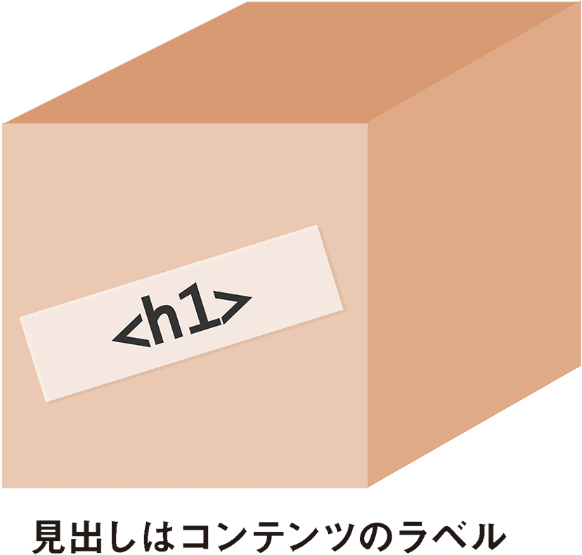

# 4-4 見出しを忘れずに！

多くの人にとって、見出しの重要性を初めて知るのは、見出しがサーチエンジン最適化（SEO）に与える影響について知ったときでしょう。

Googleなどのサーチエンジンがサイトの内容を判別するときは、`<h1>`や`<h2>`などの重要度の高い見出しにある単語やフレーズに、より大きなウェイトを置きます。ギターのアンプを販売するサイトを運営しているとすれば、事前対策としてメインの見出しにこのような重要な単語を置くことになります。するとGoogleは、この単語で検索を行った新進のギタリストには、このサイトがふさわしいと判断します。

アクセシビリティという点では、ほんの少し話が違います。

`<h1>`のテキストはやはり重要なものとみなされますが、重要視されるのは構造的な意味からです。スクリーンリーダーが`<h1>`見出しを、「見出しレベル1、ギターアンプ」と読み上げたとき、第1レベルの見出しであることが述べられているため、ギターアンプが大枠のテーマであり、これにサブテーマが続くだろうということがわかります。



ランドマークのネストの場合と同様、見出しレベルによるコンテンツのネストは含むもの、含まれるものという構造を示し、ユーザーはコンテンツのどの部分がどの部分に属しているかを知ることができます。

コンテキストがなければ何の意味もありません。コンテキストは構造に依存しているため、構造がユーザーの理解を助けることは明らかです。

- h1. 私がすること
	- h2. ギターの演奏
		- h3. ブルースギター
		- h3. スラッジメタルギター
	- h2. 執筆
		- h3. HTMLについて
		- h3. タイポグラフィについて

## 見出しとセクション？

セクショニング要素を使って構造を記述するようになったころ、すべての場所で`<h1>`見出しだけを使用し、それぞれのレベルはアルゴリズム的に計算できるのではないかと考えられていました。残念ながら、これはまったく実用的ではありませんでした。セクショニング要素をサポートしないブラウザでは機能しなかったためです。そのようなブラウザのため、そしてHTML5ページを利用するスクリーンリーダーユーザーの便益のため、[W3Cの提言が変更](http://lists.w3.org/Archives/Public/public-html/2013Feb/0125.html)されました。

先ほどの構造をセクションと見出しで表現するには、各セクションの見出しにネストのレベル（セクションそのものの等級）を示す必要があります。

```
<body>
	<h1>私がすること</h1>
	<section>
		<h2>ギターの演奏</h2>
		<section>
			<h3>ブルースギター</h3>
		</section>
		<section>
			<h3>スラッジメタルギター</h3>
		</section>
	</section>
	<section>
		<h2>執筆</h2>
		<section>
			<h3>HTMLについて</h3>
		</section>
		<section>
			<h3>タイポグラフィについて</h3>
		</section>
	</section>
</body>
```

最も重要なのは構造であるため、[見出しレベルの番号を飛ばさないように](http://accessibilitytips.com/2008/03/10/avoid-skipping-header-levels/)しなくてはなりません。`<h4>`は、コンテンツの重要度が4番目だからあまり気にしなくて良いという意味ではありません。これは、第4レベルのサブセクションのラベルであり、その中の情報はやはり大切です。見出しレベルを飛ばしてしまうと（たとえば`<h2>`の直後に`<h4>`を配置してしまうと）構造に意味がなくなり、ユーザーによっては自分の現在位置がわからなくなってしまう可能性もあります。

## 救済策としての見出し

Chapter 3「WAI-ARIAの進む道」で説明したように、ARIAの有用な用途のひとつとして、適切にコーディングされていないWebページの不十分なアクセシビリティを改善することがあります。

Johnny Paycheck（ジョニー・ペイチェック）というプロのデザイナーが、見出しを無秩序に使ってWebサイトをコーディングしたとしましょう。たとえば、以下の`<h2>`は`<h3>`でラベルづけされた`<section>`の中にあります。彼のミスは、見出しの選択をフォントサイズという見た目の効果に基づいて行ったことです。彼は単に、このテキスト部分を大きくしたかっただけでした。

```
<h2>大きく見えるテキスト</h2>
```

その後、Anna Muggins（アンナ・マギンス）という別の制作者が、そのWebページのアクセシビリティを向上するという難題を引き受けました。彼女はデザイナーとしては認められていないため、スタイルシートにアクセスすることは許されていません。しかし彼女は、`<h2>`を階層的に正しい`<h4>`に変更すれば、テキストの見た目のサイズが小さくなり、関係者を怒らせることになるだろうとわかっていました。

>レベルの値は、深さとともに増す。DOMの系統がレベルを正確に表現しない場合は、制作者が明示的にaria-level属性を定義するべきである。<br>
̶ [WAI-ARIA 1.0](http://www.w3.org/TR/wai-aria/states_and_properties#aria-level)

ARIAの`aria-level`プロパティを使用することで、Annaはページの見た目を変えることなく、見出しが描写している階層どおりに基本構造を正すことができます。単に`<h2>`にこの属性を配置するだけで、スクリーンリーダーは`<h2>`を第4レベルの見出しとして記録し、通知するようになります。

```
<h2 aria-level="4">大きく見えるテキスト</h2>
```

Johnny Paycheckは、ビジュアルに関してはデザイナーと呼ぶにふさわしい才能をもっていますが、構造的な一貫性を生み出すことができるのは、仕様に関する知識とこのメディアへの深い理解をもったAnnaのほうです。2人のうち、デザイナーとして優れているのはAnnaです。
