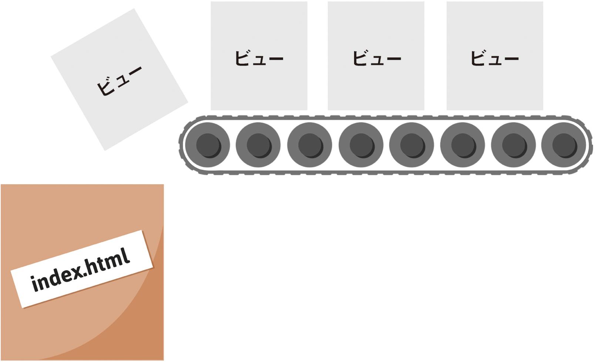

# 4-5 リンクをハイジャック

あなたがJavaScriptの初心者で、ハイパーリンクに設計上定義されている動作を意図的に無効化する、特殊なコード行を追加することができるのだと聞かされたとしましょう。まずどんな感想をもちますか？　Chapter 2「ボタンのすべて」に登場した、決して押してはならないビッグレッドボタンを思い出させるものがあると思いませんか？　

きちんとした理由がある場合に、`return false`または`e.preventDefault`を使って、JavaScriptでハイパーリンクの通常の動作をキャンセルすることがあります。

たとえばサムネイルギャラリーでは、プログレッシブエンハンスメントを使って、ユーザーの環境でJavaScriptを使えるかどうかによって、異なる方法でリンクを動作させることがあります。JavaScriptが使えない場合には、サムネイルリンクがクリックされたら単に`href`に従って大きな画像を開きま。JavaScriptが使える場合には、このデフォルトの動作は無効となり、同じページに大きな画像のポップアップを生成します。

ここで`<a>`要素が行うアクションは、リンクよりもむしろボタンのアクションに似ています。この動作の変更を支援技術ユーザーに伝えるには、`button`ロールを追加し、JavaScriptを通じて動作を変更します。

```
<a href="path/to/large/image" role="button">大きな画像</a>
```

[プログレッシブエンハンスメントがアクセシビリティに与えるメリット](http://en.wikipedia.org/wiki/Progressive_enhancement#Benefits_for_accessibility)は明白です。コンテンツへの基本的なアクセスが基盤であるため、セーフティーネットが提供され、取り残されるユーザーが少なくなります。通常、混乱が生じ始めるのは、デフォルトの動作を強化しようとしたときではなく、置き換えようとし始めたときです。

たとえば、ページ内のアンカーに移動するスクロールの動作にアニメーションの効果を取り入れてみましょう。[CSS-Tricks](http://css-tricks.com/snippets/jquery/smooth-scrolling/)に示されている再利用可能なjQueryを使用します。

```
$(function() {
	$('a[href*=#]:not([href=#])').click(function() {
		if (location.pathname.replace(/^\//,'') == this.pathname.replace(/^\//,'') && location.hostname == this.hostname) {
			var target = $(this.hash);
			target = target.length ? target : $('[name=' + this.hash.slice(1) +']');
			if (target.length) {
				$('html,body').animate({
					scrollTop: target.offset().top
				}, 1000);
				return false;
			}
		}
	});
});
```

このコードのすばらしい点は、このjQueryコードが、正確で標準化されたマークアップに基づいてページ内リンクを作成しているところです。

つまり、JavaScriptがオフになっていれば、リンクの`href`とターゲットの`id`の間にある`hash`の関係を引き続き使用し、予期した通りの動作でターゲットにジャンプできます。

```
<a href="#section2">セクション2にジャンプ</a>

<!-- 多くのコンテンツ -->

<!-- さらなるコンテンツ -->

<!-- さらに多くのコンテンツ -->

<section id="section2">
	<h2>セクション2</h2>
	<!-- 以下略 -->
</section>
```

問題は、スクリーンリーダーユーザーは**JavaScriptが使えないユーザー**ではないことです。実際のところ、これから本書で見ていくアクセシブルなパターンの多くは、属性値やウィジェットのその他の特性の管理をJavaScriptに頼っています。

スクリーンリーダーユーザーをJavaScriptが使えないユーザーとみなすなど勘違いもいいところで、車いすに乗った人に、「この人は耳が聞こえないのだろう」と思いこんで大声で話しかけるのと同じです。

この例では、スクリーンリーダーユーザーのアクションはJavaScriptが引き受けますが、JavaScriptが行っているのはスクロールバーを動かすことだけです。スクロールバーを動かしてリンク先のアンカーを表示していますが、スクリーンリーダーが理解できるような方法で明示的にリンクしているわけではありません。このため、残念ながら新たに表示されたセクションはフォーカスを受けていません。スクリーン上に表示はされてはいますが、あまり意味がありません。厳密には移動していないのと同じです。


ターゲットセクションにフォーカスを合わせ、読んだり操作したりできる状態にするには、JavaScriptコードに2行を追加する必要があります。まずは、ターゲットセクションをフォーカス可能にする行です。`<section>`要素はデフォルトではフォーカスを受け取ることができません。フォーカスを受け取るためには、`tabindex`の値を追加し、`-1`に設定します。

```
target.attr('tabindex', '-1');
```

`-1`という値を見ると無効化や配列の末尾の要素を連想するかもしれませんが、この場合はJavaScriptがターゲットにフォーカスを合わせることができるという意味です。`tabindex="0"`でも同じように機能しますが、こうするとユーザーもこの要素にフォーカスを合わせられるようになります。セクションは非インタラクティブであるため、これは期待される動作とは異なり、ユーザーを混乱させるおそれがあります。ただし、`tabindex`を正の整数にするよりはましでしょう。こうすると、WebAIMの[`tabindex`に関する記事](http://webaim.org/techniques/keyboard/tabindex)で立証されているように、タブ順序がすぐにめちゃくちゃになります。

追加の必要があるもうひとつの行は、クリックイベントによってスクロールされた後に、ターゲットセクションにフォーカスするものです。

```
target.focus();
```

セクション自体にフォーカスを合わせると、次にフォーカスできるのは同じセクションの内部にある最初のフォーカス可能な要素です。こうしないと、キーボードユーザーはこのセクションを見ているときに<kbd>Tab</kbd>キーを押した場合、前のセクションのリンクが切り替わることになってしまいます。

## ビューの問題

フォーカスに関連した問題の影響を受けるもうひとつのインターフェイスタイプは、JavaScript MV*のビューインターフェイスです。AngularJSなどの最近のJavaScriptフレームワークのナビゲーションは、1つのページ内であらゆる操作を実行し、ユーザーデータをメモリ内に保管できる「ビュー」に基づいています。ビューは、ユーザーから新しい画面が要求されるたび、その場でHTMLを再構築するように動作します。まるで新しいページが開いたように見えますが、実際にはユーザーがすでにいるページが再構築されるだけです。

>`ngView`は、主レイアウト（`index.html`）ファイルに現在のrouteの描画されたテンプレートを含めることによって、`$route`サービスを補完するディレクティブです。<br>
̶ [AngularJSドキュメント](http://docs.angularjs.org/api/ngRoute.directive:ngView)



この機能はJavaScript開発者にとっては面白いかもしれませんが、従来のアクセシブルなナビゲーションを実現しようとするブラウザにとってはまったく意味をなしません。先ほどの例のように、JavaScriptを修正するためのJavaScriptをさらに加える必要があります。**いつも**のことですね。

ビューコンテナは変化しないので、ここに手動で`tabindex="-1"`を指定します。こうすれば、必要なのは`$route`が変わった場合に、`focus()`メソッドでビューコンテナにフォーカスを合わせることだけです。

```
<div class="view-container" ng-view tabindex="-1">
	<!-- ここでページのメインコンテンツを動的に再構築 -->
</div>
```

状況に応じて、スクリーンリーダーが新しいビューを検出したら、すぐにそのコンテンツの読み上げを開始できるよう、ビューコンテナを[ARIAライブリージョン](https://developer.mozilla.org/en-US/docs/Web/Accessibility/ARIA/ARIA_Live_Regions)に変えることもできます。

この場合も、やはりインタラクションのためにビューコンテナにフォーカスを合わせる必要があります。また、気をつけないと、ライブリージョンのすべてのコンテンツが立て続けに読み上げられてしまうという問題もあります。

```
<div class="view-container" ng-view tabindex="-1" aria-live="assertive">
	<!-- ここでページのメインコンテンツを動的に再構築 -->
</div>
```

ライブリージョンについてはChapter 6「生きてる！ 生きてる！」で詳しく説明しますが、その前にちょっとした**いないいないばあ**ゲームを作成しましょう。
