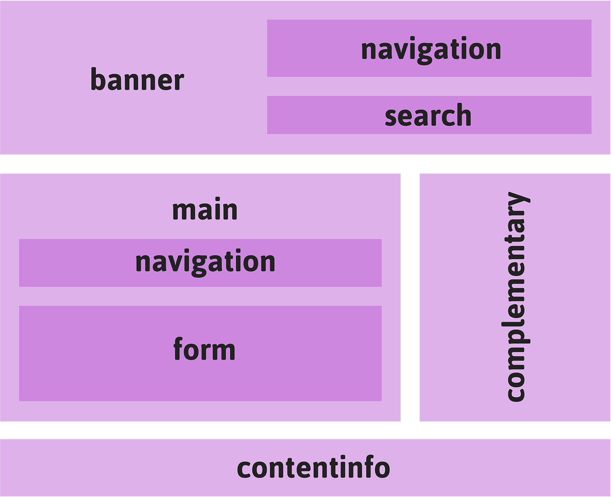

# Chapter 4 飛んでいこう
ページ内の移動やナビゲーションについて。ページ内に目印をつけて自由に移動することを可能にする「ランドマークロール」を中心に「ロール」を解説します。

- [4-1 分割する](bodymatter_4_2.xhtml)
- [4-2 有名なランドマーク](bodymatter_4_3.xhtml)
- [4-3 メインイベント](bodymatter_4_4.xhtml)
- [4-4 見出しを忘れずに！](bodymatter_4_5.xhtml)
- [4-5 リンクをハイジャック](bodymatter_4_6.xhtml)

=======================================

インターフェイスというものがいかに簡単に利用できるかを考えてみましょう。スクリーン上でさっと視線を往復させるだけで、すぐにその構造を把握することができます。そこにどれだけの情報があるか、どの部分が重要であるか、そしてどの部分を読み飛ばしたいかということが、ほとんど瞬時にしてわかります。

すべてを一度に見ることができない？　そんなときはスクロールバーをつかんで、いわゆる「above the fold（スクロールしなくても見える範囲、ファーストビュー）」より下の部分を表示します。「盛りだくさんだな。ブックマークしておいて後で読もう」となります。

ページ間の移動を可能にするハイパーリンクは本質的にアクセシブルで、登場した頃からずっとアクセシブルです。ハイパーリンクはフォーカスを受け取ることができ、支援技術はその機能を「リンク」として認識します。同じ`<a>`（アンカー）要素で同じページの別の部分にジャンプすることもでき、ほとんどのスクリーンリーダーでは、同じページ上へのリンクがフォーカスを受け取ると「ページ内リンク」と読み上げられます。

これでナビゲーションについては成功です。果たしてそうでしょうか？

グリッド状に配置されたWebページの構造は、多くの人は視覚的に受け止めることができますが、目が見えない人にとっては構造になっていません。スクリーンリーダーユーザーにとってグリッドなどは存在しないのです。誰かが完璧な黄金比で作ったグリッドシステムのフレームワークも、読み込みに時間がかかるだけで、彼らにとっては何のメリットもありません。

（少なくとも次の項目に視線を移すことができる）キーボードユーザーにとっても、何列にもまたがったレイアウトはありがたいものとは言えません。横向きであっても、結局のところ同じ距離を移動しなくてはなりません。

私はWebページをある程度ざっくり見て把握することができますが、制作者の思慮が十分でない場合、キーボードユーザーとスクリーンリーダーユーザーは、テキストやリンクなどがただ雑然と存在する荒地をしぶしぶ歩かされることになります。

あらゆる問題と同じように、この問題も切り分ける必要があります。この場合は文字通り、ページを認識可能な領域と操作可能な領域に分けて考える必要があります。すこしばかりのARIA属性を選びセマンティックを強化したHTMLを使用することで、目には見えないアプリケーションの地図を描き始めることができます。どこに何があるかがわかれば、ユーザーはナビゲーションしやすくなるでしょう。

=======================================

## 4-1 分割する

HTML5には、いくつかの新しい要素があります。[セクショニング要素](http://www.w3.org/WAI/GL/wiki/Using_HTML5_section_elements)（`<section>`、`<article>`、`<nav>`、`<aside>`）については皆さんもよくご存じでしょうが、これらの要素についてアクセシビリティという点から考えてみたことがありますか？　

セクショニングコンテンツは、HTMLの3つの基本カテゴリのひとつです。フレージングコンテンツ（`<em>`、`<strong>`などのインライン要素）とフローコンテンツ（主に`
`、`
`などのブロックレベル要素）があり、そして、ページの各部分の範囲を定義するのに使用されるセクションがあります。言い換えると、小さなコンテンツ、これより大きなコンテンツ、そして範囲をもった大きな領域のコンテンツがあるということです。

しっかりと構成されたWebページでは、フレージングコンテンツはフローコンテンツの中に入り、フローコンテンツはセクショニングコンテンツの中に入るはずです。HTML5のセクショニング関連要素を使用しない場合、`<body>`は1つの区画を囲む単一のセクションとみなすことができます。

訳注
: 実際には内容モデルのフロー（flow）という分類は非常に幅広く、フレーズやセクションに属する要素は同時にフローにも属していますが、上図のフローは主に`
`、`
`などのブロックレベル要素を指しています。HTML5ではブロックという分類がなくなり、これらの要素をひとことで言い表すことが難しくなってしまいました。

HTML5のセクショニング要素がもつ潜在的なメリットは、コンテンツを処理しやすい塊に分割できることです。JAWSスクリーンリーダーのいくつかのバージョンでは、ページ内で`<section>`および`<article>`要素に到達したときに通知が行われ、その最後に達したときには（たとえば「アーティクル終了」などのように）その終わりが通知されます。

これまで一般的だった`
`よりも、セクショニング要素のほうが優れていることは明らかです。セクショニング要素は多くの場合、耳で聞いて認識できますが、`
`は認識できません。`
`はグリッドの構築には適していますが、実際のところ、これは石積みのようなものです。支援技術のユーザーには何の意味ももたらしません。実際、セマンティックな情報を伝えることはまったく想定されていないのです。

>HTMLのspan要素とdiv要素は、一般的に、意味をもった現存の要素では目的を果たせない場合において、汎用的な組織化や様式の適用のために使用される。  
̶ [Wikipedia](http://en.wikipedia.org/wiki/Span_and_div)

`<section>`が間違って`
`と同じ意味で使用されている場合、セクショニング要素の使用によって見込まれるメリットは、失われます。次のマークアップの例を見てください。

<pre class="sourceCode html"><code class="sourceCode html">&lt;section class=&quot;outer&quot;&gt;
    &lt;section class=&quot;inner&quot;&gt;
        &lt;section class=&quot;content&quot;&gt;
            &lt;!-- ここにコンテンツを記述 --&gt;
        &lt;/section&gt;
    &lt;/section&gt;
&lt;/section&gt;</code></pre>

`
`をあまり深くネストするとHTMLコードが無意味に長くなるので良くないとされていますが、`<section>`のネストではさらにずっと深刻な問題が発生します。少なくとも、疲れやすいスクリーンリーダーユーザーに対して、すべての余分な`
`が通知されるわけではありません！

このため、[HTML5.1仕様](http://www.w3.org/html/wg/drafts/html/master/sections.html#the-section-element)（HTML5仕様の最新バージョン）が先日変更され、セクションごとの目的の強調とラベルづけに見出し（heading）を使用することが強く推奨されています。

>各`section`の主題は、一般に`section`要素の子として見出し（`h1` - `h6`要素）を含むことによって識別されるべきである。

これに加えて、現在W3Cは、ブラウザと支援技術のベンダーに「[`section`要素に名前がつけられている場合のみ、［中略］`section`要素が存在することを通知すること](http://www.w3.org/html/wg/drafts/html/master/dom.html#sec-implicit-aria-semantics)」を推奨しています。制作者のミスを考慮して、この安全策が広く取り入れられることが望まれます。

Webページのアクセシビリティにおける見出しの役割については、後で説明します。ここでは、NVDAおよびJAWSスクリーンリーダーのユーザーはキーボードショートカットを使用して見出し間を移動できること、これは基本的にセクション間のジャンプを意味することがわかっていれば十分です。たとえば、JAWSでは、1～6のキーがHTMLの見出し要素`<h1>`～`<h6>`に対応しています。WebAIMによって、[JAWSのキーボードショートカット（「ナビゲーションクイックキー」）のまとめ](http://webaim.org/articles/jaws/#quick)が公開されています。

### test.css

`<section>`を使い過ぎていないか、また`
`のように使っていないかをチェックするには、ごく単純なルールをCSSに追加します。test.cssスタイルシートに以下を追加します。

<pre class="sourceCode css"><code class="sourceCode css">section &gt; section:first-child:after {
    background: red;
    color: #fff;
    content: &#39;警告：sectionがdivのように使われているようです。各sectionに見出しを追加しましょう。&#39;;
}</code></pre>

=======================================

## 4-2 有名なランドマーク
セクショニング要素を控えめに正しく使用したとしても、ユーザーのコンテンツの読み方を改善できるのは直線的に上から下に読む場合だけです。先述の通り、ユーザーが見出しでできることは、見出し間のジャンプと、退屈な部分を読み飛ばすことだけです。

セクショニング要素は建築用のブロックのようなものです。構造を作るという点では役に立ちますが、汎用的な要素とあまり変わりません。時代遅れの`
`よりは少しましだという程度です。

私たちが本当に必要としているのは、ありふれたページデザインに含まれる、きちんとしたコードによって構成されたWebページの主要コンポーネント（言うなれば有名なランドマーク）を特定する方法です。その役目を果たすのがARIAの[ランドマークロール](http://www.nomensa.com/blog/2010/wai-aria-document-landmark-roles/)です。Webページをセクショニング要素から組み立てていくことは、レンガを積んで壁を作るのと同じことです。ランドマークの使用は、ページの骨格を構成している基本的な要素を明確にするようなものです。

ランドマークは[WCAGのガイドライン2.4](http://www.w3.org/TR/WCAG20/#navigation-mechanisms)「ユーザーがナビゲートしたり、コンテンツを探し出したり、現在位置を確認するのを手助けする手段を提供すること」に関連しています。これから見ていくように、アプリケーションの主要な部分間をすばやく移動できるようになるので、ランドマークはWebアプリケーションのインターフェイスデザインに特に役に立ちます。

ランドマークロールは以下の通りです。

- **banner：バナー**（`role="banner"`）
- **contentinfo：コンテンツ情報**（`role="contentinfo"`）
- **main：メイン**（`role="main"`）
- **navigation：ナビゲーション**（`role="navigation"`）
- **complementary：補足**（`role="complementary"`）
- **search：検索**（`role="search"`）
- **form：フォーム**（`role="form"`）

良心的なデザイナーのおかげでこれらのランドマークがすべて含まれているページを想像してみましょう。

各ランドマークロールの役割は以下の通りです。

- **banner**：ページの序文。通常はメインの`<h1>`見出しを、場合によっては`role="navigation"`ランドマークも含みます。ページにつき1回だけ使用できます。
- **contentinfo**：ページやWeb サイト全体についての情報。著作権や連絡先といった情報を配置するのに最も適した場所です。ページにつき1回だけ使用できます。
- **main**：ページのメインコンテンツを配置する場所です。別のページですでにバナーを読んだユーザーは、直接ここにジャンプしたいと考えるでしょう。ページにつき1回だけ使用できます。
- **navigation**：同じサイトの他のページへのリンクや、そのページの重要なセクションへのリンクを含むランドマーク。バナーやメインなどの他のランドマークの中にネストすることができます。1 ページに複数回使用できますが、使い過ぎないように注意します。リンクのリストに使用するものではありません。
- **complementary**：**complimentary** とスペルを間違いやすいので注意。補足的またはあまり関係のない情報を配置するのに適したランドマークを構成します。HTML4の頃は、このランドマークに相当するものに**sidebar**というラベルをつけることもありました。ページのサイドに表示しなくてはならないという意味ではありません。例えばTwitterの最新ツイートやおすすめサイトへのリンクのリストなど、補足的なコンテンツが含まれた巨大なフッターはその一例です。このロールはHTML5の`<aside>`要素と対応しています。ページにつき1回のみ使用するのが最適でしょう。
- **search**：サイトコンテンツの検索やフィルタを実行する、ページ内のフォームで使用する特殊なロールです。サイト全体の検索や、サイト内のセクションまたは単一ページの検索に、このロールを使用すると良いでしょう。ページにつき複数回使用することができます。
- **form**：`<form>`に関する汎用的なロールです。ページ上でユーザーが入力を行うという、重要な領域を特定するために使用されます。シングルページアプリケーションでは、このロールによってアプリケーションのインタラクティブな部分を特定します。

### テレポーテーション

ARIAのランドマークロールは、他のARIA属性と同じようにHTMLから拾い上げられ、Webブラウザを介してスクリーンリーダーに伝えられ、ページの構造に関する特別な情報が明らかになります。

JAWSやNVDAといったスクリーンリーダーのベンダーはランドマーク間を移動するためのキーボードショートカットを提供しているため、ランドマークを見出しと同じように使ってナビゲーションを補助することができます。たとえばJAWS 15では、<kbd>R</kbd>キーを押すと次のランドマークに移動でき、<kbd>Shift + R</kbd>キーを押すと1つ前のランドマークに移動できます。

リンク間のジャンプと比較すると、この移動は大陸間をテレポートするようなイメージです。さらに良いことに、JAWSとNVDAにはページ内のランドマークをリストアップする特別なダイアログがあり、これを使ってランドマーク間を移動することもできます。NVDAでは、<kbd>Insert + F7</kbd>キーを押すとこのダイアログにアクセスできます。他のランドマークにネストされたランドマークでも、その位置づけがわかるので便利です。

<ul>
	<li>banner
		<ul>
			<li>navigation</li>
			<li>search</li>
		</ul>
	</li>
	<li>main
		<ul>
			<li>navigation</li>
			<li>form</li>
		</ul>
	</li>
	<li>complementary</li>
	<li>contentinfo</li>
</ul>

上の例では、ナビゲーションランドマークが2つ使用されていることに注目してください。これは実に合理的で、ネストすることによって、構造全体におけるさまざまなロールを定義できます。

このケースでは、バナーのナビゲーションはサイトの別の場所にジャンプするもの、**メイン**のナビゲーションはページ上のコンテンツ間をページ内リンクで移動できるようにするものと考えられます。

#### 有名なランドマークのキーボードツアー

ランドマークを表示するダイアログインターフェイスは強力なツールです。NVDAおよびJAWSのベンダーが、同じようなソリューションを実装し、それぞれの製品間をスムーズに簡単に切り替えられるようにした成果です。

残念ながら、このスペシャルな機能を提供するには、スクリーンリーダーソフトウェアが実行されていなくてはならないため、キーボードユーザーはこれを利用できません。

しかし心配はいりません。これについて考えた人がいます。ランドマーク（および暗黙的なランドマーク：次の項を参照）間をジャンプするためのキーボードショートカットを提供する[Firefox用の無償の拡張機能](https://github.com/davidtodd/landmarks)があります。

- <kbd>n</kbd> ̶ 次のランドマークにジャンプします。
- <kbd>p</kbd> ̶ 前のランドマークにジャンプします。

ボタンなどのコントロールにフォーカスを合わせると見た目が変わるように、この拡張機能でランドマークに移動すると、そのランドマークが色つきの境界線でハイライトされます。両者の違いは、ランドマークによるナビゲーションのほうがスケールがはるかに大きく、ずっと広い領域を扱えることです。アプリケーションにおいては、`<main>`領域を囲むランドマークに直接飛ぶことで、はるかに効率的に作業できるようになります。

### ランドマークのコーディング

ARIAは[橋渡しのテクノロジー](http://www.w3.org/TR/wai-aria/introduction#co-evolution)です。ARIAは、HTMLに足りていないアクセシブルなセマンティクスを提供するため、そしてARIA属性がHTMLの要素および属性として後に採用されることを期待して、HTMLの拡張機能として開発されました。言い換えれば、ARIAは私たちの将来に向けた、よりリッチなHTMLのプロトタイプです。

時として、HTML側の表現でARIA側に追いつくことが可能になるケースがあり、これにより混乱が生じる可能性があります。いつARIAを使うのを止め、単純なHTMLを使い始めたら良いのでしょうか？　これに対する簡単な答えはありません。このため、当面の最善策は、将来的にARIAに頼らずとも意味の伝達が可能になるであろうHTMLの要素にARIA属性を記述しておくことです。

たとえば、明示的なバナーロールのセマンティックな意味は、`<body>`の直接の子として存在する`<header>`要素によって伝えられる意味と同じだと考えることができます。`<header>`はセクションの導入に使用され、`<body>`は最大のセクションであるため、ブラウザは追加の指示がなくてもこの`<header>`をバナーとして解釈することができるはずです。しかし、（今のところは）ほとんどがそうではありません。このため、これを補助するものとしてロールを残しておくのです。

<pre class="sourceCode html"><code class="sourceCode html">&lt;body&gt;
    &lt;header role=&quot;banner&quot;&gt; &lt;!-- 暗黙的/明示的バナー --&gt;
        &lt;h1&gt;ページタイトル&lt;/h1&gt;
        &lt;p&gt;導入パラグラフ&lt;/p&gt;
    &lt;/header&gt;
    &lt;article&gt;
        &lt;header&gt; &lt;!-- ノーマルなヘッダー --&gt;
        ... 以下略...</code></pre>

この策は、自転車の補助輪のようなものだと考えてください。補助輪があるからといって自転車のタイヤを取り外すことはありません。補助輪は、補助輪なしで走れるようになるまで自転車のタイヤを支えるためにあるのです。W3Cは、どのHTML要素がどのARIA属性と同等であるかを示す[Recommendations Table](http://www.w3.org/TR/aria-in-html/#recommendations-table)（対応表）を保守しています。

Léonie Watson（レオニー・ワトソン、The Paciello Groupのシニアアクセシビリティエンジニア）は「[Rock ‘n’ Roll Guide to HTML5 and ARIA](http://www.slideshare.net/LeonieWatson/generate-2013-09)（HTML5とARIAのロックンロールガイド）」の中で、要素とロールを別々に使用しないよう警告しています。

以下は正しくない使い方の例で、`role="navigation"`属性と`<nav>`要素は同じことを意味しているので、この属性は`<nav>`要素に指定されるべきです。ロールと`<nav>`を別々にすることで、1つのランドマークに対するインジケーターが重複して作成されます。スクリーンリーダーは、「ナビゲーションランドマーク、ナビゲーションランドマーク」と読み上げるに違いありません。

<pre class="sourceCode html"><code class="sourceCode html">&lt;nav&gt;
    &lt;ul role=&quot;navigation&quot;&gt;
        &lt;li&gt;&lt;a href=&quot;&quot;&gt;...&lt;/a&gt;&lt;/li&gt;
        &lt;li&gt;&lt;a href=&quot;&quot;&gt;...&lt;/a&gt;&lt;/li&gt;
        &lt;li&gt;&lt;a href=&quot;&quot;&gt;...&lt;/a&gt;&lt;/li&gt;
    &lt;/ul&gt;
&lt;/nav&gt;</code></pre>

=======================================

## 4-3 メインイベント

メインランドマークは、固有の要素`<main>`が、ARIAランドマーク`role="main"`をそのまま受け継いだものであるという点が特殊です。Webページやアプリケーションのメインコンテンツをマークアップするという非常に重要な役割を考慮して、その役割を果たす単独のタグが必要だという意見でまとまりました。

>ドキュメントのメインコンテンツの領域は、ドキュメントの中心となるトピックまたはアプリケーションの中心となる機能に、直接関連したコンテンツまたはその延長のコンテンツで構成される。  
̶ [W3C Editor's Draft](http://www.w3.org/html/wg/drafts/html/master/grouping-content.html#the-main-element)

`<main>`をランドマークのひとつだと考えるにせよ、他のランドマークを設定した後に残される部分だと考えるにせよ、ブラウザが自力でページのメイン部分を判別できるほど賢くないことはすぐに明らかになりました。メインコンテンツを推測する、いわゆる[スクービードゥーアルゴリズム](https://willnorris.com/2013/07/scooby-doo-algorithm)が提案されましたが、実験を開始するとすぐに、これはまったく役に立たないことがわかったからです。

`main`をマークアップするのは、HTMLは単なる手続きではなく、英語やその他の自然言語と同様、意味を表す手段だからです。人間のHTML制作者だけが、個々のセマンティック構造を理解できるのです。

アクセシビリティの中心にあるのは共感だ、とよく言われます。コンピュータには共感性はまったくありません。共感できるのは、これらのマシンに命令を与えている人間だけです。`<main>`要素は、ユーザーのニーズと制作者の慣習をデザインに取り込んだ、共感を仕様に落とし込んだものの代表例です。

### 核心に触れる

`<main>`の主な役割は、ページ固有のコンテンツを示すことです。仕様書によれば、`<main>`は「そのドキュメント固有のコンテンツを含み、一連のドキュメントで繰り返されるコンテンツは除外する」とされています。

キーボードユーザーとスクリーンリーダーは上から下へとドキュメントをたどること、そして共通の`role="banner"`ランドマークは通常は上に置かれることに注目すると、次のような問題が見えてきます。

- ユーザーは、サイト名を何度も告げられることを求めていない。
- ユーザーは、お決まりのスローガンがあったとしても、何度も読むことを望んでいない。
- ユーザーが特に望んでいないのは、`<iframe>`バナー広告に何度も遭遇することである。

「コンテンツにスキップ」などのリンクをページの最上部に含める（訪れたユーザーに最初に提示されるようにする）ことは、古くから行われている慣習です。これは、以下に定義するように、ページのメイン部分にリンクすべきです。

<pre class="sourceCode html"><code class="sourceCode html">&lt;main role=&quot;main&quot; id=&quot;main&quot;&gt;...&lt;/main&gt;</code></pre>

しかし、このコーディングに関する誤りがよく見られます。スキップリンクはキーボードユーザーとスクリーンリーダーユーザー専用であるため、デザイナーはこれを必要としないユーザーには表示されないようにしようとします。最初の誤りは`display`値を`none`にすることで、視覚のあるユーザーにもスクリーンリーダーユーザーにもリンクが表示されなくなってしまいます。

<pre class="sourceCode css"><code class="sourceCode css">a.skip {
    display: none; /* 誰にも見えません */
}</code></pre>

スクリーンリーダーにリンクが表示されていると錯覚させるには、`position:relative`と`top: -100px`と負の値を使用するなどして、単に画面の外に移動すると良いでしょう。もうひとつ、さらにありがちなのは、スキップリンクがキーボードユーザーに提示されないというミスです。[David Walsh（デビッド・ウォルシュ）のドキュメント](http://davidwalsh.name/accessibility-elements)にあるように、<kbd>Tab</kbd>キーでフォーカスを取得したときに`position`の値を元に戻すことで、キーボードユーザーにリンクを表示することが可能です。

<pre class="sourceCode css"><code class="sourceCode css">a.skip:focus {
    top: 0;
}</code></pre>

さらにリンクをわかりやすくするため、[CSS3トランジション](https://developer.mozilla.org/en-US/docs/Web/CSS/transition)を使ってスライドアニメーションしながらリンクが表示されるようにしても良いでしょう。

<pre class="sourceCode css"><code class="sourceCode css">a.skip {
    position: relative;
    top: -100px;
    transition: position 0.5s ease;
}

a.skip:focus {
    top: 0;
}</code></pre>

先述のスクリーンリーダーが提供するランドマークダイアログ、またはランドマーク拡張機能を利用すると、ユーザーを重要な部分により的確に導くことができます。しかし、これらの機能がサポートされるのは、比較的新しい環境に対して個別の設定を行ったときに限定されます。古いシステムが引き続き使えるようにするためには、このようなちょっとしたオリジナルのテクニックが役に立つことが多いのです。

あなたが思いついたテクニックが広く支持され、いずれは仕様書に記載されるかもしれません。それこそがコミュニティに参加することの意義です。

訳注
: 実際、このようにフォーカスを受け取ると表示されるスキップリンクについて、[Techniques for WCAG2.0 の Technique G1](http://www.w3.org/WAI/GL/WCAG20-TECHS/G1.html)に注記が追加されています。

なお、本文にもあるように、コンテンツ側でのスキップリンクの実装は、見出しやランドマークへのジャンプができない環境のためのものです。支援技術の対応が進むにつれ、スキップリンクの重要性は低下していくことでしょう。見出しやランドマークをきちんと使っておくことが重要です。

=======================================

## 4-4 見出しを忘れずに！

多くの人にとって、見出しの重要性を初めて知るのは、見出しがサーチエンジン最適化（SEO）に与える影響について知ったときでしょう。

Googleなどのサーチエンジンがサイトの内容を判別するときは、`<h1>`や`<h2>`などの重要度の高い見出しにある単語やフレーズに、より大きなウェイトを置きます。ギターのアンプを販売するサイトを運営しているとすれば、事前対策としてメインの見出しにこのような重要な単語を置くことになります。するとGoogleは、この単語で検索を行った新進のギタリストには、このサイトがふさわしいと判断します。

アクセシビリティという点では、ほんの少し話が違います。

`<h1>`のテキストはやはり重要なものとみなされますが、重要視されるのは構造的な意味からです。スクリーンリーダーが`<h1>`見出しを、「見出しレベル1、ギターアンプ」と読み上げたとき、第1レベルの見出しであることが述べられているため、ギターアンプが大枠のテーマであり、これにサブテーマが続くだろうということがわかります。

ランドマークのネストの場合と同様、見出しレベルによるコンテンツのネストは含むもの、含まれるものという構造を示し、ユーザーはコンテンツのどの部分がどの部分に属しているかを知ることができます。

コンテキストがなければ何の意味もありません。コンテキストは構造に依存しているため、構造がユーザーの理解を助けることは明らかです。

<ul>
	<li>h1. 私がすること
		<ul>
			<li>h2. ギターの演奏
				<ul>
					<li>h3. ブルースギター</li>
					<li>h3. スラッジメタルギター</li>
				</ul>
			</li>
			<li>h2. 執筆
				<ul>
					<li>h3. HTMLについて</li>
					<li>h3. タイポグラフィについて</li>
				</ul>
			</li>
		</ul>
	</li>
</ul>

### 見出しとセクション？

セクショニング要素を使って構造を記述するようになったころ、すべての場所で`<h1>`見出しだけを使用し、それぞれのレベルはアルゴリズム的に計算できるのではないかと考えられていました。残念ながら、これはまったく実用的ではありませんでした。セクショニング要素をサポートしないブラウザでは機能しなかったためです。そのようなブラウザのため、そしてHTML5ページを利用するスクリーンリーダーユーザーの便益のため、[W3Cの提言が変更](http://lists.w3.org/Archives/Public/public-html/2013Feb/0125.html)されました。

先ほどの構造をセクションと見出しで表現するには、各セクションの見出しにネストのレベル（セクションそのものの等級）を示す必要があります。

<pre class="sourceCode html"><code class="sourceCode html">&lt;body&gt;
    &lt;h1&gt;私がすること&lt;/h1&gt;
    &lt;section&gt;
        &lt;h2&gt;ギターの演奏&lt;/h2&gt;
        &lt;section&gt;
            &lt;h3&gt;ブルースギター&lt;/h3&gt;
        &lt;/section&gt;
        &lt;section&gt;
            &lt;h3&gt;スラッジメタルギター&lt;/h3&gt;
        &lt;/section&gt;
    &lt;/section&gt;
    &lt;section&gt;
        &lt;h2&gt;執筆&lt;/h2&gt;
        &lt;section&gt;
            &lt;h3&gt;HTMLについて&lt;/h3&gt;
        &lt;/section&gt;
        &lt;section&gt;
            &lt;h3&gt;タイポグラフィについて&lt;/h3&gt;
        &lt;/section&gt;
    &lt;/section&gt;
&lt;/body&gt;</code></pre>

最も重要なのは構造であるため、[見出しレベルの番号を飛ばさないように](http://accessibilitytips.com/2008/03/10/avoid-skipping-header-levels/)しなくてはなりません。`<h4>`は、コンテンツの重要度が4番目だからあまり気にしなくて良いという意味ではありません。これは、第4レベルのサブセクションのラベルであり、その中の情報はやはり大切です。見出しレベルを飛ばしてしまうと（たとえば`<h2>`の直後に`<h4>`を配置してしまうと）構造に意味がなくなり、ユーザーによっては自分の現在位置がわからなくなってしまう可能性もあります。

### 救済策としての見出し

Chapter 3「[WAI-ARIAの進む道](bodymatter_3_0.xhtml)」で説明したように、ARIAの有用な用途のひとつとして、適切にコーディングされていないWebページの不十分なアクセシビリティを改善することがあります。

Johnny Paycheck（ジョニー・ペイチェック）というプロのデザイナーが、見出しを無秩序に使ってWebサイトをコーディングしたとしましょう。たとえば、以下の`<h2>`は`<h3>`でラベルづけされた`<section>`の中にあります。彼のミスは、見出しの選択をフォントサイズという見た目の効果に基づいて行ったことです。彼は単に、このテキスト部分を大きくしたかっただけでした。

<pre class="sourceCode html"><code class="sourceCode html">&lt;h2&gt;大きく見えるテキスト&lt;/h2&gt;</code></pre>

その後、Anna Muggins（アンナ・マギンス）という別の制作者が、そのWebページのアクセシビリティを向上するという難題を引き受けました。彼女はデザイナーとしては認められていないため、スタイルシートにアクセスすることは許されていません。しかし彼女は、`<h2>`を階層的に正しい`<h4>`に変更すれば、テキストの見た目のサイズが小さくなり、関係者を怒らせることになるだろうとわかっていました。

>レベルの値は、深さとともに増す。DOMの系統がレベルを正確に表現しない場合は、制作者が明示的にaria-level属性を定義するべきである。  
̶ [WAI-ARIA 1.0](http://www.w3.org/TR/wai-aria/states_and_properties#aria-level)

ARIAの`aria-level`プロパティを使用することで、Annaはページの見た目を変えることなく、見出しが描写している階層どおりに基本構造を正すことができます。単に`<h2>`にこの属性を配置するだけで、スクリーンリーダーは`<h2>`を第4レベルの見出しとして記録し、通知するようになります。

<pre class="sourceCode html"><code class="sourceCode html">&lt;h2 aria-level=&quot;4&quot;&gt;大きく見えるテキスト&lt;/h2&gt;</code></pre>

Johnny Paycheckは、ビジュアルに関してはデザイナーと呼ぶにふさわしい才能をもっていますが、構造的な一貫性を生み出すことができるのは、仕様に関する知識とこのメディアへの深い理解をもったAnnaのほうです。2人のうち、デザイナーとして優れているのはAnnaです。

=======================================

## 4-5 リンクをハイジャック

あなたがJavaScriptの初心者で、ハイパーリンクに設計上定義されている動作を意図的に無効化する、特殊なコード行を追加することができるのだと聞かされたとしましょう。まずどんな感想をもちますか？　Chapter 2「[ボタンのすべて](bodymatter_2_0.xhtml)」に登場した、決して押してはならないビッグレッドボタンを思い出させるものがあると思いませんか？　

きちんとした理由がある場合に、`return false`または`e.preventDefault`を使って、JavaScriptでハイパーリンクの通常の動作をキャンセルすることがあります。

たとえばサムネイルギャラリーでは、プログレッシブエンハンスメントを使って、ユーザーの環境でJavaScriptを使えるかどうかによって、異なる方法でリンクを動作させることがあります。JavaScriptが使えない場合には、サムネイルリンクがクリックされたら単に`href`に従って大きな画像を開きま。JavaScriptが使える場合には、このデフォルトの動作は無効となり、同じページに大きな画像のポップアップを生成します。

ここで`<a>`要素が行うアクションは、リンクよりもむしろボタンのアクションに似ています。この動作の変更を支援技術ユーザーに伝えるには、`button`ロールを追加し、JavaScriptを通じて動作を変更します。

<pre class="sourceCode html"><code class="sourceCode html">&lt;a href=&quot;path/to/large/image&quot; role=&quot;button&quot;&gt;大きな画像&lt;/a&gt;</code></pre>

[プログレッシブエンハンスメントがアクセシビリティに与えるメリット](http://en.wikipedia.org/wiki/Progressive_enhancement#Benefits_for_accessibility)は明白です。コンテンツへの基本的なアクセスが基盤であるため、セーフティーネットが提供され、取り残されるユーザーが少なくなります。通常、混乱が生じ始めるのは、デフォルトの動作を強化しようとしたときではなく、置き換えようとし始めたときです。

たとえば、ページ内のアンカーに移動するスクロールの動作にアニメーションの効果を取り入れてみましょう。[CSS-Tricks](http://css-tricks.com/snippets/jquery/smooth-scrolling/)に示されている再利用可能なjQueryを使用します。

<pre class="sourceCode javascript"><code class="sourceCode javascript">$(function() {
    $(&#39;a[href*=#]:not([href=#])&#39;).click(function() {
        if (location.pathname.replace(/^\//,&#39;&#39;) == this.pathname.replace(/^\//,&#39;&#39;) &amp;&amp; location.hostname == this.hostname) {
            var target = $(this.hash);
            target = target.length ? target : $(&#39;[name=&#39; + this.hash.slice(1) +&#39;]&#39;);
            if (target.length) {
                $(&#39;html,body&#39;).animate({
                    scrollTop: target.offset().top
                }, 1000);
                return false;
            }
        }
    });
});</code></pre>

このコードのすばらしい点は、このjQueryコードが、正確で標準化されたマークアップに基づいてページ内リンクを作成しているところです。

つまり、JavaScriptがオフになっていれば、リンクの`href`とターゲットの`id`の間にある`hash`の関係を引き続き使用し、予期した通りの動作でターゲットにジャンプできます。

<pre class="sourceCode html"><code class="sourceCode html">&lt;a href=&quot;#section2&quot;&gt;セクション2にジャンプ&lt;/a&gt;

&lt;!-- 多くのコンテンツ --&gt;

&lt;!-- さらなるコンテンツ --&gt;

&lt;!-- さらに多くのコンテンツ --&gt;

&lt;section id=&quot;section2&quot;&gt;
    &lt;h2&gt;セクション2&lt;/h2&gt;
    &lt;!-- 以下略 --&gt;
&lt;/section&gt;</code></pre>

問題は、スクリーンリーダーユーザーは**JavaScriptが使えないユーザー**ではないことです。実際のところ、これから本書で見ていくアクセシブルなパターンの多くは、属性値やウィジェットのその他の特性の管理をJavaScriptに頼っています。

スクリーンリーダーユーザーをJavaScriptが使えないユーザーとみなすなど勘違いもいいところで、車いすに乗った人に、「この人は耳が聞こえないのだろう」と思いこんで大声で話しかけるのと同じです。

この例では、スクリーンリーダーユーザーのアクションはJavaScriptが引き受けますが、JavaScriptが行っているのはスクロールバーを動かすことだけです。スクロールバーを動かしてリンク先のアンカーを表示していますが、スクリーンリーダーが理解できるような方法で明示的にリンクしているわけではありません。このため、残念ながら新たに表示されたセクションはフォーカスを受けていません。スクリーン上に表示はされてはいますが、あまり意味がありません。厳密には移動していないのと同じです。

ターゲットセクションにフォーカスを合わせ、読んだり操作したりできる状態にするには、JavaScriptコードに2行を追加する必要があります。まずは、ターゲットセクションをフォーカス可能にする行です。`<section>`要素はデフォルトではフォーカスを受け取ることができません。フォーカスを受け取るためには、`tabindex`の値を追加し、`-1`に設定します。

<pre class="sourceCode javascript"><code class="sourceCode javascript">target.attr(&#39;tabindex&#39;, &#39;-1&#39;);</code></pre>

`-1`という値を見ると無効化や配列の末尾の要素を連想するかもしれませんが、この場合はJavaScriptがターゲットにフォーカスを合わせることができるという意味です。`tabindex="0"`でも同じように機能しますが、こうするとユーザーもこの要素にフォーカスを合わせられるようになります。セクションは非インタラクティブであるため、これは期待される動作とは異なり、ユーザーを混乱させるおそれがあります。ただし、`tabindex`を正の整数にするよりはましでしょう。こうすると、WebAIMの[`tabindex`に関する記事](http://webaim.org/techniques/keyboard/tabindex)で立証されているように、タブ順序がすぐにめちゃくちゃになります。

追加の必要があるもうひとつの行は、クリックイベントによってスクロールされた後に、ターゲットセクションにフォーカスするものです。

<pre class="sourceCode javascript"><code class="sourceCode javascript">target.focus();</code></pre>

セクション自体にフォーカスを合わせると、次にフォーカスできるのは同じセクションの内部にある最初のフォーカス可能な要素です。こうしないと、キーボードユーザーはこのセクションを見ているときに<kbd>Tab</kbd>キーを押した場合、前のセクションのリンクが切り替わることになってしまいます。

### ビューの問題

フォーカスに関連した問題の影響を受けるもうひとつのインターフェイスタイプは、JavaScript MV*のビューインターフェイスです。AngularJSなどの最近のJavaScriptフレームワークのナビゲーションは、1つのページ内であらゆる操作を実行し、ユーザーデータをメモリ内に保管できる「ビュー」に基づいています。ビューは、ユーザーから新しい画面が要求されるたび、その場でHTMLを再構築するように動作します。まるで新しいページが開いたように見えますが、実際にはユーザーがすでにいるページが再構築されるだけです。

>`ngView`は、主レイアウト（`index.html`）ファイルに現在のrouteの描画されたテンプレートを含めることによって、`$route`サービスを補完するディレクティブです。  
̶ [AngularJSドキュメント](http://docs.angularjs.org/api/ngRoute.directive:ngView)

この機能はJavaScript開発者にとっては面白いかもしれませんが、従来のアクセシブルなナビゲーションを実現しようとするブラウザにとってはまったく意味をなしません。先ほどの例のように、JavaScriptを修正するためのJavaScriptをさらに加える必要があります。**いつも**のことですね。

ビューコンテナは変化しないので、ここに手動で`tabindex="-1"`を指定します。こうすれば、必要なのは`$route`が変わった場合に、`focus()`メソッドでビューコンテナにフォーカスを合わせることだけです。

<pre class="sourceCode html"><code class="sourceCode html">&lt;div class=&quot;view-container&quot; ng-view tabindex=&quot;-1&quot;&gt;
    &lt;!-- ここでページのメインコンテンツを動的に再構築 --&gt;
&lt;/div&gt;</code></pre>

状況に応じて、スクリーンリーダーが新しいビューを検出したら、すぐにそのコンテンツの読み上げを開始できるよう、ビューコンテナを[ARIAライブリージョン](https://developer.mozilla.org/en-US/docs/Web/Accessibility/ARIA/ARIA_Live_Regions)に変えることもできます。

この場合も、やはりインタラクションのためにビューコンテナにフォーカスを合わせる必要があります。また、気をつけないと、ライブリージョンのすべてのコンテンツが立て続けに読み上げられてしまうという問題もあります。

<pre class="sourceCode html"><code class="sourceCode html">&lt;div class=&quot;view-container&quot; ng-view tabindex=&quot;-1&quot; aria-live=&quot;assertive&quot;&gt;
    &lt;!-- ここでページのメインコンテンツを動的に再構築 --&gt;
&lt;/div&gt;</code></pre>

ライブリージョンについてはChapter 6「[生きてる！ 生きてる！](bodymatter_6_0.xhtml)」で詳しく説明しますが、その前にちょっとした**いないいないばあ**ゲームを作成しましょう。
