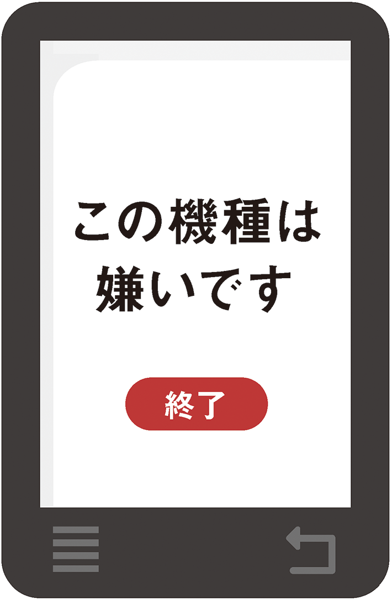
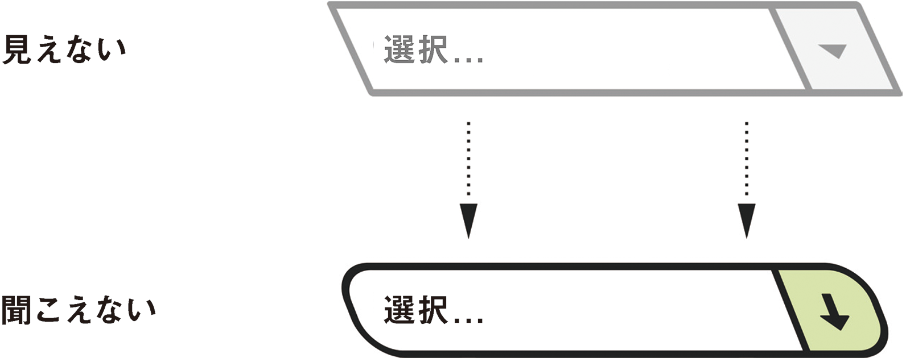
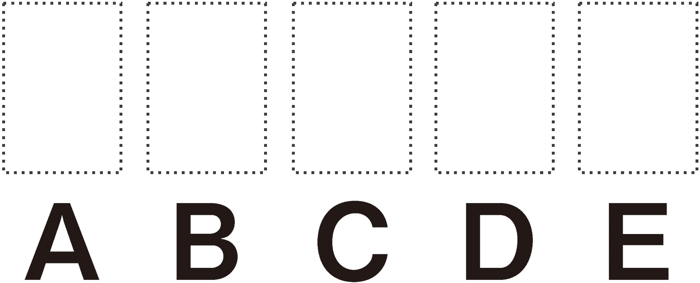

# 5-1 何をどう隠すべきか

姿を現す前に、隠れなくてはなりません。

一部のユーザーに対してのみコンテンツを隠すという方法には、地雷原のような危険性があります。地雷の危険性が隠されているという意味で、この場合にぴったりの例えです。一部の人にだけ隠すという行為は、本質的には差別行動です。しかし、「差別」にはもう1つの意味もあります。

>**差別**
>1. ある人や集団を別の人や集団とは公平でない方法で扱うこと。
>2. ある事柄と別の事柄が異なっていることを理解する能力。<br>
>̶ [Merriam-Websterの定義](http://www.merriam-webster.com/dictionary/discrimination)

## 悪い意味での差別

公平でない扱い（悪い意味での差別）の例として、特定の種類のデバイス上でのみ機能するアプリケーションを作ることが挙げられます。アップルのiPhoneでのみ機能する**Web**アプリケーションを作成することは、[オープンウェブ](http://www.w3.org/wiki/Open_Web_Platform)の精神に反します。アプリケーションの作成に使用するフリーで[インターオペラブル](http://en.wikipedia.org/wiki/Web_interoperability)（相互運用可能）なテクノロジーは、本来ならデバイスには依存しません。コンテンツを利用できるユーザーを限定することは、恣意的な差別という、最悪の差別です。



アクセシビリティとは、特定の障害に対処することではなく、できる限り多くの人々が同じ情報にアクセスできるようにすることです。Webの基本原則はオープンさであり、特定の人々を締め出して良い理由はほとんどありません。

## 良い意味での差別

悪い意味でない差別は、単にユーザーが利用できるコンテンツのタイプと利用できないコンテンツのタイプを識別することです。私たちは特定のニーズや選択に配慮する必要があります。しかし、**代替手段を提供せずにコンテンツを隠す**ようなことをするべきではありません。WCAG 2.0の原則「知覚可能」のガイドライン1.1には「すべての非テキストコンテンツには、拡大印刷、点字、音声、シンボル、平易な言葉などのユーザーが必要とする形式に変換できるように、テキストによる代替を提供すること」と規定されています。

## aria-hiddenステート

aria-hiddenステートは、通常、すべてのユーザーに対してコンテンツを隠したい要素（およびその子孫である要素）に使用します。このためaria-hiddenの仕様では、要素が見えないようにする場合は、ステートに結びつけることが推奨されています。

```CSS
[aria-hidden="true"] { display: none }
```

---

### 訳注

実際にWAI-ARIAの仕様に出ているCSSの例は微妙に異なり、以下のようになっています。

```CSS
[aria-hidden="true"] { visibility: hidden; }
```

---

しかしこの仕様には、支援技術のユーザーにとってそのコンテンツが「冗長または不要」である場合は、`aria-hidden`を**慎重に**使用して、支援技術のユーザーに対してだけそのコンテンツを隠しても良い、とも述べられています。なお、一部のユーザーに対してある形のコンテンツを隠す場合には、そのユーザーに対して別の形のコンテンツを提供する必要があることを忘れないでください。

### aria-hiddenを安全に使用する

さて、`aria-hidden`を使って、スクリーンリーダーユーザーに対してコンテンツを隠すのはどんなときでしょうか？　一般に、重複を取り除くときです。Roger Johansson（ロジャー・ヨハンソン）は、CSSでのスタイル調整が困難とされるセレクトボックスのデザイン性を高められるようにした、[カスタムの`<select>`要素](http://www.456bereastreet.com/archive/201111/an_accessible_keyboard_friendly_custom_select_menu/)を紹介しています。

このテクニックを機能させるには、`<select>`そのものを、より柔軟な`<span>`ベースの構造によって視覚的に置き換える必要があります。アクセシビリティを確保するため、セマンティックな`<select>`要素は削除せずに残します。その結果、コンテンツの重複が発生します。`<span>`ベースの構造を`aria-hidden`で隠すことによって、この重複が取り除かれます。

```HTML
<select id="id" class="custom replaced" name="id">...</select>
<span class="custom-select" aria-hidden="true">...</span>
```

`opacity: 0`によって隠された標準の`<select>`を、カスタマイズした`<span>`の上に置いているのがポイントです。これにより、マウスユーザーのクリックがキャプチャされます。つまり、視覚的には隠されていますが、マウスユーザー**および**キーボードユーザーとのインタラクティビティは保たれています。`<select>`などの要素の機能を完全に模倣することは困難ですが、この方法ではたとえ見えなくても標準の`<select>`とのインタラクティビティが失われないため、その必要はありません。



## 視界から隠す

先ほどの「良い意味での差別」の例に戻り、スクリーンには表示されない支援技術用の代替テキストを提供するというシナリオについて考えてみましょう。

文字を画像にしたものがあるとしましょう。これは実際にはテキストではないため、インターオペラブル（相互運用可能）ではありません。見た目が文字なので、多くの人は文字として解釈します。しかし、スクリーンリーダーがこの画像のピクセルを分解して読み取り、テキストとして伝えることはできないのです。スクリーンリーダーには代替として実際にテキストを提供する必要があります。


画像の代替コンテンツを提供する場合、一般には`alt`属性を使います。やっかいなのは、スクリーンリーダーが画像に遭遇すると、`alt`属性の値の前や後で「画像」「イメージ」などと読み上げることです（「画像、代替テキスト」のように）。

画像が画像であると説明されるにふさわしいコンテンツの一部である場合はこれでかまいません。しかし、この例での画像の役割はテキストとして機能することです。テキストの前に「画像」と読み上げるのでは、画像全体に「これは画像です」という透かし文字が入っているのと同じことになります。そんなことを知りたい人はいません。

ユーザーに同じコンテンツが繰り返し提示されないようにするため、チャネルを分ける必要があります。視覚的コンテンツのチャネルと、テキストコンテンツのチャネルです。ターゲットユーザーに対して、それぞれは排他的になっている必要があります。あるユーザーにとって不要なチャネルは、そのユーザーから隠さなくてはなりません。

ここではまず、[`alt`属性を空にします](http://www.w3.org/TR/WCAG-TECHS/H67.html)。`alt`属性に空文字列を指定して、`alt=""`とします。これにより、画像はスクリーンリーダーには認識されなくなります。次に、代替テキストを追加し、かつこれが表示されないようにします。ここがポイントです。

```HTML
<h2><span>タイトルテキスト</span></h2>
```

---

### 訳注

126ページで述べられているとおり、テキストの画像化は避け、Webフォントなどで表現することがベストです。ここでは、それができない場合の次善策を例として取り上げています。この実装が望ましいというわけではありません。

---

### 隠さずに隠す

残る問題は、テキストを視覚的に隠したいだけの場合にはどうするかということです。[WebAIMでいくつかのテクニックが説明されています](http://webaim.org/techniques/css/invisiblecontent/)が、そのほとんどは、スクリーン外にテキストを配置するか、CSSの`clip`プロパティを使用しています。最近登場したもうひとつの面白い方法は、タイポグラフィー自体を使用したものです。

AdobeのType Teamによって[Blankというフォント](http://blog.typekit.com/2013/03/28/introducing-adobe-blank/)が開発されました。その名の通り、文字が見えない空のフォントです。このフォントの優れたところは、文字の形は見えなくても、HTMLコードにはテキストが存在していることです。



Blankを使用するのは簡単で、テキストを囲む`<span>`に`class`を指定して、font-familyをBlankに設定するだけです。

```CSS
.visually-hidden {
	font-family: Blank;
}
```
```HTML
<h2><span class="visually-hidden">タイトルテキスト</span></h2>
```

もちろん`@font-face`からフォントを読み込む必要もありますが、本書では説明しません。[文字セットを減らしたバージョンのAdobe Blank](https://github.com/stowball/Adobe-Blank)を使用すると、ロード時間は短くなります。アクセシビリティにとってはパフォーマンスも大切です！　

---

### 訳注

ここで参照されている「文字セットを減らしたバージョン」には、日本語の文字に対するフォントが入っていません。日本語の文書では、フルセットのバージョンを使わざるをえないでしょう。

---

当然ですが、ステキなWebフォントが使えるのであれば、[画像にしたテキストを使用する理由はありません](http://www.w3.org/TR/UNDERSTANDING-WCAG20/visual-audio-contrast-text-presentation.html)。ほとんどの場合、テキストの画像化は避けるべきです。

---

### 訳注

ここで紹介されている手法には、フォントが有効かつ画像が無効の環境で文字が読めなくなるという問題もあります。その意味でも、テキストの画像化は避けるべきでしょう。

---

テキストノードは相互運用性がとても高く、アクセシブルなインターフェイスには欠かせません。

隠すことについてはこれで十分ですね。次は、表示することについてお話ししましょう。
