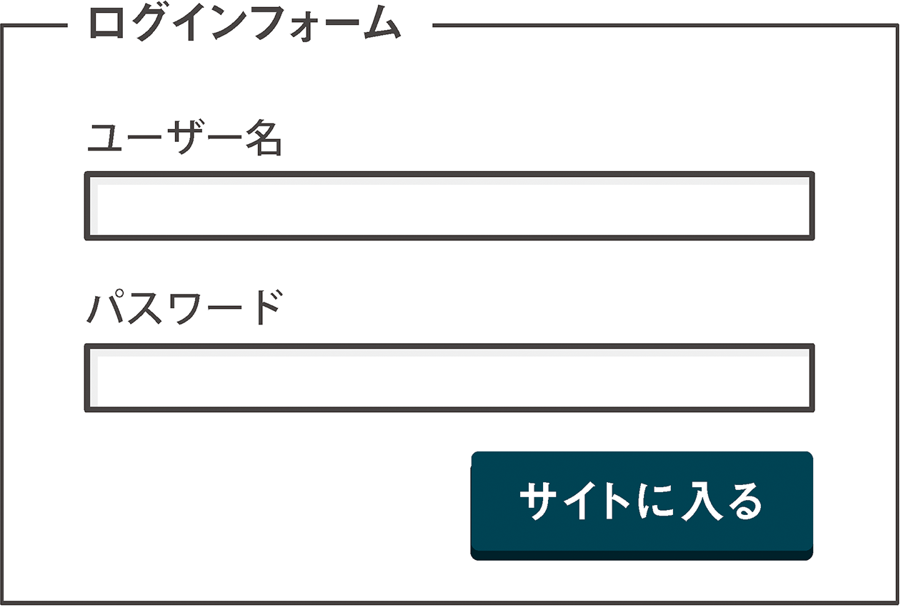
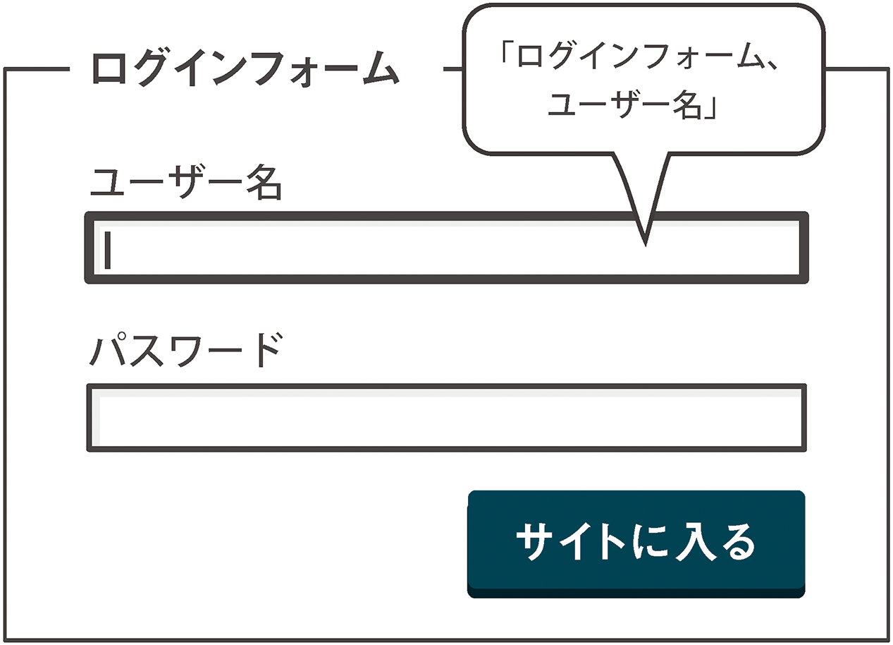
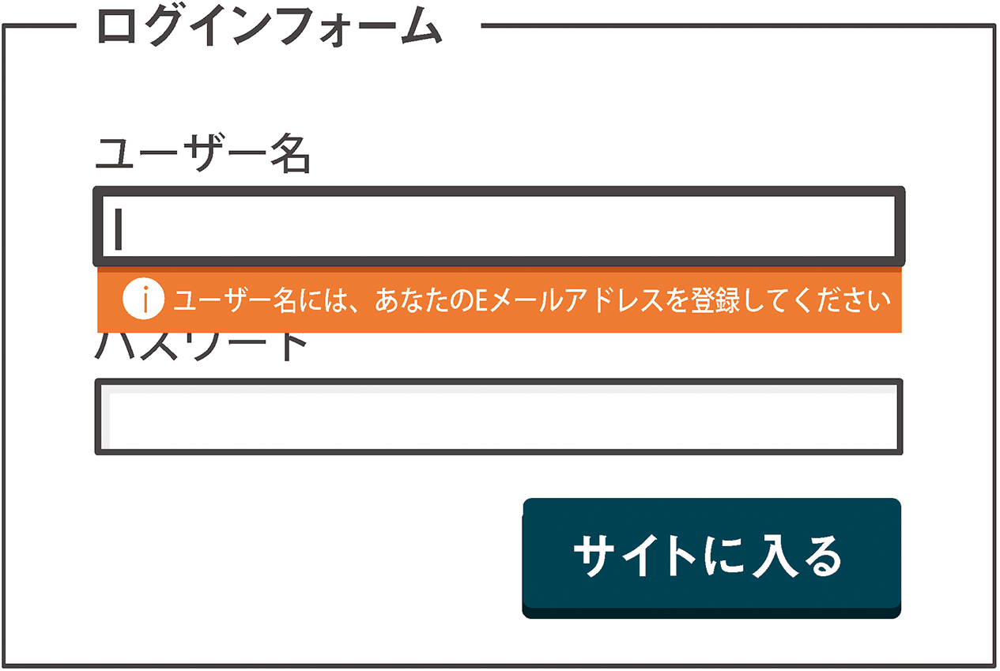
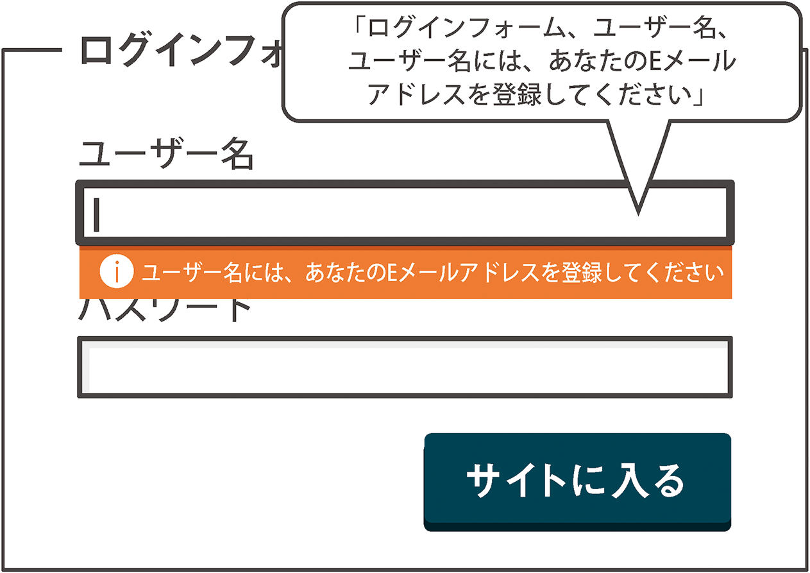

# 5-2 ヒントをちょうだい！

隠しておいたコンテンツを見せる（「いないいないばあ！」）べきタイミングは、ユーザーが特定のアクションを実行した後です。この例では、フォームの入力項目に情報を入力するためのヒントをアクセシブルな方法で提供する方法を探っていきましょう。このような**いないいないばあ**テクニックの使用には、2つのメリットがあります。

1. フォームから無駄を排除し、複雑でわかりにくい外観にならないようにする。
2. 個々のフォーム要素のインタラクション時に動的ヒントが現れることで、ユーザーの注意を引き、選択されている入力項目とヒントとの関係を明確にすることができる。

## セットアップ

それではまず、基本のフォームを作成しましょう。見栄えを整えるからといって、フォーム要素をアクセシブルではない形で使用して良いわけではありません。一番大切なことを忘れないでください。

```
<form>
	<fieldset>
		<legend>ログインフォーム</legend>
		<div>
			<label for="username">ユーザー名</label>
			<input id="username" type="text">
		</div>
		<div>
			<label for="password">パスワード</label>
			<input id="password" type="password">
		</div>
	</fieldset>
	<button type="submit">サイトに入る</button>
</form>
```



`for`属性と`id`属性に注目してください。これらは、入力項目とそれぞれのラベルの関係性を構築するために使用されています。入力項目とラベルをこのようにコーディングすることには、皆さんもすでに慣れているはずです。その目的は、対応する入力項目がフォーカスを受け取ったときに、ラベルが読み上げられるようにすることです。これによりユーザーは、自分が使用しているのがどの入力項目であるかを知ることができ、どんな場合でも便利です。また、入力項目とラベルをこのように関連づけることによってラベルがインタラクティブになり、コントロールのヒット領域が広がります。これは`label`要素内に`input`要素を含めるのと同じ効果があり、ユーザーが入力項目を選択しやすくなります。

多くのスクリーンリーダーは、ラベルテキストの前に`<legend>`のテキストを読み上げます。このため、2つの情報を組み合わせて読み上げられたときに意味をなすよう注意してください（「ログインフォーム、ユーザー名」など）。



最後に、ヒントの要素をマークアップし、これらを適切な入力項目に結びつければ、このHTMLパズルは完成です。次に、必要時にヒントを表示するよう、CSSをコーディングします。

```
<form>
	<fieldset>
		<legend>ログインフォーム</legend>
		<div>
			<label for="username">ユーザー名</label>
			<input id="username" type="text" aria-describedby="username-hint">
			<div role="tooltip" id="username-hint">ユーザー名には、あなたのEメールアドレスを登録してください</div>
		</div>
		<div>
			<label for="password">パスワード</label>
			<input id="password" type="password" aria-describedby="password-hint">
			<div role="tooltip" id="password-hint">メールでお送りしたパスワードを入れてください</div>
		</div>
	</fieldset>
	<button type="submit">サイトに入る</button>
</form>
```

ここで、新しい要素と属性の役割を整理しましょう。

- `aria-describedby`（脚注12）： ラベルの`for`属性のように、要素間のリレーションシップを作成します。今回の例では、`<input>`とヒントの`<div>`とを結びつけています。支援技術は、ブラウザを介し、この`id`値がつけられたヒントによって、フォームフィールドが説明されているであろうということを知ります。
- `role="tooltip"`： ヒント自体に使用し、支援技術に、ヒントをツールチップとして扱うように伝えます。

ユーザ名とパスワードのどちらの場合も、ヒントの要素は`<input>`要素の後の要素になっているため、CSSの隣接セレクタ（脚注13）を使用して、入力項目がフォーカスを受け取ったときにこれを簡単に表示したり隠したりできます。

最初は`display: none`を使って、ヒントを隠していることに注目してください。これは、**スクリーン上でもスクリーンリーダーにも**不可視にする必要があるためです。

```
[role="tooltip"] {
	background: orange;
	color: white;
	padding: 0.25em;
	display: none;
}
input:focus + [role="tooltip"] {
	display: block;
}
```

まとめると、ユーザー名の`<input>`にフォーカスを移すと、最初に`<legend>`が読み上げられ、続いて`<input>`に関連づけられたラベルが読み上げられます。続いてヒントテキスト（`aria-describedby`値によって`<input>`の`id`属性に関連づけられたテキスト）が読み上げられます。つまり、「ログインフォーム、ユーザー名、ユーザー名には、あなたのEメールアドレスを登録してください」となります。

視力のあるユーザーが利用できる情報はすべて、スクリーンリーダーユーザーに対して公開されており、論理的な順序で読み上げられます。

**注**： 多くの場合は、入力項目にきちんとラベルがつけられていれば十分であり、`<legend>`を含めるのはやり過ぎだと考えられています。自動テストツールの多くでは、`<fieldset>`に`<legend>`が含まれていないとエラーが報告されますが、わかりやすくするためには説明が必要かどうかという判断を慎重に行ってください。支援技術はラベルとヒントに加えて`legend`のテキストも読み上げるため、`<legend>`は短くするのがベスト（脚注14）です。



キーボードユーザーのことも忘れてはいけません！　`:focus`疑似クラスを使ってヒントの可視性を切り替えると、キーボードユーザーが（通常は<kbd>Tab</kbd>キーを使って）入力項目にフォーカスを合わせたときにヒントが表示されます。



ヒントの要素に実際どのようなテキストを指定するかは、コンテキストと、アプリケーションのデータモデルの状態によります。これを判断するのはJavaScriptまたはサーバーサイドプログラミング言語の仕事です。いずれにしても、HTML、CSS、そして多少のARIAだけで、こうしたヒントを伝えるためのアクセシブルで再利用可能なパターンを作ることができました。

この例に似た実際に動くデモ（脚注15）を用意しましたので、参考にしてください。

- 脚注12：http://www.marcozehe.de/2008/03/23/easy-aria-tip-2-aria-labelledby-and-aria-describedby/
- 脚注13：http://reference.sitepoint.com/css/adjacentsiblingselector
- 脚注14：http://www.456bereastreet.com/archive/200904/use_the_fieldset_and_legend_elements_to_group_html_form_controls/
- 脚注15：http://heydonworks.com/practical_aria_examples/#input-tooltip
