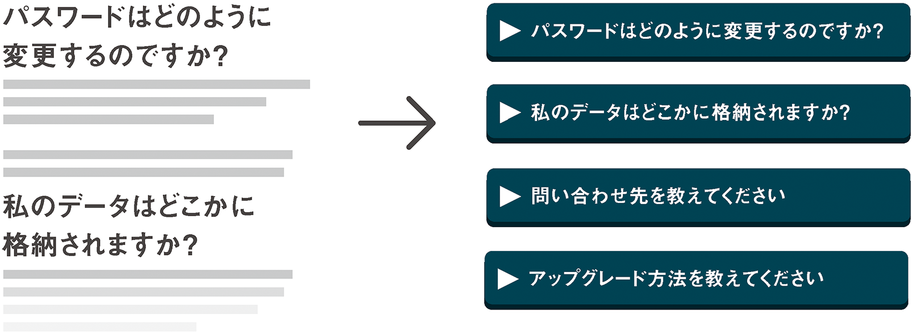
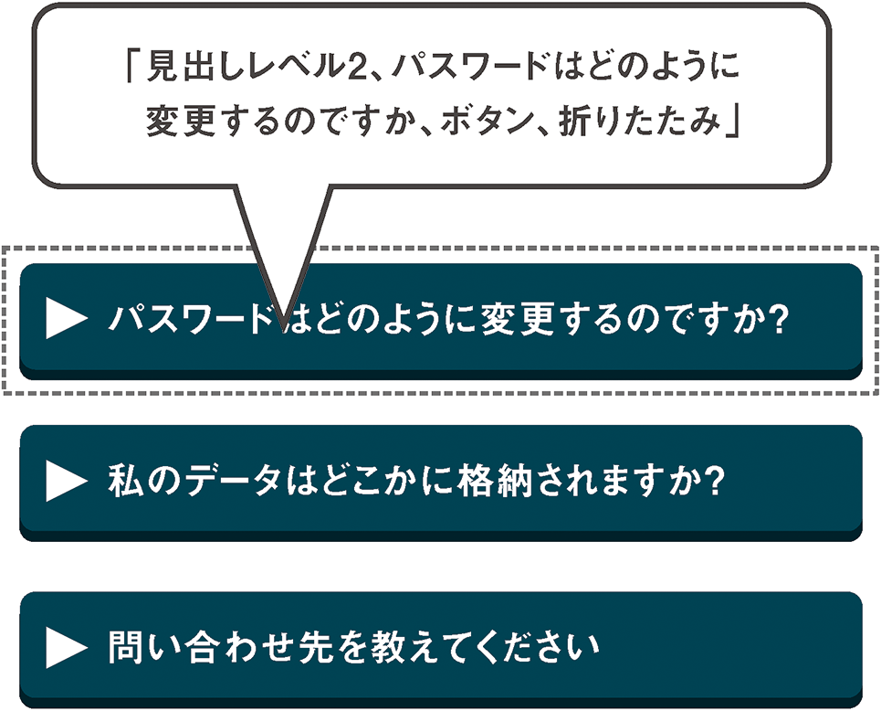
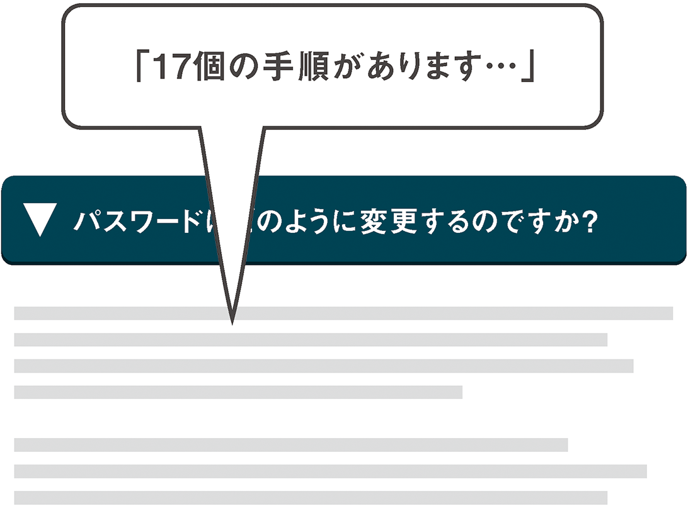
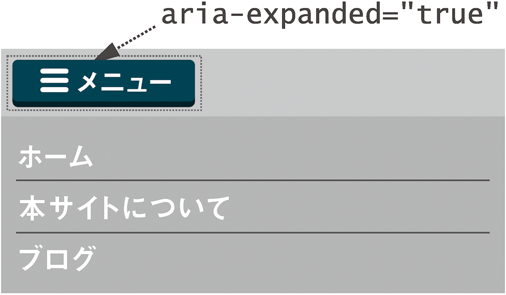
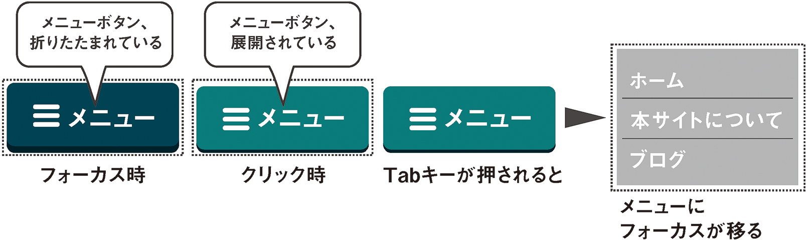

# 5-3 プログレッシブな折りたたみ項目

次はプログレッシブエンハンスメントを使用した、より複雑な「いないいないばあ」の例を見ていきましょう。

よくある質問と回答（FAQ）のページを作成したとしましょう。Webアプリケーションに関する質問が数多く届いているため、このページはかなり長くなっています。各質問は`<h2>`でマークアップされ、この`<h2>`の後に、数段落にわたる回答、画像、その他のコンテンツが続きます。

```
<h2>パスワードはどのように変更するのですか？</h2>
<p>それは、…</p>
<p>です。</p>

<h2>私のデータはどこかに格納されますか？</h2>
<p>それは、…</p>

<p>です。</p>

<h2>問い合わせ先を教えてください<h2>
<p>それは、…</p>
<p><a href="http://www.example.com/article">リンクを含むテキスト</a>です。</p>
```

セマンティクスという観点から言えば、このマークアップはかなり優秀です。適切な見出しで質問をマークアップしており、視覚的にもわかりやすく、スクリーンリーダーユーザーもクイックキー（数字の「２」のキー）を使って質問項目を簡単にジャンプできる階層構造になっています。

惜しいのはページの長さです。これでは、分類したり全体を把握したりするのが困難です。`<h2>`要素はキーボードではフォーカスできないため、キーボードユーザーが個々の質問項目を簡単に移動する方法もありません。

基盤はしっかりとしていますが、プログレッシブエンハンスメントによって、JavaScriptを利用できる多くの人々の体験を向上させてみましょう。

## HTML

各セクションのコンテンツを折りたたんで、質問だけを残しましょう。そしてユーザーがクリック、タップ、キーストロークのいずれかで、個々の質問の答えを表示できるようにします。全体として、質問を見つけ、その回答を表示する体験がより快適になるはずです。

ここで補助として使用する要素や属性の多くは、JavaScriptが利用できない場合、ページに存在しても意味をなさないので、jQueryで追加します。また、手作業で記述するマークアップが少なくなるというのも利点です。このスクリプトで変更した質問と回答のパネルのHTMLを見てみましょう。

```
<h2><button aria-expanded="false" aria-controls="howdo-I-change-my-password">パスワードはどのように変更するのですか？</button></h2>
<div id="how-do-I-change-my-password" aria-hidden="true">
	<p>それは、<a href="http://example.com">リンク</a>を…</p>
	<p>…ください。</p>
</div>
```

1. 回答を項目ごとに展開または折りたたみできるよう、すべての回答のコンテンツを共通の`<div>`で囲みました。これをjQueryで行うのは簡単です。`$('h2').nextUntil('h2').wrapAll('div');`とします。
2. `<h2>`の内容を、回答の`<div>`を展開するのに使用する`<button>`で囲みました。`<h2>`に`button`の`role`を使用することもできますが、見出しのセマンティクスが失われます（[ARIA使用の2番目のルール](http://www.w3.org/TR/aria-in-html/#second-rule-of-aria-use)を思い出してください）。
3. どの要素がどの要素から影響を受けるかを支援技術がわかるよう、[`aria-controls`プロパティ](http://www.w3.org/TR/wai-aria/states_and_properties#aria-controls)と生成された`id`を使用して見出しボタンと隠された回答のリレーションシップを設定しました。このような質問テキストから有効なスラッグ（識別用のキー）を生成するには[この小さなヘルパープラグイン](https://github.com/pmcelhaney/jQuery-Slugify-Plugin)を使用するか、ランダムなキーを生成します。リレーションシップを確立するためのidは、一意であれば何でもかまいません。
4. `button`には、対応する回答が使用できる（表示されていて読むことができる）かどうかを示す、[`aria-expanded`ステート](http://www.w3.org/TR/wai-aria/states_and_properties#aria-controls)が含まれています。もちろん、はじめは`false`に設定されています。
5. `aria-hidden`で、展開されていない回答の`<div>`を隠すよう、支援技術に伝えています。`aria-hidden`によって、回答が不用意に発見されないようにしています。

## CSS

CSSについてはいくつかの注意点のみ述べます。Chapter 2「ボタンのすべて」で説明したように、CSSでの表示状態をステートと結びつけるという方法が適しています。

>CSSの`display`プロパティをARIAの`hidden`ステートに結びつける。これは、ユーザーエージェントがサポートするプラットフォームアクセシビリティAPIではなく、ユーザーエージェントのDOMと直接やりとりする支援技術にとって重要である。<br>
̶ [WAI-ARIAオーサリングプラクティス](http://www.w3.org/WAI/PF/aria-practices/#docmgt)

こうすることで、無関係な`class`属性と値を省くことができるだけでなく、実際のステート変更を視覚的な変化に反映させることができます。たとえば、`aria-hidden`ステートを切り替えることで、各回答を折りたたんだり展開したりします。

```
[aria-hidden] {
	display: none;
}
[aria-hidden="false"] {
	display: block;
}
```

加えて、`:before`疑似コンテンツを使用して、質問テキストの横に矢印を配置します。この矢印の向き（折りたたまれているときは右向き、展開されているときは下向き）は、`aria-expanded`ステートの値（`false`または`true`）と連動しています。

```
[aria-expanded]:before {
	content: '\25ba\0020';
}
[aria-expanded="true"]:before {
	content: '\25bc\0020';
}
```

矢印にUnicodeの絵文字を使用すると、グラフィックや背景画像を挿入するよりもずっと簡単で効率的です。また、ユーザーがページをズームしても画質の低下が起こりません。なお、\0020エンコードは、[U+0020によるスペース](http://www.fileformat.info/info/unicode/char/0020/index.htm)に対応しており、見出しのタイポグラフィーとの単語間隔が保持されます。一部のスクリーンリーダーが「**右向きの黒三角**」などのように読み上げる可能性があることに注意してください。

## それからどうなる？

マークアップを組み立てたら、JavaScriptでボタンクリックを処理し、ボタンの`aria-expanded`ステートと対応するパネルの`aria-hidden`ステートを切り替えるようにします。これらの属性の追加と変更で実際に起こることは、とても興味深いものです。



質問を表すボタンがフォーカスを受け取ると、スクリーンリーダーは以下の4つの重要な情報を読み上げます。

- 見出し（質問）テキスト。
- その見出しのレベル（この例では2）。
- ボタンがフォーカスを受け取ったこと。
- このボタンの状態（折りたたまれている、または展開されている）。

`<button>`を押すと、その`aria-expanded`ステートが`true`に切り替えられ、対応するパネルの`aria-hidden`ステートが`false`に設定されます。「パスワードはどのように変更するのですか、ボタン、展開」と読み上げられると、ユーザーはコンテンツが読める状態になったことがわかります。そして通常は下矢印キーを使用して、そのコンテンツに移動することができます。



JAWSではさらに、「**use the JAWS key + ALT + M to move to the controlled element**」という情報がアナウンスされます。

JAWSは`aria-controls`によって作られたリレーションシップを明らかにし、展開したコンテンツにジャンプする方法をユーザーに提供します。この例では、展開されたコンテンツはコントローラのすぐ後に表示されるため、実際にはジャンプする必要はありません。しかし、展開されたコンテンツがページの別の場所にある場合には有用です。

この例の[実際に動くデモ](http://heydonworks.com/practical_aria_examples/#progressive-collapsibles)を用意しましたので、参考にしてください。

## すべてを支配する1つのパターン

先ほどの例では、いくらかのセマンティックなHTMLを使い、さらにいくらかのARIAとほんの少しのJavaScriptを使って、プログレッシブエンハンスメントを実現しました。これで、文章で構成されたページがクイックリファレンスに変化しました。このテクニックのアクセシビリティ上のポイントは、以下の2点です。

1. JavaScriptにエラーがある場合や、JavaScriptがロードされていない、またはセキュリティ上ブロックされているユーザーでも、コンテンツにアクセスできるようにする。
2. JavaScriptで拡張された同じコンテンツのビューを、キーボードでナビゲーションするユーザーや、スクリーンリーダーユーザーにとって有益なものにする。

ビューを拡張するという考え方の本質には、システム的な観点での複雑さはほとんどなく、用途は非常に多岐にわたります。ここで使ったARIAの展開／折りたたみの考え方は、アコーディオンメニュー（一度に1つの領域のみを展開する）や、アイコン（ナビコン）に隠されたナビゲーションメニューの表示にも応用できます。

### ナビコン

先ほどの例と、これから見ていくナビコンから展開されるナビゲーションメニューの例の大きな違いは、基本的なHTMLにデグレードする方法だけです。JavaScriptを使わずに、ナビゲーションランドマークへの単純なページ内リンクを表示しなくてはなりません。

```
<a href="#navigation">メニュー</a>
<!-- 場合によってその他のマークアップ -->
<nav id="navigation" role="navigation">
	<ul>
		<li><a href="/">ホーム</a></li>
		<li><a href="/about">本サイトについて</a></li>
		<li><a href="/blog">ブログ</a></li>
	</ul>
</nav>
```

JavaScriptを使う場合は、ARIAの`role="button"`を使用してリンクを`button`に見せかけます。これは、ナビゲーションを開いてそこに移動するようにアクションを変えようとしているためです。つまり、リンクは`return false`にします。それ以外はご存じの通りです。

```
<a href="#navigation" role="button" aria-controls="navigation" aria-expanded="false">メニュー</a>
<!-- 場合によってその他のマークアップ -->
<nav id="navigation" role="navigation" aria-hidden="true">
	<ul>
		<li><a href="/">ホーム</a></li>
		<li><a href="/about">本サイトについて</a></li>
		<li><a href="/blog">ブログ</a></li>
	</ul>
</nav>
```



## 注意点

- メニューボタンが押されたとき、スクリーンリーダーは「メニューボタンが展開されました」というような通知を行う必要があります。これにより、スクリーンリーダーユーザーは、自分が現在ナビゲーションメニューを使用していることがわかります。
- `$([aria-expanded])`に`keypress`イベントを割り当て、ユーザーが<kbd>Tab</kbd>キーを押したときにナビゲーションメニューの最初の項目にフォーカスが移動するようにします。メニューがタブオーダーにおける次の項目であるとは限らないため（DOMの編成によっては、メニューボタンとメニューの間に他のインタラクティブ要素が存在する可能性があります）、これはプログラムで行う必要があります。
- `aria-hidden`を使ってナビゲーションランドマークを隠すと、スクリーンリーダーユーザーはランドマーク一覧のダイアログからこのナビゲーションにアクセスすることはできなくなります。[このオフキャンバスナビゲーションのデモ](http://heydonworks.com/practical_aria_examples/#hamburger)では、ランドマークをもったナビゲーションそのものを複製し、これをページの最下部で見えないように隠すことによって問題を解決しています。



## test.css

このオフキャンバスメニューのパターンは、クラスを取り除いた設計によって本質的な部分だけに凝縮されています。知らぬ間に望ましくないコーディングをする可能性はあまり高くありません。すべてのARIA属性はスタイルをつけるための仕掛けとしても使用されているからです。

それでも、用心するに越したことはありません。以下のルールを**test.css**ファイルに追加します。

```
#navigation:not([role="navigation"]):after {
	background: red;
	color: white;
	content: '警告：主要なナビゲーションブロックへのページ内リンクが可能なように設定しようとしています。ARIAのナビゲーションロールがあることを確認してください';
}
[aria-controls="navigation"]:not([href="#navigation"]):after {
	background: red;
	color: white;
	content: '警告：JavaScriptが無効な場合、これはナビゲーションランドマークに移動するリンクになっているべきです';
}
```

---

### 訳注

この**test.css**は、navigationという`id`が決め打ちになっており、ここで紹介したサンプルに特化した内容となっています。この`id`を他の用途で使ったり、メニューに他の`id`をつける場合は調整が必要になります。

---

**注**：「メニュー」の文字を付加せずにナビコンのシンボルだけを表示したい場合は、Chapter 2「ボタンのすべて」で説明したように、`aria-label`属性を追加して「ナビゲーションメニュー」などの値を設定します。これによりスクリーンリーダーユーザーはボタンを認識できるようになりますが、だからと言って、他の多くのユーザーにとってシンボルがわかりにくいという事実を埋め合わせることにはなりません。

Luis Abreu（ルイス・アブレウ）が「[Why And How To Avoid Hamburger Menus](http://lmjabreu.com/post/why-and-how-to-avoid-hamburger-menus/)」で立証した通り、この横に出てくるメニューパターンは全体的なユーザビリティを損なう可能性があります。デザインパターンが使いにくいものだとわかっている場合は、それをアクセシブルにしても意味がありません。誰も望んでいないものへのアクセスが向上するだけです。
