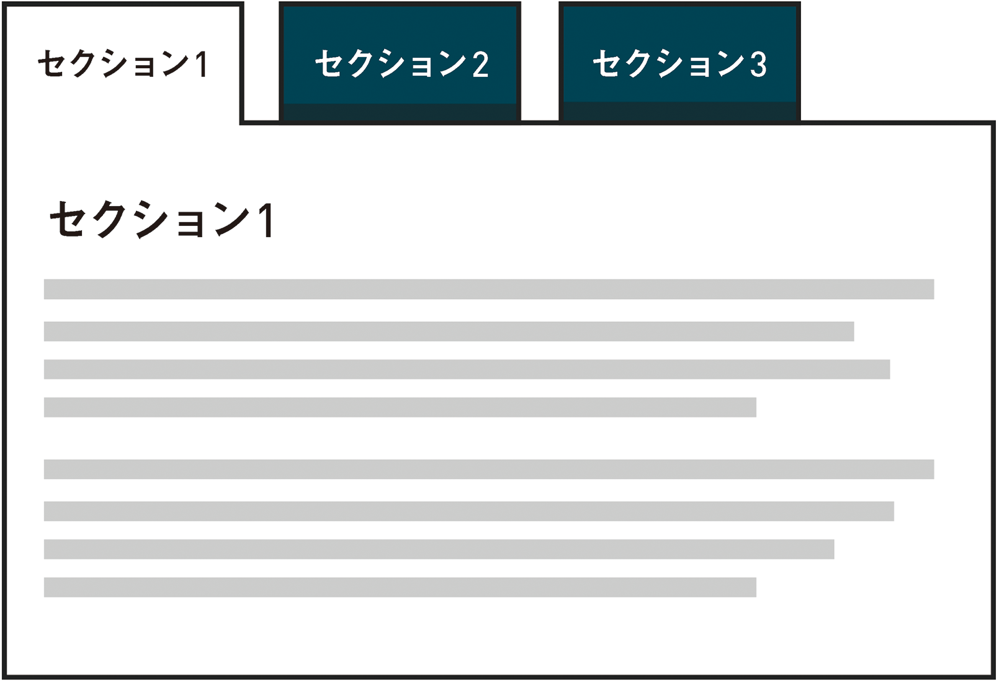
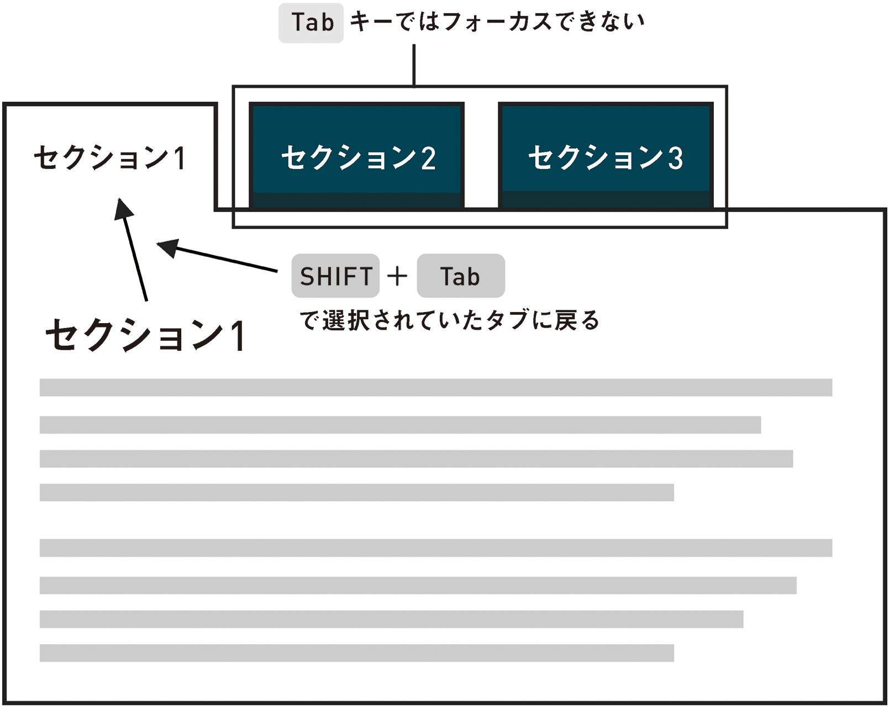
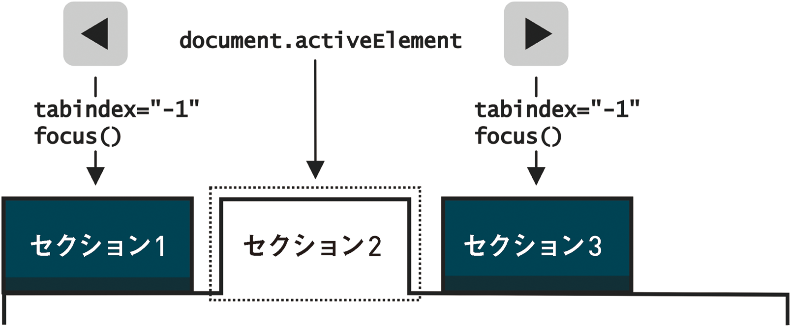

# 5-4 タブを1つください！

最近では、Webを利用すれば必ずタブを使ったインターフェイスを見かけます。一列に並んだタブには、ファイリングキャビネットで使われているタブの場合と同じように、それぞれ対応するコンテンツのペインやパネルがあります。興味のないコンテンツを非表示にしつつ、コンテンツを切り替えながら閲覧することができるので、人気のあるパターンです。

タブを使ったインターフェイスは実に広く普及しているので、**やり尽くされた**ものだと考えたくなります。パネルを表示したり隠したりするJavaScriptを書くのは簡単ですし、どこかから拝借するのはもっと簡単なので、視覚的なデザインを考える余地が生まれます。

- タブの角に丸みをつけるべきか？
- 重なり合っていた方が見栄えが良いか？
- どのようにして選択されたタブが一番上にあるように見せるか？
- そんなピンクで大丈夫か？

これらの疑問もたしかに大切ですが、タブインターフェイスの見た目が優れていても、それだけでは優秀なタブインターフェイスとは言えません。基盤となる構造は確実にセマンティックでアクセシブルになっていますか？　JavaScriptによって、1つのパネルが表示され他のパネルが隠されますが、このアクションはすべての人に本当に伝わっているでしょうか？　そもそも、すべての人がそのアクションを実行できるでしょうか？



タブインターフェイスが普及していること、そしてこれが比較的複雑であることを受け、ARIAは複数のタブをもつウィジェットを構築するための専用のロールと、それに関連するプロパティ、ステートを提供しています。

これらを使えば、この種のナビゲーションをスクリーンリーダーユーザーでも実際に使えるようにすることができます。入念にデザインしたキーボードサポートとこれらの属性を組み合わせることで、ようやくアクセシブルなタブインターフェイスを作成するための基本要件を満たすことができるのです。

一度だけ作ってしまえば、あとはそのパターンを再利用し、何度でも好きなだけスタイルを変えることができます。

## セットアップ

Léonie Watson（レオニー・ワトソン）のプレゼンテーション「A Rock ‘n’ Roll Guide To HTML5 And ARIA（脚注25）」のタブつきウィジェットのセクションには、Bachman Turner Overdrive（バックマン・ターナー・オーヴァードライヴ）の曲名を引用して「You Ain’t Seen Nothin’ Yet （まだまだこれから）」というタイトルがつけられています。これまでにやってきたことに比べて難しいのは確かですが、落ち着いて詳しく見てみれば問題はないはずです。

ここでもプログレッシブエンハンスメントを採用し、基本のHTMLから始めましょう。タブインターフェイスの作成は常に、別のコンテンツ部分にジャンプするためのナビゲーションリンクのリストから始まります。Chapter 4「飛んでいこう」で修正した、アニメーションするページ内リンクを覚えていますか？　あれこそが私たちが求めるマークアップです。そのまま使いましょう。

```
<ul>
	<li><a href="#section1">セクション1</a></li>
	<li><a href="#section2">セクション2</a></li>
	<li><a href="#section3">セクション3</a></li>
</ul>
<section id="section1">...</section>
<section id="section2">...</section>
<section id="section3">...</section>
```

**注**：タブインターフェイスは、ユーザーが同じページ上にあるコンテンツのセクションを切り替えるためのインターフェイスに適します。メインのWebサイトナビゲーションを一連のタブに見せかけたスタイルにすることもできますが、セマンティクスという観点で言うと、これは真のタブインターフェイスではありません。

順調なスタートですが、これはタブインターフェイスではありません。そう見えるようにスタイルをつけたとしてもです。ARIA属性を追加し、セマンティクスを拡張して、アクセシブルなウィジェットを作成しましょう。

```
<ul role="tablist">
	<li role="presentation"><a href="#section1" role="tab" aria-controls="section1" aria-selected="true">セクション1</a></li>
	<li role="presentation"><a href="#section2" role="tab" aria-controls="section2">セクション2</a></li>
	<li role="presentation"><a href="#section3" role="tab" aria-controls="section3">セクション3</a></li>
</ul>
<section id="section1" role="tabpanel">...</section>
<section id="section2" role="tabpanel" aria-hidden="true">...</section>
<section id="section3" role="tabpanel" aria-hidden="true">...</section>
```

おっと！?　新しい属性がたくさんありますね。それぞれ、説明すると次のようになります。

- **tablist**（ロール）：「composite（脚注26）」のひとつです。つまり、ウィジェットの一部としてナビゲーション項目をグループ化します。ここではタブを収容します。
- **tab**（ロール）： タブリストを構成する1つのタブ。
- **aria-selected**（ステート）： 選択されたタブまたは開いたタブを、（支援技術に何も通知しない）`class="selected"`よりもずっとアクセシブルな方法で示します。
- **tabpanel**（ロール）： 1つのタブに関連づけられたコンテンツのパネルを定義します。前の例のように、`aria-controls`を通じて、各`tab`とその`tabpanel`の間にリレーションシップが作成されます。
- **presentation**（ロール）： 要素のもともとの意味を取り除く特殊なロールです。`<li>`は実質的に`<>`になります。要素のセマンティクスが必要なくなった時は、要素を完全に取り除かなくても、ロールやステートを追加することで`<li>`として認識されないようにすることができます。

---

### 訳注
ここでの`<>`の表記は、`<li>`から意味が取り除かれた状態を表しています。`<li>`は暗黙的に`role="listitem"`が指定されているものとみなされますが、`role="presentation"`を指定することでこれを打ち消し、特定のロールをもたない状態にしています。

---

## フォーカスの管理
要素にいくつかの意匠を凝らした新しい属性をつけることは簡単ですが、フォーカスの管理（脚注27）について、そしてさまざまなユーザーがウィジェットとやり取りする方法について考えることは簡単ではありません。幸い、ここでのキーボードコントロールは、次の2つに絞られます。

1. 左右の矢印キーを使って隣接するタブを切り替える（フォーカスを移す）。これは対応するタブパネルを表示するアクションでもあります。
2. アクティブな（`aria-selected`な）タブと対応する`tabpanel`との間を、<kbd>Tab</kbd>キーで切り換え、<kbd>Shift + Tab</kbd>キーで戻れるようにする。

項目2については、`tabindex="0"`を使って`tabpanel`自体をフォーカス可能にすることもできますが、パネル自体にフォーカスを合わせると、ユーザーエージェントによっては「タブパネル」という説明が読み上げられなくなります。そこで、フォーカスをパネル内の最初の要素に移動しましょう。この例では、`section`は見出しをもっているはずなので、最初の要素は常に見出しになります。この場合、フォーカス取得時に「見出しレベル3、（見出しテキスト）、タブパネル」のように通知されるはずです。

隠されたパネル（`display: none`と`aria-hidden="true"`が指定されたもの）はタブオーダーから取り除かれ、開いているパネルだけが残ります。これにより、`tabindex="0"`が指定された`<h3>`の中で見えているもの（下のコードの最初の`<h3>`）が次のタブオーダーになります。

```
<section id="section1" role="tabpanel">
	<h3 tabindex="0">セクション1</h3>
</section>
<section id="section2" role="tabpanel" style="display: none" aria-hidden="true">
	<h3 tabindex="0">セクション2</h3>
</section>
<section id="section3" role="tabpanel" style="display: none" aria-hidden="true">
	<h3 tabindex="0">セクション3</h3>
</section>
```

開いた`tabpanel`と対応するタブとの間には他のタブがあり、これらが<kbd>Tab</kbd>キーによるフォーカスを受け付けると、タブパネルに直接移動することができません。`aria-selected`なタブ以外のすべてのタブに`tabindex="-1"`を指定することで、それらをタブオーダーから取り除き、タブパネルに直接移動できるようにします。

```
<ul role="tablist">
	<li role="presentation"><a href="#section1" role="tab" aria-controls="section1" aria-selected="true">セクション1</a></li>
	<li role="presentation"><a href="#section2" role="tab" aria-controls="section2" tabindex="-1">セクション2</a></li>
	<li role="presentation"><a href="#section3" role="tab" aria-controls="section3" tabindex="-1">セクション3</a></li>
</ul>
```



他のタブもフォーカス可能にしておきたいところです（さもなければ、タブインターフェイスとは言えません！）が、これらは矢印キーだけで切り換えられるようにしましょう。

JavaScriptを使用して、前のタブまたは次のタブをフォーカスする機能を（プログラムによって）キーにバインドします。疑似コードで表すと次のようになります。

```
if (タブにフォーカスがあるときにキーが押された) {
	if (右矢印キーが押され、右のタブが存在する) {
		右隣のタブにフォーカスを移動;
		右隣のタブのtabindexを'0'にし、現在のタブのtabindexを'-1'にする;
	}
	if (左矢印キーが押され、左のタブが存在する) {
		左隣のタブにフォーカスを移動;
		左隣のタブのtabindexを'0'にし、現在のタブのtabindexを'-1'にする;
	}
}
```



このタブインターフェイスの例の実際に動くデモ（脚注28）を用意しましたので、参考にしてください。また、詳細や代替策については、ARIAのタブインターフェイスに関するJason Kiss（ジェイソン・キス）の研究（脚注29）を参照してください。

## test.css

記述したインターフェイスのHTMLが適切かどうかを確認するルールをいくつか追加します。場合によって、特に開発チームがスタイル設定とステートの切り替えにクラスを使用するよう要求しているときには、ここに自身のルールを追加してください。`.tab:not([role="tab"]):after {}`のようなセレクタで正しいARIA属性が存在するかどうかをテストできます。

```
[role="tablist"] a:not([role="tab"]):after {
	background: red;
	color: white;
	content: '警告：tablist内のすべてのリンクは、tab ARIAロールを使用してtabとして定義するべきです';
}
[role="tabpanel"]:not([id]):after {
	background: red;
	color: white;
	content: '警告：各tabpanelは、idを使用して識別するべきです';
}
[role="tab"]:not([aria-controls]):after {
	background: red;
	color: white;
	content: '警告：各tabはaria-controls属性を使用して明示的にtabpanelをコントロールするべきです';
}
```

これで、表示したり隠したりする処理が完成しました。そのような処理をアクセシブルに行う方法がおおよそわかりましたね。

次の章では、ライブリージョンと、アプリケーション内で変更が起こった場合にライブリージョンを使ってユーザーに通知する方法について説明します。変更とは、ユーザーが行った変更と、ユーザーのためにアプリケーションが行った変更です。また、ユーザーが行おうとしたアクションを妨害し、そのアクションを取り消す選択肢を提示するモーダルダイアログを作成します。つまるところテーマは、「アプリケーションとユーザーによって共有されるコミュニケーションチャネルを開いておく」ことです。

- 脚注25：http://www.slideshare.net/LeonieWatson/generate-2013-09
- 脚注26：http://www.w3.org/TR/wai-aria/roles#composite
- 脚注27：http://www.w3.org/TR/wai-aria/usage#managingfocus
- 脚注28：http://heydonworks.com/practical_aria_examples/#tab-interface
- 脚注29：http://accessibleculture.org/articles/2010/08/aria-tabs/
