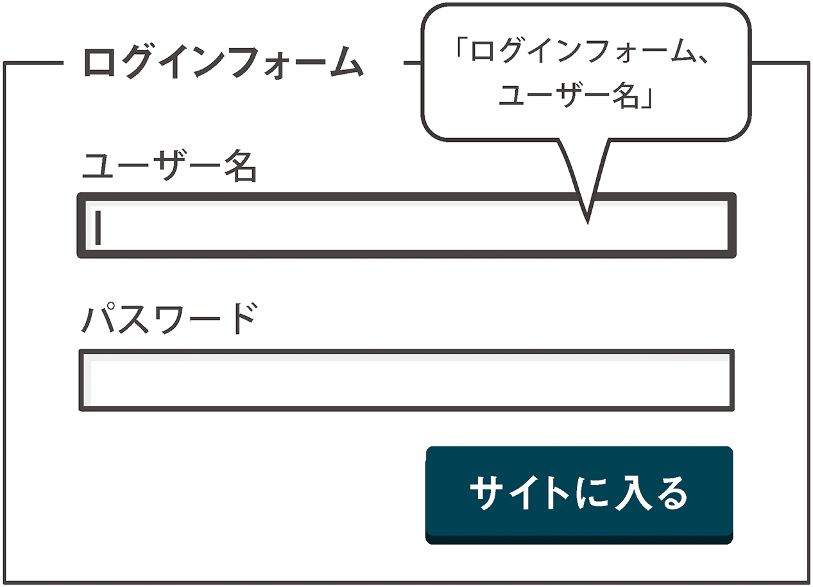

# 5 いないいないばあ
JavaScriptを用いて、「いないいないばあ」と出たり隠れたりするメニューやタブなどの「ステート」について。フォームや各種メニューのタイプ別にコードを交えて解説します。

- 5-1 何をどう隠すべきか
- 5-2 ヒントをちょうだい！
- 5-3 プログレッシブな折りたたみ項目
- 5-4 タブを1つください！

=======================================

>いないいないばあ（名詞）顔や体を隠し「いないいないばあ！」と言いながら再び見せることを繰り返すことで乳幼児を喜ばせる遊び  
̶ [Merriam-Websterの定義](http://www.merriam-webster.com/dictionary/peekaboo)

JavaScriptで動くWebインターフェイスにおいて最もよく見かけるインタラクションのスタイルは、何かを表示したり、隠したりする動作に基づいています。まさに、いないいないばあですね。個々のデザインや動き、表示のされかた、その他もろもろの細かい差異を除けば、以下のどれかに当てはまります。

- 何かが現れる。
- 何かが複数現れる。
- 何かが現れると同時に何かが見えなくなる。

いくつか例を挙げてみましょう。

- サイトのナビゲーションが現れる「いないいないばあ！」
- ドロップダウンサブメニューが現れる「いないいないばあ！」
- 用語の定義を展開する「いないいないばあ！」
- タブインターフェイスのタブを切り替える「いないいないばあ！」
- アコーディオンメニューの項目を選択する「いないいないばあ！」
- フォーム処理の次のステップへ「いないいないばあ！」
- ツールチップがフェードインする「いないいないばあ！」
- 警告メッセージが現れる「いないいないばあ！」
- ダイアログが開く「いないいないばあ！」

JavaScriptがもたらすいわゆる「リッチインタラクション」の多くが子どもを喜ばせる遊びに似ているというのは、悪いことではありません。何よりも、インターフェイスデザイナーとしてうぬぼれてはいけないという気持ちにさせてくれます。

さらに重要なのは、このメカニズムが共通しているおかげで、再利用可能でアクセシブルなコンポーネントのセットが作りやすくなっているということです。

帽子を使った手品は、その素材がシルクであってもフェルトであっても、帽子の手品であることに変わりはありません。アクセシブルなインターフェイスデザインでも同じことが言えます。コンテンツがスライドしようが、フェードしようが、大きくなろうが、重要なことはコンテンツが（白いウサギのように）はっきりと観客に見えるかどうかです。


WAIのARIA仕様では、典型的なインターフェイスコンポーネントをシンプルに保つことが重要であると認めながら、基本的なロール、ステート、プロパティ、関係する要素とのリレーションシップを定義する属性も提供しています。見かけ上の動作と実際の動作とが食い違うことになると思われるかもしれませんが、論理的な使い方をすれば、そのようなことは起こりません。

実際、これから見ていくように、ARIA属性をCSSおよびjQueryセレクタとして扱うことで、より再利用しやすく[DRY](http://en.wikipedia.org/wiki/Don%27t_repeat_yourself)（Don’t Repeat Yourself： 重複の回避）なコードを書くことができ、手間を省きながらアクセシビリティを実現することが期待できるでしょう。

=======================================

## 5-1 何をどう隠すべきか

姿を現す前に、隠れなくてはなりません。

一部のユーザーに対してのみコンテンツを隠すという方法には、地雷原のような危険性があります。地雷の危険性が隠されているという意味で、この場合にぴったりの例えです。一部の人にだけ隠すという行為は、本質的には差別行動です。しかし、「差別」にはもう1つの意味もあります。

>**差別**
>1. ある人や集団を別の人や集団とは公平でない方法で扱うこと。
>2. ある事柄と別の事柄が異なっていることを理解する能力。  
>̶ [Merriam-Websterの定義](http://www.merriam-webster.com/dictionary/discrimination)

### 悪い意味での差別

公平でない扱い（悪い意味での差別）の例として、特定の種類のデバイス上でのみ機能するアプリケーションを作ることが挙げられます。アップルのiPhoneでのみ機能する**Web**アプリケーションを作成することは、[オープンウェブ](http://www.w3.org/wiki/Open_Web_Platform)の精神に反します。アプリケーションの作成に使用するフリーで[インターオペラブル](http://en.wikipedia.org/wiki/Web_interoperability)（相互運用可能）なテクノロジーは、本来ならデバイスには依存しません。コンテンツを利用できるユーザーを限定することは、恣意的な差別という、最悪の差別です。


アクセシビリティとは、特定の障害に対処することではなく、できる限り多くの人々が同じ情報にアクセスできるようにすることです。Webの基本原則はオープンさであり、特定の人々を締め出して良い理由はほとんどありません。

### 良い意味での差別

悪い意味でない差別は、単にユーザーが利用できるコンテンツのタイプと利用できないコンテンツのタイプを識別することです。私たちは特定のニーズや選択に配慮する必要があります。しかし、**代替手段を提供せずにコンテンツを隠す**ようなことをするべきではありません。WCAG 2.0の原則「知覚可能」のガイドライン1.1には「すべての非テキストコンテンツには、拡大印刷、点字、音声、シンボル、平易な言葉などのユーザーが必要とする形式に変換できるように、テキストによる代替を提供すること」と規定されています。

### aria-hiddenステート

aria-hiddenステートは、通常、すべてのユーザーに対してコンテンツを隠したい要素（およびその子孫である要素）に使用します。このためaria-hiddenの仕様では、要素が見えないようにする場合は、ステートに結びつけることが推奨されています。

```CSS
[aria-hidden="true"] { display: none }
```

<div class="notice" markdown="1">
訳注
: 実際にWAI-ARIAの仕様に出ているCSSの例は微妙に異なり、以下のようになっています。

```CSS
[aria-hidden="true"] { visibility: hidden; }
```
</div>

しかしこの仕様には、支援技術のユーザーにとってそのコンテンツが「冗長または不要」である場合は、`aria-hidden`を**慎重に**使用して、支援技術のユーザーに対してだけそのコンテンツを隠しても良い、とも述べられています。なお、一部のユーザーに対してある形のコンテンツを隠す場合には、そのユーザーに対して別の形のコンテンツを提供する必要があることを忘れないでください。

#### aria-hiddenを安全に使用する

さて、`aria-hidden`を使って、スクリーンリーダーユーザーに対してコンテンツを隠すのはどんなときでしょうか？　一般に、重複を取り除くときです。Roger Johansson（ロジャー・ヨハンソン）は、CSSでのスタイル調整が困難とされるセレクトボックスのデザイン性を高められるようにした、[カスタムの`<select>`要素](http://www.456bereastreet.com/archive/201111/an_accessible_keyboard_friendly_custom_select_menu/)を紹介しています。

このテクニックを機能させるには、`<select>`そのものを、より柔軟な`<span>`ベースの構造によって視覚的に置き換える必要があります。アクセシビリティを確保するため、セマンティックな`<select>`要素は削除せずに残します。その結果、コンテンツの重複が発生します。`<span>`ベースの構造を`aria-hidden`で隠すことによって、この重複が取り除かれます。

```HTML
<select id="id" class="custom replaced" name="id">...</select>
<span class="custom-select" aria-hidden="true">...</span>
```

`opacity: 0`によって隠された標準の`<select>`を、カスタマイズした`<span>`の上に置いているのがポイントです。これにより、マウスユーザーのクリックがキャプチャされます。つまり、視覚的には隠されていますが、マウスユーザー**および**キーボードユーザーとのインタラクティビティは保たれています。`<select>`などの要素の機能を完全に模倣することは困難ですが、この方法ではたとえ見えなくても標準の`<select>`とのインタラクティビティが失われないため、その必要はありません。


### 視界から隠す

先ほどの「良い意味での差別」の例に戻り、スクリーンには表示されない支援技術用の代替テキストを提供するというシナリオについて考えてみましょう。

文字を画像にしたものがあるとしましょう。これは実際にはテキストではないため、インターオペラブル（相互運用可能）ではありません。見た目が文字なので、多くの人は文字として解釈します。しかし、スクリーンリーダーがこの画像のピクセルを分解して読み取り、テキストとして伝えることはできないのです。スクリーンリーダーには代替として実際にテキストを提供する必要があります。


画像の代替コンテンツを提供する場合、一般には`alt`属性を使います。やっかいなのは、スクリーンリーダーが画像に遭遇すると、`alt`属性の値の前や後で「画像」「イメージ」などと読み上げることです（「画像、代替テキスト」のように）。

画像が画像であると説明されるにふさわしいコンテンツの一部である場合はこれでかまいません。しかし、この例での画像の役割はテキストとして機能することです。テキストの前に「画像」と読み上げるのでは、画像全体に「これは画像です」という透かし文字が入っているのと同じことになります。そんなことを知りたい人はいません。

ユーザーに同じコンテンツが繰り返し提示されないようにするため、チャネルを分ける必要があります。視覚的コンテンツのチャネルと、テキストコンテンツのチャネルです。ターゲットユーザーに対して、それぞれは排他的になっている必要があります。あるユーザーにとって不要なチャネルは、そのユーザーから隠さなくてはなりません。

ここではまず、[`alt`属性を空にします](http://www.w3.org/TR/WCAG-TECHS/H67.html)。`alt`属性に空文字列を指定して、`alt=""`とします。これにより、画像はスクリーンリーダーには認識されなくなります。次に、代替テキストを追加し、かつこれが表示されないようにします。ここがポイントです。

```HTML
<h2><span>タイトルテキスト</span></h2>
```

<div class="notice" markdown="1">
訳注
: 126ページで述べられているとおり、テキストの画像化は避け、Webフォントなどで表現することがベストです。ここでは、それができない場合の次善策を例として取り上げています。この実装が望ましいというわけではありません。
</div>

#### 隠さずに隠す

残る問題は、テキストを視覚的に隠したいだけの場合にはどうするかということです。[WebAIMでいくつかのテクニックが説明されています](http://webaim.org/techniques/css/invisiblecontent/)が、そのほとんどは、スクリーン外にテキストを配置するか、CSSの`clip`プロパティを使用しています。最近登場したもうひとつの面白い方法は、タイポグラフィー自体を使用したものです。

AdobeのType Teamによって[Blankというフォント](http://blog.typekit.com/2013/03/28/introducing-adobe-blank/)が開発されました。その名の通り、文字が見えない空のフォントです。このフォントの優れたところは、文字の形は見えなくても、HTMLコードにはテキストが存在していることです。


Blankを使用するのは簡単で、テキストを囲む`<span>`に`class`を指定して、font-familyをBlankに設定するだけです。

```CSS
.visually-hidden {
	font-family: Blank;
}
```
```HTML
<h2><span class="visually-hidden">タイトルテキスト</span></h2>
```

もちろん`@font-face`からフォントを読み込む必要もありますが、本書では説明しません。[文字セットを減らしたバージョンのAdobe Blank](https://github.com/stowball/Adobe-Blank)を使用すると、ロード時間は短くなります。アクセシビリティにとってはパフォーマンスも大切です！　

<div class="notice" markdown="1">
訳注
: ここで参照されている「文字セットを減らしたバージョン」には、日本語の文字に対するフォントが入っていません。日本語の文書では、フルセットのバージョンを使わざるをえないでしょう。
</div>

当然ですが、ステキなWebフォントが使えるのであれば、[画像にしたテキストを使用する理由はありません](http://www.w3.org/TR/UNDERSTANDING-WCAG20/visual-audio-contrast-text-presentation.html)。ほとんどの場合、テキストの画像化は避けるべきです。

<div class="notice" markdown="1">
訳注
: ここで紹介されている手法には、フォントが有効かつ画像が無効の環境で文字が読めなくなるという問題もあります。その意味でも、テキストの画像化は避けるべきでしょう。
</div>

テキストノードは相互運用性がとても高く、アクセシブルなインターフェイスには欠かせません。

隠すことについてはこれで十分ですね。次は、表示することについてお話ししましょう。

=======================================

## 5-2 ヒントをちょうだい！

隠しておいたコンテンツを見せる（「いないいないばあ！」）べきタイミングは、ユーザーが特定のアクションを実行した後です。この例では、フォームの入力項目に情報を入力するためのヒントをアクセシブルな方法で提供する方法を探っていきましょう。このような**いないいないばあ**テクニックの使用には、2つのメリットがあります。

1. フォームから無駄を排除し、複雑でわかりにくい外観にならないようにする。
2. 個々のフォーム要素のインタラクション時に動的ヒントが現れることで、ユーザーの注意を引き、選択されている入力項目とヒントとの関係を明確にすることができる。

### セットアップ

それではまず、基本のフォームを作成しましょう。見栄えを整えるからといって、フォーム要素をアクセシブルではない形で使用して良いわけではありません。一番大切なことを忘れないでください。

```HTML
<form>
	<fieldset>
		<legend>ログインフォーム</legend>
		<div>
			<label for="username">ユーザー名</label>
			<input id="username" type="text">
		</div>
		<div>
			<label for="password">パスワード</label>
			<input id="password" type="password">
		</div>
	</fieldset>
	<button type="submit">サイトに入る</button>
</form>
```


`for`属性と`id`属性に注目してください。これらは、入力項目とそれぞれのラベルの関係性を構築するために使用されています。入力項目とラベルをこのようにコーディングすることには、皆さんもすでに慣れているはずです。その目的は、対応する入力項目がフォーカスを受け取ったときに、ラベルが読み上げられるようにすることです。これによりユーザーは、自分が使用しているのがどの入力項目であるかを知ることができ、どんな場合でも便利です。また、入力項目とラベルをこのように関連づけることによってラベルがインタラクティブになり、コントロールのヒット領域が広がります。これは`label`要素内に`input`要素を含めるのと同じ効果があり、ユーザーが入力項目を選択しやすくなります。

多くのスクリーンリーダーは、ラベルテキストの前に`<legend>`のテキストを読み上げます。このため、2つの情報を組み合わせて読み上げられたときに意味をなすよう注意してください（「ログインフォーム、ユーザー名」など）。



最後に、ヒントの要素をマークアップし、これらを適切な入力項目に結びつければ、このHTMLパズルは完成です。次に、必要時にヒントを表示するよう、CSSをコーディングします。

```HTML
<form>
	<fieldset>
		<legend>ログインフォーム</legend>
		<div>
			<label for="username">ユーザー名</label>
			<input id="username" type="text" aria-describedby="username-hint">
			<div role="tooltip" id="username-hint">ユーザー名には、あなたのEメールアドレスを登録してください</div>
		</div>
		<div>
			<label for="password">パスワード</label>
			<input id="password" type="password" aria-describedby="password-hint">
			<div role="tooltip" id="password-hint">メールでお送りしたパスワードを入れてください</div>
		</div>
	</fieldset>
	<button type="submit">サイトに入る</button>
</form>
```

ここで、新しい要素と属性の役割を整理しましょう。

- [`aria-describedby`](http://www.marcozehe.de/2008/03/23/easy-aria-tip-2-aria-labelledby-and-aria-describedby/)： ラベルの`for`属性のように、要素間のリレーションシップを作成します。今回の例では、`<input>`とヒントの`<div>`とを結びつけています。支援技術は、ブラウザを介し、この`id`値がつけられたヒントによって、フォームフィールドが説明されているであろうということを知ります。
- `role="tooltip"`： ヒント自体に使用し、支援技術に、ヒントをツールチップとして扱うように伝えます。

ユーザ名とパスワードのどちらの場合も、ヒントの要素は`<input>`要素の後の要素になっているため、[CSSの隣接セレクタ](http://reference.sitepoint.com/css/adjacentsiblingselector)を使用して、入力項目がフォーカスを受け取ったときにこれを簡単に表示したり隠したりできます。

最初は`display: none`を使って、ヒントを隠していることに注目してください。これは、**スクリーン上でもスクリーンリーダーにも**不可視にする必要があるためです。

```CSS
[role="tooltip"] {
	background: orange;
	color: white;
	padding: 0.25em;
	display: none;
}
input:focus + [role="tooltip"] {
	display: block;
}
```

まとめると、ユーザー名の`<input>`にフォーカスを移すと、最初に`<legend>`が読み上げられ、続いて`<input>`に関連づけられたラベルが読み上げられます。続いてヒントテキスト（`aria-describedby`値によって`<input>`の`id`属性に関連づけられたテキスト）が読み上げられます。つまり、「ログインフォーム、ユーザー名、ユーザー名には、あなたのEメールアドレスを登録してください」となります。

視力のあるユーザーが利用できる情報はすべて、スクリーンリーダーユーザーに対して公開されており、論理的な順序で読み上げられます。

**注**： 多くの場合は、入力項目にきちんとラベルがつけられていれば十分であり、`<legend>`を含めるのはやり過ぎだと考えられています。自動テストツールの多くでは、`<fieldset>`に`<legend>`が含まれていないとエラーが報告されますが、わかりやすくするためには説明が必要かどうかという判断を慎重に行ってください。支援技術はラベルとヒントに加えて`legend`のテキストも読み上げるため、[`<legend>`は短くするのがベスト](http://www.456bereastreet.com/archive/200904/use_the_fieldset_and_legend_elements_to_group_html_form_controls/)です。


キーボードユーザーのことも忘れてはいけません！　`:focus`疑似クラスを使ってヒントの可視性を切り替えると、キーボードユーザーが（通常は<kbd>Tab</kbd>キーを使って）入力項目にフォーカスを合わせたときにヒントが表示されます。


ヒントの要素に実際どのようなテキストを指定するかは、コンテキストと、アプリケーションのデータモデルの状態によります。これを判断するのはJavaScriptまたはサーバーサイドプログラミング言語の仕事です。いずれにしても、HTML、CSS、そして多少のARIAだけで、こうしたヒントを伝えるためのアクセシブルで再利用可能なパターンを作ることができました。

この例に似た[実際に動くデモ](http://heydonworks.com/practical_aria_examples/#input-tooltip)を用意しましたので、参考にしてください。

=======================================

## 5-3 プログレッシブな折りたたみ項目

次はプログレッシブエンハンスメントを使用した、より複雑な「いないいないばあ」の例を見ていきましょう。

よくある質問と回答（FAQ）のページを作成したとしましょう。Webアプリケーションに関する質問が数多く届いているため、このページはかなり長くなっています。各質問は`<h2>`でマークアップされ、この`<h2>`の後に、数段落にわたる回答、画像、その他のコンテンツが続きます。

```HTML
<h2>パスワードはどのように変更するのですか？</h2>
<p>それは、…</p>
<p>です。</p>

<h2>私のデータはどこかに格納されますか？</h2>
<p>それは、…</p>

<p>です。</p>

<h2>問い合わせ先を教えてください<h2>
<p>それは、…</p>
<p><a href="http://www.example.com/article">リンクを含むテキスト</a>です。</p>
```

セマンティクスという観点から言えば、このマークアップはかなり優秀です。適切な見出しで質問をマークアップしており、視覚的にもわかりやすく、スクリーンリーダーユーザーもクイックキー（数字の「２」のキー）を使って質問項目を簡単にジャンプできる階層構造になっています。

惜しいのはページの長さです。これでは、分類したり全体を把握したりするのが困難です。`<h2>`要素はキーボードではフォーカスできないため、キーボードユーザーが個々の質問項目を簡単に移動する方法もありません。

基盤はしっかりとしていますが、プログレッシブエンハンスメントによって、JavaScriptを利用できる多くの人々の体験を向上させてみましょう。


### HTML

各セクションのコンテンツを折りたたんで、質問だけを残しましょう。そしてユーザーがクリック、タップ、キーストロークのいずれかで、個々の質問の答えを表示できるようにします。全体として、質問を見つけ、その回答を表示する体験がより快適になるはずです。

ここで補助として使用する要素や属性の多くは、JavaScriptが利用できない場合、ページに存在しても意味をなさないので、jQueryで追加します。また、手作業で記述するマークアップが少なくなるというのも利点です。このスクリプトで変更した質問と回答のパネルのHTMLを見てみましょう。

```HTML
<h2><button aria-expanded="false" aria-controls="howdo-I-change-my-password">パスワードはどのように変更するのですか？</button></h2>
<div id="how-do-I-change-my-password" aria-hidden="true">
	<p>それは、<a href="http://example.com">リンク</a>を…</p>
	<p>…ください。</p>
</div>
```

1. 回答を項目ごとに展開または折りたたみできるよう、すべての回答のコンテンツを共通の`<div>`で囲みました。これをjQueryで行うのは簡単です。`$('h2').nextUntil('h2').wrapAll('div');`とします。
2. `<h2>`の内容を、回答の`<div>`を展開するのに使用する`<button>`で囲みました。`<h2>`に`button`の`role`を使用することもできますが、見出しのセマンティクスが失われます（[ARIA使用の2番目のルール](http://www.w3.org/TR/aria-in-html/#second-rule-of-aria-use)を思い出してください）。
3. どの要素がどの要素から影響を受けるかを支援技術がわかるよう、[`aria-controls`プロパティ](http://www.w3.org/TR/wai-aria/states_and_properties#aria-controls)と生成された`id`を使用して見出しボタンと隠された回答のリレーションシップを設定しました。このような質問テキストから有効なスラッグ（識別用のキー）を生成するには[この小さなヘルパープラグイン](https://github.com/pmcelhaney/jQuery-Slugify-Plugin)を使用するか、ランダムなキーを生成します。リレーションシップを確立するためのidは、一意であれば何でもかまいません。
4. `button`には、対応する回答が使用できる（表示されていて読むことができる）かどうかを示す、[`aria-expanded`ステート](http://www.w3.org/TR/wai-aria/states_and_properties#aria-controls)が含まれています。もちろん、はじめは`false`に設定されています。
5. `aria-hidden`で、展開されていない回答の`<div>`を隠すよう、支援技術に伝えています。`aria-hidden`によって、回答が不用意に発見されないようにしています。

### CSS

CSSについてはいくつかの注意点のみ述べます。Chapter 2「[ボタンのすべて](2 ボタンのすべて.md)」で説明したように、CSSでの表示状態をステートと結びつけるという方法が適しています。

>CSSの`display`プロパティをARIAの`hidden`ステートに結びつける。これは、ユーザーエージェントがサポートするプラットフォームアクセシビリティAPIではなく、ユーザーエージェントのDOMと直接やりとりする支援技術にとって重要である。  
̶ [WAI-ARIAオーサリングプラクティス](http://www.w3.org/WAI/PF/aria-practices/#docmgt)

こうすることで、無関係な`class`属性と値を省くことができるだけでなく、実際のステート変更を視覚的な変化に反映させることができます。たとえば、`aria-hidden`ステートを切り替えることで、各回答を折りたたんだり展開したりします。

```CSS
[aria-hidden] {
	display: none;
}
[aria-hidden="false"] {
	display: block;
}
```

加えて、`:before`疑似コンテンツを使用して、質問テキストの横に矢印を配置します。この矢印の向き（折りたたまれているときは右向き、展開されているときは下向き）は、`aria-expanded`ステートの値（`false`または`true`）と連動しています。

```CSS
[aria-expanded]:before {
	content: '\25ba\0020';
}
[aria-expanded="true"]:before {
	content: '\25bc\0020';
}
```

矢印にUnicodeの絵文字を使用すると、グラフィックや背景画像を挿入するよりもずっと簡単で効率的です。また、ユーザーがページをズームしても画質の低下が起こりません。なお、\0020エンコードは、[U+0020によるスペース](http://www.fileformat.info/info/unicode/char/0020/index.htm)に対応しており、見出しのタイポグラフィーとの単語間隔が保持されます。一部のスクリーンリーダーが「**右向きの黒三角**」などのように読み上げる可能性があることに注意してください。

### それからどうなる？

マークアップを組み立てたら、JavaScriptでボタンクリックを処理し、ボタンの`aria-expanded`ステートと対応するパネルの`aria-hidden`ステートを切り替えるようにします。これらの属性の追加と変更で実際に起こることは、とても興味深いものです。


質問を表すボタンがフォーカスを受け取ると、スクリーンリーダーは以下の4つの重要な情報を読み上げます。

- 見出し（質問）テキスト。
- その見出しのレベル（この例では2）。
- ボタンがフォーカスを受け取ったこと。
- このボタンの状態（折りたたまれている、または展開されている）。

`<button>`を押すと、その`aria-expanded`ステートが`true`に切り替えられ、対応するパネルの`aria-hidden`ステートが`false`に設定されます。「パスワードはどのように変更するのですか、ボタン、展開」と読み上げられると、ユーザーはコンテンツが読める状態になったことがわかります。そして通常は下矢印キーを使用して、そのコンテンツに移動することができます。


JAWSではさらに、「**use the JAWS key + ALT + M to move to the controlled element**」という情報がアナウンスされます。

JAWSは`aria-controls`によって作られたリレーションシップを明らかにし、展開したコンテンツにジャンプする方法をユーザーに提供します。この例では、展開されたコンテンツはコントローラのすぐ後に表示されるため、実際にはジャンプする必要はありません。しかし、展開されたコンテンツがページの別の場所にある場合には有用です。

この例の[実際に動くデモ](http://heydonworks.com/practical_aria_examples/#progressive-collapsibles)を用意しましたので、参考にしてください。

### すべてを支配する1つのパターン

先ほどの例では、いくらかのセマンティックなHTMLを使い、さらにいくらかのARIAとほんの少しのJavaScriptを使って、プログレッシブエンハンスメントを実現しました。これで、文章で構成されたページがクイックリファレンスに変化しました。このテクニックのアクセシビリティ上のポイントは、以下の2点です。

1. JavaScriptにエラーがある場合や、JavaScriptがロードされていない、またはセキュリティ上ブロックされているユーザーでも、コンテンツにアクセスできるようにする。
2. JavaScriptで拡張された同じコンテンツのビューを、キーボードでナビゲーションするユーザーや、スクリーンリーダーユーザーにとって有益なものにする。

ビューを拡張するという考え方の本質には、システム的な観点での複雑さはほとんどなく、用途は非常に多岐にわたります。ここで使ったARIAの展開／折りたたみの考え方は、アコーディオンメニュー（一度に1つの領域のみを展開する）や、“☰”アイコン（ナビコン）に隠されたナビゲーションメニューの表示にも応用できます。

#### ナビコン

先ほどの例と、これから見ていくナビコンから展開されるナビゲーションメニューの例の大きな違いは、基本的なHTMLにデグレードする方法だけです。JavaScriptを使わずに、ナビゲーションランドマークへの単純なページ内リンクを表示しなくてはなりません。

```HTML
<a href="#navigation">メニュー</a>
<!-- 場合によってその他のマークアップ -->
<nav id="navigation" role="navigation">
	<ul>
		<li><a href="/">ホーム</a></li>
		<li><a href="/about">本サイトについて</a></li>
		<li><a href="/blog">ブログ</a></li>
	</ul>
</nav>
```

JavaScriptを使う場合は、ARIAの`role="button"`を使用してリンクを`button`に見せかけます。これは、ナビゲーションを開いてそこに移動するようにアクションを変えようとしているためです。つまり、リンクは`return false`にします。それ以外はご存じの通りです。

```HTML
<a href="#navigation" role="button" aria-controls="navigation" aria-expanded="false">メニュー</a>
<!-- 場合によってその他のマークアップ -->
<nav id="navigation" role="navigation" aria-hidden="true">
	<ul>
		<li><a href="/">ホーム</a></li>
		<li><a href="/about">本サイトについて</a></li>
		<li><a href="/blog">ブログ</a></li>
	</ul>
</nav>
```


### 注意点

- メニューボタンが押されたとき、スクリーンリーダーは「メニューボタンが展開されました」というような通知を行う必要があります。これにより、スクリーンリーダーユーザーは、自分が現在ナビゲーションメニューを使用していることがわかります。
- `$([aria-expanded])`に`keypress`イベントを割り当て、ユーザーが<kbd>Tab</kbd>キーを押したときにナビゲーションメニューの最初の項目にフォーカスが移動するようにします。メニューがタブオーダーにおける次の項目であるとは限らないため（DOMの編成によっては、メニューボタンとメニューの間に他のインタラクティブ要素が存在する可能性があります）、これはプログラムで行う必要があります。
- `aria-hidden`を使ってナビゲーションランドマークを隠すと、スクリーンリーダーユーザーはランドマーク一覧のダイアログからこのナビゲーションにアクセスすることはできなくなります。[このオフキャンバスナビゲーションのデモ](http://heydonworks.com/practical_aria_examples/#hamburger)では、ランドマークをもったナビゲーションそのものを複製し、これをページの最下部で見えないように隠すことによって問題を解決しています。


### test.css

このオフキャンバスメニューのパターンは、クラスを取り除いた設計によって本質的な部分だけに凝縮されています。知らぬ間に望ましくないコーディングをする可能性はあまり高くありません。すべてのARIA属性はスタイルをつけるための仕掛けとしても使用されているからです。

それでも、用心するに越したことはありません。以下のルールを**test.css**ファイルに追加します。

```CSS
#navigation:not([role="navigation"]):after {
	background: red;
	color: white;
	content: '警告：主要なナビゲーションブロックへのページ内リンクが可能なように設定しようとしています。ARIAのナビゲーションロールがあることを確認してください';
}
[aria-controls="navigation"]:not([href="#navigation"]):after {
	background: red;
	color: white;
	content: '警告：JavaScriptが無効な場合、これはナビゲーションランドマークに移動するリンクになっているべきです';
}
```

<div class="notice" markdown="1">
訳注
: この**test.css**は、navigationという`id`が決め打ちになっており、ここで紹介したサンプルに特化した内容となっています。この`id`を他の用途で使ったり、メニューに他の`id`をつける場合は調整が必要になります。
</div>

**注**：「メニュー」の文字を付加せずにナビコンのシンボルだけを表示したい場合は、Chapter 2「[ボタンのすべて](2 ボタンのすべて.md)」で説明したように、`aria-label`属性を追加して「ナビゲーションメニュー」などの値を設定します。これによりスクリーンリーダーユーザーはボタンを認識できるようになりますが、だからと言って、他の多くのユーザーにとってシンボルがわかりにくいという事実を埋め合わせることにはなりません。

Luis Abreu（ルイス・アブレウ）が「[Why And How To Avoid Hamburger Menus](http://lmjabreu.com/post/why-and-how-to-avoid-hamburger-menus/)」で立証した通り、この横に出てくるメニューパターンは全体的なユーザビリティを損なう可能性があります。デザインパターンが使いにくいものだとわかっている場合は、それをアクセシブルにしても意味がありません。誰も望んでいないものへのアクセスが向上するだけです。

=======================================

## 5-4 タブを1つください！

最近では、Webを利用すれば必ずタブを使ったインターフェイスを見かけます。一列に並んだタブには、ファイリングキャビネットで使われているタブの場合と同じように、それぞれ対応するコンテンツのペインやパネルがあります。興味のないコンテンツを非表示にしつつ、コンテンツを切り替えながら閲覧することができるので、人気のあるパターンです。

タブを使ったインターフェイスは実に広く普及しているので、**やり尽くされた**ものだと考えたくなります。パネルを表示したり隠したりするJavaScriptを書くのは簡単ですし、どこかから拝借するのはもっと簡単なので、視覚的なデザインを考える余地が生まれます。

- タブの角に丸みをつけるべきか？
- 重なり合っていた方が見栄えが良いか？
- どのようにして選択されたタブが一番上にあるように見せるか？
- そんなピンクで大丈夫か？

これらの疑問もたしかに大切ですが、タブインターフェイスの見た目が優れていても、それだけでは優秀なタブインターフェイスとは言えません。基盤となる構造は確実にセマンティックでアクセシブルになっていますか？　JavaScriptによって、1つのパネルが表示され他のパネルが隠されますが、このアクションはすべての人に本当に伝わっているでしょうか？　そもそも、すべての人がそのアクションを実行できるでしょうか？


タブインターフェイスが普及していること、そしてこれが比較的複雑であることを受け、ARIAは複数のタブをもつウィジェットを構築するための専用のロールと、それに関連するプロパティ、ステートを提供しています。

これらを使えば、この種のナビゲーションをスクリーンリーダーユーザーでも実際に使えるようにすることができます。入念にデザインしたキーボードサポートとこれらの属性を組み合わせることで、ようやくアクセシブルなタブインターフェイスを作成するための基本要件を満たすことができるのです。

一度だけ作ってしまえば、あとはそのパターンを再利用し、何度でも好きなだけスタイルを変えることができます。

### セットアップ

Léonie Watson（レオニー・ワトソン）のプレゼンテーション「[A Rock ‘n’ Roll Guide To HTML5 And ARIA](http://www.slideshare.net/LeonieWatson/generate-2013-09)」のタブつきウィジェットのセクションには、Bachman Turner Overdrive（バックマン・ターナー・オーヴァードライヴ）の曲名を引用して「You Ain’t Seen Nothin’ Yet （まだまだこれから）」というタイトルがつけられています。これまでにやってきたことに比べて難しいのは確かですが、落ち着いて詳しく見てみれば問題はないはずです。

ここでもプログレッシブエンハンスメントを採用し、基本のHTMLから始めましょう。タブインターフェイスの作成は常に、別のコンテンツ部分にジャンプするためのナビゲーションリンクのリストから始まります。Chapter 4「[飛んでいこう](4 飛んでいこう.md)」で修正した、アニメーションするページ内リンクを覚えていますか？　あれこそが私たちが求めるマークアップです。そのまま使いましょう。

```HTML
<ul>
	<li><a href="#section1">セクション1</a></li>
	<li><a href="#section2">セクション2</a></li>
	<li><a href="#section3">セクション3</a></li>
</ul>
<section id="section1">...</section>
<section id="section2">...</section>
<section id="section3">...</section>
```

**注**：タブインターフェイスは、ユーザーが同じページ上にあるコンテンツのセクションを切り替えるためのインターフェイスに適します。メインのWebサイトナビゲーションを一連のタブに見せかけたスタイルにすることもできますが、セマンティクスという観点で言うと、これは真のタブインターフェイスではありません。

順調なスタートですが、これはタブインターフェイスではありません。そう見えるようにスタイルをつけたとしてもです。ARIA属性を追加し、セマンティクスを拡張して、アクセシブルなウィジェットを作成しましょう。

```HTML
<ul role="tablist">
	<li role="presentation"><a href="#section1" role="tab" aria-controls="section1" aria-selected="true">セクション1</a></li>
	<li role="presentation"><a href="#section2" role="tab" aria-controls="section2">セクション2</a></li>
	<li role="presentation"><a href="#section3" role="tab" aria-controls="section3">セクション3</a></li>
</ul>
<section id="section1" role="tabpanel">...</section>
<section id="section2" role="tabpanel" aria-hidden="true">...</section>
<section id="section3" role="tabpanel" aria-hidden="true">...</section>
```

おっと！?　新しい属性がたくさんありますね。それぞれ、説明すると次のようになります。

- **tablist**（ロール）：「[composite](http://www.w3.org/TR/wai-aria/roles#composite)」のひとつです。つまり、ウィジェットの一部としてナビゲーション項目をグループ化します。ここではタブを収容します。
- **tab**（ロール）： タブリストを構成する1つのタブ。
- **aria-selected**（ステート）： 選択されたタブまたは開いたタブを、（支援技術に何も通知しない）`class="selected"`よりもずっとアクセシブルな方法で示します。
- **tabpanel**（ロール）： 1つのタブに関連づけられたコンテンツのパネルを定義します。前の例のように、`aria-controls`を通じて、各`tab`とその`tabpanel`の間にリレーションシップが作成されます。
- **presentation**（ロール）： 要素のもともとの意味を取り除く特殊なロールです。`<li>`は実質的に`<>`になります。要素のセマンティクスが必要なくなった時は、要素を完全に取り除かなくても、ロールやステートを追加することで`<li>`として認識されないようにすることができます。

<div class="notice" markdown="1">
訳注
: ここでの`<>`の表記は、`<li>`から意味が取り除かれた状態を表しています。`<li>`は暗黙的に`role="listitem"`が指定されているものとみなされますが、`role="presentation"`を指定することでこれを打ち消し、特定のロールをもたない状態にしています。
</div>

<div class="notice" markdown="1">
訳注
: 上の例ではsection要素にtabpanelロールが指定されていますが、当初、[ARIA in HTML](http://www.w3.org/TR/html-aria/)では、section要素にtabpanelロールを指定することは許されていませんでした。2016年11月の更新でsection要素にtabpanelロールの指定が可能とされ、現在では指定できるようになっています。
</div>

### フォーカスの管理
要素にいくつかの意匠を凝らした新しい属性をつけることは簡単ですが、[フォーカスの管理](http://www.w3.org/TR/wai-aria/usage#managingfocus)について、そしてさまざまなユーザーがウィジェットとやり取りする方法について考えることは簡単ではありません。幸い、ここでのキーボードコントロールは、次の2つに絞られます。

1. 左右の矢印キーを使って隣接するタブを切り替える（フォーカスを移す）。これは対応するタブパネルを表示するアクションでもあります。
2. アクティブな（`aria-selected`な）タブと対応する`tabpanel`との間を、<kbd>Tab</kbd>キーで切り換え、<kbd>Shift + Tab</kbd>キーで戻れるようにする。

項目2については、`tabindex="0"`を使って`tabpanel`自体をフォーカス可能にすることもできますが、パネル自体にフォーカスを合わせると、ユーザーエージェントによっては「タブパネル」という説明が読み上げられなくなります。そこで、フォーカスをパネル内の最初の要素に移動しましょう。この例では、`section`は見出しをもっているはずなので、最初の要素は常に見出しになります。この場合、フォーカス取得時に「見出しレベル3、（見出しテキスト）、タブパネル」のように通知されるはずです。

隠されたパネル（`display: none`と`aria-hidden="true"`が指定されたもの）はタブオーダーから取り除かれ、開いているパネルだけが残ります。これにより、`tabindex="0"`が指定された`<h3>`の中で見えているもの（下のコードの最初の`<h3>`）が次のタブオーダーになります。

```HTML
<section id="section1" role="tabpanel">
	<h3 tabindex="0">セクション1</h3>
</section>
<section id="section2" role="tabpanel" style="display: none" aria-hidden="true">
	<h3 tabindex="0">セクション2</h3>
</section>
<section id="section3" role="tabpanel" style="display: none" aria-hidden="true">
	<h3 tabindex="0">セクション3</h3>
</section>
```

開いた`tabpanel`と対応するタブとの間には他のタブがあり、これらが<kbd>Tab</kbd>キーによるフォーカスを受け付けると、タブパネルに直接移動することができません。`aria-selected`なタブ以外のすべてのタブに`tabindex="-1"`を指定することで、それらをタブオーダーから取り除き、タブパネルに直接移動できるようにします。

```HTML
<ul role="tablist">
	<li role="presentation"><a href="#section1" role="tab" aria-controls="section1" aria-selected="true">セクション1</a></li>
	<li role="presentation"><a href="#section2" role="tab" aria-controls="section2" tabindex="-1">セクション2</a></li>
	<li role="presentation"><a href="#section3" role="tab" aria-controls="section3" tabindex="-1">セクション3</a></li>
</ul>
```


他のタブもフォーカス可能にしておきたいところです（さもなければ、タブインターフェイスとは言えません！）が、これらは矢印キーだけで切り換えられるようにしましょう。

JavaScriptを使用して、前のタブまたは次のタブをフォーカスする機能を（プログラムによって）キーにバインドします。疑似コードで表すと次のようになります。

```JavaScript
if (タブにフォーカスがあるときにキーが押された) {
	if (右矢印キーが押され、右のタブが存在する) {
		右隣のタブにフォーカスを移動;
		右隣のタブのtabindexを'0'にし、現在のタブのtabindexを'-1'にする;
	}
	if (左矢印キーが押され、左のタブが存在する) {
		左隣のタブにフォーカスを移動;
		左隣のタブのtabindexを'0'にし、現在のタブのtabindexを'-1'にする;
	}
}
```


このタブインターフェイスの例の[実際に動くデモ](http://heydonworks.com/practical_aria_examples/#tab-interface)を用意しましたので、参考にしてください。また、詳細や代替策については、[ARIAのタブインターフェイスに関するJason Kiss（ジェイソン・キス）の研究](http://accessibleculture.org/articles/2010/08/aria-tabs/)を参照してください。

### test.css

記述したインターフェイスのHTMLが適切かどうかを確認するルールをいくつか追加します。場合によって、特に開発チームがスタイル設定とステートの切り替えにクラスを使用するよう要求しているときには、ここに自身のルールを追加してください。`.tab:not([role="tab"]):after {}`のようなセレクタで正しいARIA属性が存在するかどうかをテストできます。

```CSS
[role="tablist"] a:not([role="tab"]):after {
	background: red;
	color: white;
	content: '警告：tablist内のすべてのリンクは、tab ARIAロールを使用してtabとして定義するべきです';
}
[role="tabpanel"]:not([id]):after {
	background: red;
	color: white;
	content: '警告：各tabpanelは、idを使用して識別するべきです';
}
[role="tab"]:not([aria-controls]):after {
	background: red;
	color: white;
	content: '警告：各tabはaria-controls属性を使用して明示的にtabpanelをコントロールするべきです';
}
```

これで、表示したり隠したりする処理が完成しました。そのような処理をアクセシブルに行う方法がおおよそわかりましたね。

次の章では、ライブリージョンと、アプリケーション内で変更が起こった場合にライブリージョンを使ってユーザーに通知する方法について説明します。変更とは、ユーザーが行った変更と、ユーザーのためにアプリケーションが行った変更です。また、ユーザーが行おうとしたアクションを妨害し、そのアクションを取り消す選択肢を提示するモーダルダイアログを作成します。つまるところテーマは、「アプリケーションとユーザーによって共有されるコミュニケーションチャネルを開いておく」ことです。
