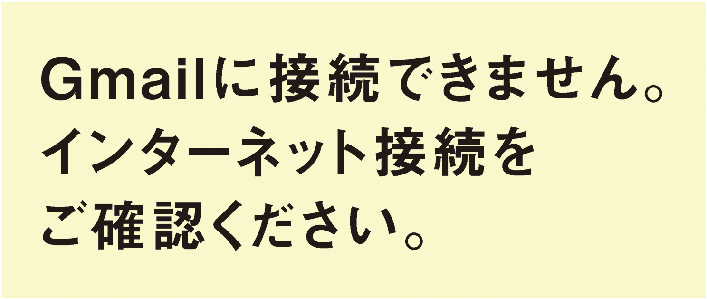
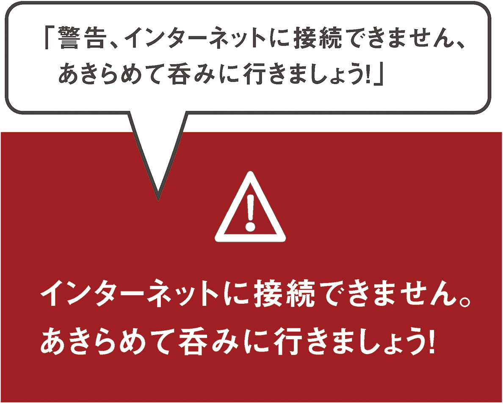

# 6-1 警告！

Web 開発会社のオフィスで起こりうる事態で火事よりも深刻なのは、おそらく、Webに接続できなくなることでしょう。確かに、私がオンラインアプリケーションを使って作業しているとしたら、アプリケーションの動作が通常と異なる場合にはそのことを把握し、おそらくはデータをきちんと保存しようとするはずです。

同じ理由から、Gmailにはユーザーがオフラインになったときには必ず警告する機能があります。[Marco Zehe（マルコ・ツィーエ）の2008年のブログ記事](http://www.marcozehe.de/2008/08/04/aria-in-gmail-1-alerts/)にあるように、GoogleはARIAライブリージョンをいち早く採用しました。



ここでは、ユーザーがオンラインであるかどうかをテストし、オフラインの場合はARIAを使ってスクリーンリーダーユーザーに警告し、引き続き作業するか、呑みにでも出かけるかを選択してもらうというスクリプトを作成します。

## セットアップ

ライブリージョンに関して、ARIAは`role`属性と`aria-live`属性の両方で値を定義しています。これらの一部は機能が重複しており、スクリーンリーダーの中には`role`と`aria-live`のいずれかしかサポートしていないものがあるため、混乱を招くことがあります。ただし、解決方法があるので問題はありません。

最も基本的なレベルでは、メッセージには2つの共通タイプがあります。

1. 「これは大変重要な情報ですが、現在の作業内容に関わらず、あなたの作業が終わるまでお待ちしてからお伝えします」
2. 「すべての作業を中止してください！　今すぐにこの情報を確認しないと大変なことになります。ぬわーーっっ！」

それぞれを`role`および`aria-live`属性に当てはめると、これらの共通タイプは以下のように記述されます。

1. 「これは大変重要な情報ですが、現在の作業内容に関わらず、あなたの作業が終わるまでお待ちしてからお伝えします」（`aria-live="polite"`または`role="status"`）
2. 「すべての作業を中止してください！　今すぐにこの情報を確認しないと大変なことになります。ぬわーーっっ！」（`aria-live="assertive"`または`role="alert"`）

独自のライブリージョンをマークアップする場合は、最大限の互換性をもたせるために、同等の属性と値を2つとも指定します。なぜなら、ユーザーエージェントの中には残念ながら同等の属性のどちらかをサポートしていないものがあるからです。ライブリージョンに関する詳細は、[Mozillaのドキュメント](https://developer.mozilla.org/en-US/docs/Accessibility/ARIA/ARIA_Live_Regions)を参照してください。

インターネット接続が失われるというのは大問題ですので、積極的な方の属性値を使います。

```
<div id="message" role="alert" aria-live="assertive" class="online">
	<p>現在オンラインです。</p>
</div>
```

上のコード自体は何も警告していません。アラートが発生するのは、ライブリージョンのコンテンツが動的に変更されている場合です。

一方、次のページのスクリプトは、**test_resource.html**をロードできるかどうかのチェックを3秒ごとに実行します。ロードできなかった場合や、ロードに失敗した後にロードできた場合は、このライブリージョンの`class`値を更新し、文の記述を変更します。予期に反してオフラインになった場合は、次のようなメッセージが表示されます。`<p>インターネットに接続できません。あきらめて呑みに行きましょう！</p>`

変更が発生すると、その時点でページ上で読み上げられているものが何であれ、それに割り込んで`#message`ライブリージョンの内容がアナウンスされます。

```
// オフラインになった場合に実行する関数
var offline = function() {
	if (!$('#message').hasClass('offline')) {
		$('#message') // [role="alert"]かつ[aria-live="assertive"]である要素
			.attr('class', 'offline')
			.text('インターネットに接続できません。あきらめて呑みに行きましょう！');
	}
}

// オンラインに戻った場合に実行する関数
var online = function() {
	if (!$('#message').hasClass('online')) {
		$('#message') // [role="alert"]かつ[aria-live="assertive"]である要素
		.attr('class', 'online')
		.text('現在オンラインです。');
	}
}

// ファイルをポーリングして確認
function testConnection(url) {
	var xmlhttp = new XMLHttpRequest();
	xmlhttp.onload = function() {
		online();
	}
	xmlhttp.onerror = function() {
		offline();
	}
	xmlhttp.open("GET",url,true);
	xmlhttp.send();
}

// ループして3秒ごとに「test_resource.html」を確認
function start() {
	rand = Math.floor(Math.random()*90000) + 10000;
	testConnection('test_resource.html?fresh=' + rand);
	setTimeout(start, 3000);
}

// 最初のテストを開始
start();
```



[offline.js](http://github.hubspot.com/offline/docs/welcome/)という専用のスクリプトを使って、アプリケーションがオンラインであるかどうかをより包括的にテストする方法もありますが、ここでは話の流れから短いほうのスクリプトを紹介しました。一部のスクリーンリーダーではアナウンスの前に「警告！」と付加されることがあるので、**よほど重要な情報である場合**以外は、実際のテキストには「警告」という単語を使わないほうが良いでしょう。

[このサンプルのデモ](http://heydonworks.com/practical_aria_examples/#offline-alert)を確認してください。

## test.css

ライブリージョンがブラウザや支援技術の種類に依存しないように、最大限の互換性をもたせたいものです。**test.css**にルールを追加して、次のように、同等の属性がすべて含まれるようにしましょう。

```
[role="status"]:not([aria-live="polite"]),
[role="alert"]:not([aria-live="assertive"]) {
	content: '警告：より広範なサポートを提供するために、aria-live属性を使って、ライブリージョンにポライトネスを追加しましょう';
}
[aria-live="polite"]:not([role="status"]),
[aria-live="assertive"]:not([role="alert"]) {
	content: '警告：より広範なサポートを提供するために、aria-liveのポライトネス設定に対応したロールを追加しましょう';
}
```
