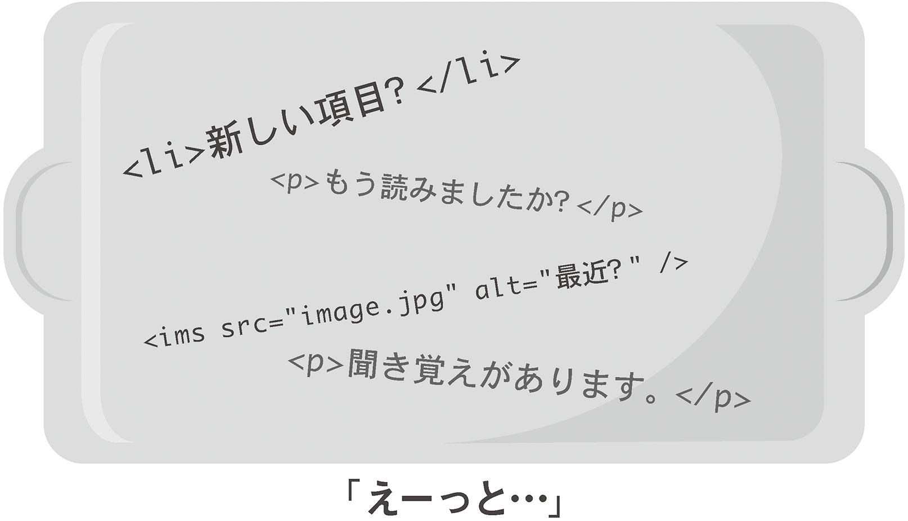
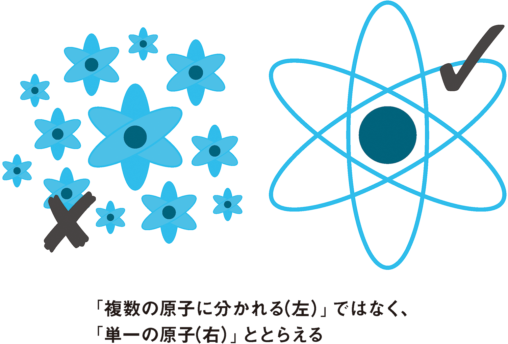
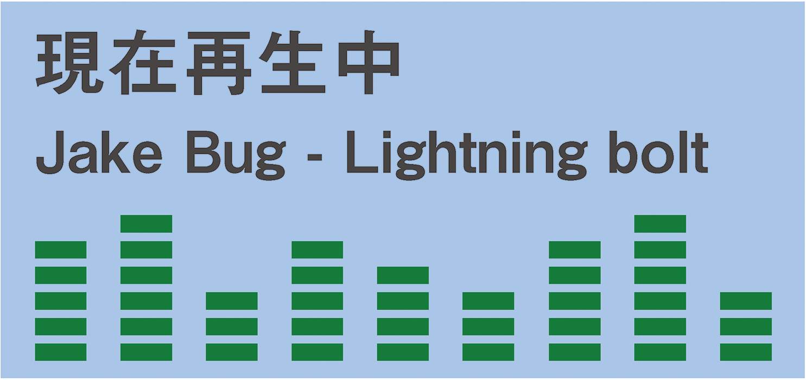

# 6-2 全体像を見せる

>コンテクストがなかったら、私はよほど奇妙に見えるだろう<br>
̶ Ani DiFranco（アーニー・ディフランコ）「Fire Door」より



デフォルトでは、ライブリージョンのコンテンツが変更された場合は、実際に変更されるノード（ここではHTMLの要素）だけがアナウンスされます。

ごくわずかな変更である場合に大量のコンテンツを読み直す必要はないので、このような動作は合理的です。すべてが一度に読み出されるとしたら、どこが変更されたのかをどのようにして知ることができますか？　それは、トレイに載っている物を記憶しておいて、なくなった物を言い当てる記憶ゲームのようなものかもしれません。

しかし、場合によっては、若干のコンテクストがあったほうが解明しやすいこともあります。そんな時に使うのが`aria-atomic`属性です。

`aria-atomic`を設定しない場合や`aria-atomic`を`false`に設定した場合は、実際に変更された要素だけがユーザーに通知されます。`aria-atomic`を`true`に設定した場合は、`aria-atomic`が設定されている要素の全コンテンツが読み出されます。

`atomic`という言葉に惑わされないようにしてください。`true`に設定すると、この要素のコンテンツは1つの不可分な物質（単一の原子）として扱われます。小さな破片（複数の原子）に分解されるのではありません。原子を指す`atomic`という言葉がふさわしいと思うかどうかはさておき、期待される動作が重要です。ここでの定義は前者（単一の原子として扱う）です。



Gez Lemon（ゲズ・レモン）が[`aria-atomic`のすばらしいサンプル](http://juicystudio.com/article/wai-aria_live-regions_updated.php)を提供してくれています。このサンプルでは、現在再生されている曲の曲名が表示されるミュージックプレイヤーが埋め込まれています。

```
<div aria-live="polite" role="status" aria-atomic="true">
	<h3>現在再生中：</h3>
	<p>Jake Bugg - Lightning Bolt</p>
</div>
```

変更されるのはアーティスト名と曲名のみですが、`aria-atomic`が`true`に設定されているので、リージョン全体（「現在再生中：Jake Bugg - Lightning Bolt」）が毎回読み出されます。コンテクスト上、「現在再生中」という表示は重要です。

ライブリージョンのポライトネス設定は`polite`であり、**test.css**で例示した`assertive`ではないことに注意してください。ユーザーがほかの何かを読んでいたりキー入力を行っていたりする場合には、ユーザーがその動作を止めるまで通知を待機します。ユーザーの操作を妨げるほどの重要性はありません。ユーザー自身のプレイリストであり、おそらくすべての曲の曲名を知っているはずだからです。



Gez Lemonのサンプルにあるように、`aria-atomic`属性を使用する要素はライブリージョンを定義しているものと同一である必要はありません。たとえば、同一リージョン内の個別の子要素で`aria-atomic`を使うこともできます。仕様では以下のようになっています。

>ライブリージョンのコンテンツが変更されたとき、ユーザーエージェントは変更された要素の祖先を辿って`aria-atomic`が最初に設定された要素を探し出し、適切な動作を適用しなくてはなりません。<br>
̶ [Supported States and Properties（サポートされるステートおよびプロパティ）](http://www.w3.org/TR/wai-aria/states_and_properties#aria-atomic)

ライブリージョン内にもう1ブロックを追加すれば、次の曲を表示することもできます。

```
<div aria-live="polite" role="status">

	<div aria-atomic="true">
		<h3>現在再生中：</h3>
		<p>Jake Bugg - Lightning Bolt</p>
	</div>

	<div aria-atomic="true">
		<h3>次の曲：</h3>
		<p>Napalm Death - You Suffer</p>
	</div>

</div>
```

さて、Jake Bugg（ジェイク・バグ）の「Lightning Bolt」が終わりに近づいたら、「次の曲：」ブロックの`<p>`を「次の曲：Napalm Death ̶ You Suffer」に変更し、Napalm Death（ナパーム・デス）の出番であることをユーザーに知らせます。Napalm Deathの演奏が始まったら「現在再生中：」ブロックのクレジットを変更して、次にユーザーからの視線を受けた時に、聞こえてくるノイズがNapalm Deathによるものだということをユーザーに思い出させます。

## aria-busy

Napalm Deathの「You Suffer」を例にしたのはちょっとした冗談です（笑）。この曲は世界で一番短い曲（1.316秒）として認定されており、ライブリージョンが曲名を告げる前に終わってしまいます。すべての曲がこれほど短いとすると、アプリケーションは大忙しですね。

ライブリージョンに対する複雑な変更が数多く行われ、ユーザーが結果を理解する前に次の変更が行われてしまうような場合は、[`aria-busy`属性](http://www.w3.org/TR/wai-aria/states_and_properties#aria-busy)を使用します。この属性は、ライブリージョンの更新によってビジーである間は`true`に設定され、更新が終わると`false`に戻ります。JavaScriptアプリケーションでアセットのロード中にスピナーが表示されるのと同じようなものです。


通常はライブリージョンの最初の要素（または追加要素）がロードまたは変更される前に`aria-busy="true"`を設定し、最後の要素まで終わったときに`false`に戻します。ミュージックプレイヤーの例で言うと、10秒ほどのタイムアウトを設定して、曲のアナウンスにかかる時間よりも再生時間が長いトラックだけがアナウンスされるようにします。

```
$('#music-info').attr('aria-busy', 'true');

// ここでアーティスト名と曲名を更新し…

setTimeout(function() {
	$('#music-info').attr('aria-busy', 'false');
}, 10000);
```
