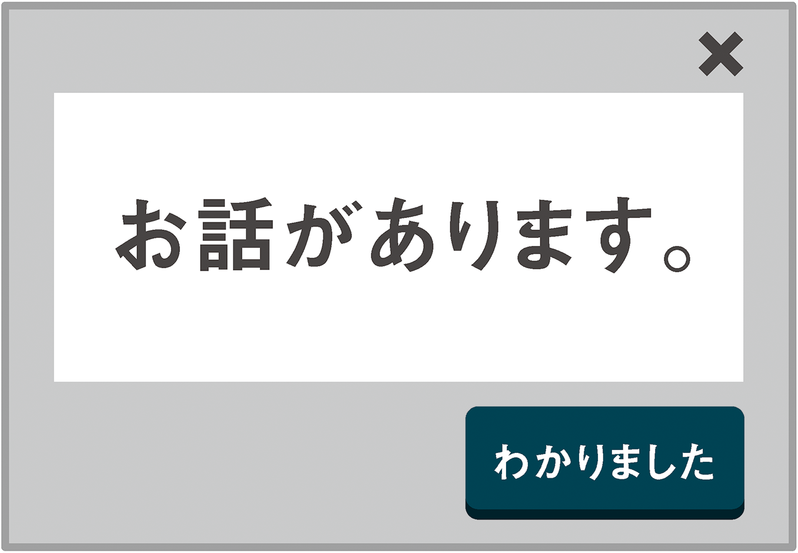
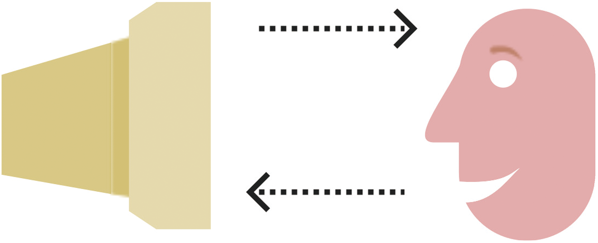
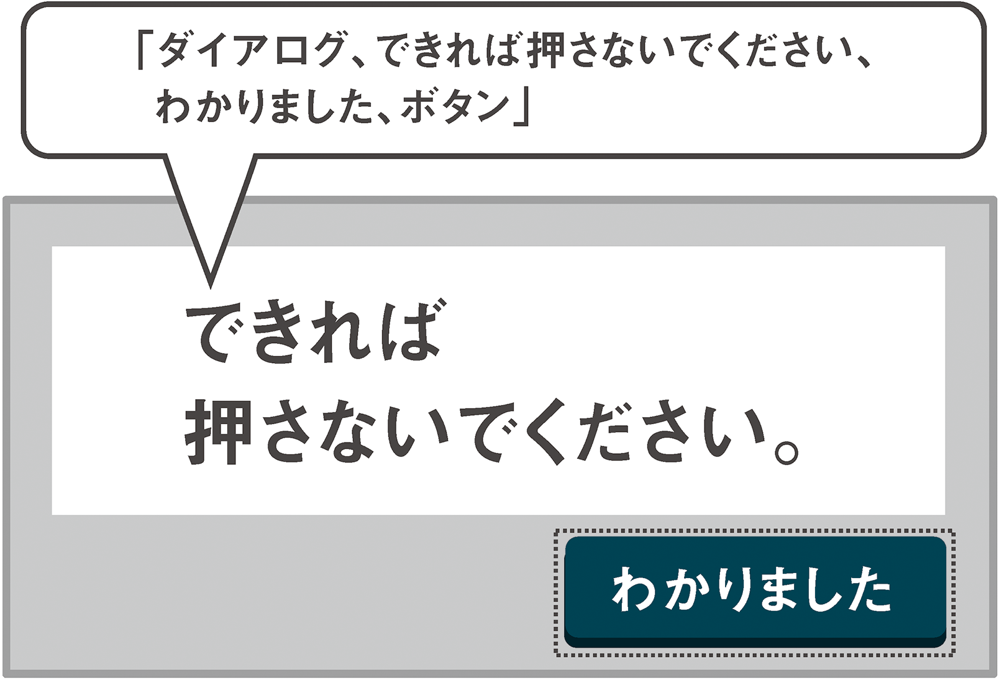
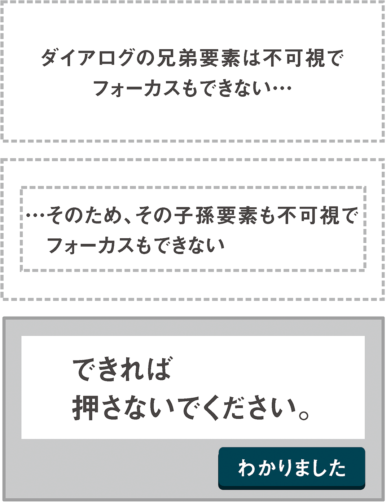

# 6-3 ダイアログ

世界中のアクセシビリティエンジニアやアクセシビリティエバンジェリストは、ダイアログを使ったWebアプリケーションの提案にすくみ上がっています。恐怖のカルーセル（脚注10）と同様に、ダイアログは1人ひとりのユーザーにとって使いやすいものにするためには十分な検討が必要なユーザーインターフェイスです。

>ダイアログ：複数の人物の間で交わされる会話。また、人とほかの何か（コンピュータなど）との間で交わされる類似したやりとり。<br>
― Merriam-Websterの定義（脚注11）



カルーセルとは異なり、ダイアログはデスクトップアプリケーションおよびWebアプリケーションの設計において回避することのできない重要なパターンです。その名が表す通り、ダイアログはユーザーとアプリケーションの間で合意が得られなければそれ以上の処理が進められない局面に登場します。ダイアログは次のいずれかに属します。

- 処理を続けるうえでユーザーが知っておくべき情報を提供する
- 分かれ道（処理を進めるうえで行うべきアクションを選択させる）

ここでは、単純化するために、アクセシブルな警告ダイアログを作成するために必要な一連の技術を考察していきます。そのためには、本書でこれまでに紹介したセマンティックなHTML、ロール、プロパティ、ステートといったすべての要素を（単純化した形で）使いながら、同時にコントロールのフォーカスを巧妙に管理および提示する必要があります。

## 要点

ダイアログは事前に用意しておく必要はなく、前述した「合意が必要な局面」になった時点で動的に構築します。こうすることで、柔軟性をもたせ、ページから余分なマークアップを排除することができます。また、ダイアログを呼び出すという行為によって支援技術がダイアログを新しいライブコンテンツとして認識し、優先的に処理するようにもなります。

ここで質問です。ダイアログに欠かせないパーツとはいったい何でしょうか？



本来の意味のダイアログ（対話）は、2つの要素で構成されます。すなわち、ある人（この場合はコンピュータ）の言い分と、それに対する相手の応答です。ダイアログパターンを再利用可能なものにするために、HTML5のカスタムデータ属性（`data-dialog-call`および`data-dialog-response`）にこれら2つの変数を格納し、ダイアログを呼び出す任意のボタンコントロールに割り当てます。`data`属性（脚注12）の利点は、プライベートなストレージとして使えることです。`<div>`要素と同じように、`data`属性の意味はユーザーには通知されません。ユーザーに伝わるとなると、不要なノイズを作成していることになります。

## セットアップ

Chapter 2「ボタンのすべて」で取り上げたビッグレッドボタンを覚えていますか？　警告ダイアログのトリガーとして使いましょう。いずれにしろビッグレッドボタンを押しても何も良いことはありませんし、おそらくはユーザーも（それが誰であれ）そのことに気づいていることでしょう。

```
<button class="big-red" data-dialog-call="できれば押さないでください" data-dialog-response="わかりました">ビッグレッドボタン</button>
```

### <dialog>要素

すぐにわかることですが、アクセシブルなWebベースのダイアログを作ることは、簡単ではありません。注意すべきことも、失敗しやすいポイントも数多くあります。そのようなダイアログを作るための使いやすいプログラミングインターフェイスの仕様が現在策定されている理由もそこにあります。

`<dialog>`とこの要素に関連する属性とメソッドを使ってダイアログを標準仕様に準拠させることは、試用版のChrome CanaryブラウザおよびChrome（バージョン25以降）ですでに可能となっています（脚注13）。試用版のWebプラットフォームの機能を有効にすれば、`HTMLDialogElement`インターフェイスの一部として以下のメソッドを利用できます。

- `show()`：基本的なダイアログを表示します。
- `showModal()`：警告に似たダイアログを表示し、ユーザーがページ上のほかの要素とのインタラクションを行えないようにします。
- `close()`：ダイアログをきちんと閉じるためのメソッドです。

標準化が明確になるにつれて、ダイアログの作り方について考え直す必要はなくなるはずです。ただし、これはまだ実際の環境で使用できるインターフェイスではなく、ユーザーの動作を実際にどのように処理するかについては、まだ盛んに議論（脚注14）されている段階です。

さしあたり、少なくともHTML5 shiv（脚注15）を介して、既知の要素として`<dialog>`要素を使ってダイアログを登録することはできます。さらに、CSSを適用することによって`open`属性をシミュレーションすることができます。次のスクリプトでは、`open`属性によって表示、非表示を直接切り替えています。

```
dialog {
	display: none;
}
dialog[open] {
	display: block;
}
```

### ダイアログの構築

すでに説明した通り、ここではひとり立ちの途中にある`<dialog>`要素を使って、動的にダイアログを構築します。トリガーの`click`関数と同時にスクリプトが実行されると、`<dialog>`は以下のように拡張されます。

```
<dialog tabindex="0" open role="alertdialog" aria-describedby="d-message">
	<div>
		<div>
			<p id="d-message">できれば押さないでください</p>
			<button>わかりました</button>
		</div>
	</div>
</dialog>
```

- `role="alertdialog"`ネイティブの`<dialog>`セマンティクスを上書きし、警告またはエラー用のダイアログとして定義します。標準ダイアログは単に`dialog`ロールを担います。`alertdialog`ロールは`alert`に関連づけられた特殊なライブリージョン（脚注16）です。
- `open`は、ダイアログが開かれているかどうかを示す単純なブール型属性です。
- `tabindex="0"`を設定すると、`<dialog>`にフォーカスできます。ダイアログが表示された時点ではフォーカスは閉じるボタンにありますが、ダイアログ自体にフォーカスできるようにすることで、ユーザーはメッセージと閉じるボタンを切り替えて、必要に応じて繰り返し読むことができます。
- `aria-describedby="d-message"`は、ダイアログのメッセージとダイアログを関連づけて、`<dialog>`がフォーカスされるたびにメッセージが読まれるようにします。


フリーのNVDAスクリーンリーダーを使ってこのダイアログを開くと、「ダイアログ、できれば押さないでください、わかりました、ボタン」と読み上げられます。

つまり、ダイアログが表示された理由と意図、および最後に承諾するという唯一の選択肢がアナウンスされます。もちろん、選択肢が1つしかないダイアログばかりではありませんが、ここではできるだけ単純化しておきましょう。

## フォーカスの難問

繰り返しになりますが、ユーザーのフォーカスを管理することは、アクセシブルなアプリケーション設計において最も難しく、重要な側面のひとつです。モーダルダイアログの場合はなおさらです。

以下の3つのポイントに注意する必要があります。

1. モーダルダイアログが開いている間は、ユーザーはその他の要素とインタラクションを行うことはできない。
2. ユーザーのフォーカスをダイアログの中に閉じ込めてはならない。ブラウザのアドレスバーやページ外部のその他のコントロールに、ユーザーがフォーカスを移動できるようにしなくてはならない。
3. ダイアログを呼び出した要素がある場合は、ダイアログを閉じるときにその要素にフォーカスを戻し、ユーザーが元の操作を続行できるようにしなくてはならない。

上記すべてに関わるちょっとした難問は、ダイアログを除いたページ上のすべてのコンテンツはフォーカス可能なようにできていることです。まず、フォーカスの対象となりうる要素の種類をすべて挙げてみましょう。CSSセレクタとして書くと、次のようになります。

- a[href]
- button:not([disabled])
- [tabindex]:not([tabindex="-1"])

このほかに、すべてのフォーム関連要素も含まれます。

ノースカロライナ州立大学のブログ記事「The Incredible Accessible Modal Dialog（とてつもなくアクセシブルなモーダルダイアログ）（脚注17）」では、Greg Krauss（グレッグ・クラウス）がこれらのすべての要素を識別し、フォーカスできないものとして表示し、ダイアログが閉じられたときには再び元の状態に戻せるようにそれぞれをメモリ内に格納する方法を説明しています。

このままではあまり効率が良くないので、それぞれの要素にマーカーとなる属性を追加しておき、このマーカーと一致する要素だけをフォーカス可能に戻すほうが良いでしょう。

```
<a href="http://www.google.com" tabindex="-1" datamodal-unfocused></a>
```

さらに面倒なことに、これらの要素がスクリーンリーダーでも読まれないようにする必要がある、ということに注意する必要があります。つまり、スクリーンリーダーに対して隠しておかない限り、ユーザーはダイアログを抜け出してページ内の他のコンテンツを読み続けることができてしまいます。

ほとんどの最新のスクリーンリーダーに対しては、`aria-hidden`ステートを使ってページのコンテンツを隠すことができるので、ここではダイアログ以外のすべてのコンテンツに`aria-hidden="true"`を設定します。

ただしそれだけでは、残念ながらキーボードを使って要素にフォーカスすることはできてしまうので、キーボードによるフォーカスについては別途コントロールする必要があります。作業量が多くなりそうですね。もっと簡単な方法はないでしょうか？

### visibility:hiddenを使った方法

本書ではこれまでに、スクリーンリーダーが特定のCSSスタイルをいかに巧みに（巧みすぎる場合もあります）理解するかを取り上げてきました。`display:none`または`visibility:hidden`を使って隠した要素が、表示からも読み出しからも同じように隠される仕組みを説明しました。

`visibility:hidden`または`display:none`を使って隠した要素はフォーカスできず、キーボードによるナビゲーションもできなくなります。私たちのするべきことは、ページのコンテンツの中でダイアログに含まれていないものを見分け、`visibility:hidden`を設定した`class`属性をつけることです（`display: none`ではなく`visibility:hidden`を使うのは、要素の配置を保持するためです。何ひとつ動かしてはなりません）。

以下のjQueryのワンライナーは、`<dialog>`の兄弟にあたるすべての要素に`mod-hidden`クラスを追加し、それらの子孫も含めて丸ごと隠します。これが機能するためには、`<dialog>`が`<body>`の直接の子要素になっている必要があります。そのようにマークアップしておきましょう。

```
$('body > *:not(dialog)').addClass('mod-hidden');
```



### わなを仕掛けろ！

ユーザーが気づかないうちにダイアログから抜けだして、ページのほかの部分とのインタラクションを行わないように、ダイアログ内のフォーカス可能な最後の要素で<kbd>Tab</kbd>キーが押されたときにはダイアログ自体にフォーカスが戻るようにします。具体的には、閉じるボタンの`keydown`ハンドラーを上書きします。

```
close.on('keydown', function(e) {
	if ((e.keyCode || e.which) == 9) {
		dialog.focus();
		e.preventDefault();
	}
});
```

実装次第では、ダイアログ要素で<kbd>Shift + Tab</kbd>キーを押すと閉じるボタン（またはダイアログ内のフォーカス可能な最後の要素）にフォーカスが戻ることでしょう。ただ、このフォーカスループを作成することによってユーザーはダイアログから出ることができなくなるので、ページを離れること自体も難しくなります。

次の例では、<kbd>Shift + Tab</kbd>キーを押すとブラウザのアドレスバーに移動できるようにして、逃げ道を与えます。

## クローズ関数

「わかりました」ボタンは、`closeDialog()`などの関数を実行して、ダイアログを閉じ、生成したすべてのマークアップを削除します。<kbd>Esc</kbd>キーを押した場合にも同じ結果になるようにすべきです。この機能は、「ARIAプラクティス」においてダイアログに実装するべきだとされています（脚注18）。

```
$(dialog).on('keypress.escape', function(e) {
	if (e.keyCode == 27) {
		closeDialog();
	}
});
```
ダイアログを閉じるためには`open`属性を単に取り除けば良いのですが、`<dialog>`を今後起動するダイアログのシンプルなプレースホルダーにしなくてはならないため、その他の属性もすべて必ず取り除きます。

そして重要なのは、ダイアログが最初に開いたときにフォーカスされていた要素にフォーカスを戻すことです。トリガー要素の`id`を使って、その要素を識別します（もしidがなければ、テンポラリのidを作成して付与します）。

```
var trigger = $(this).attr('id') ? $(this).attr('id') : 'origin';
```

---

### 訳注

トリガーとなる要素にidがなかったときには、上記の処理に加え、要素にテンポラリな`id`（上記コードでは'`origin`'）をつける処理も必要です。

---

そして、ダイアログを閉じるプロセスの最後で、フォーカスをこの要素に戻します。

```
$('#' + trigger).focus();
```

この方法には、スクリーンリーダーユーザーとキーボードユーザーに影響する2つのメリットがあります。

1つは、ビッグレッドボタンのフォーカススタイルを復活させることで、フォーカスの存在を確認でき、フォーカスがビューポートの外部に移動していた場合でも元の位置に戻せることです。2つめは、フォーカスが戻ったことがコンテクスト内でアナウンスされることです。

このダイアログサンプルのデモページ（脚注19）では、ページのタイトルがアナウンスされ、続いてランドマーク位置（メイン）、さらにボタンテキストがアナウンスされます。短いセンテンスの中で、ユーザーは自身の位置を割り出すことができます。



警告は表示されましたね？　ボタンを押さないようにしましょう。

それにしても、いったいぜんたい、どういう理由でこんな大きな赤いボタンを作ったんでしょうね。

- 脚注10：http://www.creativebloq.com/accessibility-expert-warns-stop-using-carousels-7133778
- 脚注11：http://www.merriam-webster.com/dictionary/dialogue
- 脚注12：http://ejohn.org/blog/html-5-data-attributes/
- 脚注13：http://blog.teamtreehouse.com/a-preview-of-the-new-dialog-element
- 脚注14：http://lists.w3.org/Archives/Public/public-html-bugzilla/2013Sep/0357.html
- 脚注15：https://github.com/aFarkas/html5shiv/blob/master/src/html5shiv.js
- 脚注16：http://www.w3.org/TR/wai-aria-practices/#chobet
- 脚注17：http://accessibility.oit.ncsu.edu/blog/2013/09/13/the-incredible-accessible-modal-dialog/
- 脚注18：http://www.w3.org/WAI/PF/aria-practices/#dialog_modal
- 脚注19： http://heydonworks.com/practical_aria_examples/#warning-dialog
