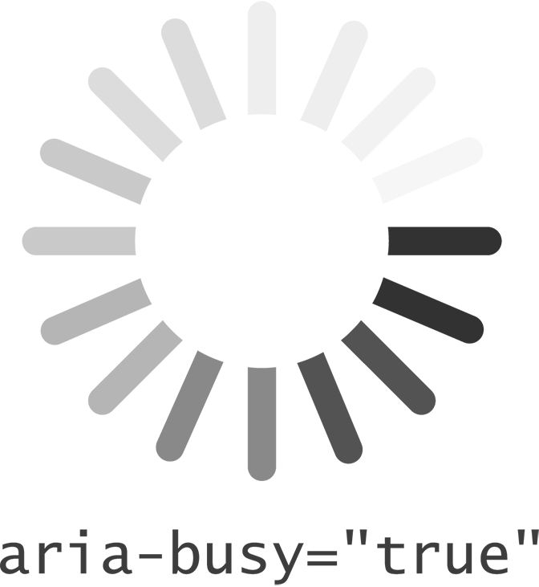

# Chapter 6 生きてる！生きてる！
フランケンシュタインの名セリフ「It's Alive! - 生きてる、生きてる! 」じゃないですが、ユーザーとコンテンツの対話に欠かせない「ライブリージョン」や「ダイアログ」の実装を解説します。

- [6-1 警告！](bodymatter_6_2.xhtml)
- [6-2 全体像を見せる](bodymatter_6_3.xhtml)
- [6-3 ダイアログ](bodymatter_6_4.xhtml)

=======================================

こんなシーンを思い浮かべてみてください。あなたはロンドンの豪華な事務所で働く有能なフロントエンドエンジニアのひとりです。普段と何も変わらないある日、あなたは職場の席でアーチ状に並べたモニターに囲まれて拡張デスクトップに向かい、MegaDigiSpaceHub社の大規模な開発案件で夢中になってCSSを記述していました。

あなたはまだ気がついていませんが、すぐ下のフロアで火事が起こりました。「モバイルストラテジスト」が無意識のうちに発生させた炎上が原因です。ポストモダン風の洒落た装飾に注ぎ込んだせいで予算が足りず、火災警報器は設置されていません。オフィスを走りまわって各部署に火事が起きたことを直接知らせるのは、フロアマネージャーの役目です。

彼は音も立てず部屋に入り、12ptのArialで「火事です」と書いた名刺サイズのカードを3秒ほど掲げては次の部屋へと向かいました。あなたも同僚も、モニターに囲まれているので、彼が部屋に入ってきたことにすら気がつきません。

本書はおおよそ、Webサイトとアプリケーションをアクセシブルにする方法をテーマにしています。つまり私たちの関心は、誰もがWebサイトやアプリケーションを簡単に使えるようにすることにあります。しかし、何かが行われる（または起こる）ときには、その結果として他の何かも起こるであろうことを認識することが重要です。「作用あるところ反作用あり」です。

>物体1が別の物体2に対して力を及ぼすとき、物体2は物体1に対して大きさが同じで向きが反対の力を及ぼす。  
̶ [ニュートンの運動の第3法則（Wikipedia「Newton's laws of motion」より）](http://en.wikipedia.org/wiki/Newton%27s_laws_of_motion)

ユーザーが行った操作の結果や、計算の結果、あらゆる種類の有益な情報の挿入など、ユーザーにフィードバックを提供することは、アプリケーションデザインの一部として重要です。対処が必要な問題は、画面にメッセージを表示する視覚的な割り込みが、音もなく出現することです。また、ダイアログが立ち上がる際、ユーザーのフォーカス位置からは大きく離れた、ドキュメントのまったく異なるところのDOMノードがアクティブになることも問題です。

これらの問題に対処しながらメッセージを確実にユーザーに届けるために、ARIAには[ライブリージョン](https://developer.mozilla.org/en-US/docs/Accessibility/ARIA/ARIA_Live_Regions)が用意されています。名前からもわかるように、ライブリージョンとは、アプリケーションを使っているうちに変更される可能性のあるコンテンツをもった要素です。ライブリージョンは生き物のようなものであり、いつまでも現状を維持しているわけではありません。適切なARIA属性を割り当てることで、ライブリージョンは自身が変更されたときにユーザーの操作に割り込んで通知を行います。

この章ではさまざまなライブリージョンのロールやその他の関連する属性を見ていきます。多くの場合、これらにはユーザーが行った操作に対するフィードバックが関連します。また、ユーザーが求めてはいなくても、（最初の例の火事の時のように）何らかの形で知っておくべき変更について警告する方法も取り上げます。

=======================================

## 6-1 警告！

Web開発会社のオフィスで起こりうる事態で火事よりも深刻なのは、おそらく、Webに接続できなくなることでしょう。確かに、私がオンラインアプリケーションを使って作業しているとしたら、アプリケーションの動作が通常と異なる場合にはそのことを把握し、おそらくはデータをきちんと保存しようとするはずです。

同じ理由から、Gmailにはユーザーがオフラインになったときには必ず警告する機能があります。[Marco Zehe（マルコ・ツィーエ）の2008年のブログ記事](http://www.marcozehe.de/2008/08/04/aria-in-gmail-1-alerts/)にあるように、GoogleはARIAライブリージョンをいち早く採用しました。

ここでは、ユーザーがオンラインであるかどうかをテストし、オフラインの場合はARIAを使ってスクリーンリーダーユーザーに警告し、引き続き作業するか、呑みにでも出かけるかを選択してもらうというスクリプトを作成します。

### セットアップ

ライブリージョンに関して、ARIAは`role`属性と`aria-live`属性の両方で値を定義しています。これらの一部は機能が重複しており、スクリーンリーダーの中には`role`と`aria-live`のいずれかしかサポートしていないものがあるため、混乱を招くことがあります。ただし、解決方法があるので問題はありません。

最も基本的なレベルでは、メッセージには2つの共通タイプがあります。

1. 「これは大変重要な情報ですが、現在の作業内容に関わらず、あなたの作業が終わるまでお待ちしてからお伝えします」
2. 「すべての作業を中止してください！　今すぐにこの情報を確認しないと大変なことになります。ぬわーーっっ！」

それぞれを`role`および`aria-live`属性に当てはめると、これらの共通タイプは以下のように記述されます。

1. 「これは大変重要な情報ですが、現在の作業内容に関わらず、あなたの作業が終わるまでお待ちしてからお伝えします」（`aria-live="polite"`または`role="status"`）
2. 「すべての作業を中止してください！　今すぐにこの情報を確認しないと大変なことになります。ぬわーーっっ！」（`aria-live="assertive"`または`role="alert"`）

独自のライブリージョンをマークアップする場合は、最大限の互換性をもたせるために、同等の属性と値を2つとも指定します。なぜなら、ユーザーエージェントの中には残念ながら同等の属性のどちらかをサポートしていないものがあるからです。ライブリージョンに関する詳細は、[Mozillaのドキュメント](https://developer.mozilla.org/en-US/docs/Accessibility/ARIA/ARIA_Live_Regions)を参照してください。

インターネット接続が失われるというのは大問題ですので、積極的な方の属性値を使います。

<pre class="sourceCode html"><code class="sourceCode html">&lt;div id=&quot;message&quot; role=&quot;alert&quot; aria-live=&quot;assertive&quot; class=&quot;online&quot;&gt;
    &lt;p&gt;現在オンラインです。&lt;/p&gt;
&lt;/div&gt;</code></pre>

上のコード自体は何も警告していません。アラートが発生するのは、ライブリージョンのコンテンツが動的に変更されている場合です。

一方、次のページのスクリプトは、**test_resource.html**をロードできるかどうかのチェックを3秒ごとに実行します。ロードできなかった場合や、ロードに失敗した後にロードできた場合は、このライブリージョンの`class`値を更新し、文の記述を変更します。予期に反してオフラインになった場合は、次のようなメッセージが表示されます。`
インターネットに接続できません。あきらめて呑みに行きましょう！
`

変更が発生すると、その時点でページ上で読み上げられているものが何であれ、それに割り込んで`#message`ライブリージョンの内容がアナウンスされます。

<pre class="sourceCode javascript"><code class="sourceCode javascript">// オフラインになった場合に実行する関数
var offline = function() {
    if (!$(&#39;#message&#39;).hasClass(&#39;offline&#39;)) {
        $(&#39;#message&#39;) // [role=&quot;alert&quot;]かつ[aria-live=&quot;assertive&quot;]である要素
            .attr(&#39;class&#39;, &#39;offline&#39;)
            .text(&#39;インターネットに接続できません。あきらめて呑みに行きましょう！&#39;);
    }
}

// オンラインに戻った場合に実行する関数
var online = function() {
    if (!$(&#39;#message&#39;).hasClass(&#39;online&#39;)) {
        $(&#39;#message&#39;) // [role=&quot;alert&quot;]かつ[aria-live=&quot;assertive&quot;]である要素
        .attr(&#39;class&#39;, &#39;online&#39;)
        .text(&#39;現在オンラインです。&#39;);
    }
}

// ファイルをポーリングして確認
function testConnection(url) {
    var xmlhttp = new XMLHttpRequest();
    xmlhttp.onload = function() {
        online();
    }
    xmlhttp.onerror = function() {
        offline();
    }
    xmlhttp.open(&quot;GET&quot;,url,true);
    xmlhttp.send();
}

// ループして3秒ごとに「test_resource.html」を確認
function start() {
    rand = Math.floor(Math.random()*90000) + 10000;
    testConnection(&#39;test_resource.html?fresh=&#39; + rand);
    setTimeout(start, 3000);
}

// 最初のテストを開始
start();</code></pre>

[offline.js](http://github.hubspot.com/offline/docs/welcome/)という専用のスクリプトを使って、アプリケーションがオンラインであるかどうかをより包括的にテストする方法もありますが、ここでは話の流れから短いほうのスクリプトを紹介しました。一部のスクリーンリーダーではアナウンスの前に「警告！」と付加されることがあるので、**よほど重要な情報である場合**以外は、実際のテキストには「警告」という単語を使わないほうが良いでしょう。

[このサンプルのデモ](http://heydonworks.com/practical_aria_examples/#offline-alert)を確認してください。

### test.css

ライブリージョンがブラウザや支援技術の種類に依存しないように、最大限の互換性をもたせたいものです。**test.css**にルールを追加して、次のように、同等の属性がすべて含まれるようにしましょう。

<pre class="sourceCode css"><code class="sourceCode css">[role=&quot;status&quot;]:not([aria-live=&quot;polite&quot;]),
[role=&quot;alert&quot;]:not([aria-live=&quot;assertive&quot;]) {
    content: &#39;警告：より広範なサポートを提供するために、aria-live属性を使って、ライブリージョンにポライトネスを追加しましょう&#39;;
}
[aria-live=&quot;polite&quot;]:not([role=&quot;status&quot;]),
[aria-live=&quot;assertive&quot;]:not([role=&quot;alert&quot;]) {
    content: &#39;警告：より広範なサポートを提供するために、aria-liveのポライトネス設定に対応したロールを追加しましょう&#39;;
}</code></pre>

=======================================

## 6-2 全体像を見せる

>コンテクストがなかったら、私はよほど奇妙に見えるだろう  
̶ Ani DiFranco（アーニー・ディフランコ）「Fire Door」より

デフォルトでは、ライブリージョンのコンテンツが変更された場合は、実際に変更されるノード（ここではHTMLの要素）だけがアナウンスされます。

ごくわずかな変更である場合に大量のコンテンツを読み直す必要はないので、このような動作は合理的です。すべてが一度に読み出されるとしたら、どこが変更されたのかをどのようにして知ることができますか？　それは、トレイに載っている物を記憶しておいて、なくなった物を言い当てる記憶ゲームのようなものかもしれません。

しかし、場合によっては、若干のコンテクストがあったほうが解明しやすいこともあります。そんな時に使うのが`aria-atomic`属性です。

`aria-atomic`を設定しない場合や`aria-atomic`を`false`に設定した場合は、実際に変更された要素だけがユーザーに通知されます。`aria-atomic`を`true`に設定した場合は、`aria-atomic`が設定されている要素の全コンテンツが読み出されます。

`atomic`という言葉に惑わされないようにしてください。`true`に設定すると、この要素のコンテンツは1つの不可分な物質（単一の原子）として扱われます。小さな破片（複数の原子）に分解されるのではありません。原子を指す`atomic`という言葉がふさわしいと思うかどうかはさておき、期待される動作が重要です。ここでの定義は前者（単一の原子として扱う）です。

Gez Lemon（ゲズ・レモン）が[`aria-atomic`のすばらしいサンプル](http://juicystudio.com/article/wai-aria_live-regions_updated.php)を提供してくれています。このサンプルでは、現在再生されている曲の曲名が表示されるミュージックプレイヤーが埋め込まれています。

<pre class="sourceCode html"><code class="sourceCode html">&lt;div aria-live=&quot;polite&quot; role=&quot;status&quot; aria-atomic=&quot;true&quot;&gt;
    &lt;h3&gt;現在再生中：&lt;/h3&gt;
    &lt;p&gt;Jake Bugg - Lightning Bolt&lt;/p&gt;
&lt;/div&gt;</code></pre>

変更されるのはアーティスト名と曲名のみですが、`aria-atomic`が`true`に設定されているので、リージョン全体（「現在再生中：Jake Bugg - Lightning Bolt」）が毎回読み出されます。コンテクスト上、「現在再生中」という表示は重要です。

ライブリージョンのポライトネス設定は`polite`であり、**test.css**で例示した`assertive`ではないことに注意してください。ユーザーがほかの何かを読んでいたりキー入力を行っていたりする場合には、ユーザーがその動作を止めるまで通知を待機します。ユーザーの操作を妨げるほどの重要性はありません。ユーザー自身のプレイリストであり、おそらくすべての曲の曲名を知っているはずだからです。

Gez Lemonのサンプルにあるように、`aria-atomic`属性を使用する要素はライブリージョンを定義しているものと同一である必要はありません。たとえば、同一リージョン内の個別の子要素で`aria-atomic`を使うこともできます。仕様では以下のようになっています。

>ライブリージョンのコンテンツが変更されたとき、ユーザーエージェントは変更された要素の祖先を辿って`aria-atomic`が最初に設定された要素を探し出し、適切な動作を適用しなくてはなりません。  
̶ [Supported States and Properties（サポートされるステートおよびプロパティ）](http://www.w3.org/TR/wai-aria/states_and_properties#aria-atomic)

ライブリージョン内にもう1ブロックを追加すれば、次の曲を表示することもできます。

<pre class="sourceCode html"><code class="sourceCode html">&lt;div aria-live=&quot;polite&quot; role=&quot;status&quot;&gt;

    &lt;div aria-atomic=&quot;true&quot;&gt;
        &lt;h3&gt;現在再生中：&lt;/h3&gt;
        &lt;p&gt;Jake Bugg - Lightning Bolt&lt;/p&gt;
    &lt;/div&gt;

    &lt;div aria-atomic=&quot;true&quot;&gt;
        &lt;h3&gt;次の曲：&lt;/h3&gt;
        &lt;p&gt;Napalm Death - You Suffer&lt;/p&gt;
    &lt;/div&gt;

&lt;/div&gt;</code></pre>

さて、Jake Bugg（ジェイク・バグ）の「Lightning Bolt」が終わりに近づいたら、「次の曲：」ブロックの`
`を「次の曲：Napalm Death ̶ You Suffer」に変更し、Napalm Death（ナパーム・デス）の出番であることをユーザーに知らせます。Napalm Deathの演奏が始まったら「現在再生中：」ブロックのクレジットを変更して、次にユーザーからの視線を受けた時に、聞こえてくるノイズがNapalm Deathによるものだということをユーザーに思い出させます。

### aria-busy

Napalm Deathの「You Suffer」を例にしたのはちょっとした冗談です（笑）。この曲は世界で一番短い曲（1.316秒）として認定されており、ライブリージョンが曲名を告げる前に終わってしまいます。すべての曲がこれほど短いとすると、アプリケーションは大忙しですね。

ライブリージョンに対する複雑な変更が数多く行われ、ユーザーが結果を理解する前に次の変更が行われてしまうような場合は、[`aria-busy`属性](http://www.w3.org/TR/wai-aria/states_and_properties#aria-busy)を使用します。この属性は、ライブリージョンの更新によってビジーである間は`true`に設定され、更新が終わると`false`に戻ります。JavaScriptアプリケーションでアセットのロード中にスピナーが表示されるのと同じようなものです。

通常はライブリージョンの最初の要素（または追加要素）がロードまたは変更される前に`aria-busy="true"`を設定し、最後の要素まで終わったときに`false`に戻します。ミュージックプレイヤーの例で言うと、10秒ほどのタイムアウトを設定して、曲のアナウンスにかかる時間よりも再生時間が長いトラックだけがアナウンスされるようにします。

<pre class="sourceCode javascript"><code class="sourceCode javascript">$(&#39;#music-info&#39;).attr(&#39;aria-busy&#39;, &#39;true&#39;);

// ここでアーティスト名と曲名を更新し…

setTimeout(function() {
    $(&#39;#music-info&#39;).attr(&#39;aria-busy&#39;, &#39;false&#39;);
}, 10000);</code></pre>

=======================================

## 6-3 ダイアログ

世界中のアクセシビリティエンジニアやアクセシビリティエバンジェリストは、ダイアログを使ったWebアプリケーションの提案にすくみ上がっています。[恐怖のカルーセル](http://www.creativebloq.com/accessibility-expert-warns-stop-using-carousels-7133778)と同様に、ダイアログは1人ひとりのユーザーにとって使いやすいものにするためには十分な検討が必要なユーザーインターフェイスです。

>ダイアログ：複数の人物の間で交わされる会話。また、人とほかの何か（コンピュータなど）との間で交わされる類似したやりとり。  
― [Merriam-Websterの定義](http://www.merriam-webster.com/dictionary/dialogue)

カルーセルとは異なり、ダイアログはデスクトップアプリケーションおよびWebアプリケーションの設計において回避することのできない重要なパターンです。その名が表す通り、ダイアログはユーザーとアプリケーションの間で合意が得られなければそれ以上の処理が進められない局面に登場します。ダイアログは次のいずれかに属します。

- 処理を続けるうえでユーザーが知っておくべき情報を提供する
- 分かれ道（処理を進めるうえで行うべきアクションを選択させる）

ここでは、単純化するために、アクセシブルな警告ダイアログを作成するために必要な一連の技術を考察していきます。そのためには、本書でこれまでに紹介したセマンティックなHTML、ロール、プロパティ、ステートといったすべての要素を（単純化した形で）使いながら、同時にコントロールのフォーカスを巧妙に管理および提示する必要があります。

### 要点

ダイアログは事前に用意しておく必要はなく、前述した「合意が必要な局面」になった時点で動的に構築します。こうすることで、柔軟性をもたせ、ページから余分なマークアップを排除することができます。また、ダイアログを呼び出すという行為によって支援技術がダイアログを新しいライブコンテンツとして認識し、優先的に処理するようにもなります。

ここで質問です。ダイアログに欠かせないパーツとはいったい何でしょうか？

本来の意味のダイアログ（対話）は、2つの要素で構成されます。すなわち、ある人（この場合はコンピュータ）の言い分と、それに対する相手の応答です。ダイアログパターンを再利用可能なものにするために、HTML5のカスタムデータ属性（`data-dialog-call`および`data-dialog-response`）にこれら2つの変数を格納し、ダイアログを呼び出す任意のボタンコントロールに割り当てます。[`data`属性](http://ejohn.org/blog/html-5-data-attributes/)の利点は、プライベートなストレージとして使えることです。`
`要素と同じように、`data`属性の意味はユーザーには通知されません。ユーザーに伝わるとなると、不要なノイズを作成していることになります。

### セットアップ

Chapter 2「[ボタンのすべて](bodymatter_2_0.xhtml)」で取り上げたビッグレッドボタンを覚えていますか？　警告ダイアログのトリガーとして使いましょう。いずれにしろビッグレッドボタンを押しても何も良いことはありませんし、おそらくはユーザーも（それが誰であれ）そのことに気づいていることでしょう。

<pre class="sourceCode html"><code class="sourceCode html">&lt;button class=&quot;big-red&quot; data-dialog-call=&quot;できれば押さないでください&quot; data-dialog-response=&quot;わかりました&quot;&gt;ビッグレッドボタン&lt;/button&gt;</code></pre>

### &lsaquo;dialog&rsaquo;要素

すぐにわかることですが、アクセシブルなWebベースのダイアログを作ることは、簡単ではありません。注意すべきことも、失敗しやすいポイントも数多くあります。そのようなダイアログを作るための使いやすいプログラミングインターフェイスの仕様が現在策定されている理由もそこにあります。

`<dialog>`とこの要素に関連する属性とメソッドを使ってダイアログを標準仕様に準拠させることは、[試用版のChrome CanaryブラウザおよびChrome（バージョン25以降）ですでに可能となっています](http://blog.teamtreehouse.com/a-preview-of-the-new-dialog-element)。試用版のWebプラットフォームの機能を有効にすれば、`HTMLDialogElement`インターフェイスの一部として以下のメソッドを利用できます。

- `show()`：基本的なダイアログを表示します。
- `showModal()`：警告に似たダイアログを表示し、ユーザーがページ上のほかの要素とのインタラクションを行えないようにします。
- `close()`：ダイアログをきちんと閉じるためのメソッドです。

標準化が明確になるにつれて、ダイアログの作り方について考え直す必要はなくなるはずです。ただし、これはまだ実際の環境で使用できるインターフェイスではなく、ユーザーの動作を実際にどのように処理するかについては、[まだ盛んに議論](http://lists.w3.org/Archives/Public/public-html-bugzilla/2013Sep/0357.html)されている段階です。

さしあたり、少なくとも[HTML5 shiv](https://github.com/aFarkas/html5shiv/blob/master/src/html5shiv.js)を介して、既知の要素として`<dialog>`要素を使ってダイアログを登録することはできます。さらに、CSSを適用することによって`open`属性をシミュレーションすることができます。次のスクリプトでは、`open`属性によって表示、非表示を直接切り替えています。

<pre class="sourceCode css"><code class="sourceCode css">dialog {
    display: none;
}
dialog[open] {
    display: block;
}</code></pre>

#### ダイアログの構築

すでに説明した通り、ここではひとり立ちの途中にある`<dialog>`要素を使って、動的にダイアログを構築します。トリガーの`click`関数と同時にスクリプトが実行されると、`<dialog>`は以下のように拡張されます。

<pre class="sourceCode html"><code class="sourceCode html">&lt;dialog tabindex=&quot;0&quot; open role=&quot;alertdialog&quot; aria-describedby=&quot;d-message&quot;&gt;
    &lt;div&gt;
        &lt;div&gt;
            &lt;p id=&quot;d-message&quot;&gt;できれば押さないでください&lt;/p&gt;
            &lt;button&gt;わかりました&lt;/button&gt;
        &lt;/div&gt;
    &lt;/div&gt;
&lt;/dialog&gt;</code></pre>

- `role="alertdialog"`ネイティブの`<dialog>`セマンティクスを上書きし、警告またはエラー用のダイアログとして定義します。標準ダイアログは単に`dialog`ロールを担います。[`alertdialog`ロールは`alert`に関連づけられた特殊なライブリージョン](http://www.w3.org/TR/wai-aria-practices/#chobet)です。
- `open`は、ダイアログが開かれているかどうかを示す単純なブール型属性です。
- `tabindex="0"`を設定すると、`<dialog>`にフォーカスできます。ダイアログが表示された時点ではフォーカスは閉じるボタンにありますが、ダイアログ自体にフォーカスできるようにすることで、ユーザーはメッセージと閉じるボタンを切り替えて、必要に応じて繰り返し読むことができます。
- `aria-describedby="d-message"`は、ダイアログのメッセージとダイアログを関連づけて、`<dialog>`がフォーカスされるたびにメッセージが読まれるようにします。

フリーのNVDAスクリーンリーダーを使ってこのダイアログを開くと、「ダイアログ、できれば押さないでください、わかりました、ボタン」と読み上げられます。

つまり、ダイアログが表示された理由と意図、および最後に承諾するという唯一の選択肢がアナウンスされます。もちろん、選択肢が1つしかないダイアログばかりではありませんが、ここではできるだけ単純化しておきましょう。

### フォーカスの難問

繰り返しになりますが、ユーザーのフォーカスを管理することは、アクセシブルなアプリケーション設計において最も難しく、重要な側面のひとつです。モーダルダイアログの場合はなおさらです。

以下の3つのポイントに注意する必要があります。

1. モーダルダイアログが開いている間は、ユーザーはその他の要素とインタラクションを行うことはできない。
2. ユーザーのフォーカスをダイアログの中に閉じ込めてはならない。ブラウザのアドレスバーやページ外部のその他のコントロールに、ユーザーがフォーカスを移動できるようにしなくてはならない。
3. ダイアログを呼び出した要素がある場合は、ダイアログを閉じるときにその要素にフォーカスを戻し、ユーザーが元の操作を続行できるようにしなくてはならない。

上記すべてに関わるちょっとした難問は、ダイアログを除いたページ上のすべてのコンテンツはフォーカス可能なようにできていることです。まず、フォーカスの対象となりうる要素の種類をすべて挙げてみましょう。CSSセレクタとして書くと、次のようになります。

- `a[href]`
- `button:not([disabled])`
- `[tabindex]:not([tabindex="-1"])`

このほかに、すべてのフォーム関連要素も含まれます。

ノースカロライナ州立大学のブログ記事「[The Incredible Accessible Modal Dialog](http://accessibility.oit.ncsu.edu/blog/2013/09/13/the-incredible-accessible-modal-dialog/)（とてつもなくアクセシブルなモーダルダイアログ）」では、Greg Krauss（グレッグ・クラウス）がこれらのすべての要素を識別し、フォーカスできないものとして表示し、ダイアログが閉じられたときには再び元の状態に戻せるようにそれぞれをメモリ内に格納する方法を説明しています。

訳注
: 上記のブログ記事は2017年3月時点でリンク切れとなっています。モーダルダイアログのコードは[The Incredible Accessible Modal Window](https://github.com/gdkraus/accessible-modal-dialog)としてGitHub上で公開されています。

このままではあまり効率が良くないので、それぞれの要素にマーカーとなる属性を追加しておき、このマーカーと一致する要素だけをフォーカス可能に戻すほうが良いでしょう。

<pre class="sourceCode html"><code class="sourceCode html">&lt;a href=&quot;http://www.google.com&quot; tabindex=&quot;-1&quot; datamodal-unfocused&gt;&lt;/a&gt;</code></pre>

さらに面倒なことに、これらの要素がスクリーンリーダーでも読まれないようにする必要がある、ということに注意する必要があります。つまり、スクリーンリーダーに対して隠しておかない限り、ユーザーはダイアログを抜け出してページ内の他のコンテンツを読み続けることができてしまいます。

ほとんどの最新のスクリーンリーダーに対しては、`aria-hidden`ステートを使ってページのコンテンツを隠すことができるので、ここではダイアログ以外のすべてのコンテンツに`aria-hidden="true"`を設定します。

ただしそれだけでは、残念ながらキーボードを使って要素にフォーカスすることはできてしまうので、キーボードによるフォーカスについては別途コントロールする必要があります。作業量が多くなりそうですね。もっと簡単な方法はないでしょうか？

#### visibility:hiddenを使った方法

本書ではこれまでに、スクリーンリーダーが特定のCSSスタイルをいかに巧みに（巧みすぎる場合もあります）理解するかを取り上げてきました。`display:none`または`visibility:hidden`を使って隠した要素が、表示からも読み出しからも同じように隠される仕組みを説明しました。

`visibility:hidden`または`display:none`を使って隠した要素はフォーカスできず、キーボードによるナビゲーションもできなくなります。私たちのするべきことは、ページのコンテンツの中でダイアログに含まれていないものを見分け、`visibility:hidden`を設定した`class`属性をつけることです（`display: none`ではなく`visibility:hidden`を使うのは、要素の配置を保持するためです。何ひとつ動かしてはなりません）。

以下のjQueryのワンライナーは、`<dialog>`の兄弟にあたるすべての要素に`mod-hidden`クラスを追加し、それらの子孫も含めて丸ごと隠します。これが機能するためには、`<dialog>`が`<body>`の直接の子要素になっている必要があります。そのようにマークアップしておきましょう。

<pre class="sourceCode javascript"><code class="sourceCode javascript">$(&#39;body &gt; *:not(dialog)&#39;).addClass(&#39;mod-hidden&#39;);</code></pre>

#### わなを仕掛けろ！

ユーザーが気づかないうちにダイアログから抜けだして、ページのほかの部分とのインタラクションを行わないように、ダイアログ内のフォーカス可能な最後の要素で<kbd>Tab</kbd>キーが押されたときにはダイアログ自体にフォーカスが戻るようにします。具体的には、閉じるボタンの`keydown`ハンドラーを上書きします。

<pre class="sourceCode javascript"><code class="sourceCode javascript">close.on(&#39;keydown&#39;, function(e) {
    if ((e.keyCode || e.which) == 9) {
        dialog.focus();
        e.preventDefault();
    }
});</code></pre>

実装次第では、ダイアログ要素で<kbd>Shift + Tab</kbd>キーを押すと閉じるボタン（またはダイアログ内のフォーカス可能な最後の要素）にフォーカスが戻ることでしょう。ただ、このフォーカスループを作成することによってユーザーはダイアログから出ることができなくなるので、ページを離れること自体も難しくなります。

次の例では、<kbd>Shift + Tab</kbd>キーを押すとブラウザのアドレスバーに移動できるようにして、逃げ道を与えます。

### クローズ関数

「わかりました」ボタンは、`closeDialog()`などの関数を実行して、ダイアログを閉じ、生成したすべてのマークアップを削除します。<kbd>Esc</kbd>キーを押した場合にも同じ結果になるようにすべきです。この機能は、[「ARIAプラクティス」においてダイアログに実装するべきだとされています](http://www.w3.org/WAI/PF/aria-practices/#dialog_modal)。

<pre class="sourceCode javascript"><code class="sourceCode javascript">$(dialog).on(&#39;keypress.escape&#39;, function(e) {
    if (e.keyCode == 27) {
        closeDialog();
    }
});</code></pre>

ダイアログを閉じるためには`open`属性を単に取り除けば良いのですが、`<dialog>`を今後起動するダイアログのシンプルなプレースホルダーにしなくてはならないため、その他の属性もすべて必ず取り除きます。

そして重要なのは、ダイアログが最初に開いたときにフォーカスされていた要素にフォーカスを戻すことです。トリガー要素の`id`を使って、その要素を識別します（もしidがなければ、テンポラリのidを作成して付与します）。

<pre class="sourceCode javascript"><code class="sourceCode javascript">var trigger = $(this).attr(&#39;id&#39;) ? $(this).attr(&#39;id&#39;) : &#39;origin&#39;;</code></pre>

訳注
: トリガーとなる要素にidがなかったときには、上記の処理に加え、要素にテンポラリな`id`（上記コードでは'`origin`'）をつける処理も必要です。

そして、ダイアログを閉じるプロセスの最後で、フォーカスをこの要素に戻します。

<pre class="sourceCode javascript"><code class="sourceCode javascript">$(&#39;#&#39; + trigger).focus();</code></pre>

この方法には、スクリーンリーダーユーザーとキーボードユーザーに影響する2つのメリットがあります。

1つは、ビッグレッドボタンのフォーカススタイルを復活させることで、フォーカスの存在を確認でき、フォーカスがビューポートの外部に移動していた場合でも元の位置に戻せることです。2つめは、フォーカスが戻ったことがコンテクスト内でアナウンスされることです。

[このダイアログサンプルのデモページ](http://heydonworks.com/practical_aria_examples/#warning-dialog)では、ページのタイトルがアナウンスされ、続いてランドマーク位置（メイン）、さらにボタンテキストがアナウンスされます。短いセンテンスの中で、ユーザーは自身の位置を割り出すことができます。

警告は表示されましたね？　ボタンを押さないようにしましょう。

それにしても、いったいぜんたい、どういう理由でこんな大きな赤いボタンを作ったんでしょうね。
