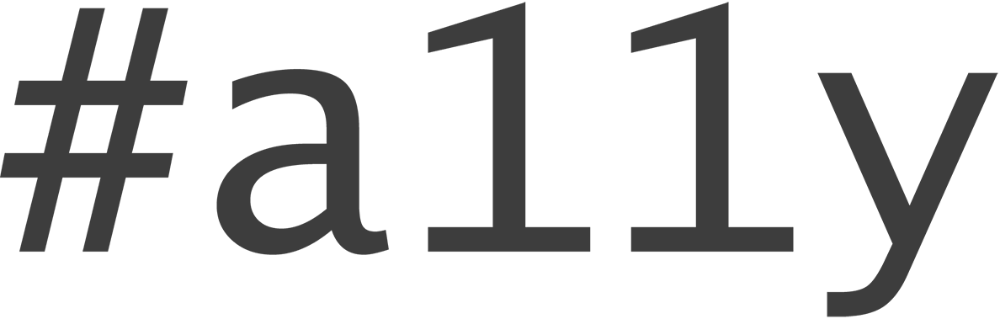

## \#a11y

普段からWebをあちこちチェックしている人は、a11yという好奇心をそそる**略語**を見たことがあるかもしれません。これは「accessibility」（アクセシビリティ）の略語で、「11」は省略された文字数を表しています。アクセシビリティのコミュニティでは、Twitterのハッシュタグ#a11yは（バットマンのバットシグナルのように）、そのリソースがアクセシビリティの実践と関連があることを示します。

\#a11yは、アクセシビリティへの対処に失敗したことを示すものとして使われることもありますが、ほとんどはアクセシビリティ分野での成功に注意を引くために使用されます。

アクセシビリティテクニックの革新、仕様のアップデート、人気のアプリケーションやWebサイトのアクセシビリティの改良に関する最新情報を常に把握するため、Twitterのハッシュタグ#a11yに注目しておきましょう。

### フォローのオススメ

ここでは、私がTwitterでフォローしている人の一部を紹介します。Webアクセシビリティに関する専門知識と経験の持ち主ばかりですが、熱心な#a11y支持者はこの限りではありません。情報網をさらに広げたい方は、彼らがフォローしているTwitterユーザーもチェックしましょう！

#### <@stevefaulkner>

Steve Faulknerは、アクセシビリティコンサルティングのリーダー企業であるThe Paciello Groupに勤務しています。W3CのHTML仕様の策定や`<main>`要素の導入を手掛けたほか、本書のテクニカルレビューも担当しています。また、[The Paciello Groupのブログ](http://blog.paciellogroup.com/)の記事も頻繁に執筆しています。

#### <@LeonieWatson>

Léonie Watsonは、Nomensaのアクセシビリティディレクターを経て現在はSteveと同じThe Paciello Groupに勤務する、影響力の大きいアクセシビリティ提唱者です。#a11yハッシュタグを精力的に使用し、[The Tink Tank](http://tink.co.uk/about-tink/)というブログも書いています。

#### <@rogerjohansson>

Roger Johanssonは1994年からWebの開発に携わっており、私は、Webの標準やアクセシビリティを中心に扱う彼のブログ[456 Berea Street](http://www.456bereastreet.com/)を2006年から読んでいます。

#### <@karlgroves>

Karl Groves は、アクセシビリティを広める活動を根気強く続けています。[karlgroves.com](http://www.karlgroves.com)でブログを書き、[CSSアクセシビリティテスティングツール](http://www.karlgroves.com/2013/09/07/diagnostic-css-super-quick-web-accessibility-testing/)（本書で使ったtest.cssに似た、さらに包括的なツール）を構築するため、協力者を募集しています。

#### <@jsutt>

Jennifer Suttonは、アクセシビリティに情熱をもち、深い知識をもっています。彼女は、W3Cの[Contacting Organizations about Inaccessible Websites](http://www.w3.org/WAI/users/inaccessible)（アクセスできないWebサイトのオーナー組織に連絡するためのガイド）の作成にも協力しました。

#### <@dennisl>

Dennis Lembréeは、アクセシビリティに関するブログおよびPodcastである[Web Axe](http://www.webaxe.org/)の創立者兼メインホストです。ぜひ<@WebAxe>もフォローしましょう。

#### <@jkiss>

Jason Kiss は、アクセシビリティの提唱者兼リサーチャーです。[Accessible Culture](http://accessibleculture.org/articles/)では、あらゆる手段を講じて確実に成功するアクセシビリティテクニックを探求した詳細な記事を執筆しています。

#### <@dboudreau>

Denis Boudreauは、#a11yだけでなく#a11yTips（簡単に実装できるアクセシビリティ向上のヒントを示すタグ）を使ってツイートする有名人のひとりです。

#### <@yatil>

Eric EggertはW3Cに勤務する経験豊富なアクセシビリティスペシャリストで、Webアクセシビリティについてのワークショップや講演を行っています。

#### <@aardrian>

Adrian Roselli は主にユーザビリティをテーマにしているライターですが、アクセシビリティに関する彼との議論はいつも興味深く、ためになります。W3Cの<ruby>招聘<rp>（</rp><rt>しょうへい</rt><rp>）</rp></ruby>エキスパートのひとりであり、[彼のブログのアクセシビリティカテゴリ](http://blog.adrianroselli.com/search/label/accessibility)は常時更新されています。

#### <@cookiecrook>

James Craigとダイアログの実装について白熱した議論ができたことをとても光栄に思っています。彼はWAI-ARIA仕様の記述に参加したほか、書籍『[designing with progressive enhancement](http://filamentgroup.com/dwpe/)』にも参加しています。

#### <@MarcoInEnglish>

Marco Zeheは、Mozillaのアクセシビリティ品質保証エンジニアです。彼のブログ[marcozehe.de](http://www.marcozehe.de)の「Easy ARIA Tip」は必見です。

#### <@gezlemon>

Gez Lemonはアクセシビリティに関する豊富な知識をもった**エキスパート**です。Chapter6「[生きてる！生きてる！](6 生きてる！生きてる！.md)」で取り上げたミュージックプレイヤーのライブリージョンの例は、彼のブログ[Juicy Studio](http://juicystudio.com/articles.php)からお借りしました。

#### <@icaaq>

Isac Lagerbladは、HTMLセマンティクスに関して非常に深い洞察をもつ、晴眼のスクリーンリーダーユーザーです。

#### <@patrick_h_lauke>

私がARIA仕様の若干不鮮明な部分に取り組んでいるときに、大きな力となってくれたのがPatrickでした。彼は現在、[タッチイベント](http://www.slideshare.net/redux/getting-touchy-an-introduction-to-touch-events-saint)およびアクセシビリティの実装について多くの研究を行っています。

#### <@marcysutton>

Marcy Suttonは、AngularJSやWeb Componentsなど、最先端のJavaScriptフレームワークに関するアクセシビリティの実験を多く行っています。

#### <@jared_w_smith>

Jared Smithは、本書でも何度か引用した[WebAIM](http://webaim.org/blog/)で多くの記事を書いています。WebAIMには独自の[Twitterでフォローすべきアクセシビリティ関係者](http://webaim.org/blog/twitter-accessibility-roundup/)のリストがありますので、この続きはそちらを参照してください。
